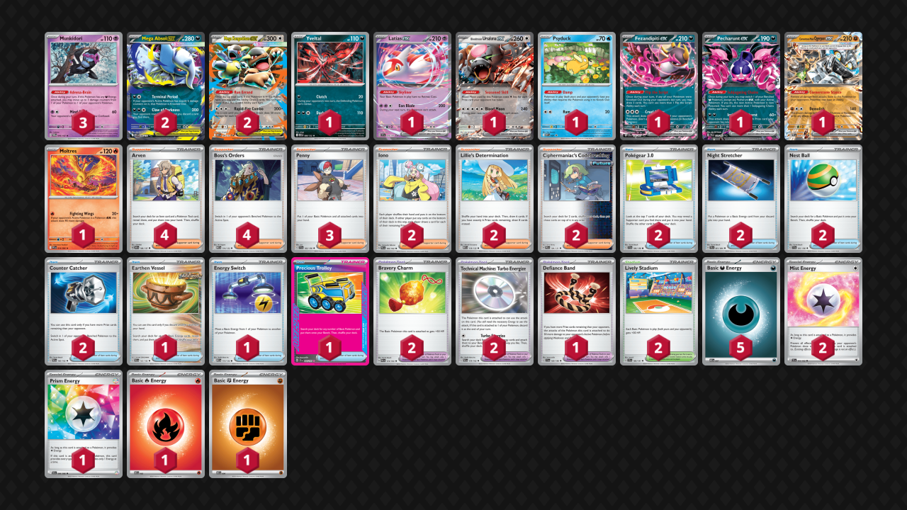

## Decklist

- Moltres does not really solve the Gholdengo matchup but it at least gives you a chance, as opposed to having an auto-loss which is terrible in this meta.
- Defiance Band is probably more often used with things other than Moltres, such as Ursaluna, even though it was originally included as a package deal with Moltres. That said, if I cut Moltres I would probably still cut Defiance Band because it is extremely situational.
- Yveltal was pretty underwhelming in testing, so I no longer think you need two.
- I'm on the fence about Ciphermaniac. I think the card is extremely strong in this deck, natural synergy with Kang, Iono-proof, it's otherwise hard to find the right cards most of the time, and it can also help against Gholdengo when you aren't allowed to have any draw Pokemon on the board. The only issue with Ciphermaniac is its high opportunity cost in terms of deck space. Running one Vessel is a little risky, and I would also like another Dark Energy, so it's possible to cut the Ciphers for those cards. I also like Cipher because it improves overall consistency, which is one area where this deck is lacking.
- Lively Stadium is relevant often enough to warrant the two copies.

**To try:** Enhanced Hammer, no Mist Energy

## Gameplay

In slower matchups or against decks that have a hard time getting through a Mega Kangaskhan, you typically want to play more passively and prioritize setting up an unbreakable board. However, against decks that can pressure you, such as sniping or capability of one-shotting Megas, it's ok to be aggressive with Absol on Turn 2-3. Aggressive Absol can also be strong in general if the opponent has a weak start. Multiple Claws of Darkness do compound if you're able to use the attack multiple times. I think this deck really benefits from a balance of playing passive and aggressive depending on the matchup and situation. Most players tend to favor one route or the other when they both can be good.

I think this deck requires a lot of experience to get used to. It is very weird and runs into complex situations often.

Always be vigilant and look for spots to pivot into a prize trade. This is a very important part of this deck. You need to be able to identify board states and lines to close out games, even the game was slow up until that point. It is difficult for this deck to power up attackers, so try to get a lot of mileage out of your first Absol. You may need to rely on Ursaluna/Pecharunt to close out a lot of games. Yveltal/Iono can also be a useful stopgap to pivot.

Kang is not your go-to attacker, but sometimes you just put Energy on it because you have nothing better to do, and it can act as a convenient backup attacker.

With 3, 2, and 1-prize Pokemon, opponents can abuse this to make a convenient prize map for themselves. Your job is to identify what lines your opponent is going for, and use cards like Charm and Penny (or just not putting things down) to make the prize map as difficult as possible.

## Matchups

### Dragapult / Dusknoir - Unfavorable

Ideal board is Absol Latias Kang double Monkey Psyduck. All of these are extremely important. Need to Stretcher Duck if they KO it and are threatening Dusclops.

- Need to build Energy in play as fast as possible
- Don't Adrenabrain preemptively to Budew in case you want to Clutch it.
- Charm is usually best on Absol and Psyduck (if the duck doesn't have Mist).
- As soon as you see Mist, slam it on Duck.
- If they have Fez, Hawlucha, or Latias in play, Clutch can punish them super hard and give you time to heal Absol. If they do not, Yveltal is basically useless.
- Leave Kang in the Active early-game to set up. Being the aggressor with Absol is ok, especially if you have plenty of Energy on the board. Usually respond to Phantom Dive with Terminal Period. Using Claw into their first Dragapult is often not ideal because you want to one-shotting it with Terminal Period.
- After Absol goes down, can use Kang, Ursaluna, or second Absol as your second attacker depending on the situation. Kang is generally the least useful but the most convenient because it's already on your board and may already have Energy.

### Gardevoir / Jellicent - Even or Slightly Unfavorable

Slam Mist Energy on Absol because it protects from Mew and Mind Bend. Ideal board is Kang, Absol, Latias, two Munki, and then an open spot depending on the situation.

- Starting out aggressively is good if they won't be able to immediately punch your Absol after its first attack. Otherwise, try to get Absol and multiple Munkidori with Energy.
- If they ever leave Scream Tail with too little HP after punching Absol, try to KO it with Adrenabrains and Claw of Darkness something else. Using Claw of Darkness to KO Gardevoir is the go-to play and is almost always good.
- Charm is usually best prioritized on Latias or Pech, and can also be good on the Megas.
- If you have a Mega in the Active with no HP buffs, Diancie with two Adrenabrain can one-shot it, so try to play around that.
- Clutch strategies are not the go-to. It is best if you are waiting to find a game-winning combo, buying a bit of time in general, or if you have the Munkidori advantage on board. Clutch can be useful but it's very situational and doesn't always come up. Also they probably play a Turo so watch out for that (in other words, don't rely on Clutch sticking forever if they haven't used Turo yet).
- Second attacker is ideally the second Absol, but this can be hard to pull off. Pech and Ursaluna can also be decent closers, especially if they take their first KO on Absol to go to three. As usual, Kang is the least useful attacker but sometimes gets used anyway because of convenience or necessity. Energy Switch is very useful for enabling Pecharunt when no other attacker is available, which can take 1 or 2 prizes fairly easily, and Ursaluna can take the last 1-2.

### Gholdengo - Unfavorable

In the early-game, go for only Cornerstone on board. Having a single-prize Pokemon is also fine. You can use something like Kang or Latias, but try to Penny it up before they can KO it. In general, taking prizes aggressively with Cornerstone is good.

- Save Boss for smacking Mawile or for closing out the game, depending on the situation.
- Charm and Lively Stadium are only good with each other to survive the Mawile 260. Be careful not to screw yourself by giving their Mawile extra HP.
- If they draw well and threaten a Mawile sweep, you may need to pivot in the mid- or late-game so that you don't get swept. Try to get a few prizes with Cornerstone early, and then power up other attackers and find a prize map to close out the game.
- Yveltal + Pech can build some damage on the board, which can be useful for closing out the game. However, they play two Turo and sometimes Prime, so you can't rely on Yveltal for long, and probably want to combo it with Iono for the best chance of buying a few turns. This is very situational and somewhat unreliable though.
- Moltres helps with closing out the game if you're able to get a few prizes with Cornerstone. After Cornerstone dies, try to make a single prize board so that you can always activate Counter Catcher/Defiance Band. Even if you play Moltres, the matchup is still bad and you have to draw well. Also Moltres doesn't do anything vs Lopunny, just Mawile.
- If they are playing Lopunny you need to make sure it never hits the board. KO Buneary on sight.

### Charizard / Noctowl - Very Favorable if they don't have Klefki, Very Unfavorable if they do

Start attacking with Absol because it can tank hits and disrupt. It makes great math against Terapagos in particular.

- Cornerstone is futile, even if you think can remove their Terapagos. Yveltal is also generally bad because they have so many switching cards.
- Kangaskhan as the second attacker can be good because it survives max-power Charizard with a Charm.
- The early-game is about denying prize cards and forcing them to activate Adrenabrain.
- You have to be extremely careful with what Pokemon you put on your board to avoid giving them and easy prize map.
- Going for early Absol, Psyduck, Munkidori, and Kangaskhan is ideal. Latias and Pecharunt are situational. They are very good, but also big liabilities. Charm on Cornerstone can be ok as it cannot be one-shot.
- Make sure you can always Stretcher for Psyduck if they KO it.
- Usually you only need one Munkidori with Dark.

### Charizard / Secret Box - Favorable

Cornerstone is bait! Ideal board is Absol, Kang, two Munki, Pech/Latias, Psyduck. Sometimes Yveltal can be in there as well. You can sometimes pivot into Cornerstone as your second attacker later if they run out of gusts.

- If you cannot find/recover Psyduck, sometimes KO'ing their Duskull/Clops/Noir is effective because they have a really hard time KO'ing Megas without it.
- Apply pressure with Absol, don't wait around for them to find their wombo combo.
- Charm is best on Pecharunt and Absol. Sometimes you can even Penny up the Pecharunt/Latias to throw off their prize map.
- In general, just make it as as possible hard for them to KO a Mega.
- If they punch your Absol, either use Penny to heal or take the opportunity to Terminal Period their Pidgeot.
- Hitting Boss, Jet, or Super Rod with Claw of Darkness can be game-winning.

### Grimmsnarl - Favorable

Do absolutely nothing but load up Energy with Kang in the Active. Try not to activate their Counter Catcher in the early-game. Need at least two Munkidori with Darks. Save Stretchers for Munkidori.

- Charm is very good on Absol to sometimes deny them a 2-shot KO. Otherwise, Charming Munki is also good.
- If they start the game by KO'ing a Munki, KO one of their Munki back.
- If they punch a Mega with Grimmsnarl, use a bunch of Adrenabrains and Terminal Period. Try to get the Mega out of two-shot range with HP buffs and Adrenabrain.
- If you're not sure what to do, do nothing but set up or KO their Munkidori with Energy.
- If you need to buy time for healing or setup, Yveltal can trap their Froslass or Munkidori.
- Ideal board is Kang, Absol, Latias, double Munki, plus extra spot, or Pech+Yveltal instead of Latias.

### Absol Mirror - Even

Set up a double Munki and Absol behind Kang as usual.

- If you get Mist on Absol (or if they are not set up), you're allowed to punch into their Mega (best with Iono if they have a big hand). Otherwise, you can KO their Munki or just do nothing and wait.
- Your prize map is likely going to be 1-2-3 or 3-3.
- Kang is a good attacker. Sometimes you need to just go in with it and flip heads. Depending on the situation, such as if you don't need to Claw punch their Mega, you'd rather have Mist on Kang so you can go in with it.
- Pech with Charm is generally better than Latias to avoid giving them a two-prize KO with Claw (if they are potentially going for a 3-2-1). It also gets around Yveltal shenanigans. So your ideal board is Pech with Charm, Kang, Absol, two Munki, Yveltal.
- I haven't played this one enough to know exactly when to do everything in every situation, this is a pretty weird matchup.

## Personal thoughts

This is probably the most interesting deck in the format, however I would not recommend playing to a major tournament. It is inconsistent, has a bad matchup spread, and is extremely difficult to play. I rank it along with Charizard/Secret Box at the very bottom of the meta decks, and I won't be playing until something changes in the meta.
