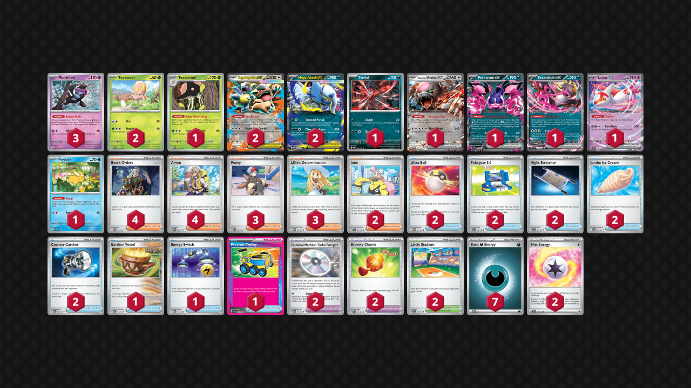
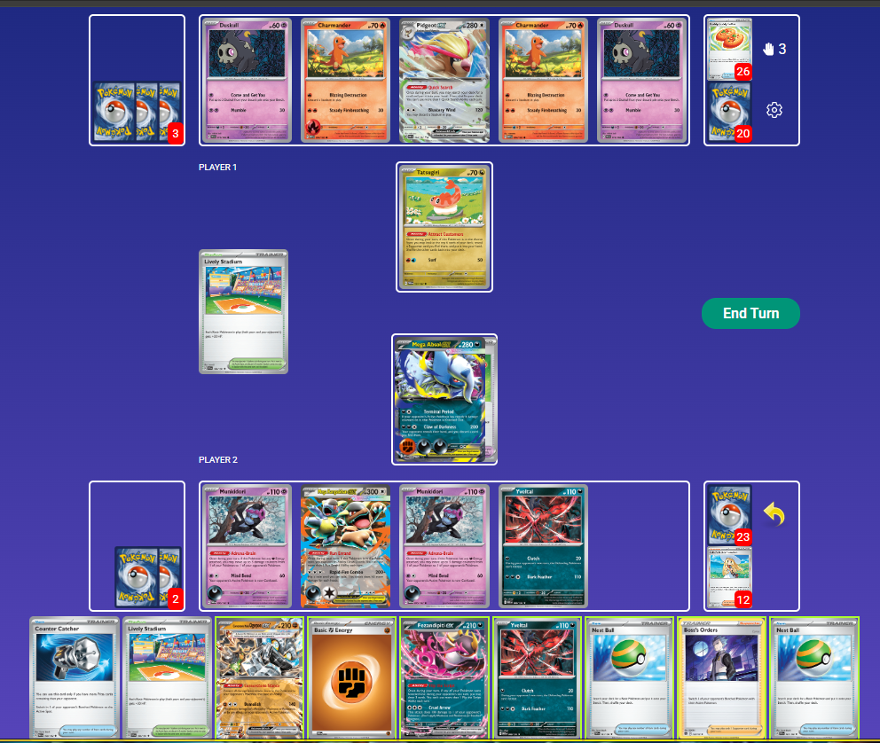

## Decklist


```decklist
Pokémon: 16
3 Munkidori TWM 95
2 Toedscool PAR 16
1 Toedscruel PAR 17
2 Mega Kangaskhan ex MEG 104
2 Mega Absol ex MEG 86
1 Yveltal MEG 88
1 Bloodmoon Ursaluna ex TWM 141
1 Pecharunt ex SFA 39
1 Fezandipiti ex SFA 38
1 Latias ex SSP 76
1 Psyduck MEP 7

Trainer: 35
4 Boss's Orders MEG 114
4 Arven OBF 186
3 Penny SVI 183
3 Lillie's Determination MEG 119
2 Iono PAL 185
2 Ultra Ball MEG 131
2 Pokégear 3.0 SVI 186
2 Night Stretcher SFA 61
2 Counter Catcher PAR 160
2 Jumbo Ice Cream PFL 91
1 Earthen Vessel PAR 163
1 Energy Switch MEG 115
1 Precious Trolley SSP 185
2 Technical Machine: Turbo Energize PAR 179
2 Bravery Charm PAL 173
2 Lively Stadium SSP 180

Energy: 9
7 Darkness Energy MEE 7
2 Mist Energy TEF 161
```
<!-- PUBLIC -->
### Inclusions

- Toedscruel actually works pretty well against Gholdengo, improving the matchup to slightly favorable. However, some of the credit also has to go to Jumbo Ice Cream for thwarting Mawile.
- Jumbo Ice Cream is extremely strong in every matchup. This deck's main lose condition is the Absol going down too early, and Ice Cream helps prevent that. I added a second copy to help find it at the right time since it needs to be used on one specific turn.
- Lively Stadium is relevant often enough to warrant both copies.
- Two Ultra Ball is necessary with Toedscruel. I still like having Nest Ball too, but ended up cutting it for second Ice Cream (for now).

### Exclusions

- Yveltal was pretty underwhelming in testing, so I no longer think you need two of them.
- Cornerstone and Moltres aren't as good at beating Gholdengo as Toedscruel.
- I think Judge is a terrible card.
- Other random techs such as Hammer, Devo, and Sandy Shocks seem bad to me but I have not tried them so they could be worthwhile. I would sooner try out a second Jumbo Ice Cream though.
<!-- /PUBLIC -->
## Gameplay

- In slower matchups or against decks that have a hard time getting through a Mega Kangaskhan, you typically want to play more passively and prioritize setting up an unbreakable board. However, against decks that can pressure you, such as sniping or capability of one-shotting Megas, it's ok to be aggressive with Absol on Turn 2-3. 
- Aggressive Absol can also be strong in general if the opponent has a weak start. Multiple Claws of Darkness do compound if you're able to use the attack multiple times. I think this deck really benefits from a balance of playing passive and aggressive depending on the matchup and situation. Most players tend to favor one route or the other when they both can be good. I think this deck requires a lot of experience to get used to. It is very weird and runs into complex situations often.
- Always be vigilant and look for spots to pivot into a prize trade. This is a very important part of this deck. You need to be able to identify board states and lines to close out games, even when the game was slow up until that point. It is difficult for this deck to power up attackers, so try to get a lot of mileage out of your first Absol. You may need to rely on Ursaluna/Pecharunt to close out a lot of games. Yveltal/Iono can also be a useful stopgap to pivot.
- Kang is never your go-to attacker, but sometimes you just put Energy on it because you have nothing better to do, and it can act as a convenient backup attacker.
- With 3, 2, and 1-prize Pokemon, opponents can abuse this to make a convenient prize map for themselves. Your job is to identify what lines your opponent is going for, and use cards like Charm and Penny (or just not putting things down) to make their prize map as difficult as possible.



This spot is uncomfortable for a few reasons. Psyduck was just KO'd, and we need to minimize the chance of losing next turn. Kang could go for double heads on the Pidgeot to win right now, but I think we have better than 25% odds by simply going for Claw on their Active instead. If we had another Boss in hand, Bossing the Pidgeot and using Claw on it would almost certainly be best, but we don't. Claw finds Lillie, Candy, and Defiance, which is a cracked hand, and we are forced to discard the Defiance. They are down a Counter Catcher, so they still have to get lucky off Lillie to win.


Psyduck was just KO'd and we don't have Stretcher! A common occurrence. Both of their Jets are gone, so Bossing the Pidgeot and using Clutch is the best play! Draw and thin as much as possible, and then play Pokegear for the best odds of finding Boss. We got it off the Pokegear! Make sure to poison Yveltal to get that Pidgeot in Kang-KO range as quickly as possible, and equip a Charm to defend against the possibility of an eventual Dusknoir + Blustery Wind.


Once again, Bossing the Pidgeot would be viable if we had another follow-up Boss, but we don't! After thinking about this spot for awhile, I decided to Boss and Claw the Dusclops. Even though we have Psyduck, they have Klefki, so this limits their options as much as possible and ensures that Absol is safe! We can also get a bit of poison damage on Absol since we already have Munki with Dark. Claw of Darkness finds two Boss, a Counter Catcher, Secret Box, Dusknoir, and a TM: Evo. All kinds of goodies to choose from! Getting rid of Boss is definitely best in this matchup!

## Matchups

### Gholdengo - Slightly Favorable

This matchup is slightly favorable with Toedscruel and unfavorable without it. Your approach to the matchup depends on what build and techs you are playing.

- Ideal board is both Toedscool, Absol, Kang, Latias, Munki/random guy.
- Do not evolve Toedscool until after they discard a bunch of Energy. Use Stretcher to recover Toedscool if KO’d. If you have Toedscool and Toedscruel, and they KO Toedscruel, make sure to save a Stretcher so you can reestablish it.
- Spam attacks with Absol. If Absol is KO’d, use second Turbo Energize to load up another one.
- If they are loading up Mawile, try to gust and smack it.
- If they play Cram, try to play around it (don’t go to 4 until you’re good and ready, KO Cram if it’s on the board). Just be aware that Cram can KO Toedscruel for minimal investment.
- Super Rod is their most important resource when Toedscruel is in play, so always Claw it away if you can.

For the non Toedscruel build:

- In the early-game, go for only Cornerstone on board. Having a single-prize Pokemon is also fine. You can use something like Kang or Latias, but try to Penny it up before they can KO it. In general, taking prizes aggressively with Cornerstone is good.
- Save Boss for smacking Mawile or for closing out the game, depending on the situation.
- Charm and Lively Stadium are only good with each other to survive the Mawile 260. Be careful not to screw yourself by giving their Mawile extra HP.
- If they draw well and threaten a Mawile sweep, you may need to pivot in the mid- or late-game so that you don't get swept. Try to get a few prizes with Cornerstone early, and then power up other attackers and find a prize map to close out the game.
- Yveltal + Pech can build some damage on the board, which can be useful for closing out the game. However, they play two Turo and sometimes Prime, so you can't rely on Yveltal for long, and probably want to combo it with Iono for the best chance of buying a few turns. This is very situational and somewhat unreliable though.
- Moltres helps with closing out the game if you're able to get a few prizes with Cornerstone. After Cornerstone dies, try to make a single prize board so that you can always activate Counter Catcher/Defiance Band. Even if you play Moltres, the matchup is still bad and you have to draw well. Also Moltres doesn't do anything vs Lopunny, just Mawile.
- If they are playing Lopunny, try to KO Buneary on sight. If they TM: Evo into Lopunny, make sure you have Charm on Cornerstone, and gust up the Lopunny to smack it. For Lopunny, you'll need multiple Munkidori set up. If they use up Turos, punish them by pivoting into Yveltal gameplan.

```twitch
id: 2682290642
title: Absol (Toed) v Gholdengo 1
```
Me figuring how Toedscruel does against Gholdengo.

```twitch
id: 2682290643
title: Absol (Toed) v Gholdengo 2
```
They have a hard time piecing it together at the end as long as you can establish Toedscruel.

```twitch
id: 2682290633
title: Absol (Toed) v Gholdengo 3
```
Close game.

```twitch
id: 2677258007
title: Dengo (Mawile) v Absol 1
```
This game shows how Cornerstone alone is not good enough.

```twitch
id: 2677258001
title: Dengo (Mawile) v Absol 2
```
Interesting game. Ignore my brain fart on lethal in the first timeline.

```twitch
id: 2677340489
title: Dengo (Mawile) v Absol (Moltres) 1
```
Kinda close game.

```twitch
id: 2677340486
title: Dengo (Mawile) v Absol (Moltres) 2
```
Rare footage of Moltres actually doing its thing.

```twitch
id: 2677340487
title: Dengo (Mawile) v Absol (Moltres) 3
```
Moltres being good again. Is this legit?

### Gardevoir - Even or Slightly Unfavorable

- Slam Mist Energy on Absol because it protects from Mew and Mind Bend. Ideal board is Kang, Absol, Latias, two Munki, and then an open spot depending on the situation.
- Starting out aggressively is good if they won't be able to immediately punch your Absol after its first attack. Otherwise, try to get Absol and multiple Munkidori with Energy.
- If they ever leave Scream Tail with too little HP after punching Absol, try to KO it with Adrenabrains and Claw of Darkness something else. Using Claw of Darkness to KO Gardevoir is the go-to play and is almost always good.
- Charm is usually best prioritized on Latias or Pech, and can also be good on the Megas.
- If you have a Mega in the Active with no HP buffs, Diancie with two Adrenabrain can one-shot it, so try to play around that.
- Clutch strategies are not the go-to. It is best if you are waiting to find a game-winning combo, buying a bit of time in general, or if you have the Munkidori advantage on board. Clutch can be useful but it's very situational and doesn't always come up. Also they probably play a Turo so watch out for that (in other words, don't rely on Clutch sticking forever if they haven't used Turo yet).
- Second attacker is ideally the second Absol, but this can be hard to pull off. Pech and Ursaluna can also be decent closers, especially if they take their first KO on Absol to go to three. As usual, Kang is the least useful attacker but sometimes gets used anyway because of convenience or necessity. Energy Switch is very useful for enabling Pecharunt when no other attacker is available, which can take 1 or 2 prizes fairly easily, and Ursaluna can take the last 1-2.

```twitch
id: 2677185410
title: Garde v Absol 1
```
Me being a headless chicken.

```twitch
id: 2677185406
title: Garde v Absol 2
```
Starting out ahead into a close endgame.

```twitch
id: 2677185405
title: Garde v Absol 3
```
This was a kind of weird game.

```twitch
id: 2677185404
title: Garde v Absol 4
```
Getting dominated to start into an interesting endgame.

### Charizard / Noctowl - Depends on Klefki

This matchup is favorable if they don't have Klefki and unfavorable if they do.

- Start attacking with Absol because it can tank hits and disrupt. It makes great math against Terapagos in particular.
- Cornerstone is futile, even if you think can remove their Terapagos. Yveltal is also generally bad because they have so many switching cards.
- Kangaskhan as the second attacker can be good because it survives max-power Charizard with a Charm.
- The early-game is about denying prize cards and forcing them to activate Adrenabrain.
- You have to be extremely careful with what Pokemon you put on your board to avoid giving them and easy prize map.
- Going for early Absol, Psyduck, Munkidori, and Kangaskhan is ideal. Latias and Pecharunt are situational. They are very good, but also big liabilities. Charm on Cornerstone can be ok as it cannot be one-shot.
- Make sure you can always Stretcher for Psyduck if they KO it.
- Usually you only need one Munkidori with Dark.

```twitch
id: 2675808567
title: DawnZard (no Klefki) v Absol 1
```
This game is a good example of using Yveltal to punish them for using switch cards.

```twitch
id: 2675808563
title: DawnZard (no Klefki) v Absol 2
```
This game demonstrates how to take advantage of and punish their resources to make a comeback!

```twitch
id: 2675808581
title: DawnZard (no Klefki) v Absol 3
```
This game shows how Kangaskhan can be a convenient backup attacker.

```twitch
id: 2675808575
title: DawnZard (Klefki) v Absol 1
```
This game explores some potential routes with suboptimal draws.

```twitch
id: 2675808579
title: DawnZard (Klefki) v Absol 2
```
This is a pretty one-sided game, showing how the decks interact with various combinations of Klefki and / or Duck on the board.

```twitch
id: 2675808566
title: DawnZard (Klefki) v Absol 3
```
This game comes down to an interesting decision: force a sudden death or go for a 50-50 flip on Kang. You'll have to excuse me completely spacing out near the end.

```twitch
id: 2675808580
title: DawnZard (Klefki) v Absol 4
```

### Dragapult / Dusknoir - Slightly Favorable

This matchup is slightly favorable with the Ice Creams and unfavorable without them.

- Ideal board is Absol Latias Kang double Monkey Psyduck. All of these are extremely important. Need to Stretcher Duck if they KO it and are threatening Dusclops.
- Need to build Energy in play as fast as possible.
- Don't Adrenabrain preemptively to Budew in case you want to Clutch it.
- Charm is usually best on Absol and Psyduck (if the duck doesn't have Mist).
- As soon as you see Mist, slam it on Duck.
- If they have Fez, Hawlucha, or Latias in play, Clutch can punish them super hard and give you time to heal Absol. If they do not, Yveltal is basically useless.
- Leave Kang in the Active early-game to set up. Being the aggressor with Absol is ok, especially if you have plenty of Energy on the board. Usually respond to Phantom Dive with Terminal Period. Using Claw into their first Dragapult is often not ideal because you want to one-shotting it with Terminal Period.
- After Absol goes down, can use Kang, Ursaluna, or second Absol as your second attacker depending on the situation. Kang is generally the least useful but the most convenient because it's already on your board and may already have Energy.

```youtube
id: VDQKGxKCEg8
title: Absol (Ice Cream) v Pult 1
```
This is an interesting game.

```twitch
id: 2687729270
title: Absol (Ice Cream) v Pult 2
```
This is another interesting game where I look at three main timelines.

```twitch
id: 2676573152
title: Dragapult v Absol 1
```
Weird game. Going in with Absol seemed fine but kind of got punished by Neo Upper.

```twitch
id: 2676573174
title: Dragapult v Absol 2
```
Interesting game that looks at different lines, and how to make a nice comeback. Kindly overlook the (possible) misplay at the beginning and missing the lethal.

```twitch
id: 2676573151
title: Dragapult v Absol 3
```
I think going in with Absol was alright here, as the game then kinda progressed as if I hadn't (so I wouldn't have gotten the benefits of doing so). Sometimes it's hard to tell whether or not you should go in or wait.

```twitch
id: 2676573148
title: Dragapult v Absol 4
```
Yveltal goes hard in this game.

```twitch
id: 2676573180
title: Dragapult v Absol 5
```
I think I misjudged the situation this time and went in with Absol when I shouldn't, since it was good a lot of other times.

```twitch
id: 2676573175
title: Dragapult v Absol 6
```

### Charizard / Secret Box - Favorable

- Cornerstone is bait early on! Ideal board is Absol, Kang, two Munki, Pech/Latias, Psyduck. Sometimes Yveltal can be in there as well. You can sometimes pivot into Cornerstone as your second attacker later if they run out of gusts.
- If you cannot find/recover Psyduck, sometimes KO'ing their Duskull/Clops/Noir is effective because they have a really hard time KO'ing Megas without it.
- Apply pressure with Absol, don't wait around for them to find their wombo combo.
- Charm is best on Pecharunt and Absol. Sometimes you can even Penny up the Pecharunt/Latias to throw off their prize map.
- In general, just make it as as possible hard for them to KO a Mega.
- If they punch your Absol, either use Penny to heal or take the opportunity to Terminal Period their Pidgeot.
- Hitting Boss, Jet, or Super Rod with Claw of Darkness can be game-winning.

```twitch
id: 2677258000
title: ZardBox v Absol 1
```
This was an interesting game. I'm also just learning the matchup.

```twitch
id: 2677258004
title: ZardBox v Absol 2
```
Interesting endgame.

### Grimmsnarl - Favorable

- Do absolutely nothing in the early-game but load up Energy with Kang in the Active. 
- Try not to activate their Counter Catcher in the early-game. 
- Need at least two Munkidori with Darks. Save Stretchers for Munkidori.
- Charm is very good on Absol to sometimes deny them a 2-shot KO. Otherwise, Charming Munki is also good.
- If they start the game by KO'ing a Munki, KO one of their Munki back.
- If they punch a Mega with Grimmsnarl, use a bunch of Adrenabrains and Terminal Period. Try to get the Mega out of two-shot range with HP buffs and Adrenabrain.
- If you're not sure what to do, do nothing but set up or KO their Munkidori with Energy.
- If you need to buy time for healing or setup, Yveltal can trap their Froslass or Munkidori.
- Ideal board is Kang, Absol, Latias, double Munki, plus extra spot, or Pech + Yveltal instead of Latias.

```twitch
id: 2677315533
title: Absol v Grimm 1
```
Me trying to figure out how to navigate this matchup. It can get a little weird sometimes.

```twitch
id: 2677315540
title: Absol v Grimm 2
```
This game demonstrates how important Munkidori control is. The Munkis are everything.

### Absol Mirror - Even

- Set up a double Munki and Absol behind Kang as usual.
- If you get Mist on Absol (or if they are not set up), you're allowed to punch into their Mega (best with Iono if they have a big hand). Otherwise, you can KO their Munki or just do nothing and wait.
- Your prize map is likely going to be 1-2-3 or 3-3.
- Kang is a good attacker. Sometimes you need to just go in with it and flip heads. Depending on the situation, such as if you don't need to Claw punch their Mega, you'd rather have Mist on Kang so you can go in with it.
- Pech with Charm is generally better than Latias to avoid giving them a two-prize KO with Claw (if they are potentially going for a 3-2-1). It also gets around Yveltal shenanigans. So your ideal board is Pech with Charm, Kang, Absol, two Munki, Yveltal.
- I haven't played this one enough to know exactly when to do everything in every situation; this is a pretty weird matchup.

## Personal thoughts

This is probably the most interesting deck in the format, however I would not recommend playing to a major tournament. It is inconsistent, has a bad matchup spread, and is extremely difficult to play. However, with the new additions of Toedscruel and Jumbo Ice Cream, there is some merit to revisiting this deck. These cards might be what Absol needs to save it.
