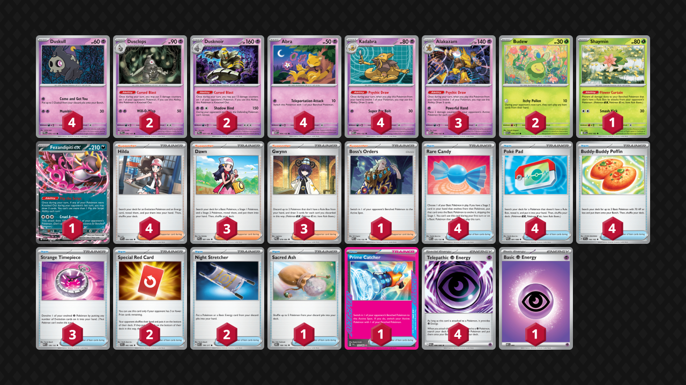

<!-- PUBLIC -->
## Decklist


```decklist
Pokémon: 23
4 Duskull PRE 35
2 Dusclops PRE 36
2 Dusknoir PRE 37
4 Abra MEG 54
4 Kadabra MEG 55
3 Alakazam MEG 56
2 Budew ASC 16
1 Shaymin DRI 10
1 Fezandipiti ex ASC 142

Trainer: 32
4 Hilda WHT 84
3 Dawn PFL 87
3 Gwynn PBL 78
1 Boss's Orders MEG 114
4 Rare Candy MEG 125
4 Poké Pad POR 81
4 Buddy-Buddy Poffin TEF 144
3 Strange Timepiece MEG 128
2 Special Red Card CRI 82
2 Night Stretcher ASC 196
1 Sacred Ash DRI 168
1 Prime Catcher TEF 157

Energy: 5
4 Telepathic Psychic Energy POR 88
1 Psychic Energy MEE 5
```
### Inclusions

- The Frankfurt list is basically optimized, so I only changed a few things. I added a fourth Poffin to help stabilize the early-game, as that’s a card you always want one or two of. If you have extra Basic Pokemon in your hand, you can keep it for Gwynn fuel while searching out what you need with Poffin / Telepathic.
- Two Budew is mandatory for keeping Item lock against Dragapult until you’re ready to go in. I think a third copy could even be considered.
- Shaymin beats Slowking for free and also very good against two-prize slop decks.
- Strange Timepiece is the main source of consistent draw power throughout the game, especially in slower or prolonged games.
- Prime Catcher is absolutely mandatory as the Ace Spec. It is so broken, and it makes Dusknoir combos a lot easier since you can use a different Supporter to piece together the combo instead of relying on Boss. Having it as a switch out also cuts down opponent’s possible lines via retreat lock.

### Possible Inclusions

- A Stadium such as Team Rocket’s Watchtower would be quite good. Stadiums such as Risky Ruins and Battle Cage are extremely problematic, so having a counter to those would be nice. Furthermore, Watchtower has disruptive synergy with Red Card and Dusknoir, and could be yet another combo piece to further shut opponents out of the game.
- Bad Alakazam could play well into this deck’s strategy of taking lots of prize cards at once. If you smack something for a lot of damage, you can perfectly repurpose that damage for Dusknoir and Dusclops and take lots of prizes. The problem is that most decks have ways of punishing you for leaving damage on the board (Adrenabrain, Chien-Pao, Jumbo Ice Cream). Attacking without Item locking or taking a KO is also not as disruptive as this deck would like. It would also be helpful against Crustle for its second attack.
- A third Budew or second Boss could be good.
- Third Stretcher over Sacred Ash could be considered.

### Exclusions

- I swapped out the Teleporter Abra because it was too much of a liability. Once in a blue moon, you can get value from Teleporter, but I didn’t find it to be that useful. Far more often, it was a liability to the likes of Risky Ruins, Zorua’s Scratch, as well as general Phantom Dive snipe.
- Patrat is useless because Munkidori isn’t actually a real problem for this deck.
- Flutter Mane is not a sufficient countermeasure for Psyduck because this deck can’t gust enough to take advantage of it.
- Fourth Dawn is not as good as Poffin, in my opinion. This deck typically has plenty of extra Supporters lying around in the mid- or late-game. Getting value from one or two Dawn is plenty. Dawn is better against Dragapult in some early-games, but I still think three is sufficient.
<!-- /PUBLIC -->
## Gameplay Tips

- Go first. Turn 1 Itchy Pollen is nice, but sometimes you just don’t have it, and it’s not that big of a deal to get it on Turn 1. We want to evolve as fast as possible and don’t want our opponents doing the same.
- This deck’s game plan varies by matchup. In general, against evolving or other setup decks, we aim to set up a boardwipe to deprive them of a specific option or resource. Against big beatstick decks, we simply engage in a winning prize trade.
- We should generally avoid activating an opponent’s Special Red Card until the turn we win the game or otherwise establish an unbeatable boardstate.
- Unfair Stamp is impossible to completely play around, but the idea is to make it so that you need as little as possible to win on the other end of a Stamp. If we take a bunch of prize cards and only leave ourselves with one or two, that’s not too demanding (if we’re activating Red Card against a deck that could also Stamp, it’s generally unavoidable). It’s also important to leave an Abra and Kadabra on the bench to maximize odds of drawing out of Stamp. Fezandipiti is good for this too, though it’s sometimes a liability.
- You don’t need to blindly go for Itchy Pollen in every early-game. Budew is much better in some matchups (Dragapult, Alakazam, Crustle) than others (Raging Bolt, Excadrill).
- When drawing in mid- or late-game, don’t forget to thin out the deck with Poke Pad first (the exception sometimes being if you need to find multiple Pad’able Pokemon). Can also apply to Poffin or Telepathic in some scenarios.
- Keep in mind the net card value of the various cards for Alakazam’s breakpoints. Gwynn is +3, Dawn can be +2 up to +7 depending on the situation, Strange Timepiece can only be +1 or +2 in very specific circumstances. Poke Pad is +0 but thins a card out of the deck (making it slightly better than +0), which is why it’s important to sequence it correctly. Dusknoir can also generate cards in hand by taking prize cards.
- Every Dusknoir use should be doing something broken. It can be used for board positioning and / or just taking prize cards along an optimized prize map. If Dusclops can KO something, it’s usually best to do so. Anything that Dusclops can KO will evolve out of range given the opportunity (or is Budew, which we want to KO immediately), so it’s best to stuff that out. This maximizes the efficiency of our deck.
- Whether you want to Supporter first or draw first depends on your hand. If your turn is fairly open-ended or you don’t already have everything you need, drawing first is generally best. If you’re looking for specific cards and don’t care about using Gwynn / Boss, you can use Hilda / Dawn first to thin. Gwynn’s existence makes it often better to draw first as you may draw into Gwynn, which lets you draw more (unless you have no spare Gwynn fuel).
- If you play Teleporter Abra, it’s usually best to search that one out first to give yourself more flexibility. Exceptions exist (such as against Zoroark where they can Scratch it).

## Matchups

### Dragapult - Unfavorable

The Risky Ruins build is the most challenging, Dusknoir and Blaziken are slightly unfavorable, while the straight Dragapult / Watchtower build is about even.

- If they might play Ruins, get Budew into play immediately. It wouldn’t even be unreasonable to get both Budew into play if you’re able to before Ruins comes into play. The same goes for Teleporter Abra if you play it. These Pokemon are massive liabilities after the opponent has put Ruins into play.
- Use Dusclops to KO their Budew on sight and spam Itchy Pollen. If their Budew has 20 from Ruins (this shouldn’t ever happen), just KO it with Itchy Pollen instead of Dusclops.
- The general game plan is to use Itchy Pollen until we can wipe out all of the Drakloak (and Dragapult if they have it), then use Red Card and take a KO with Alakazam. Against Rare Candy builds, it would be ideal to KO everything that can Candy (especially if it has Energy), but it’s not necessarily realistic. Going for a board of Budew, three Abra, two Duskull early is typically best. 
- One Duskull typically goes into Dusclops to pop Budew and is immediately replaced by another Duskull. The two other Duskull typically get Candied into Noir, popping two Drakloak, while Alakazam KO’s their Dragapult / remaining Drakloak. If they KO Budew, get the second one (unless you’re ready to go in). If they get their own second Budew, get the second Dusclops. Of course, the dynamic nature of the game often forces you to improvise.
- When you go in with Alakazam, it’s ideal to have a Kadabra and Abra open on the bench. Just in case they do get a hand disruption card off of your Red Card, you want to maximize the outs to respond to it.
- Gusting to stall in the early-game is a valid option. The ideal trap target is something that can’t immediately threaten you, but it still valuable to KO with Alakazam later on (such as a Dreepy with no Energy).

```youtube
id: NfQPi10WnyA
title: ZamNoir v PultHam 1
```

```youtube
id: 8ciISbyJlUQ
title: ZamNoir v PultHam 2
```

```youtube
id: QUVOtrELjnU
title: ZamNoir v PultNoir 1
```

```youtube
id: ubV4nAw_8KM
title: ZamNoir v PultNoir 2
```

```youtube
id: ga6HDsFJovo
title: ZamNoir v PultBlaze 1
```

```youtube
id: yK97slQIa0g
title: ZamNoir v PultBlaze 2
```

```youtube
id: ElRlP72TodY
title: ZamNoir v PultBlaze 3
```

### Raging Bolt - Slightly Favorable

- Budew is a pretty big liability because of the board spot it occupies (and because it gets KO’d by Iron Crown along with Abra). Usually you don’t want to put it into play, but if you start with it, that’s fine.
- Get Shaymin down.
- Your game plan varies depending if they play Stamp. If they do not have Stamp, take two prizes early, and then set up a four-prize turn to play around Red Card. If they do have Stamp, go for the four-prize turn (KO’ing Fez + Kang is ideal) + Red Card first, leaving you with just two prizes to take later. If you’re going for the 2-4 line, start with a board of three Abra, two Duskull, Shaymin. If you’re going for 4-2, go for two Abra, three Duskull, Shaymin. If you don’t know what Ace Spec they’re playing, just go for whatever is most convenient (which will usually be the 2-4 line).
- Leaving one Abra is fine, but the others want to evolve as soon as possible to stop Iron Crown shenanigans. If they get a very fast Iron Crown, there’s nothing you can do about it, but it usually is not that big of an issue.
- Save Prime Catcher as an out to retreat-lock.
- Fezandipiti can be a big liability (though it is still good sometimes). The main problem with Fez is that if they get two fast prizes, they can KO Fez to go to two, and then you can no longer double Dusknoir. Keep this in mind when evaluating the situation.
- Shadow Bind is ineffective as long as they have Iron Leaves available, so I wouldn’t rely on it.

```youtube
id: V544SIFPwCk
title: ZamNoir v Bolt 1
```

```youtube
id: IYMjAlXkRas
title: ZamNoir v Bolt 2
```

```youtube
id: NsJwRONLAkc
title: ZamNoir v Bolt 3
```

```youtube
id: FUrzkgSHVMA
title: ZamNoir v Bolt 4
```

### Zoroark - Depends

Against the disruption build with N’s Purrloin, the matchup is slightly unfavorable. Against the other builds, it’s favorable.

- I would actually go second in this matchup but I don’t know for sure if that’s correct.
- Keep them Item-locked until you’re ready to go in (don’t take too long).
- In this matchup, it’s possible to set up for a board wipe or simply go for a prize trade. This mostly depends on how good your opponent’s start is. If they have a good setup with something like Poffin into Cyrano, try to go for a normal prize trade with Dusknoir as a finisher. If they have a weaker start and no more than one Zoroark in play, just set up the board wipe to clear them out of Zorua / Zoroark.
- Shaymin is good against Darmanitan.
- Save Prime Catcher as an out to retreat-lock.
- If they play N’s Purrloin, you may need Fezandipiti on the board for some protection. As always, Fez can be good but it can also be a liability, so be careful with it.

```youtube
id: e9QiSKm5Kek
title: ZamNoir v Zoro 1
```

```youtube
id: _ooq7iyXWYE
title: ZamNoir v Zoro 2
```

### Alakazam - Depends

Against normal Alakazam, if they have Psyduck, it’s unfavorable. If they have heavy Battle Cage, it’s slightly unfavorable to unfavorable. Against the Nighttime Mine build, it’s favorable. The mirror is obviously even.

- Dusclops to pop Abra whenever possible.
- Early Budew is very good and makes it likely that you will get the first attack.
- Play around Eri to some extent. Use recovery cards for value whenever possible. Recovering Dusknoir pieces is often pointless, so try to use the recovery cards on Alakazam pieces instead.
- If they have Cage or Duck, play like a normal Alakazam mirror. Their list is more efficient, but we have more Candies. Don’t put Fez down.

### Slowking - Very Favorable

- Get Shaymin down as soon as possible. It’s basically impossible to lose once you do.
- The only possible threat to Shaymin is Cofagrigus. Can play around that with overwhelming aggression or boardwiping their Slowpoke / Slowking. Cofagrigus is a fairly uncommon tech though. If they use something weird like Spectrier or Boss to KO Shaymin, just get it back immediately.
- If Shaymin is prized, go for early Budew and try to evolve everyone out of Kyurem range as quickly as possible. If you get multiple Alakazam and they don’t play hand disruption (it’s pretty rare), you’ll still probably win even without Shaymin, but of course there’s a decent chance they still get the fast Trifrost.

```youtube
id: M8Rd7GLBnz0
title: ZamNoir v Slowking 1
```

### Excadrill - Auto-Win

- If they go with Team Rocket’s Kang + Articuno, go for Dusknoir on the Articuno + Alakazam one-shot on the Kang. If the Articuno has Cape, double Dusknoir.
- It is impossible for us to beat a Caped Empoleon, but we can easily stop Empoleon from coming into play by using Itchy Pollen and then KO’ing the Piplup.

### Crustle - Slightly Unfavorable

- The plan is to cheese them with Budew. Despite that, I still think going first is better, but I’m not sure. Giving them an extra attachment by letting them go first can let them get aggressive with Kang, which is very scary.
- Start attaching Energy to Duskull, as we’ll need Dusknoir to attack. Board should be two Abra for drawing, three Duskull (one to attack, two to pop), and an attacking Budew.
- Two Itchy Pollens + Cursed Blast + Shadow Bind KO’s Kang. Two Cursed Blasts + Shadow Bind KO’s a Caped Kang. Shadow Bind easily deals with Crustle (sometimes with Dusclops help).
- Play around Eri and Xerosic to some extent. Recovering Dusknoir pieces is extremely important since we need lots of Dusknoir in order to win.
- If they make the mistake of putting down Dwebble, we can easily stall it to set up our board. However, this also lets them set up their Kang on the bench, so make sure you have your other gust available before using the first one to stall! We need to get that preemptive strike on their Kang (and not let them KO our loaded Dusknoir).

```youtube
id: C6ybomCLR4I
title: ZamNoir v Crustle 1
```

```youtube
id: tUjQcrvxGC8
title: ZamNoir v Crustle 2
```

```youtube
id: yiOii5gZuOU
title: ZamNoir v Crustle 3
```

### Hydrapple - Favorable

- This matchup is a normal prize trade for the most part.
- Early-game Budew is very strong. Go for a board of Budew, triple Abra, double Duskull.
- The idea is to use Dusknoir as a finisher, but in reality, using it to KO a Chikorita or Bayleef before it becomes Meganium is generally good. Same for Dusclops vs Applin if the opportunity presents itself. This is less good if they play Red Card since we’re going to three prizes, but it does avoid Briar to some extent.
- Try to keep Abra and Kadabra open for some Stamp protection. We can’t really avoid getting Stamped in this matchup. Fez can be situational.

```youtube
id: hCAbYtSSwoo
title: ZamNoir v Hydrapple 1
```

```youtube
id: tYjYsDCIOJw
title: ZamNoir v Hydrapple 2
```

```youtube
id: oNM2m836gOI
title: ZamNoir v Hydrapple 3
```

### Festival Lead - Even

- Whoever goes first is at a massive advantage. When going first, apply as much pressure as possible. When going second, try to mitigate the damage with tactics such as Item lock and benched Fez as a sponge.
- Putting Fez on the bench is generally very good at basically any time, especially early-game. However, you need an Energy on a benched attacker so that you can retreat Fez after promoting it to sponge a hit.
- The ideal early-game board is two Abra, two Duskull, Fez, and either a third Abra or attacking Budew.
- Cursed Blast their active + gust KO their other Festival Lead Pokemon + Red Card is a very strong line that can make them brick. If they don’t have Rabsca in play, you can fairly easily KO both Thwackey, or just pick their board apart and more easily exploit vulnerabilities. A simple Red Card + gust on Thwackey is similarly vicious, but not as big of a deal if they have Rabsca in play.
- Pop Dusclops for a KO whenever possible, especially on Rellor or to wipe out all of their Festival Lead Pokemon.

```youtube
id: EpQOlQbBpr8
title: ZamNoir v Festival 1
```

```youtube
id: 8iBK5vouH8U
title: ZamNoir v Festival 2
```

### Hide n Sneak - Very Unfavorable

- Power up Fez asap and use it to KO Hide n Sneak Pokemon. Use Alakazam to KO everything else.

## Personal Thoughts

This deck has a solid matchup spread but is weak against Dragapult, which is unfortunate for it. Overall, the deck is not bad but not amazing. I would personally not want to play anything that’s unfavored against Pult, though crushing a lot of other decks is nice.
