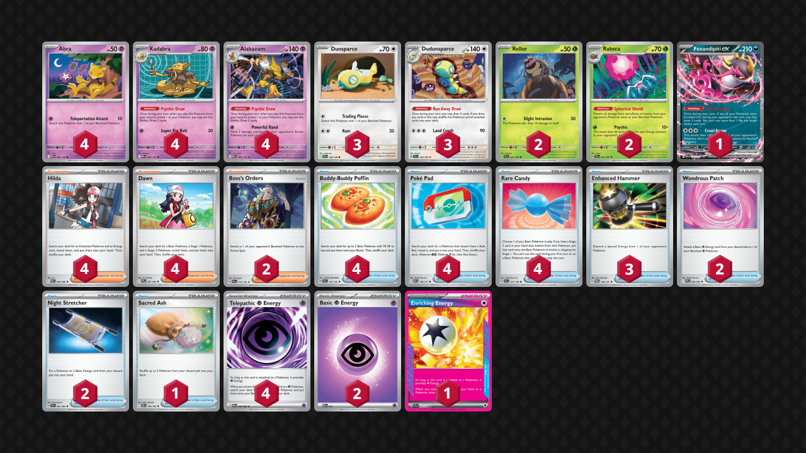
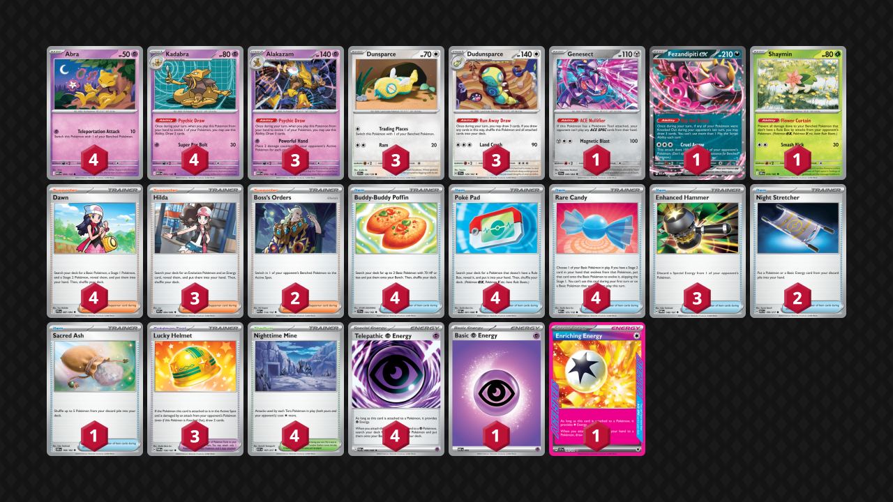

## Decklist 1


```decklist
Pokémon: 23
4 Abra MEG 54
4 Kadabra MEG 55
4 Alakazam MEG 56
3 Dunsparce JTG 120
3 Dudunsparce TEF 129
2 Rellor TEF 23
2 Rabsca TEF 24
1 Fezandipiti ex ASC 142

Trainer: 30
4 Hilda WHT 84
4 Dawn PFL 87
2 Boss's Orders PAL 172
4 Buddy-Buddy Poffin TEF 144
4 Poké Pad ASC 198
4 Rare Candy SVI 191
3 Enhanced Hammer TWM 148
2 Wondrous Patch PFL 94
2 Night Stretcher SFA 61
1 Sacred Ash DRI 168

Energy: 7
4 Telepathic Psychic Energy POR 88
2 Psychic Energy MEE 5
1 Enriching Energy SSP 191
```
<!-- PUBLIC -->
### Inclusions

- Rabsca works very well against Dragapult. The second Rellor is necessary incase Rabsca gets KO'd. The second Rabsca is very good against Dusknoir and Risky Ruins because it's much harder for them to KO both at once.
- Rare Candy is so broken and consistently useful in this deck. From early-game speed, mid-game consistency, sometimes whiffing multiple Kadabra, Abra getting sniped off, etc. There are so many reasons to love Rare Candy. Even with four Kadabra, I still think this deck needs four Rare Candy. Getting the Turn 2 Alakazam is often very important.
- Night Stretcher is my preferred recovery because I mostly just want to get back Abra as conveniently as possible.
- Wondrous Patch helps us spam Enriching Energy which is very good and crucial for recovering off hand disruption.
- Enhanced Hammer is necessary to deal with Mist Energy and Rocky Fighting Energy. Three is typically enough, as this deck can end games before decks like Crustle can get their fourth Mist.
- Sacred Ash is not as conveneint as Stretcher, but it's good to have the flexibility since the downside isn't too bad. It is mostly included to easily make 5-6 Alakazam against single-prize decks such as the mirror match and Festival Lead, which is relevant.

### Possible Inclusions

- Shaymin would be ok but it's a bit redudant with heavy Rabsca.
- Special Red Card would probably be good.
- Morty’s Conviction is very nice as a draw card that can add a lot of cards to hand. Sometimes Hilda or Dawn nets more cards by extending into Alakazam/Dudunsparce, but in other situations, Morty is a more powerful draw Supporter. The reason I prefer Morty to other options is because it’s the only way for this deck to discard Psychic Energy, which is very relevant when you want to use the Wondrous Patch/Enriching Energy combo. I ended up cutting the Mortys for space for Rabsca but it's still not bad.
- Perhaps some sort of switching option could be ok. This is mostly relevant against Dragapult with Yveltal, which is not as common as it used to be. Other random retreat locks aren't as problematic.

### Exclusions

- Psyduck is not here because I tested it against Pult/Noir and was still losing even with Rabsca too.
- Genesect is too much investment for too little return. It’s not that hard to recover off Stamp, and committing a bench spot as well as deck spots for Tools seems bad.
- Fan Rotom is bad, especially with no Stadiums. I initially thought that it would be fine to play Fan Rotom if you played Stadiums, but I did not get much value from it at all, and it is a liability to have in play. Even with Stadiums, I would not play Fan Rotom.
- I think Rabsca is better than other Stadiums like Nighttime Mine or Battle Cage. However, the deck is a little more vulnerable to Watchtower this way.
- Lana’s Aid seems like it would be alright but I would always rather play other Supporters for the turn. Night Stretcher is more convenient. This deck doesn’t really need heavy recovery, but if it does, there’s still Sacred Ash.

## Decklist 2


```decklist
Pokémon: 20
4 Abra MEG 54
4 Kadabra MEG 55
3 Alakazam MEG 56
3 Dunsparce JTG 120
3 Dudunsparce TEF 129
1 Genesect SFA 40
1 Fezandipiti ex ASC 142
1 Shaymin DRI 10

Trainer: 34
4 Dawn PFL 87
3 Hilda WHT 84
2 Boss's Orders MEG 114
4 Buddy-Buddy Poffin TEF 144
4 Poké Pad POR 81
4 Rare Candy MEG 125
3 Enhanced Hammer TWM 148
2 Night Stretcher ASC 196
1 Sacred Ash DRI 168
3 Lucky Helmet TWM 158
4 Nighttime Mine ASC 197

Energy: 6
4 Telepathic Psychic Energy POR 88
1 Psychic Energy MEE 5
1 Enriching Energy SSP 191
```

This is the more standard build with Genesect and Stadiums instead of Rabsca and Wondrous Patches. Which build is better kind of depends on the meta. With more Watchtowers, the Stadiums are better. Otherwise, Rabsca is better.

### Inclusions

- Genesect helps against Dragapult primarily and gives us an excuse to play Lucky Helmet, which is very helpful against hand disruption. Lucky Helmet is the best Tool for this reason, so I think it's best to play three of those instead of any other Tools.
- Shaymin is for Wellspring and Slowking.
- Four Rare Candy for same reasons as above, same with three Hammer.
- Nighttime Mine is very nice against Dragapult and gives us an easy answer to Team Rocket's Watchtower.

### Possible Inclusions

- Fourth Hilda and/or fourth Alakazam would be nice.
- Battle Cage over Nighttime Mine would probably be fine.
- Special Red Card would probably be good.
- Playing the Wondrous Patch package over the Genesect package could be possible.
- Psyduck helps a little against Dragapult / Dusknoir but the matchup is still tough even with it, so I don't think it's worth it. Having random bad Pokemon to start with can be a big liability too.

### Exclusions

- Dedenne is a bad Pokemon to start with and doesn't get used much. I think three Hammer is enough to naturally win the game quick enough against decks like Crustle and Lopunny. I'd rather have the third Hammer over the Dedenne. Makes them easier to find too which is relevant.
- Elgyem did not prove to be very relevant against Dragapult so I cut it.
- I think Night Stretcher is better than Lana's Aid.
- Handheld Fan isn't that good against Dragapult and Festival Lead isn't as relevant for the time being. Air Balloon isn't necessary either. The main issues with these Tools is that they aren't Lucky Helmet.

<!-- /PUBLIC -->
## Gameplay Tips

- Go first.
- As long as you have access to a 3-2 line of Dudunsparce, you can never deck out! Make sure to always use Run Away Draw with one or more cards in deck and never go down to 0 cards in deck! The extra Dunsparce is needed in this scenario in case your opponent KO’s one. Pretty nifty!
- Sequencing with this deck is very weird! If you’re not sure about the sequencing for your turn, think about the fundamentals. 1) Using Run Away Draw early in a sequence increases your chances of drawing into Dunsparce/Dudunsparce on subsequent draws. 2) Putting Enriching Energy back into the deck can be either good or bad depending on if you need to attach Psychic for the turn. 3) Poke Pad can be used for thinning, but oftentimes you want multiple Pokemon! Sometimes you use Poke Pad early in a sequence (if you’re digging for something specific like Energy or Rare Candy), and sometimes later (if you need lots of Pokemon). 4) Using Dawn first for thinning is best if you don’t need multiple Basics/Stage 1s, with similar logic to PokePad. As for Hilda, you’ll only ever need one Energy per turn, I would mostly focus on how many Evolutions you need for your turn. If you only need one, start with Hilda for sure. Otherwise, drawing first might be better! In general, starting your sequence with Hilda/Dawn is good, so that should be the default!
- Telepathic Energy/Poffin are usually first in any sequence. However, sometimes you use Run Away Draw first so that Poffin has space to get two Pokemon. The Poffin may therefore be delayed in a sequence until after Run Away Draw is optimal.
- While the sequencing is very nuanced and interesting, it probably doesn’t matter! This deck sees so many cards and has such polarized matchups that even if you have the IQ of a caveman and play cards at random your winrate will probably be the same!
- If there is any chance of needing Wondrous Patch on your turn, promote Dudunsparce/Dunsparce! If your attacker already has an Energy or you’re sure you won’t rely on Wondrous Patch, promote your attacker so you aren’t committed to using Run Away Draw.
- This deck is very good at winning prize trades, so it’s sometimes totally fine to take a turn off attacking in order to set up and stabilize your board! It is possible to lose if you prioritize taking a KO over stabilizing, so keep that in mind. This deck is extremely linear, so it shouldn’t be too hard to identify lose conditions and prize maps. You can structure your board to play around certain concerns, such as leaving Dudunsparce in play (or passing until you get a better board) to help against Stamp. Of course, most of the time, you will be going for the KO!
- The ideal bench to play around hand disruption is: two Dudunsparce, Abra, Kadabra, and Fez. Sometimes Fez can get punished, however, so it is a little more situational. If you have everything you need for the turn, I prefer leaving evolved Dudunsparce on my bench as well as Abra and Kadabra so that Kadabra and Alakazam are both draw outs.
- Keep careful track of how many cards are in your hand as well as how many you need to get the KO! Against higher-HP Pokemon, every card matters, and sometimes you will make sacrifices to get the KO.
- Understanding the card values of draw cards can help with Alakzam specifically. Dudunsparce in hand is +2, Dudunsparce on board is +3, Candy Alakazam is only +1, as is Kadabra. In the best case, Hilda can be +6, while Dawn can be a whopping +8! Morty’s Conviction is only +3 if your opponent has a full bench (or +6 with Area Zero), but it is less conditional based on what you have on the board. In other words, Morty is better draw power if your Pokemon are already evolved.
- Playing around Watchtower with the no-Stadium build often involves leaving Enriching Energy in the deck and having access to Fez. Most Dragapult play 0-1 Watchtower, which is fine. If they play more, it can be tough. Make sure not to leave too many Dunsparce / Dudunsparce in play when you're likely to get hit with the full disruption combo, as those board spots become completely dead.
- Lucky Helmet is best when going into Red Card range or are particularly worried about Judge/Stamp at a particular moment. Of course it can also just get slammed on Genesect early if possible. If you're worried about Fez getting smacked/trapped against Dragapult, it's reasonable to put it on Fez.
- Playing around random Xerosic's is generally good to keep in mind.

## Matchups

### Dragapult - Depends

With the addition of Rabsca, non-Dusknoir and non-Yveltal builds are now favorable for Alakazam! Dragapult / Dusknoir is still unfavorable for all builds. If you play Battle Cage instead of Rabsca, all Dragapult matchups are still unfavorable. How you play against Dragapult with and without Rabsca is quite different. With the Nighttime Mine build, it's close to even against Dragapult decks with fewer than three hand disruption cards.

With Rabsca:

- The most important thing is setting up and stabilizing. It's ok to not attack for awhile as you don't want to lose to Unfair Stamp. If you're ok with getting Stamped, such as if you have Dudunsparce and/or Fez in play, then it's fine to start attacking. You will get Stamped at some point, and you just want to make sure you don't fully brick off of it.
- The ideal board is both Rabsca, attacking Alakazam, Kadabra, and then some combination of Abra, Fezandipiti, and Dudunsparce. If they play Watchtower, you can ignore Dudunsparce completely.
- If Rabsca or a Rellor is prized, you may need to be more aggressive as you won't be able to set up the unbeatable board. Same if you're against Dusknoir since their setup beats yours.
- Fezandipiti is very good in this matchup, especially to preemptively bench it to play around Stamp. Rabsca protects the Fezandipiti so it's not much of a liability like it would be without Rabsca.
- Passing instead of swinging into Dragapult for less than a KO is often best, but there are some exceptions depending on the board (such as if you think you won't be able to get the KO next turn). In general, don't give them free damage. If they already have plenty of damage from Risky Ruins, this is less of a concern.

Without Rabsca:

- Prioritize getting lots of Abra down and evolved quickly. All four Abra would be ideal.
- Kadabra one-shots Budew. Just go for it if you're Item-locked. Bonus points if you have Genesect with a Tool. Genesect is very good early if you can get it before they get Stamp.
- Boss’s Orders can let us KO Drakloak with Energy to hopefully slow them down by a turn. KO’ing two-prize liabilities can also be quite good.
- Leave 1-2 Dudunsparce in play if you can in order to play around Stamp.
- Fez can be a big liability but often needs to get used anyway. If you can play around hand disruption with Helmet and Dudunsparce instead, that would be ideal.
- Slam Nighttime Mine on sight.

```youtube
id: M8qiF8cGqdY
title: Rabsca v Pult 1
```

```youtube
id: 2pwoICz5MAs
title: Zam v Pult 1
```

```youtube
id: WqRUQWNB7HU
title: Zam v Pult 2
```
This is one of the most interesting and confusing games I’ve ever played.

```youtube
id: VL0a9wzxKwI
title: Pultnoir v Zam 1
```

```youtube
id: KKp9jEXXOdI
title: Pultnoir v Zam 2
```

```youtube
id: bdMztyglVF4
title: Blaziken v Zam 1
```

```youtube
id: 3oqKTcPvTRs
title: Blaziken v Zam 2
```

### Raging Bolt - Very Favorable

- Shaymin / Rabsca is very good to protect against Waterpon.
- Watch out for Stamp. Don't risk losing to it with no protection. Since the prize trade is so favorable, it's ok to wait and stabilize your board before going in.

```youtube
id: jghIvgnkBmg
title: Zam v Bolt 1
```

```youtube
id: nqv7CF4-1NI
title: Zam v Bolt 2
```

### Alakazam Mirror - Even

- Do everything you can to get the first attack. Use Sacred Ash for Alakazam pieces as needed.
- Play around Enhanced Hammer.
- Don't put Fez in play.

### Zoroark - Favorable

- If they have Darmanitan/Darumaka, Shaymin / Rabsca is a huge priority.
- Play around Stamp as normal. Also be aware of possible Xerosic's and try to play around it.
- Don’t worry about the Yveltal trap. It will often happen, but it is not a real threat. If they trap Fez, power it up asap to make it a threat. If they trap Shaymin, just let it go down in four hits and don’t bother powering it up. If they have the board of Pech, Munki, Darm, Yveltal, and Zoroark, they can get a triple-KO play by trapping Shaymin, KO’ing it with Adrenabrain, and then using Darm. You’ll probably still win even if they do this, and it’s unlikely to happen in the first place since they need board spots for draw power. If that actually does happen, make sure to have a third Alakazam line in play so they cannot wipe all attackers.

```youtube
id: AAIh8BWElzA
title: Zam v Zoroark 1
```

### Crustle - Favorable

- Get a fast Alakazam and draw cards aggressively to find Hammers and Bosses. 
- Boss is good specifically to target Spiky Energy, Hero’s Cape, or anything that accumulates too much Energy.
- Start powering up Dudunsparce right away! This is how you can deal with a Crustle with Mist once you run out of Hammers. This is actually relevant in most games. If they ever leave a Dwebble with Mist Energy and you can KO it with Dudunsparce, do that and it’s basically game over.
- If they have more prizes left than Bosses, you can even loop Dudunsparce into each other in the end-game. You have to be a bit careful with managing cards to not accidentally deck out, but Dudunsparce can infinitely heal itself while Crustle cannot KO it in one shot.

```youtube
id: KfDqsPaSWZo
title: Crustle v Zam 1
```

```youtube
id: 0Cw8pFTfpZE
title: Crustle v Zam 2
```

### Mewtwo - Auto Loss

- This is obviously a horrible matchup because of Articuno, but if there is a way to win it’s by powering up Fez as fast as possible and taking out their Articuno. Use Boss’s Orders and Enhanced Hammer to slow them down. They do sometimes draw garbage, so it is possible to get lucky.
- If they for some reason do not have Articuno in play, wreak as much havoc as possible with Alakazam during that window whenever possible. Also use Alakazam to KO Spidops.

### Slop Box - Very Favorable

- Just play normally and get Shaymin / Rabsca for the Wellspring.

### Lucario - Very Favorable

- Your lose conditions involve Rocky Fighting Energy and Judge. Play around Judge the same way you would play around Stamp.
- Save Enhanced Hammers for Rocky Energy on Lucario. If they are attacking with Rocky Energy on Solrock, try to Boss around it instead so you’ll have Hammer for the Lucario/Hariyama. If you can’t Boss around, it’s fine to use the Hammer on it to get the KO.
- Benching Fez preemptively is fine to play around Judge, as long as you’re ahead in the prize race and won’t lose by giving it to them. They can get an easy two prizes on it, but they cannot do any real snipe or trap shenanigans like Dragapult.
- I think going second is best to avoid the unnecessary risk of getting donked by Solrock.

```youtube
id: tQgDTTJcgC0
title: Zam v Lucario 1
```

### Festival Lead - Even

- Rare Candy is a very important resource. Try to get as many Abra and Kadabra in play as soon as possible so that you won’t stress the Candies as much.
- Try to get a Dudunsparce in play to use as a sponge as soon as possible to deny them the two-prize turn.
- KO Dipplin every turn. This stresses their resources the most. One time I got baited by KO’ing their only Thwackey and it was actually the difference between winning and losing.
- If you play Battle Cage, try to bump their Stadium every turn. You can create a board in the end-game full of Pokemon with more than 100 HP to potentially win if they run out of Stadiums.
- If you play Fan, using it on Alakazam is usually best. There can be some cheeky Dudunsparce plays with Fan but they are very involved and situational.

```youtube
id: g5-pKFaJc_Y
title: Festival v Zam 1
```

```youtube
id: X3YpsKBoBBI
title: Festival v Zam 2
```

### Lopunny - Slightly Favorable

This matchup would be better with Dedenne or Handheld Fan, but it’s still fine.

- Draw cards fast and cycle Dudunsparce as aggressively as possible. We need to find those Hammers!
- Hoard the Hammers until you can empty the clip to one-shot a Lopunny. Same goes for Boss. If you play three Boss you could consider a cheeky KO on a Dunsparce/Dudunsparce one time.
- Start attaching Energy to Fezandipiti as soon as possible. This is very important since we need to threaten their Buneary before it gets all four Mists.
- If you play Handheld Fan, there might be some merit to not KO’ing their extra Buneary or Fan Rotom, depending on the situation. Without Fan, just take KO’s as much as you can.
- KO any Lopunny whenever possible!

```youtube
id: STEe7cRpzw0
title: Lop v Zam 1
```

### Garchomp - Favorable

- Draw tons of cards aggressively to find Hammers and Bosses.
- Use any spare Energy attachments to power up Fezandipiti. You may need it to KO a Gabite with Rocky Energy. Get one Energy on Alakazam first, then power up Fez asap. Use Fez to KO a Rocky Energy at any opportunity! This play is basically an instant-win if you get it.
- If they have Garchomp in play, try to KO it. If not, Gabite is the ideal target. However, if they have lots of Pokemon in play, it can be better to save Boss to get around Rocky which can close out the game if the opponent is not careful.

```youtube
id: 8q94dnhtquM
title: Chomp v Zam 1
```

```youtube
id: sAhw5oGWVZE
title: Chomp v Zam 2
```

### Arboliva - Very Favorable

- Lose conditions are Stamp/Judge bricking as well as Arboliva shenanigans. Fez is very good in this matchup for the hand disruption, but it can get trapped and sniped around by Arboliva. It’s still worth playing around hand disruption as much as possible. Try to always have a Dudunsparce on the board.
- Shaymin is good by default because they are always threatening a fast Arboliva. However, depending on the board state, Shaymin may not be a priority. Do not let Arboliva KO two Abra at once. Later, Shaymin is better with Fez also on the board in case it gets stuck, but you sometimes don’t have space for both.
- Play around Briar (usually with Boss's Orders at some point).

```youtube
id: iD7-LXurpaQ
title: Zam v Meganium 1
```

```youtube
id: mfO2VViBono
title: Zam v Meganium 2
```

### Ogerpon - Very Favorable

- Prioritize getting Shaymin. If you can’t get Shaymin fast but you do get set up without going too far behind, you won’t even need Shaymin anymore.
- Play around Stamp as usual unless you know they play a different Ace Spec.
- If you end up putting Fez in play, attach an extra Energy or two to it in case they go for the Sob into three-prize play.

## Personal Thoughts

This deck is quite good now with Rabsca allowing it to beat some Dragapult decks such as the Hammers / Risky Ruins build. However it's still playing matchup roulette since it hard loses to Mewtwo and some other Dragapult lists. This deck is also a bit worse when more Dragapult are playing Watchtower, so it depends on current meta trends.