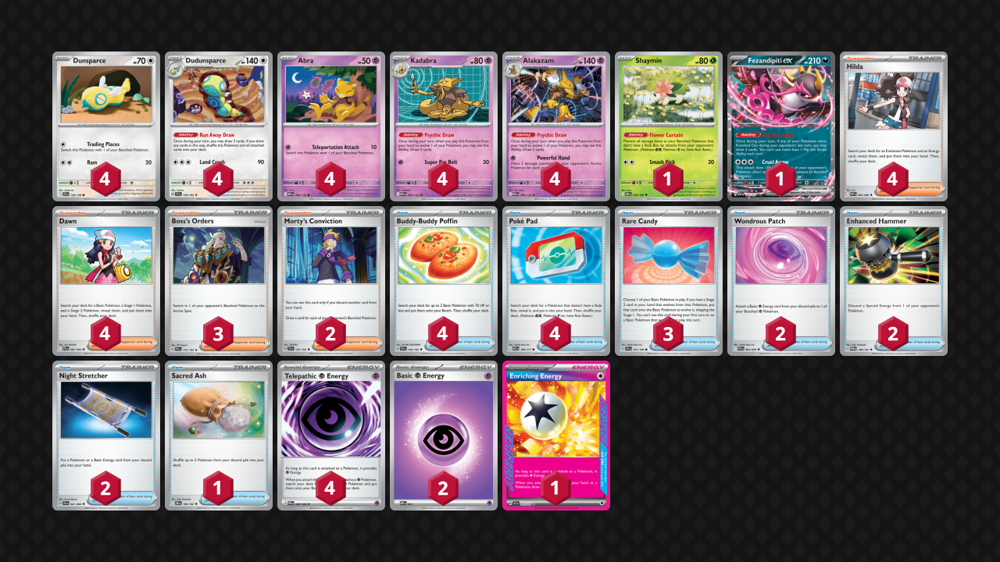

## Decklist


```decklist
Pokémon: 22
4 Dunsparce JTG 120
4 Dudunsparce TEF 129
4 Abra MEG 54
4 Kadabra MEG 55
4 Alakazam MEG 56
1 Shaymin DRI 10
1 Fezandipiti ex ASC 142

Trainer: 31
4 Hilda WHT 84
4 Dawn PFL 87
3 Boss's Orders PAL 172
2 Morty's Conviction TEF 155
4 Buddy-Buddy Poffin TEF 144
4 Poké Pad ASC 198
3 Rare Candy SVI 191
2 Wondrous Patch PFL 94
2 Enhanced Hammer TWM 148
2 Night Stretcher SFA 61
1 Sacred Ash DRI 168

Energy: 7
4 Telepathic Psychic Energy POR 88
2 Psychic Energy MEE 5
1 Enriching Energy SSP 191
```

### Inclusions

- This list is pretty simple and straightforward. Alakazam’s matchups are extremely polarized. It would make sense to try and cover for the bad matchups in some way, but I don’t think that’s possible. Therefore, I wanted to make the deck as fundamentally sound as possible and fully lean into the matchup roulette.
- Shaymin is mostly relevant against random Waterpons and Darmanitan. It also adds a few percentage points against Arboliva. I think it’s one of the few techs that makes a lot of sense, though it’s not strictly needed.
- Morty’s Conviction is very nice as a draw card that can add a lot of cards to hand. Sometimes Hilda or Dawn nets more cards by extending into Alakazam/Dudunsparce, but in other situations, Morty is a more powerful draw Supporter. The reason I prefer Morty to other options is because it’s the only way for this deck to discard Psychic Energy, which is very relevant when you want to use the Wondrous Patch/Enriching Energy combo.
- Rare Candy is so broken and consistently useful in this deck. From early-game speed, mid-game consistency, sometimes whiffing multiple Kadabra, Abra getting sniped off, etc. There are so many reasons to love Rare Candy. Even with four Kadabra, I actually want a fourth Candy and will be trying to fit it in.
- Night Stretcher is my preferred recovery because I mostly just want to get back Abra as conveniently as possible.
- Wondrous Patch is either useless or insanely powerful. It won’t be used every game, but it allows us to make use of Enriching Energy, which is a fantastic draw card that we can recycle via Dudunsparce.
- Enhanced Hammer is necessary to deal with Mist Energy and Rocky Fighting Energy.
- Sacred Ash isn’t very good, but the downside compared to Night Stretcher is minimal. It is mostly included to easily make 5-6 Alakazam against single-prize decks such as the mirror match.

### Exclusions

- Psyduck is not here because we lose to Dragapult either way and Dusknoir isn’t that big a part of the meta.
- Genesect is too much investment for too little return. It’s not that hard to recover off Stamp, and committing a bench spot as well as deck spots for Tools seems bad.
- Fan Rotom is bad, especially with no Stadiums. I initially thought that it would be fine to play Fan Rotom if you played Stadiums, but I did not get much value from it at all, and it is a liability to have in play. Even with Stadiums, I don’t think I would play Fan Rotom.
- Speaking of Stadiums, many lists play Battle Cage. However, even with 3-4 Battle Cage, the Dragapult matchup is still terrible. Therefore, I do not want to waste the deck space on it. Another option for the Stadium is Nighttime Mine, which might be better.
- Chien-Pao is a consideration for random Watchtowers. If decks besides Dragapult end up playing random Watchtowers, it may be worth adding Chien-Pao in.
- Lana’s Aid seems like it would be alright but I would always rather play other Supporters for the turn. Night Stretcher is more convenient. This deck doesn’t really need heavy recovery, but if it does, there’s still Sacred Ash.

## Gameplay

- As long as you have access to a 3-2 line of Dudunsparce, you can never deck out! Make sure to always use Run Away Draw with one or more cards in deck and never go down to 0 cards in deck! The extra Dunsparce is needed in this scenario in case your opponent KO’s one. Pretty nifty!
- Sequencing with this deck is very weird! If you’re not sure about the sequencing for your turn, think about the fundamentals. 1) Using Run Away Draw early in a sequence increases your chances of drawing into Dunsparce/Dudunsparce on subsequent draws. 2) Putting Enriching Energy back into the deck can be either good or bad depending on if you need to attach Psychic for the turn. 3) Poke Pad can be used for thinning, but oftentimes you want multiple Pokemon! Sometimes you use Poke Pad early in a sequence (if you’re digging for something specific like Energy or Rare Candy), and sometimes later (if you need lots of Pokemon). 4) Using Dawn first for thinning is best if you don’t need multiple Basics/Stage 1s, with similar logic to PokePad. As for Hilda, you’ll only ever need one Energy per turn, I would mostly focus on how many Evolutions you need for your turn. If you only need one, start with Hilda for sure. Otherwise, drawing first might be better! In general, starting your sequence with Hilda/Dawn is good, so that should be the default!
- Telepathic Energy/Poffin are usually first in any sequence. However, sometimes you use Run Away Draw first so that Poffin has space to get two Pokemon. The Poffin may therefore be delayed in a sequence until after Run Away Draw is optimal.
- While the sequencing is very nuanced and interesting, it probably doesn’t matter! This deck sees so many cards and has such polarized matchups that even if you have the IQ of a caveman and play cards at random your winrate will probably be the same!
- If there is any chance of needing Wondrous Patch on your turn, promote Dudunsparce/Dunsparce! If your attacker already has an Energy or you’re sure you won’t rely on Wondrous Patch, promote your attacker so you aren’t committed to using Run Away Draw.
- This deck is very good at winning prize trades, so it’s sometimes totally fine to take a turn off attacking in order to set up and stabilize your board! It is possible to lose if you prioritize taking a KO over stabilizing, so keep that in mind. This deck is extremely linear, so it shouldn’t be too hard to identify lose conditions and prize maps. You can structure your board to play around certain concerns, such as leaving Dudunsparce in play (or passing until you get a better board) to help against Stamp. Of course, most of the time, you will be going for the KO!
- The ideal bench to play around hand disruption is: two Dudunsparce, Abra, Kadabra, and Fez. Sometimes Fez can get punished, however, so it is a little more situational. If you have everything you need for the turn, I prefer leaving evolved Dudunsparce on my bench as well as Abra and Kadabra so that Kadabra and Alakazam are both draw outs.
- Keep careful track of how many cards are in your hand as well as how many you need to get the KO! Against higher-HP Pokemon, every card matters, and sometimes you will make sacrifices to get the KO.
- Understanding the card values of draw cards can help with Alakzam specifically. Dudunsparce in hand is +2, Dudunsparce on board is +3, Candy Alakazam is only +1, as is Kadabra. In the best case, Hilda can be +6, while Dawn can be a whopping +8! Morty’s Conviction is only +3 if your opponent has a full bench (or +6 with Area Zero), but it is less conditional based on what you have on the board. In other words, Morty is better draw power if your Pokemon are already evolved.
- Going first is best!

## Matchups

I feel like I should put a disclaimer here: there is really not a lot of strategy in these matchups due to the linear nature of Alakazam! Its matchups are either hard wins or hard losses for the most part. As a result, there is not much interesting game footage. Most of the games I recorded were one-sided beatdowns one way or the other.

### Dragapult - Very Unfavorable

Even with Battle Cages, this matchup is still very unfavorable! If there is some build or tech that makes this matchup slightly unfavorable instead, Alakazam will instantly become top tier.

- Prioritize getting lots of Abra down and evolved quickly. Since this list does not run a Stadium, we cannot bump Risky Ruins. We are trying to avoid giving them 3 prizes off one Phantom Dive.
- Kadabra one-shots Budew. Just go for it. Our win condition is high-rolling and going fast, so play into that.
- Boss’s Orders can let us KO Drakloak with Energy to hopefully slow them down by a turn. KO’ing two-prize liabilities can also be quite good.
- Leave two Dudunsparce in play if you can in order to play around Stamp.
- Fez is a HUGE liability. Ideally you won’t put it down, but it might be necessary to reach for a big one-shot on a Dragapult. I wouldn’t put it down preemptively though.

```youtube
id: N7C96e59bMc
title: Zam v Pult 1
```

```youtube
id: HJZBgT8hcF0
title: Zam v Pult 2
```

### Lucario - Very Favorable

- Your lose conditions involve Rocky Fighting Energy and Judge. Play around Judge the same way you would play around Stamp.
- Save Enhanced Hammers for Rocky Energy on Lucario. If they are attacking with Rocky Energy on Solrock, try to Boss around it instead so you’ll have Hammer for the Lucario/Hariyama. If you can’t Boss around, it’s fine to use the Hammer on it to get the KO as long as you did not prize your other Hammer.
- Benching Fez preemptively is fine to play around Judge, as long as you’re ahead in the prize race and won’t lose by giving it to them. They can get an easy two prizes on it, but they cannot do any real snipe or trap shenanigans like Dragapult.

```youtube
id: tQgDTTJcgC0
title: Zam v Lucario 1
```

### Absol - Very Favorable

- The only real lose conditions are bricking off Stamp or running out of ways to deal with Mist Energy, both of which can be played around.
- Play around Stamp as normal, try to keep a Dudunsparce in play.
- Slam Enhanced Hammer as soon as you see a Mist Energy. If you hang onto it, it might get Claw’d away, which is one of the few ways to actually lose this matchup. Boss is also a good resource to get around Mist Energy since they will usually have targets on the board. Using one or two aggressively is usually fine though, but it depends on the situation and what their board looks like.
- Don’t bother with Shaymin in this matchup unless they play Waterpon. Fez alone is not a big deal.

```youtube
id: XXMfhlPs4lg
title: Zam v Absol 1
```

### Meganium - Very Favorable

- Lose conditions are Stamp/Judge bricking as well as Arboliva shenanigans. Fez is very good in this matchup for the hand disruption, but it can get trapped and sniped around by Arboliva. It’s still worth playing around hand disruption as much as possible. Try to always have a Dudunsparce on the board.
- Shaymin is good by default because they are always threatening a fast Arboliva. However, depending on the board state, Shaymin may not be a priority. Do not let Arboliva KO two Abra at once. Later, Shaymin is better with Fez also on the board in case it gets stuck, but you sometimes don’t have space for both.

```youtube
id: iD7-LXurpaQ
title: Zam v Meganium 1
```

```youtube
id: mfO2VViBono
title: Zam v Meganium 2
```

### Raging Bolt - Very Favorable

- Although the baby Bolt is very annoying, I still don’t think it’s worth prioritizing Shaymin due to the bench spot it occupies.
- Watch out for Stamp, Fez is very good, etc. 
- If they start by attacking with baby Bolt, you’ll have to go through it eventually anyway, so do it whenever it’s most convenient for you or least convenient for your opponent. KO’ing baby Bolt asap when it’s the only thing with Energy can be good. KO’ing Fez or their only Tera Pokemon could be also considered instead, if possible.
- If they don’t have baby Bolt and you aren’t ready to attack yet, try to leave something chunky in the active such as Dudunsparce or even Kadabra so they don’t get a free KO with Fan Rotom.

```youtube
id: jghIvgnkBmg
title: Zam v Bolt 1
```

```youtube
id: nqv7CF4-1NI
title: Zam v Bolt 2
```

### Mewtwo - Very Unfavorable

- This is obviously a horrible matchup because of Articuno, but if there is a way to win it’s by powering up Fez as fast as possible and taking out their Articuno. Use Boss’s Orders and Enhanced Hammer to slow them down. They do sometimes draw garbage, so it is possible to get lucky.
- If they for some reason do not have Articuno in play, wreak as much havoc as possible with Alakazam during that window whenever possible.

### Zoroark - Very Favorable

- If they have Darmanitan/Darumaka, Shaymin is a huge priority. You’ll probably lose without Shaymin.
- Play around Stamp as normal.
- Don’t worry about the Yveltal trap. It will often happen, but it is not a real threat. If they trap Fez, power it up asap to make it a threat. If they trap Shaymin, just let it go down in four hits and don’t bother powering it up. If they have the board of Pech, Munki, Darm, Yveltal, and Zoroark, they can get a triple-KO play by trapping Shaymin, KO’ing it with Adrenabrain, and then using Darm. You’ll probably still win even if they do this, and it’s unlikely to happen in the first place since they need board spots for draw power. If that actually does happen, make sure to have a third Alakazam line in play so they cannot wipe all attackers.

```youtube
id: AAIh8BWElzA
title: Zam v Zoroark 1
```

## Personal Thoughts

Pure matchup roulette deck. I probably wouldn’t play it because losing to Dragapult is not ideal, and that matchup is worse than expected. However most of the other matchups are so free that Alakazam can still be a good play. The deck is also very consistent and can even be fast with the Candies.
