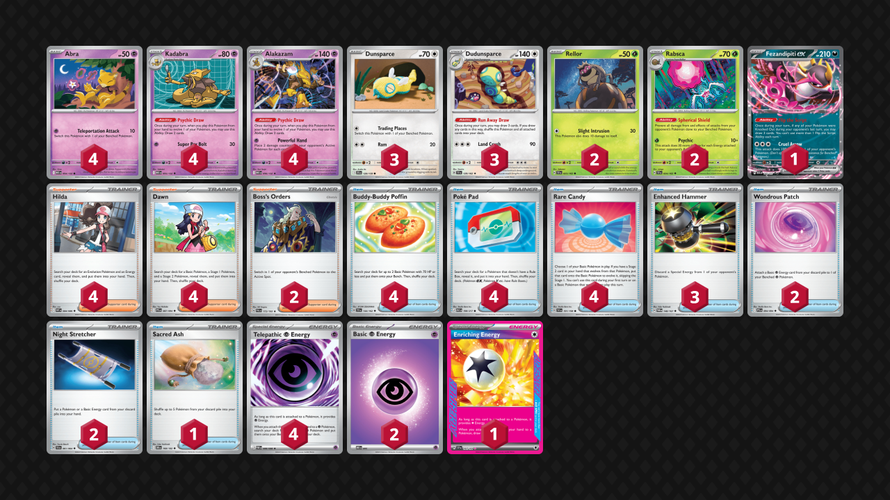
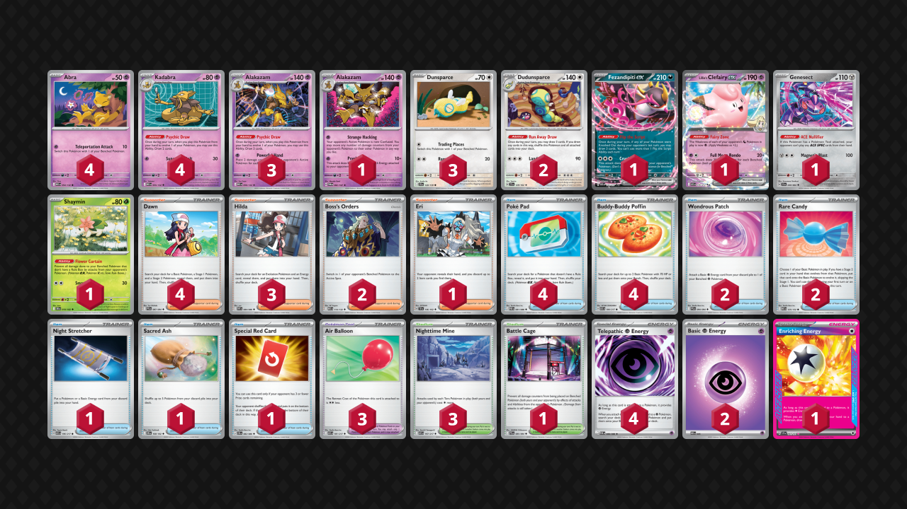

## Decklist 1


```decklist
Pokémon: 23
4 Abra MEG 54
4 Kadabra MEG 55
4 Alakazam MEG 56
3 Dunsparce JTG 120
3 Dudunsparce TEF 129
2 Rellor TEF 23
2 Rabsca TEF 24
1 Fezandipiti ex ASC 142

Trainer: 30
4 Hilda WHT 84
4 Dawn PFL 87
2 Boss's Orders PAL 172
4 Buddy-Buddy Poffin TEF 144
4 Poké Pad ASC 198
4 Rare Candy SVI 191
3 Enhanced Hammer TWM 148
2 Wondrous Patch PFL 94
2 Night Stretcher SFA 61
1 Sacred Ash DRI 168

Energy: 7
4 Telepathic Psychic Energy POR 88
2 Psychic Energy MEE 5
1 Enriching Energy SSP 191
```
<!-- PUBLIC -->
### Inclusions

- Rabsca works very well against Dragapult. The second Rellor is necessary incase Rabsca gets KO'd. The second Rabsca is very good against Dusknoir and Risky Ruins because it's much harder for them to KO both at once.
- Rare Candy is so broken and consistently useful in this deck. From early-game speed, mid-game consistency, sometimes whiffing multiple Kadabra, Abra getting sniped off, etc. There are so many reasons to love Rare Candy. Even with four Kadabra, I still think this deck needs four Rare Candy. Getting the Turn 2 Alakazam is often very important.
- Night Stretcher is my preferred recovery because I mostly just want to get back Abra as conveniently as possible.
- Wondrous Patch helps us spam Enriching Energy which is very good and crucial for recovering off hand disruption.
- Enhanced Hammer is necessary to deal with Mist Energy and Rocky Fighting Energy. Three is typically enough, as this deck can end games before decks like Crustle can get their fourth Mist.
- Sacred Ash is not as conveneint as Stretcher, but it's good to have the flexibility since the downside isn't too bad. It is mostly included to easily make 5-6 Alakazam against single-prize decks such as the mirror match, which is relevant.

### Possible Inclusions

- Shaymin would be ok but it's a bit redudant with heavy Rabsca.
- Special Red Card would probably be good.
- Lillie's Clefairy enables some interesting setups and also provides a way to circumvent hard counters. It could be worth playing.

### Exclusions

- Psyduck is not here because I tested it against Pult/Noir and it was not doing much. I'd rather have double Rabsca on the board.
- Toucannon bad. Too much space for hardly contributing anything.
- Genesect doesn't go well in this list since we need the board space for Rabsca, and it's not too hard to recover off Stamp anyway.
- Fan Rotom is bad, especially with no Stadiums. I initially thought that it would be fine to play Fan Rotom if you played Stadiums, but I did not get much value from it at all, and it is a liability to have in play. Even with Stadiums, I would not play Fan Rotom.
- I think Rabsca is better than other Stadiums like Nighttime Mine or Battle Cage. However, the deck is more vulnerable to Watchtower this way.
- Forest of Vitality is bait. It doesn't accomplish much besides countering Stadiums, at which point just play Battle Cages and cut Rabsca.
- Lana’s Aid seems like it would be alright but I would always rather play other Supporters for the turn. Night Stretcher is more convenient. This deck doesn’t really need heavy recovery, but if it does, there’s still Sacred Ash.

## Decklist 2


```decklist
Pokémon: 21
4 Abra MEG 54
4 Kadabra MEG 55
3 Alakazam MEG 56
1 Alakazam TWM 82
3 Dunsparce JTG 120
2 Dudunsparce TEF 129
1 Fezandipiti ex ASC 142
1 Lillie's Clefairy ex ASC 76
1 Genesect SFA 40
1 Shaymin DRI 10

Trainer: 32
4 Dawn PFL 87
3 Hilda WHT 84
2 Boss's Orders MEG 114
1 Eri TEF 146
4 Poké Pad POR 81
4 Buddy-Buddy Poffin ASC 184
2 Wondrous Patch PFL 94
2 Rare Candy MEG 125
1 Night Stretcher ASC 196
1 Sacred Ash DRI 168
1 Special Red Card CRI 82
3 Air Balloon ASC 181
3 Nighttime Mine ASC 197
1 Battle Cage PFL 85

Energy: 7
4 Telepathic Psychic Energy POR 88
2 Psychic Energy MEE 5
1 Enriching Energy SSP 191
```

This is the more normal build with Genesect and Stadiums instead of Rabsca. Which build is better kind of depends on the meta. With more Watchtowers around, the Stadiums are better. Otherwise, Rabsca is better.

### Inclusions

- The bad Alakazam is a Crustle counter. It can also be useful against other Pokemon that are invincible to the main Alakazam. Thanks to Nighttime Mine and Clefairy, it can also one-shot a Dragapult with three Energy. If they attach three Energy to attack through Nighttime Mine, it's easier to KO it that way than get sixteen cards in hand.
- Genesect helps against Dragapult primarily and Unfair Stamp in general, which is otherwise a very annoying card. Genesect is also good against Festival to stop Secret Box, making it a little more difficult for them to play Gladion's Final Battle.
- Clefairy is good against Dragapult and can also deal with annoying Pokemon that are invincible to Alakazam. Wondrous Patch to power up Clefairy.
- Air Balloon is fairly good as a Tool option for Genesect because of Dragapult's Crushing Hammer. If we did not play Balloon, they could Hammer and then Boss stall to set up damage for free.
- Shaymin is for Wellspring and Slowking.
- Eri and Special Red Card are particularly good against Dragapult but they also end up being useful in other matchups such as the mirror.
- Rare Candy is used more as a combo piece for making stronger boards in mid- or late-game. It would be nice to have more, but there's no space. If you happen to have it early, that's great, but it's not the main game plan.
- Nighttime Mine and Battle Cage are good against Dragapult and to bump annoying Stadiums. I'm honestly not sure which Stadium is best overall. The more Dusknoir is present in the metagame, the better Battle Cage gets.

### Possible Inclusions

- Fourth Hilda, another Dudunsparce, or more Candy would be nice.
- Special Red Card would probably be good.
- Could play a Lucky Helmet over one Balloon.
- Could play Battle Cages over Mines.

### Exclusions

- Dedenne is especially bad without Hammers.
- Elgyem was not doing anything for me against Dragapult so I cut it.
- Toucannon is bad.
- I think Night Stretcher is better than Lana's Aid.
- Handheld Fan is bad because you still lose to Festival Lead anyway and it's not that good against Dragapult.

<!-- /PUBLIC -->
## Gameplay Tips

- Go first.
- As long as you have access to a 3-2 line of Dudunsparce, you can never deck out! Make sure to always use Run Away Draw with one or more cards in deck and never go down to 0 cards in deck! The extra Dunsparce is needed in this scenario in case your opponent KO’s one. Pretty nifty!
- Sequencing with this deck is very weird! If you’re not sure about the sequencing for your turn, think about the fundamentals. 1) Using Run Away Draw early in a sequence increases your chances of drawing into Dunsparce/Dudunsparce on subsequent draws. 2) Putting Enriching Energy back into the deck can be either good or bad depending on if you need to attach Psychic for the turn. 3) Poke Pad can be used for thinning, but oftentimes you want multiple Pokemon! Sometimes you use Poke Pad early in a sequence (if you’re digging for something specific like Energy or Rare Candy), and sometimes later (if you need lots of Pokemon). 4) Using Dawn first for thinning is best if you don’t need multiple Basics/Stage 1s, with similar logic to PokePad. As for Hilda, you’ll only ever need one Energy per turn, I would mostly focus on how many Evolutions you need for your turn. If you only need one, start with Hilda for sure. Otherwise, drawing first might be better! In general, starting your sequence with Hilda/Dawn is good, so that should be the default!
- Telepathic Energy/Poffin are usually first in any sequence. However, sometimes you use Run Away Draw first so that Poffin has space to get two Pokemon. The Poffin may therefore be delayed in a sequence until after Run Away Draw is optimal.
- While the sequencing is very nuanced and interesting, it probably doesn’t matter! This deck sees so many cards and has such polarized matchups that even if you have the IQ of a caveman and play cards at random your winrate will probably be the same!
- If there is any chance of needing Wondrous Patch on your turn, promote Dudunsparce/Dunsparce! If your attacker already has an Energy or you’re sure you won’t rely on Wondrous Patch, promote your attacker so you aren’t committed to using Run Away Draw.
- This deck is very good at winning prize trades, so it’s sometimes totally fine to take a turn off attacking in order to set up and stabilize your board! It is possible to lose if you prioritize taking a KO over stabilizing, so keep that in mind. This deck is extremely linear, so it shouldn’t be too hard to identify lose conditions and prize maps. You can structure your board to play around certain concerns, such as leaving Dudunsparce in play (or passing until you get a better board) to help against Stamp. Of course, most of the time, you will be going for the KO!
- The ideal bench to play around hand disruption is: two Dudunsparce, Abra, Kadabra, and Fez. Sometimes Fez can get punished, however, so it is a little more situational. If you have everything you need for the turn, I prefer leaving evolved Dudunsparce on my bench as well as Abra and Kadabra so that Kadabra and Alakazam are both draw outs.
- Keep careful track of how many cards are in your hand as well as how many you need to get the KO! Against higher-HP Pokemon, every card matters, and sometimes you will make sacrifices to get the KO.
- Understanding the card values of draw cards can help with Alakzam specifically. Dudunsparce in hand is +2, Dudunsparce on board is +3, Candy Alakazam is only +1, as is Kadabra. In the best case, Hilda can be +6, while Dawn can be a whopping +8! Morty’s Conviction is only +3 if your opponent has a full bench (or +6 with Area Zero), but it is less conditional based on what you have on the board. In other words, Morty is better draw power if your Pokemon are already evolved.
- Playing around Watchtower with the no-Stadium build often involves leaving Enriching Energy in the deck and having access to Fez. Most Dragapult play 0-1 Watchtower, which is fine. If they play more, it can be tough. Make sure not to leave too many Dunsparce / Dudunsparce in play when you're likely to get hit with the full disruption combo, as those board spots become completely dead.
- Lucky Helmet is best when going into Red Card range or are particularly worried about Judge/Stamp at a particular moment. Of course it can also just get slammed on Genesect early if possible. If you're worried about Fez getting smacked/trapped against Dragapult, it's reasonable to put it on Fez.
- Playing around random Xerosic's is generally good to keep in mind. You don't have to draw as much as you can all the time, as you end up with diminishing returns at some point. That said, if you're going to need to find a specific card like Boss's Orders within the next turn or two, that's when it's best to draw as many cards as possible.

## Matchups

### Dragapult - Unfavorable

Depending on the builds, the matchup is usually unfavorable or slightly unfavorable. The Rabsca version does better against non-Watchtower builds, but struggles more against Watchtower than the Battle Cage version.

With Rabsca:

- The most important thing is setting up and stabilizing. It's ok to not attack for awhile as you don't want to lose to Unfair Stamp. If you're ok with getting Stamped, such as if you have Dudunsparce and/or Fez in play, then it's fine to start attacking. You will get Stamped at some point, and you just want to make sure you don't fully brick off of it.
- The ideal board is both Rabsca, attacking Alakazam, Kadabra, and then some combination of Abra, Fezandipiti, and Dudunsparce. If they play Watchtower, you can ignore Dudunsparce completely.
- If Rabsca or a Rellor is prized, you may need to be more aggressive as you won't be able to set up the unbeatable board. Same if you're against Dusknoir since their setup beats yours.
- Fezandipiti is very good in this matchup, especially to preemptively bench it to play around Stamp. Rabsca protects the Fezandipiti so it's not much of a liability like it would be without Rabsca.
- Passing instead of swinging into Dragapult for less than a KO is often best, but there are some exceptions depending on the board (such as if you think you won't be able to get the KO next turn). In general, don't give them free damage to use Adrenabrain with. If they already have plenty of damage from Risky Ruins, this is less of a concern.

Without Rabsca:

- Prioritize getting lots of Abra down and evolved quickly. All four Abra would be ideal.
- Kadabra one-shots Budew. Just go for it if you're Item-locked and they don't have any Drakloak yet. If you don't have Dudunsparce as protection, it's also fine to wait until you have Genesect with a Tool. Genesect is very good early if you can get it before they get Stamp.
- Boss’s Orders can let us KO Drakloak with Energy to hopefully slow them down by a turn. KO’ing two-prize liabilities can also be quite good.
- Leave 1-2 Dudunsparce in play if you can in order to play around Stamp and Red Card.
- Fez can be a big liability but often needs to get used anyway. If you can play around hand disruption with Helmet and Dudunsparce instead, that would be ideal.
- Slam Nighttime Mine on sight.

With Clefairy:

- Prioritize getting a basic Psychic Energy on your attacker or in discard. The only way to do this is by retreating or having it get KO'd.
- This build benefits from playing more passively in some cases because you have options to trade into Dragapult even after hand disruption. You want Genesect established (or Eri on Stamp) before going in.
- Don't put Fez down unless you have to.
- Evolve all Abra as soon as possible to avoid feeding them to Phantom Dive snipe.
- If you can't get to sixteen cards in hand, Clefairy is a good option for KO'ing Dragapult. You can put the Clefairy down preemptively if you can also attach a basic Psychic to it (ideally with the Abras also evolved out of range). They cannot Boss and Judge at the same time. If they target Clefairy, just KO with the sixteen card Alakazam.
- Boss to target Energy or two-prizers is generally good.
- Slam Nighttime Mine whenever. Bad Alakazam can one-shot a Dragapult with three Energy as long as Clefairy is in play, but don't expect that to come up every game.
- Against Blaziken, if they somehow don't have Energy in the discard (or if they have too many Energy already committed to the board / discard), you can Boss the Blaziken and smack it for 300, which sets up for a bad Zam Strange Hacking play.

```youtube
id: M8qiF8cGqdY
title: Rabsca v Pult 1
```

```youtube
id: 2pwoICz5MAs
title: Zam v Pult 1
```

```youtube
id: WqRUQWNB7HU
title: Zam v Pult 2
```
This is one of the most interesting and confusing games I’ve ever played.

```youtube
id: VL0a9wzxKwI
title: Pultnoir v Zam 1
```

```youtube
id: KKp9jEXXOdI
title: Pultnoir v Zam 2
```

```youtube
id: bdMztyglVF4
title: Blaziken v Zam 1
```

```youtube
id: 3oqKTcPvTRs
title: Blaziken v Zam 2
```

### Raging Bolt - Very Favorable

- Shaymin / Rabsca is very good to protect against Waterpon.
- Watch out for Stamp. Don't risk losing to it with no protection. Since the prize trade is so favorable, it's ok to wait and stabilize your board before going in. All you really need to deal with Stamp is Genesect or a Dudunsparce. Some of them aren't even playing Stamp anymore.

```youtube
id: jghIvgnkBmg
title: Zam v Bolt 1
```

```youtube
id: nqv7CF4-1NI
title: Zam v Bolt 2
```

### Zoroark - Favorable

- If they have Darmanitan/Darumaka, Shaymin / Rabsca is a huge priority.
- Try to play around disruption to the best of your ability. Although many now play Box instead of Stamp, they still often pack Judge, Red Card, and Watchtower.
- Don’t worry about the Yveltal trap. It will often happen, but it is not a real threat. If they trap Fez, power it up asap to make it a threat. If they trap Shaymin, just let it go down in four hits and don’t bother powering it up. If they have the board of Pech, Munki, Darm, Yveltal, and Zoroark, they can get a triple-KO play by trapping Shaymin, KO’ing it with Adrenabrain, and then using Darm. You’ll probably still win even if they do this, and it’s unlikely to happen in the first place since they need board spots for draw power. If that actually does happen, make sure to have a third Alakazam line in play so they cannot wipe all attackers.

```youtube
id: AAIh8BWElzA
title: Zam v Zoroark 1
```

### Alakazam Mirror - Even

- Play around Eri by using Stretcher and Sacred Ash for value as soon as possible. If you let those cards get Eri'd, you may run out of attackers.
- Do everything you can to get the first KO.
- Don't give them free Enhanced Hammer value by attaching extra Telepathic Energy for no reason.
- Don't put Fez in play.

Against the Dusknoir build (unfavorable):
The heavy Battle Cage build is favored against the Dusknoir build. Otherwise, it’s unfavorable.

- Protecting the bench from Dusknoir is the priority. With Battle Cage, spam draw and Enriching to try and find the Cage.
- If your bench is protected, play like a normal mirror match (except you don’t have to play around Eri).

### Slowking - Very Favorable

This matchup is good thanks to Shaymin / Rabsca. If you don’t have either, the control combo of Dede + Elgyem + Eri also wins. If you have just Elgyem + Dedenne but no Eri, the matchup is about even. If you have none of these cards, it’s probably slightly unfavorable.

- Get Shaymin / Rabsca asap and play normally.
- If you can’t get protection or don’t play it, try to play with a slim board and make their Trifrosts inefficient. Rare Candy is a premium card in this matchup to help play around Trifrost in addition to getting a fast attack.
- Draw tons of cards aggressively, assuming they have no hand disruption. If they have Kang in play, you can go for a 3-2-1 prize map, though usually this requires two Boss’s Orders.
- If you have Dedenne + Elgyem, you can trap a Slowking after it uses Trifrost. This is best if they used/discarded a Switch or Patch, or if you play Eri, or if you’re too far behind and need a desperation play.

```youtube
id: yV715Nm-4z8
title: King v Zam 1
```

```youtube
id: FyKyROvWcvY
title: King v Zam 2
```

```youtube
id: OkwXG4DViHE
title: King v Zam 3
```

### Excadrill - Very Favorable

- Draw cards as much as possible so you can quickly one-shot Excadrill. The one exception is sometimes Fez. Sometimes it’s fine to put down, but if they got a fast start and you’re behind several prizes, it might be too much of a risk. Of course, if Fez is the difference between KO’ing an Excadrill and not, then it’s usually worth it.
- Boss is an important resource for when they start attacking with single-prize Pokemon.
- Shaymin is sometimes good to stop their Fez. Don’t let them cheese you with Boss Fez strats.
- Try to not two-shot their non-Caped Excadrill if you have any better option (such as Boss or extending for a one-shot). If they have Cape, you'll probably need to two-shot it, which is fine. Dealing lots of damage on the first hit can be relevent if they play Jumbo Ice Cream.
- If they play a counter such as Team Rocket's Kangaskhan or Empoleon, bad Zam or Clefairy are solid responses.

### Festival Lead - Unfavorable

- Rare Candy is a very important resource. Try to get as many Abra and Kadabra in play as soon as possible so that you won’t stress the Candies as much.
- Early Genesect can be good to lock Secret Box, which also makes subsequent disruption cards like Red Card or Eri better.
- Try to get a Dudunsparce in play to use as a sponge as soon as possible to deny them the two-prize KO on Turn 2. Unfortunately, there's not much you can do about Gladion's Final Battle taking a double KO later in the game, so the best chance is to rush them down and hope they draw bad.
- KO Dipplin every turn. This stresses their resources the most. One time I got baited by KO’ing their only Thwackey and it was actually the difference between winning and losing.
- If you play lots of Stadiums, try to bump their Stadium every turn. You can create a board in the end-game full of Pokemon with more than 100 HP to potentially win if they run out of Stadiums. This is less common now with Gladion but still possible.
- If you play Fan, using it on Alakazam when they are likely to get a Gladion play is usually best.
- If you play Special Red Card, you can actually do the Boss Thwackey + Red Card + Cruel Arrow combo to make a comeback, though powering up Fez is unfortuantely slow and telegraphed. It's also reasonable to attempt this without Red Card if they just emptied their hand for Gladion.

```youtube
id: g5-pKFaJc_Y
title: Festival v Zam 1
```
These games are pre-Gladion. Some of the same principles still apply, but the matchup is now a bit more lopsided in Festival's favor.

```youtube
id: X3YpsKBoBBI
title: Festival v Zam 2
```

### Crustle - Favorable

With Hammers:

- Get a fast Alakazam and draw cards aggressively to find Hammers and Bosses. Hammers always get used on Mist Energy.
- If you don't have Hammer and they don't have Mist, don't draw extra cards if you don't have to. We want to play around Eri. The popular Crustle list plays a lot of Eri, so try not to let them snipe Enhanced Hammers for free. Slam Hammers on Mist Energy whenever possible. If they don't have Mist, don't use Hammer.
- Boss is good specifically to target Spiky Energy, Hero’s Cape, or anything that accumulates too much Energy.
- Start powering up Dudunsparce right away! This is how you can deal with a Crustle with Mist once you run out of Hammers. This is actually relevant in most games. If they ever leave a Dwebble with Mist Energy and you can KO it with Dudunsparce, do that and it’s basically game over.
- If they have more prizes left than Bosses, you can even loop Dudunsparce into each other in the end-game. You have to be a bit careful with managing cards to not accidentally deck out, but Dudunsparce can infinitely heal itself while Crustle cannot KO it in one shot. This is very situational.

With Clefairy:

- We rely on bad Zam (and Clefairy vs an attacking Kang) to KO through mist Energy. Use the good Zam to KO anything without a Mist Energy.
- Genesect is very good if you can get it before they get Cape!
- Don't draw too many extra cards because we don't want our recovery cards to get Eri'd, and we also don't want to get bodied too hard by Xerosic.
- Save Eri for when their hand is big or when you're about to smack for less than a KO (to get rid of Ice Creams).


```youtube
id: KfDqsPaSWZo
title: Crustle v Zam 1
```

```youtube
id: 0Cw8pFTfpZE
title: Crustle v Zam 2
```

### Hydrapple - Favorable

- Play around Unfair Stamp as normal. Some of them have Special Red Card and some don't.
- Watch out for Briar.
- For the most part, play normally and you'll win more often than not.

### Bronzong / Lopunny - Very Unfavorable

- If you play Clefairy, go for it as soon as possible. If not, prioritize powering up Fezandipiti. Of course, going first and getting Candy Alakazam is ideal, but that requires too much luck.

```youtube
id: rC7gz5bNU-Q
title: Bronz v Zam 1
```

### Clefairy Box - Very Favorable

- Prioritize stabilizing by getting as many Abra and Kadabra as possible. Shaymin / Rabsca can be very good for protecting against Wellspring.
- If they get a significant fast lead, you may need to avoid benching Fezandipiti in order to win the prize trade.
- Play normally for the most part. It’s impossible to lose if you get set up.

```youtube
id: UMXM2VXsxeo
title: Slop v Zam 1
```

```youtube
id: OABzOSwJJ3c
title: Slop v Zam 2
```

### Hide n Sneak - Unfavorable

This matchup becomes favorable or slightly favorable if you play Toucannon.

- Get Fez (or Clefairy if you play it) and start attaching to it immediately. Use it to KO Banette. Ideally two.
- If they have a non Sneak guy active, aggressively use Alakazam to KO it. Also use Boss to get Alakazam KO’s. Getting Alakazam KO’s first is ideal since KO’ing Banette charges up their Dhelmise.
- You also need to start powering up Dudunsparce to attack later in the game (after Fez goes down). If you play Clefairy, you can use that instead.
- This matchup requires very careful use of Energy (and Balloon if you play it). All recovery cards need to be used on Psychic Energy. All Energy (including Enriching) will need to be used for attacking purposes.
- Draw cards as much as possible.
- If you have Toucannon, try to set it up on the bench as fast as possible. Unlike against Mewtwo, going out of your way to attack with Toucannon and Boss isn't the way to go. Use Toucannon as a reserve on the bench while powering up Fezandipiti. This way, you can respond to a Hide n Sneak Pokemon no matter what your opponent does, while using Alakazam to KO Dhelmise as normal.

```youtube
id: rlDTFg8czno
title: Sneak v Zam 1
```

```youtube
id: g6O65XUmUxM
title: Sneak v Zam 2
```

### Lucario - Very Favorable

- Your lose conditions involve Rocky Fighting Energy and Judge. Play around Judge the same way you would play around Stamp.
- Save Enhanced Hammers for Rocky Energy on Lucario. If they are attacking with Rocky Energy on Solrock, try to Boss around it instead so you’ll have Hammer for the Lucario/Hariyama. If you can’t Boss around, it’s fine to use the Hammer on it to get the KO.
- Benching Fez preemptively is fine to play around Judge, as long as you’re ahead in the prize race and won’t lose by giving it to them. They can get an easy two prizes on it, but they cannot do any real snipe or trap shenanigans like Dragapult can.
- I think going second is best to avoid the unnecessary risk of getting donked by Solrock.
- The Clefairy build doesn't play Hammers so you'll need to use Clefairy to deal with Rocky Energy if they play it.

```youtube
id: tQgDTTJcgC0
title: Zam v Lucario 1
```

### Mewtwo - Auto Loss

This matchup is still unfavorable even if you play Toucannon / Clefairy, but it's a little less terrible.

- This is obviously a horrible matchup because of Articuno, but if there is a way to win it’s by powering up Fez as fast as possible and taking out their Articuno. Use Boss’s Orders and Enhanced Hammer to slow them down. They do sometimes draw garbage, so it is possible to get lucky.
- If they for some reason do not have Articuno in play, wreak as much havoc as possible with Alakazam during that window whenever possible. Also use Alakazam to KO Spidops.
- If you play Toucannon, try to set it up quickly (so they can't KO it first) and use it along with Boss to KO Articuno. Whenever they don't have Articuno in play, use Alakazam as normal.

### Lopunny - Slightly Favorable

This matchup would be better with Dedenne or Handheld Fan, but it’s still fine. For the Clefairy build, it's unfavorable.

- Draw cards fast and cycle Dudunsparce as aggressively as possible. We need to find those Hammers!
- Hoard the Hammers until you can empty the clip to one-shot a Lopunny. Same goes for Boss. If you play three Boss you could consider a cheeky KO on a Dunsparce/Dudunsparce one time.
- Start attaching Energy to Fezandipiti as soon as possible. This is very important since we need to threaten their Buneary before it gets all four Mists.
- If you play Handheld Fan, there might be some merit to not KO’ing their extra Buneary or Fan Rotom, depending on the situation. Without Fan, just take KO’s as much as you can.
- KO any Lopunny whenever possible!

```youtube
id: STEe7cRpzw0
title: Lop v Zam 1
```

### Garchomp - Favorable

For the Clefairy build, this is basically an auto-loss.

- Draw tons of cards aggressively to find Hammers and Bosses.
- Use any spare Energy attachments to power up Fezandipiti. You may need it to KO a Gabite with Rocky Energy. Get one Energy on Alakazam first, then power up Fez asap. Use Fez to KO a Rocky Energy at any opportunity! This play is basically an instant-win if you get it.
- If they have Garchomp in play, try to KO it. Otherwise, Gabite is the ideal target. However, if they have lots of Pokemon in play, it can be better to save Boss to get around Rocky which can close out the game if the opponent is not careful.

```youtube
id: 8q94dnhtquM
title: Chomp v Zam 1
```

```youtube
id: sAhw5oGWVZE
title: Chomp v Zam 2
```

### Arboliva - Very Favorable

- Lose conditions are Stamp/Judge bricking as well as Arboliva shenanigans. Fez is very good in this matchup to recover off hand disruption, but it can get trapped and sniped around by Arboliva. It’s still worth playing around hand disruption as much as possible. Try to always have a Dudunsparce on the board.
- Shaymin is good by default because they are always threatening a fast Arboliva. However, depending on the board state, Shaymin may not be a priority. Do not let Arboliva KO two Abra at once. Later, Shaymin is better if you also have Fez on the board in case it gets stuck, but you sometimes don’t have space for both.
- Play around Briar (usually with Boss's Orders at some point).

```youtube
id: iD7-LXurpaQ
title: Zam v Meganium 1
```

```youtube
id: mfO2VViBono
title: Zam v Meganium 2
```

### Ogerpon - Very Favorable

- Prioritize getting Shaymin. If you can’t get Shaymin fast but you do get set up without going too far behind, you won’t even need Shaymin anymore after the game starts progressing.
- Play around Stamp as usual unless you know they play a different Ace Spec.
- If you end up putting Fez in play, attach an extra Energy or two to it in case they go for the Sob into three-prize play.

## Personal Thoughts

This deck is fundamentally very powerful, but the Dragapult matchup is always going to be tough. There are also quite a few random other bad matchups. However, it's possible that those decks won't become too popular, so Alakazam still has potential. Alakazam has lots of good matchups, so it has that going for it. Overall, I think it is just ok.