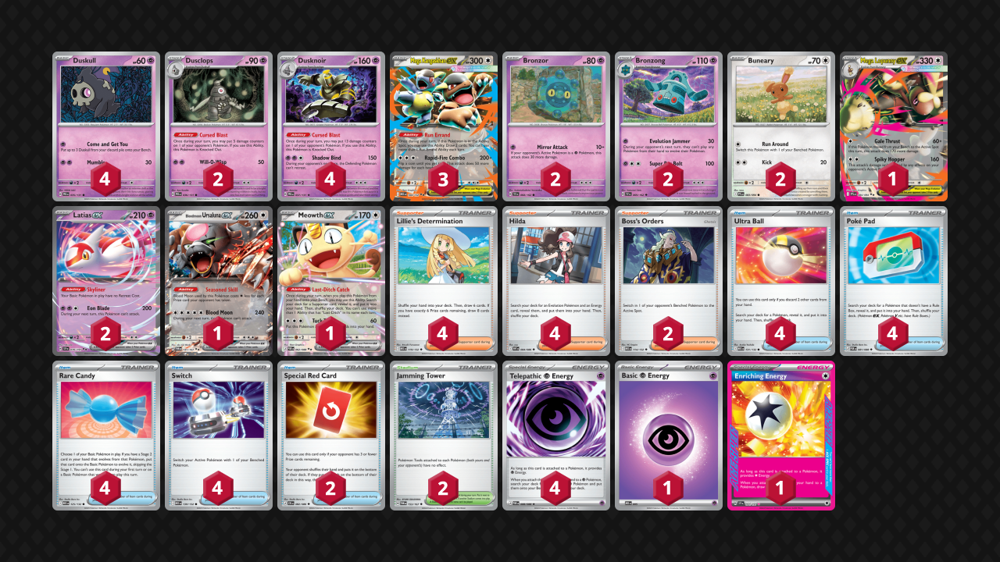

<!-- PUBLIC -->
## Decklist


```decklist
Pokémon: 24
4 Duskull PRE 35
2 Dusclops PRE 36
4 Dusknoir PRE 37
3 Mega Kangaskhan ex MEG 104
2 Bronzor TEF 68
2 Bronzong TEF 69
2 Buneary PFL 83
1 Mega Lopunny ex PFL 84
2 Latias ex SSP 76
1 Bloodmoon Ursaluna ex TWM 141
1 Meowth ex POR 62

Trainer: 30
4 Lillie's Determination MEG 119
4 Hilda WHT 84
2 Boss's Orders MEG 114
4 Ultra Ball MEG 131
4 Poké Pad POR 81
4 Rare Candy MEG 125
4 Switch MEG 130
2 Special Red Card CRI 82
2 Jamming Tower TWM 153

Energy: 6
4 Telepathic Psychic Energy POR 88
1 Psychic Energy MEE 5
1 Enriching Energy SSP 191
```
### Inclusions

- This list is very similar to the list that did well in Baltimore. There are a few ways you can go with the deck, and I think this is the most consistent. Since the deck takes very polarized matchups anyway, being consistent and playing to the deck’s strength makes the most sense to me.
- Fourth Dusknoir is actually quite important since many games involve using triple Dusknoir, leaving little leeway to prize or discard one. I occasionally ran out of Dusknoir because I didn’t think I needed to be conservative with them.
- Bronzong is too important in too many matchups to greed a lower count.
- Ursaluna is a very efficient closer and takes some of the pressure off the lone Lopunny. It could be reasonable to play a second Lopunny or Stretcher instead. I like Ursaluna. The card is just good.
- Meowth is typically needed for mid- or late-game Boss. Of course, if the opening hand is bad, it can let you play the game as well.
- Special Red Card was a card I sorely missed when testing without it. It can make a big difference in matchups where the opponent can build up their hand, such as Dragaput, Raging Bolt, Slowking, and Zoroark. It has great synergy with Dusknoir’s natural disruption and forced activation. Since it’s very hard to find, a second copy is included (and it’s reasonable to use both copies in a game). The testing games I recorded were without Red Card, and you can see how impactful it would be.
- Jamming Tower is mostly to counter annoying Stadiums such as Team Rocket’s Watchtower. It is the Stadium of choice because it has a huge impact against Cape decks, such as Raging Bolt and Excadrill. It can also be useful against Zoroark’s Binding Mochi.

### Possible Inclusions

- Second Lopunny could be good because it’s catastrophic if it’s prized. However, most of the time you can take a few prizes to try and find it first, unlike with Bronzong. Therefore, it’s not as necessary to play two copies of as something like Bronzong.
- Fourth Kangaskhan isn’t bad, but I cut it due to space constraints. It’s not as necessary to start Kang with this deck, since starting with a Psychic-type is also good. You basically never need more than one Kang in a game anyway.
- I often wanted a third Dusclops. Maybe it would be ok to cut a Candy for a Dusclops.
- The Mew Clefairy package might help against Dragapult. However, board space is already very tight and congested, so I am inclined to not play Mew.
- Festival Grounds would help a little against Dragapult and retain the same functionality as Jamming against Zoroark.

### Exclusions

- I was quite surprised to find that Budew had basically no impact whatsoever. It seems like it would be very good, but that is not the case in reality. It does slightly improve the Alakazam matchup, but that matchup is already free anyway. The same can be said for Frillish.
- Flutter Mane just doesn’t do what you want it to. From the board space, difficulty in accessing Boss, and the actual impact is has (or lack thereof), the card is just awful.
<!-- /PUBLIC -->
## Gameplay Tips

- Go first.
- Oftentimes need more Duskull than you think. You can free up board space later with your first Dusknoir / Dusclops. Duskull first, ask questions later.
- Needing second Bronzong is very rare, but possible. In Bronzong-based matchups, carefully consider the board state, as you will need to predict the future to know if you’ll need second Bronzong. If they can KO your Bronzong with a threat, which you can then respond KO with Dusknoir, and need to continue the Evo lock (if you aren’t yet far enough ahead), that’s the main scenario you’ll need to prepare a second Bronzor. Of course, if you misjudge the situation and commit a second Bronzor down for no reason, you will probably get punished!
- If they are threatening a fast Fez, the two main ways to deal with it are Dusknoir + Dusclops + Evo Jammer for 210, or bench double Buneary. The former is ideal because then you can continue the Evo Jammer lock, but it’s harder to pull off quickly.
- Prize check Dusknoir pieces, Bosses, and one-of Pokemon. Probably won’t get punished for not prize checking the rest.
- Dusknoir should be used to either delete an imminent threat, make space for another one, or win the game. It’s not unusual to hang on to Dusknoir and then take 4-5 prizes at once to close out the game after one or two Evo Jammer KO’s.
- Putting extra Energy on Bronzong is generally good.
- Shadow Bind line isn’t real.

## Matchups

### Dragapult - Depends

Against the version with Hammers and Munkidori, the matchup is about even. Against the Dusknoir build with Patrat and no Munkidori, it’s favorable. Against Blaziken, it’s unfavorable to slightly unfavorable.

- The game plan is to get a fast Bronzong and use Dusknoir to remove threats such as an attacking Munkidori, Drakloak, or Fez. Do not let them get a Dragapult into play.
- Duskulls are very important to get down since you need Dusknoir to respond to threats, and the opponent can easily KO Duskull with stuff like Drakloak, Munkidori, or Fez.
- If they are threatening a Fez and you don’t have the Dusknoir + Dusclops + Evo Jammer response to it, you may need to put double Buneary down so you can respond-KO it with Lopunny.
- Getting a Buneary down preemptively can be good because then you can evolve it quickly and won’t need to worry about Fez or getting a second Buneary.
- If you’re going to have to remove Fez with Lopunny, that means breaking the Evo Jammer lock, so in that case, you’ll want to remove all of their Drakloak with Dusknoir.
- Against Rare Candy builds, the Red Card is particularly good to stop their combo on the turn you break the Evo Jammer lock. Even against others, it is generally good when they have a big hand, and is a good resource to keep around.
- Use Jamming Tower to bump their annoying Stadiums.
- Boss is a premium resource for late-game. Switch is also an important resource for getting out of Mind Bend confusion.

```youtube
id: A2tLdC0Ruxc
title: Bronz v PultHam 1
```

```youtube
id: QqxYNuDdyxg
title: Bronz v PultHam 2
```

```youtube
id: 2gVi8YZ6eMk
title: Bronz v PultBlaze 1
```

```youtube
id: uvzzRTEJp6s
title: Bronz v PultBlaze 2
```

```youtube
id: ZRBCLvhjB4w
title: Bronz v PultBlaze 3
```

```youtube
id: 93420PHKYco
title: Bronz v PultBlaze 4
```

### Raging Bolt - Even

- Go aggro Lopunny as fast as possible.
- Plan out how many Dusknoir you’ll need (usually two, sometimes three), and don’t put any extra ones down. Those extra Duskull quickly become liabilities for reverse prize mapping and Clefairy damage.
- Ursaluna is often needed for closing out the game. Bronzong is useless.
- Save Jamming Tower to get through Cape (obviously does not apply if they play a different Ace Spec).
- If you’re not sure what to KO, target down their Energy. They rely on Raging Bolt to take KO’s, and that thing is so Energy-hungry. KO’ing their Energy makes it hard for them to get there.
- Even if you’re behind on the prize trade, if you limit your board, they might not be able to close out the game (especially after Red Card). Not putting extra Pokemon on the board for no reason is a great way to snatch victory from the jaws of defeat.

```youtube
id: 8JDzaw-yjeQ
title: Bronz v Bolt 1
```

```youtube
id: hsBZsfJz00o
title: Bronz v Bolt 2
```

```youtube
id: GsGM_7PCI1s
title: Bronz v Bolt 3
```

### Zoroark - Unfavorable

- Go for Bronzong. Jamming Tower can stop Mochi Scratch from return-KO’ing. They do play a few Stadiums, but it forces them to have yet another combo piece under Jammer lock. Therefore, it’s best to slam Jamming Tower preemptively.
- The ideal scenario is to wipe out all of their Zorua with Dusknoir / Dusclops and then go in with Lopunny. Even if you don’t get to wipe out all of them, sometimes KO’ing all but one can get you far enough ahead. If they’re drawing bad, try to get a KO or two on a Zorua with Evo Jammer. Each one is one fewer Dusclops you have to commit to the board wipe.
- One Dusclops + Lopunny KO’s a Zoroark, which can be a good way to clean up if one slips through the cracks.
- They have to put Pecharunt down, so Boss should be used to pick that off with Lopunny or Ursaluna.
- If they go first and get Zoroark out, you have to rush them down with Lopunny. Dusknoir can also KO their benched Zekrom, which can make it harder for them to get the KO on Lopunny.

```youtube
id: RExC7pnDq5w
title: Bronz v ZoroPurr 1
```

```youtube
id: fYS8klIAWGE
title: Bronz v ZoroPurr 2
```

```youtube
id: 735BujRcwK8
title: Bronz v ZoroDarm 1
```

### Alakazam - Very Favorable

- Go for Bronzong. You may need a second one, depending on how well they draw.
- If they go first and get a Candy play, you can KO their Alakazam with Dusknoir + Evo Jammer.
- If they start charging up Clefairy or Fez, Dusknoir + Dusclops + Evo Jammer is the surest way to deal with it and shut them out of the game.
- Jamming Tower can be saved to counter Handheld Fan.
- Don’t need to be stingy with Enriching Energy since Genesect can come down at any time.
- If you’re going second and play Item lock, it’s generally good on Turn 1 (as long as you have the Bronzong follow up).

```youtube
id: rC7gz5bNU-Q
title: Bronz v Zam 1
```

### Slowking - Unfavorable

- If you go first (or if they somehow whiff Slowpoke), Bronzong can stop Trifrost. However, you can’t rely on Bronzong for long since it’s too easy for them to respond with Clefairy.
- I did not have success going for a boardwipe on Slowpoke strategy, so I think it’s better to KO their draw power and make them brick off Red Card. Saving Jamming to bump their Stadium pn the Red Card turn is ideal. Bonus points if you can also Dusknoir-KO their loaded Slowking on the combo turn.

```youtube
id: LtU0lFjuaI8
title: Bronz v King 1
```

```youtube
id: GbyojO9NLWc
title: Bronz v King 2
```

### Excadrill - Favorable

- Going first with Turn 2 Bronzong is a free win. Going second, it’s still possible to win, especially if they have a mediocre start.
- How you play depends on their setup and what they do. In general (when they get evolutions out), it’s fine to rush them down with Lopunny. If you can KO an Excadrill with Dusknoir + Lopunny before they get the Cape on it, it’s very strong. Even if they get the Cape, you can still get the KO if you can find Jamming Tower.
- If they have a slower start, you can use Bronzong to buy time to set up for a big Dusknoir combo, or just use Dusknoir to remove Beldum / Metang while going in with Lopunny.
- If they threaten to attack with Fez, Mega Skarmory, or Genesect ex while Evo locked, wait for them to commit two Energy and then blow it up.

```youtube
id: VBip_I0ITnk
title: Bronz v Exca 1
```

### Crustle - Very Favorable

- Rush them down with Lopunny. Its second attack goes through Crustle. Use Dusknoir to help KO their Kang with Energy. It’s fine to wait until they have two Energy committed to take the KO (unless it’s the Crispin version).
- Save Jamming Tower for the Cape.

### Hydrapple - Unfavorable

- Bronzong is bait. Just rush them down with Lopunny and target their Energy.
- If they have any evolving Pokemon within Dusknoir / Dusclops range, punish them by popping the Dusknoir for a KO. This basically denies Celebi because if they put that down too you can pop it with Dusknoir to end the game. If they have Celebi but no other single-prize Pokemon, popping Dusknoir on it is wasted effort unless they put something else in range. In other words, just save Dusknoir for the two-prize Pokemon unless your opponent makes a mistake.

### Festival Lead - Favorable

- They cannot do literally anything to a Bronzong. Even if you don’t go first, simply set up a situation where Dusknoir KO’s all of their Dipplin / Seaking, and then Bronzong wins.
- When going second, getting a second Bronzor down preemptively can be good. Getting lots of Pokemon minimizes the chances of getting run off the board.
- If they have Rabsca, you can use Dusknoir to KO their active attacker, Boss + Dusknoir their other threat, and then Evo Jammer to win. Of course, this requires some setup, and you might get run off the board before that comes together. 
- If they have Rabsca, don’t put extra Energy on your Bronzong!

## Personal Thoughts

This is basically a solitaire deck that plays its own brand of Pokemon TCG. It is interesting, but very mediocre. It feels like a worse / incomplete version of the Alakazam / Dusknoir deck.
