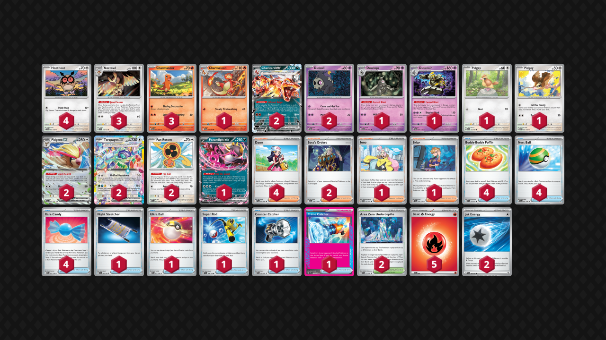
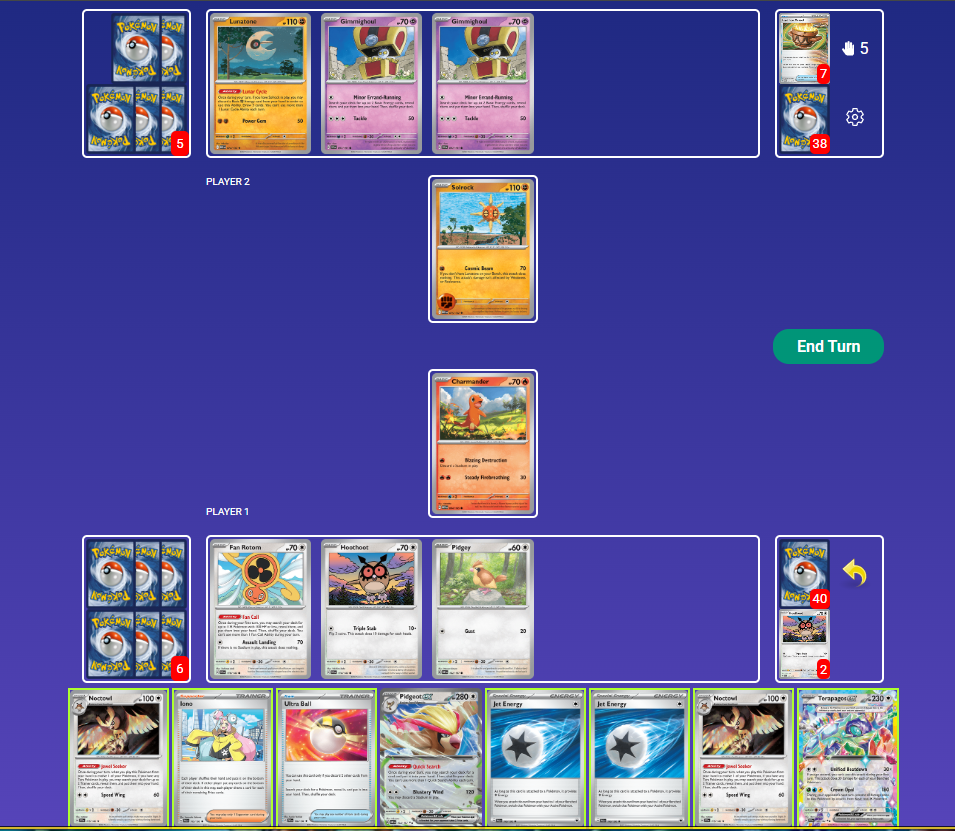
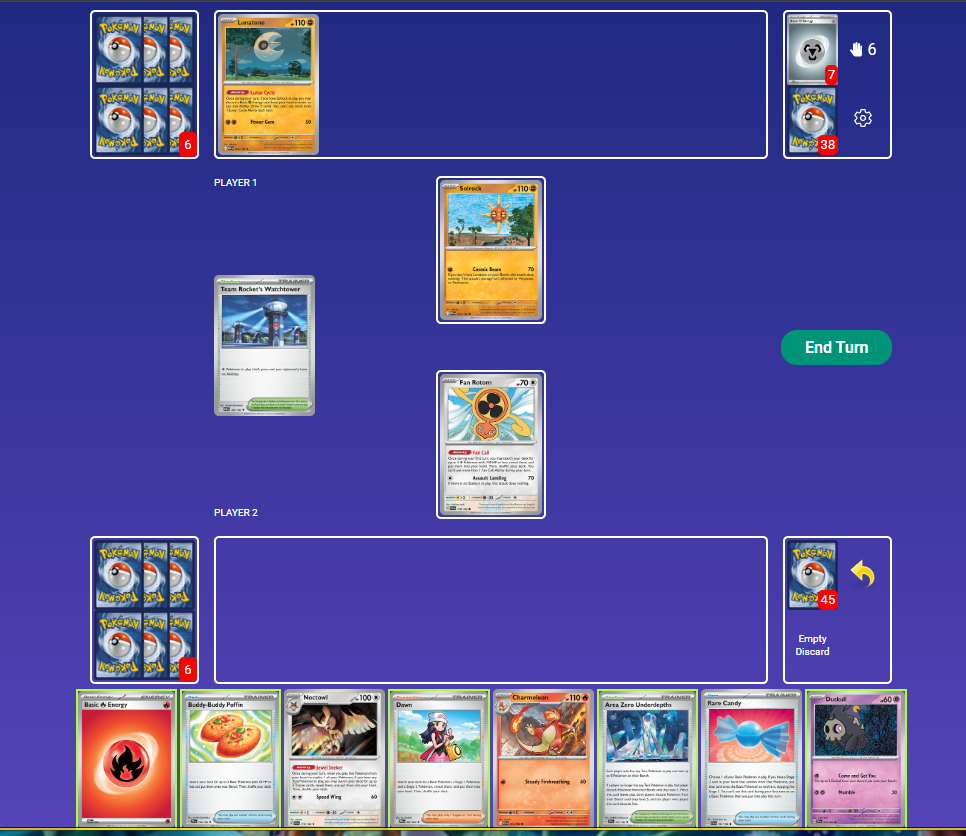

## Decklist


```decklist
Pokémon: 26
4 Hoothoot SCR 114
3 Noctowl SCR 115
3 Charmander PAF 7
1 Charmeleon PFL 12
2 Charizard ex OBF 125
2 Duskull PRE 35
1 Dusclops PRE 36
1 Dusknoir PRE 37
1 Pidgey OBF 162
1 Pidgey MEW 16
2 Pidgeot ex OBF 164
2 Terapagos ex SCR 128
2 Fan Rotom SCR 118
1 Fezandipiti ex SFA 38

Trainer: 27
4 Dawn PFL 87
2 Boss's Orders MEG 114
1 Iono PAL 185
1 Briar SCR 132
4 Buddy-Buddy Poffin TEF 144
4 Nest Ball SVI 181
4 Rare Candy MEG 125
1 Night Stretcher SFA 61
1 Ultra Ball MEG 131
1 Super Rod PAL 188
1 Counter Catcher PAR 160
1 Prime Catcher TEF 157
2 Area Zero Underdepths SCR 131

Energy: 7
5 Fire Energy MEE 2
2 Jet Energy PAL 190
```

- 60 HP Pidgey is extremely relevant against any Dusknoir deck. Call for Family is still useful enough with Jet Energy in the deck (especially if you're lacking a Tera Pokemon), so we hedge by playing one of each. If you prize the 60 HP against specifically Dusclops, tough luck.
- The more I play with 80 HP Charmander, the more I dislike it. It definitely can be relevant, but hasn't come up that often for me. More often, I want to Poffin for it and it's annoying that I can't. It's also hard to get early which is the best time for it. So I think it's better to just play all 70 HP ones.
- Pidgeotto is obviously helpful against Dragapult and Jellicent. However, this deck loses to Dragapult anyway. In practice, it is good against Jellicent, but it's not as important as I initially expected it to be. You lose a few percentage points against Jellicent without it, but that matchup is still favorable anyway. The deciding factor for me is how useless Pidgeotto was against literally everything else; you're simply always Candy'ing into Pidgeot.
- Ditto is bad. There are lots of times where you simply don't have Energy Turn 1, and even if you do, having to discard it is bad too. Ditto is mostly relevant specifically when you start with Energy and no out to Tera, which is somewhat rare (especially with four Dawn now). Can also Call for Family for Terapagos. However, naturally opening with Ditto is extremely strong.
- This deck relies on Poffin too much to justify more than one 80 HP Charmander. It opens up too many possibilities for disaster. Playing one 80 is good though, as it tanks lots of relevant breakpoints and KO's Budew. Naturally opening with it is also great.
- Klefki is very relevant against Psyduck, but most decks don't play Psyduck. Absol is slightly fading in popularity. Klefki is always a consideration that could make its way back into the list if Absol is enough of a popular threat.
- Counter Catcher makes it a lot easier to pull off Briar and has great synergy with Noctowl and Dusclops/Dusknoir. Sometimes we want to use Prime plus Dawn in the early-game. Sometimes this deck wants more gusts in general. A third Boss's Orders would be very nice too, so I'd consider swapping CC for that.
- Second Iono would be nice and helpful in various spots. It's just not entirely necessary, and only rarely is very relevant. You don't ever need both, but sometimes you really need that one at the end of the game. Iono is also a useful draw/consistency card which makes it generally good. I think it is similar in usefulness to Counter Catcher, but maybe slightly less so.
- Four Hoothoot is very nice as you often need Noctowl to both set up the early-game and finish the late-game. With the possibility of Hoothoot being prized or KO'd, having as many as possible is relevant. That said, this is probably the most flexible spot, and could be a Klefki, Pidgeotto, or second Iono instead.
- Four Nest Ball is just too good. We always want to slam it Turn 1 for Terapagos, and it retains its usefulness for random stuff in the mid-game (especially Fezandipiti). The Ultra Ball is a premium resource so we'd rather not be forced to use that for a Basic.

## Gameplay

Most games, the setup priority is: Pidgeot -> Charizard -> Dusknoir, simply in order of importance. However, there are occasionally tempo-oriented games that do not involve Pidgeot, or sometimes the opponent is able to keep Pidgeot off the board. If you are in such a matchup or scenario, you can ignore Pidgeot and try to apply enough pressure with everyone else. In non-Pidgeot games, speed is important to close out the game as fast as possible. This is a tempo-oriented deck, but with Pidgeot, it can also play a slower game like normal Charizard / Pidgeot because Charizard and Pidgeot are so versatile and bulky.

We pretty much always want Pidgeot, but it's even more important against decks that force longer games and / or play lots of hand disruption. Try to force Pidgeot into play against those decks. Better late than never. However, if the opponent has a setup like Dragapult ex or double Munkidori with Gardevoir, putting down Pidgey is an exercise in futility. Hopefully you already have Pidgeot at that point or else you probably lost. We don't want to feed them 60 HP Pokemon for free (unless you're creating a relevant multi threat, such as Charizard + Duskull Pidgey or double Pidgey, since we expect them to be able to KO both low-HP Pokemon. This has to be relevant to the board though)

It is extremely important to carefully plan out your turns. Before starting something, take note of exactly what cards you're going to grab in order to piece together your turn. Account for Noctowl, Quick Search, Dawn, as well as Fan Call and Poffin to fully maximize each card you have access to. Wasting Noctowl or any search can be game-losing.

Noctowl is the glue holding the deck together. It is generally used early-game to establish Pidgeot and Charizard, as well as late-game for a big combo. There are going to be plenty of non-Noctowl turns. Thanks to Pidgeot, this deck can often do stuff even without Noctowl. In general, do not use Noctowl if you don't have to! Noctowl is also an important part of your prize mapping, as it helps efficiently use Charizard and Dusknoir based on the opponent's board.

If the prize map is going to rely on Briar (as it often does, especially with Dusclops/Dusknoir), try to save Prime Catcher/Counter Catcher (if you play it) for the end-game if you're going to have access to Noctowl.



For this one, we need to figure out what the best turn is. We topdecked Terapagos, so we don't necessarily need Charizard. We can KO their Gimmighoul with Fan Rotom, but that feeds them yet another prize. Charizard should be very difficult to KO from this position, so I think it's the best option. Bench Terapagos, Noctowl for two Candy. Ultra Ball for Charizard, discarding both Jets, Candy into both, leaving us with only Iono and Noctowl. Jet Energy is not very important in this matchup, even though it is in a lot of others. Iono gives us a fresh hand, and we can use Quick Search for whatever piece we need after seeing our new hand. Iono is sometimes needed in the late-game, but since the return KO on Charizard is unlikely here, I think it's fine.



They used Watchtower, but luckily we have the Stadium counter. How do we optimally set up our board? They don't have any Gimmighoul, so there's no threat of KO'ing our Terapagos. Poffin for two Charmander, Dawn for Terapagos Pidgeot Noctowl, Fan Call for Hoothoot Hoothoot Pidgey, play Duskull from hand thanks to Area Zero's extra bench spot, and retreat into Terapagos. Getting/denying the first prize is massive in this matchup. If they whiff the gust KO, it's basically over (and they already used Secret Box).

## Matchups

### Gholdengo - Favorable

- The most important thing is to plan out the prize map very far in advance. Oftentimes will rely on Briar to close out the game. You will need to chain multiple Charizard, and may need Dusknoir against an end-game single-prize board.
- Establishing multiple Hoothoot and Charmander is more important than Duskull in most spots. Dusknoir is usually not worth investing into early even though it seems good, as you need a fully established board. It's mostly used for closing out the game.
- Be careful to always have outs to your Stage 2s, or get them in advance with Dawn. With only one Ultra Ball, finding Stage 2s can be difficult on turns where you need to use Boss or Briar. Stretcher is an important piece in chaining Charizard for this reason.
- Build up your hand as much as possible. They cannot disrupt you, and you will need a lot of specific cards to piece together each turn. Establishing Fezandipiti early can be good for this reason, and it's not really a liability except for the Bench spot it occupies.
- Some end-games you'll need to keep everything out of Solrock range, especially when relying on Iono, and this sometimes requires thinking a turn ahead and managing your board appropriately.
- If they use Watchtower, we may need to use Charmander's Blazing Destruction to remove it, so try to leave yourself with that option.

### Gardevoir / Jellicent - Very Favorable

- Dusknoir isn't as much of a priority as you'd expect, but it can still be useful occasionally, especially for KO'ing Ralts + Gardevoir in the same turn.
- Aggressively targeting down the Ralts line is often very strong, as well as KO'ing Gardevoir on sight.
- Establishing Charizard is very important, sometimes it's more of a priority than anything else like Pidgeot or Hoothoot. Charizard mercilessly destroys them.
- Terapagos is nice to keep around for Devo protection. Sometimes keep Noctowl on the board when they bump your Stadium. If you have Terapagos + Noctowl on the board, you can easily recover from any Devolution combo. Watch out for late-game Jellicent + Devolution.
- If they start off attacking with Frillish, try to get Charmeleon and then Charizard as soon as possible. For attacking options before Charizard comes into play, gust-KO Ralts with Fan Rotom or manually power Terapagos if possible.
- If they go into Jellicent early such as Turn 2 and you don't already have Charmeleon out, go for the pop off turn with Boss's Orders and Rare Candies.
- Gust cards are absolutely premium in this matchup. Even Counter Catcher is often useful in the early-game.

### Dragapult / Dusknoir - Very Unfavorable

- Try to get Duskull down early and evolved before they start using Phantom Dive. Otherwise, only put it down when making a relevant multi-threat, or else it will get farmed by Phantom Dive. Early Duskull is sometimes more important than early Charmander.
- Try to get early prizes with manual Fan Rotom or Terapagos to at least somewhat limit their Dusknoir options later on. Boss Fan Rotom is good against Duskull.
- Early Charmander/Charizard isn't that important, but can sometimes be good early to manual evolve through Charmeleon if it lines up.
- Try to have as many attacking threats present as possible in the mid- and late-game. If they wipe out all your attacking options at once you are cooked.
- If you somehow get Pidgeot in play, Blustery Wind is very strong to bump damaged Pokemon off your bench and take one prize card at the same time.
- Fezandipiti is a pretty massive liability in the early- and mid-game. So is Terapagos, but often you have to put that down anyway.
- The Clefairy tech does not swing the matchup, as it's still nearly impossible to beat them if they draw well. However, Clefairy allows you to convert games where they don't draw well. This portion of games can be turned from losses into wins thanks to Clefairy. However, I still think you need a lot of luck to win.

### Grimmsnarl - Favorable

- Manual Pidgeot can be good for attacking on Turn 2.
- Dusknoir is absolutely cracked in this matchup and getting Duskull is a high priority.
- Try to not leave enough damage for them to spawn trap Duskull, or just put down two Duskull at once to make it hard for them to KO both. Use Dusknoir super aggressively.
- Using a Jet/Prime for Turn 2 attack is fine, otherwise save them for retreat lock.
- If you do have to Candy into Zard, powering up Terapagos can play around Devo.

### Absol - Depends on Klefki

This matchup is favorable with Klefki and unfavorable without it.

- Terapagos is a great attacker because it does more damage than Charizard in the early-game, it can deal with Cornerstone, and you can manually attack with it.
- You need to be very careful about allowing them to use Adrenabrain because it allows Claw of Darkness to KO Terapagos, which is very relevant. Playing around Adrenabrain by abusing early- and mid-game gusts is good.
- Usually you'll end up attacking with a Terapagos, one Charizard, and sometimes some sort of third attacker depending on the board state. Sometimes even Fan Rotom or Pidgeot can attack in a relevant way.
- Yveltal is not much of a factor in this matchup because there's so many switching cards, but you still need to pay attention if you're running low on switching cards.
- Dusknoir is either best in the early-game to KO their only attacking Tag Team, or the late-game to win. Don't bother trying to cheese them with Klefki (if you have it), save it for when it's needed for a big Dusknoir combo.
- If you don't have Klefki, aggressively KO Psyduck and try to catch them without a Stretcher to get value from Dusknoir. It's very hard to win without Dusknoir. This also lets you get value from attacking Fan Rotom.

### Charizard / Pidgeot - Favorable

- This matchup is all about Dusknoir control and board positioning. You always want Duskull in play, and double Duskull is very potent. If they have one Duskull in play, taking it out is often best.
- Punching into Charizard usually happens at some point and is totally fine
- If they setup your Charizard in range of Dusknoir, you can remove it with Blustery Wind or Blazing Destruction. This is very situational; sometimes you can just leave it.
- Killing their Pidgeot is often best, but not always necessary. Pidgeot can be a liability on both sides in the late-game, which is why keeping the opponent's Pidgeot around isn't the worst thing ever.
- Look for opportunities to shut down their options. Wiping out Charizard + Charmander, or both Duskull, etc. can be potent.
- Taking the first prize can be risky if you aren't stabilized, as they can use Charizard + Defiance Band to KO Terapagos (only relevant against the non-Max Belt build with Defiance Band, against other builds, being aggressive with Fan Rotom is fine.).

### Charizard / Noctowl Mirror - Even

- Mostly the same concepts as above except they don't have damage mods such as Defiance/Maximum Belt.
- Try to play around their breakpoints (on 5 prizes still keeps Terapagos out of range of their Charizard, 3 prizes Pidgeot is out of range, and 2 for Charizard but watch out for Briar).
- Fan Rotom can be a useful aggressive option for speed or single-prize board

## Personal thoughts

This deck is extremely strong and beats most stuff. It is just superior to the other build of Charizard/Pidgeot/Dusknoir but has a worse Dragapult matchup. Personally, I don't think I could play a deck with a terrible matchup to Dragapult in this meta, but this deck is strong enough to make a case for it. Clefairy does not do nearly enough against Dragapult to warrant its inclusion in the deck.
