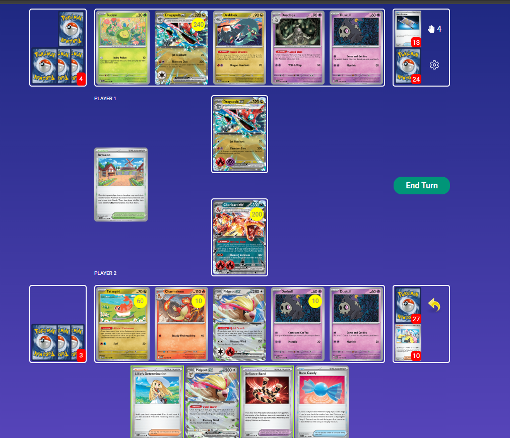
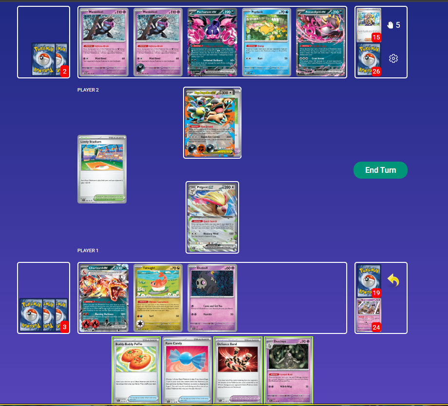

## Decklist


```decklist
Pokémon: 20
3 Charmander PAF 7
1 Charmeleon PAF 8
1 Charmeleon PFL 12
2 Charizard ex OBF 125
2 Duskull PRE 35
1 Dusclops PRE 36
1 Dusknoir PRE 37
2 Pidgey OBF 162
1 Pidgeotto OBF 163
2 Pidgeot ex OBF 164
1 Chi-Yu PAR 29
1 Fezandipiti ex SFA 38
1 Klefki SVI 96
1 Tatsugiri TWM 131

Trainer: 33
3 Lillie's Determination MEG 119
3 Arven OBF 186
2 Boss's Orders MEG 114
2 Iono PAL 185
1 Briar SCR 132
4 Buddy-Buddy Poffin TEF 144
4 Ultra Ball MEG 131
3 Rare Candy MEG 125
2 Super Rod PAL 188
2 Counter Catcher PAR 160
1 Night Stretcher SFA 61
1 Secret Box TWM 163
2 Technical Machine: Evolution PAR 178
1 Defiance Band SVI 169
1 Mesagoza SVI 178
1 Artazon PAL 171

Energy: 7
5 Fire Energy MEE 2
2 Jet Energy PAL 190
```
### Inclusions

- This is basically just the EU list because it's so good.
- I cut the Turo for Stretcher because I found Stretcher to be incredibly strong in most games. It's definitely better than the Turo, but you could potentially find space for the Turo elsewhere.
- I cut one Lillie for Arven. Even though Lillie draws 8 cards which is broken, sometimes you need Arven because TM: Evo is also broken (and super important in some matchups), and Lillie does not consistently find TM: Evo.
- 60 HP Pidgey is important against other Charizard decks and is also useful against Dragapult and Grimmsnarl. Although Call for Family can be useful on occasion, it is rare.
- Not 100% on the Charmeleon split. The 110 HP one is obviously best. The 90 HP is occasionally relevant against Devolution (Garde/Jelly and Grimmsnarl) and has the added bonus of helping against Alakazam. I don't see the reason for the 100 HP one, as this deck can't really afford to use its attack.

## Gameplay

- Setting up Pidgeot is usually the number one priority.
- Duskull priority varies based on matchup.
- Setting up with TM: Evo is generally better than burning Candies, but if the opponent is applying fast pressure, you may need to use Candies to keep up, which is fine. Having more Candies later allows you to chain Charizard or commit war crimes with Dusknoir.
- Attacking with Pidgeot and/or setting up second Pidgeot can be relevant, so keep your eye out for opportunities to do that.
- Turn 2 attacking Fezandipiti can be good against Stage 2 decks! It is also very situational.
- Do not use Dusknoir just because you can. You should be pulling off an extremely strong play whenever you use it, and with this deck, you should be using Dusknoir a lot more than Dusclops. Common examples: KO'ing both of something (Garde+Ralts, double Froslass), one-shotting a big guy (Dragapult, Grimmsnarl), or ending the game outright.
- Managing your extra Energy, such as the third one from Infernal Reign or Energy you have in hand, depends on how many Infernal Reigns you'll need this game. If you'll need a follow-up Charizard, try to leave at least two Energy in the deck and don't commit one to Charmander off Infernal Reign just because you can. Putting an extra Energy on Chi-Yu, Pidgeot, or Tatsugiri can also be a good use of it, allowing for a lot of flexibility later. However, committing the third Infernal Reign Energy does thin the deck and prevent you from drawing it, so it can be ok to do if you don't think you'll need the flexibility. Saving Energy helps against gust traps, but in reality, that doesn't happen very often (and can be negated by Pidgeot's Quick Search).



With Secret Box in deck, this is a straightforward lethal with Quick Search for Box for Boss and Ultra for Clops, Clops the Budew and Boss the damaged Pult. This board is to illustrate the power of double Duskull and the ability to checkmate Dragapult. If they did anything else besides spread damage, they would instantly lose to Briar Defiance (if they KO'd both Duskull) or Dusknoir (if they did anything else). This also shows how we can punish them if they put Latias down, as we were able to KO the first Budew, then Boss KO the Latias leaving the second Budew as a liability on board. Of course, this only happens with an ideal initial setup.



This spot is interesting because the correct play is difficult to identify and the situation is more complex than it looks. Every option opens up a way to lose. All Energy are gone, but we still have both Boss as well as Stretcher and Super Rod. Smacking the Kang loses to Dark plus Boss, so we'd have to evolve into Dusclops to avoid that. However, the Dusclops gets stuck to Boss and they swap the Kang into Fez, winning within two turns anyway. They could also just win a 50-50 flip on the Pidgeot. Even if we use Quick Searches to prep an Infernal Reign to let the Dusclops escape, we can't Quick Search for enough cards to also get the Boss.

We may instead go for back-to-back Bosses. Boss KO'ing the Fez loses to gust plus Dark and Energy Switch. Boss KO'ing Pecharunt loses to the same thing plus Stretcher. Although that combo may seem unlikely, they have draw 5 on board and can find the missing piece with Arven. I ended up Boss KO'ing Psyduck here. This does open us up to Yveltal plus Boss plus Dark, which I think is the least likely combo since it requires the Boss. There is also some time to topdeck out, as Dusknoir plus Blustery Wind can win in a couple of turns. Evolve to Dusclops and Poffin for Charmander to enable a potential Infernal Reign with Candy in hand already.

## Matchups

### Gholdengo - Unfavorable

- The game gets harder if they KO Pidgeot but there's nothing you can really do about it. Tatsugiri, Fez, and second Pidgey can help.
- Chi-Yu plus Iono is extremely strong.
- Getting Chi-Yu in the Active on Turn 1 can make it more annoying for Solrock. Manually attaching to Chi-Yu in the early game is very good.
- Ideal board is double Pidgey, double Mander, Duskull, Chi-Yu. Tatsugiri is fine to have if you need it.
- Almost always want to take a two-prize KO whenever possible.

```twitch
id: 2677221311
title: Dengo v BoxZard 1
```
I maybe could have played this game differently. It can be difficult to work Dusknoir into a normal prize trade, and sometimes there's nothing you can do about it.

```twitch
id: 2677221309
title: Dengo v BoxZard 2
```
This game shows how Klefki is a fraud. While it varies on the situation, this is a compelling case to not go out of your way to get Klefki.

```twitch
id: 2677221318
title: Dengo v BoxZard 3
```
This game is a good example of how Turo can be very useful in this matchup.

```twitch
id: 2677221321
title: Dengo v BoxZard 4
```

```twitch
id: 2677221319
title: Dengo v BoxZard 5
```
Getting Chi-Yu in the Active early is definitely good, but it is sad when they have the response.

```twitch
id: 2677221317
title: Dengo v BoxZard 6
```
This was a reasonable Iono effort, but it just didn't work out this time.

```twitch
id: 2677221320
title: Dengo v BoxZard 7
```

### Gardevoir - Favorable

- KO Gardevoir on sight.
- Dusknoir is strong but not a priority. Stabilizing your board to play around their options is more important. However, if you have the option to boardwipe their Gardevoir lines (such as Dusknoir the Ralts and KO their Gardevoir, that's obviously very strong).
- Manual Pidgeot can be a fast attacking option and doesn't worry about Mind Bend. Be careful about doing this though, as you don't want to get KO'd by Diancie.
- Gust effects are premium resources, usually used to KO Gardevoir.
- Setting up with TM:Evo is generally best, as it does not leave you vulnerable to Devo. However, you often have to Candy into the initial Pidgeot because of the Scream Tail threat. Setting up a second Pidgeot is very strong if possible.
- Their main win cons are setting up Devo or Mew one-shot. Try to play around these however possible. They also are aiming to remove Pidgeot as it is extremely important.
- Third Charmander can help prevent getting boardwiped.

```twitch
id: 2677185403
title: Garde v BoxZard 1
```
Back and forth game. Optimizing and trying different lines.

```twitch
id: 2677185407
title: Garde v BoxZard 2
```
Looking at different timelines of the same game.

```twitch
id: 2677185402
title: Garde v BoxZard 3
```
Looking at different timelines. Always need to respect their comeback potential.

### Charizard / Noctowl - Unfavorable

- This matchup is all about Dusknoir control and board positioning. You always want Duskull in play, and double Duskull is very potent. If they have one Duskull in play, taking it out is often best.
- Punching into Charizard usually happens at some point and is totally fine.
- If they setup your Charizard in range of Dusknoir and they leave Area Zero in play, you can bump it, but that is only sometimes necessary.
- Killing their Pidgeot is often best, but not always necessary. Pidgeot can be a liability on both sides in the late-game, which is why keeping the opponent's Pidgeot around isn't the worst thing ever.
- Look for opportunities to shut down their options. Wiping out Charizard + Charmander, or both Duskull, etc. can be potent.
- Keep track of their breakpoints and manage your board accordingly. Charizard / Noctowl typically doesn't run damage modifiers, so if they do not have Duskull on the board (of if you KO it), their damage is capped.
- If they take the first prize, try to respond with Defiance Band KO on their Terapagos.

```twitch
id: 2676468351
title: DawnZard v BoxZard 1
```
This game looks at various different lines and shows how to win this matchup.

```twitch
id: 2676468355
title: DawnZard v BoxZard 2
```
Sometimes you need to go for a high-roll play, even though it doesn't always work out.

```twitch
id: 2676468366
title: DawnZard v BoxZard 3
```
Close game.

### Dragapult / Dusknoir - Unfavorable

- Prioritize setting up Pidgeot and stabilizing your board over attacking. Pidgeot is extremely important and awkward for them to KO.
- Boss and Iono are premium resources. Boss can pick off Drakloak with Energy, and is also important to KO any two-prize liabilities if they put them down. Iono is strong in the late-game for making them miss combos.
- Dusknoir/Dusclops are very strong. Duskull isn't a priority in the early-game, but it can be very useful later to help one-shot Dragapult. Threatening double Duskull is also very potent because if they want to KO both, they have to float a ton of damage.
- Defiance Band (and sometimes Briar) are important pieces in making comebacks.
- If you do not have to play a Stadium, save it to counter Jamming Tower. However, if you have to play a Stadium in order to set up (especially under Item lock), that is fine.

```twitch
id: 2676573154
title: Dragapult v BoxZard 2
```
Funny game.

```twitch
id: 2676573153
title: Dragapult v BoxZard 3
```
Funny endgame.

```twitch
id: 2676573179
title: Dragapult v BoxZard 4
```

```twitch
id: 2676573166
title: Dragapult v BoxZard 5
```
Attacking with Pidgeot!

### Absol - Unfavorable

- Usually look for some form of 1-2-3 prize map. Take the 1 and 2 with Charizard normally, and try to set up a Dusknoir play for a one-shot on a Mega.
- You don't want to punch into Kang if they have the Terminal Period response ready. However, if they aren't fully set up, you can swing into them for pressure.
- Bossing Absol for a two-shot is bait because they will just Penny and Boss is a premium resource. Usually you'll need both Boss for your prize map.
- Killing Absol is always good if you're ever able to do so.
- Can Boss KO Psyduck if it's part of your prize map, maybe they will whiff Stretcher. Otherwise, you'll need Klefki for a big Dusknoir/Clops turn.
- Two-shotting Absol can be ok if they're attacking with it, accepting the Terminal Period response.
- Stadiums, Defiance Band, Jet Energy, and honestly most things are very important resources so you just have to be careful.

```twitch
id: 2677258000
title: ZardBox v Absol 1
```
This was an interesting game. I'm also just learning the matchup.

```twitch
id: 2677258004
title: ZardBox v Absol 2
```
Interesting endgame.

### Grimmsnarl - Unfavorable

- Manual Pidgeot can be very good, especially on Turn 2.
- Try to get Dusknoir into play quickly, otherwise the Duskull will get spawn trapped. Dusclops/Dusknoir is very important for controlling the board and increasing Charizard's damage.
- Usually prioritize KO'ing their Froslass.
- Don't put Pokemon with Abilities in play unless you have to.
- Iono and Boss are very important resources. Try to use all of them at the best times as they are very effective at disrupting the opponent's deck.
- Attacking Fez can be good in the early-game as an efficient Froslass killer. If they KO Fez with Grimmsnarl, it powers up Charizard.
- Try to play around Devo, such as second Pidgey or evolving to second Charizard the turn before they Devo. This is all very situational, mostly there isn't much you can do about the Devo.

```twitch
id: 2677315534
title: ZardBox v Grimm 1
```
This is an interesting game that shows how Charizard can make a comeback.

```twitch
id: 2677315535
title: ZardBox v Grimm 2
```
This is an interesting game that is also an example of how the manual attacking Pidgeot can be good.

```twitch
id: 2677315536
title: ZardBox v Grimm 3
```
This game shows how Ursaluna is a big threat and common lose-condition.

### Charizard / Pidgeot Mirror - Even

- This matchup is all about Dusknoir control and board positioning. You always want Duskull in play, and double Duskull is very potent. If they have one Duskull in play, taking it out is often best.
- Punching into Charizard usually happens at some point and is totally fine.
- Killing their Pidgeot is often best, but not always necessary. Pidgeot can be a liability on both sides in the late-game, which is why keeping the opponent's Pidgeot around isn't the worst thing ever.
- Look for opportunities to shut down their options. Wiping out Charizard + Charmander, or both Duskull, etc. can be potent.
- Defiance Band is an important part of the matchup, so try to get value from it by KO'ing Pidgeot or saving it for Charizard. Watch out for their Defiance Band as well! Going ahead in prizes isn't necessarily bad, again the matchup is more about positioning and Dusknoir anyway. The main downside of taking prizes is Pidgeot getting in KO range, so be aware of that and only allow it to happen if you're getting an advantageous board state.

## Personal thoughts

This is the worst among the main meta decks and I would not play it in this format. Its matchups are pretty bad and the Noctowl build is superior. However, this deck has a significantly better Dragapult matchup than the Noctowl build, but I don't think that makes up for its other shortcomings.
