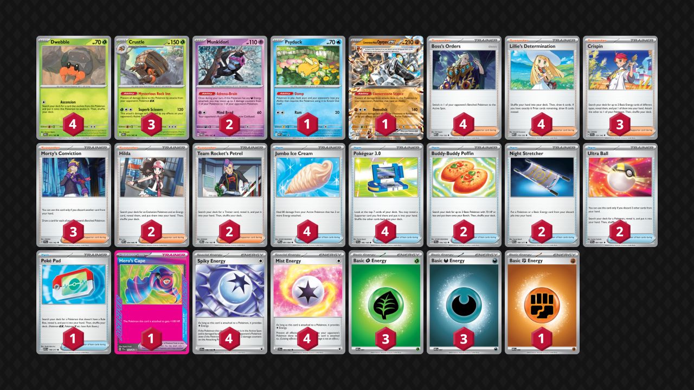
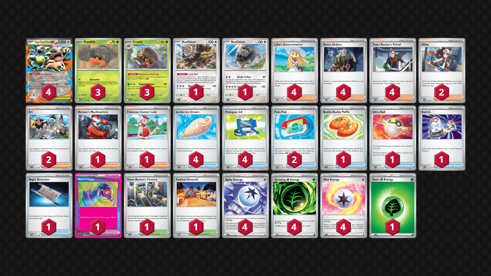

## Decklist


```decklist
Pokémon: 11
4 Dwebble DRI 11
3 Crustle DRI 12
2 Munkidori TWM 95
1 Psyduck MEP 7
1 Cornerstone Mask Ogerpon ex TWM 112

Trainer: 34
4 Boss's Orders MEG 114
4 Lillie's Determination MEG 119
3 Crispin SCR 133
3 Morty's Conviction TEF 155
2 Hilda WHT 84
2 Team Rocket's Petrel DRI 176
4 Jumbo Ice Cream PFL 91
4 Pokégear 3.0 SVI 186
2 Buddy-Buddy Poffin TEF 144
2 Night Stretcher ASC 196
2 Ultra Ball PAF 91
1 Poké Pad ASC 198
1 Hero's Cape TEF 152

Energy: 15
4 Spiky Energy JTG 159
4 Mist Energy TEF 161
3 Grass Energy MEE 1
3 Darkness Energy MEE 7
1 Fighting Energy MEE 6
```
<!-- PUBLIC -->
### Inclusions

- Munkidori is very strong against anything that cannot easily one-shot your attacker. Particularly Dragapult, Mewtwo, or anything with their own Munkidori. It has natural synergy with Crispin and Crustle by helping to keep it alive.
- Psyduck is needed for Dusknoir.
- Cornerstone Ogerpon single-handedly saves the Mewtwo and Festival Lead matchups.
- Boss is very good in this deck because most decks only have a few answers to Crustle. Boss allows us to pick them off before they can get value, allowing for easy wins. There are many examples where Boss is actually relevant for winning the game: Duskull, Meganium, Team Rocket’s Mimikyu, etc. I would not play fewer than four!
- Crispin is included because this deck is way too slow with Energy attachments and desperately needs the help.
- Morty’s Conviction is a mid draw Supporter but there aren’t really any better options and Crustle needs a lot of help with seeing cards.
- Hilda is rather weak most of the time but can be good for finding specific Energy types. It’s mostly included because it improves the Alakazam matchup while also being a fairly functional card in general.
- Team Rocket’s Petrel is also pretty weak but it is very important in the situations where you need it. Searching Cape, Ice Cream, or Stretcher at key times is game-winning. It also is key for the Mewtwo matchup as a way to find Cornerstone Ogerpon via Ultra Ball, and searching for Poffin early is nice as well.
- Most of the Item cards are pretty self-explanatory. I play two Ultra Ball because it is a lot harder to find the Cornerstone with just one. Although this is only relevant in two matchups, Ultra Ball is still useful in general and discarding cards isn’t that bad for this deck.
- Hero’s Cape is the only viable Ace Spec for this deck because it’s actually pretty hard to keep Crustle alive.
- Spiky Energy is very good against lots of Pokemon: Meganium, Dusknoir, baby Raging Bolt, Rocket stuff, and Zoroark to name a few.
- Four Mist Energy is required for Alakazam and very nice against Dragapult as well.
- If it weren’t for Crispin, we could probably get away with two Dark and two Grass, but Crispin is very important and powerful, and we often rely on it being live for Energy acceleration.

### Possible Inclusions

- Sacred Charm is a consideration as it would help against the close matchups by reducing relevant damage from Drakloak, Dusknoir, or Dudunsparce.
- Forest of Vitality could be a decent inclusion. It does not seem powerful enough to warrant the space but I haven't tried it.

### Exclusions

- I think the Kangaskhan is an unnecessary liability. It is too difficult to maneuver around, and giving up those prizes is a good way to instantly lose matchups such as Alakazam
- Playing the non-Crispin build makes the deck unnecessarily vulnerable to random matchups (Garchomp, Mewtwo, etc.) that are able to pressure your Energy drops. It is too slow and can potentially lose to matchups that should be easy wins.
- Some lists play the baby Fezandipiti to counter Hariyama. I am skeptical that this actually works but I haven’t tried it. I think I would rather just play Psychic Energy and KO the Hariyama with Mind Bend, but the matchup is probably bad no matter what.
- Growing Energy and extra healing cards aren't necessary, but they do make the deck better in the mirror match.
- I don't think Xerosic's Machinations or Eri do anything that we need.
<!-- /PUBLIC -->
## Decklist 2


```decklist
Pokémon: 12
4 Mega Kangaskhan ex MEG 104
3 Dwebble DRI 11
3 Crustle DRI 12
1 Bouffalant SCR 119
1 Bouffalant SSP 151

Trainer: 35
4 Lillie's Determination MEG 119
4 Boss's Orders MEG 114
4 Team Rocket's Petrel DRI 176
2 Hilda WHT 84
2 Eri TEF 146
1 Xerosic's Machinations SFA 64
1 Pokémon Center Lady MEG 123
4 Jumbo Ice Cream PFL 91
4 Pokégear 3.0 SVI 186
2 Poké Pad POR 81
1 Buddy-Buddy Poffin TEF 144
1 Ultra Ball MEG 131
1 Switch MEG 130
1 Night Stretcher ASC 196
1 Hero's Cape TEF 152
1 Team Rocket's Factory DRI 173
1 Festival Grounds TWM 149

Energy: 13
4 Spiky Energy JTG 159
4 Growing Grass Energy POR 86
4 Mist Energy TEF 161
1 Grass Energy MEE 1
```

### Inclusions

- Bouffalant is a very nice addition because it significantly helps against otherwise bad matchups such as Slowking, Festival Lead, and Hide n Sneak. It was also supposed to help against Dragapult with anti-Crustle tech, but unfortunately that matchup is still bad. There are some downsides to Bouffalant and requires some accomodation with the list, such as the addition of Stretcher and Poke Pad. That said, Crustle's good matchups are still good and Bouffalant saves a few bad ones, which is very good for Crustle.
- Although this list is a little less aggressive than the Crispin one, Boss is still very good for applying pressure to the relevant threats (sometimes with Kang attacking). Boss also has the added utilty of straining opponent's resources, which is also quite nice for this deck.
- Hilda finding Energy is very nice and also allows us to evolve into Crustle from the safety of the bench without necessarily needing Ascension. However I could see the possibility of cutting them if space is needed.
- Eri is very good for the mirror, Dragapult, and Alakazam matchups. It actually gives the deck a chance of beating Alakazam, even if they have Dedenne. Two is needed to make it relevant, otherwise it would be drawn too infrequently as a one-of.
- Pokemon Center Lady is like another Jumbo Ice Cream and also heals Mind Bend confusion, which is a lot more relevant now that most Dragapult decks play Crushing Hammer.
- Poke Pad is needed to find Bouffalant, along with Night Stretcher to recover a Bouffalant if it gets targeted down.
- Ultra Ball is necessary to find Kangaskhan if you don't start with it. All of these Trainer cards go very well with Team Rocket's Petrel.
- I'm not sure if Team Rocket's Factory is the best Stadium option but we do need Stadiums to bump Team Rocket's Watchtower and drawing cards is good. Festival Grounds is also quite handy to remove Mind Bend's confusion. Unlike Pokemon Center Lady, it can instantly be utilized off a Petrel.
- The Grass Energy ensures that Dragapult cannot Hammer away all of the Growings and stop Crustle from attacking entirely. Even if you prize a Growing, there is significantly less risk against Hammer. More Energy is generally good since we want to attach Energy every turn.

### Possible Inclusions

- Psyduck could be good to help against Dragapult / Dusknoir.
- Brock's Scouting would be very nice to help find Bouffalant and / or Kangaskhan in the early-game.
- Handheld Fan is a fairly strong disruption card, though usually the attacker would rather have Hero's Cape.
- Lumiose City is probably fine.

### Exclusions

- Random hyper-situational techs such as Hand Trimmer, Bianca's Devotion, and Lisia's Appeal are just bad. Don't play them.
- Cornerstone Ogerpon does solve the Rocket's Mewtwo matchup, but it's not as good against Festival Lead now that they have Gladion's Final Battle. Even against those matchups, the Kang Bouff strategy (ignoring Crustle) is strong enough to win.
- Crushing Hammer takes up too much space and is mostly good against Dragapult, which is already favorable (or still unfavorable with a tech).
- Community Center is much worse than the other Stadium options.

## Gameplay Tips

- A lot of the skill expression with Crustle is understanding board positioning as well as the capabilities of opponent’s decks. The deck is a lot weaker without Luxurious Cape, so it is actually possible to lose against favorable matchups. One consistent thing I’ve found is that you need to spread out Energy and make strategic sacrifices in order to set up a checkmate position.
- If you can get a Crustle attacking on Turn 2, great. If not, think about what your opponent might be able to do. If you invest two manual attachments into your active Crustle and your opponent can two-shot it right away, you’ll be behind the whole game. This deck is functionally online when there is an undamaged Crustle with three Energy, so that’s more or less what you’re going for. Lots of times you want to spread out Energy or put them on the bench. Just try to set up for an unbeatable board based on the opponent’s deck. Sacrificing random stuff while you set up is also quite common.
- Don’t feed them Dwebble one by one. Dwebble is very vulnerable on the bench before it evolves. If you aren’t careful, your opponent can shut you out from getting a second Crustle. Dwebble are best benched in twos. One will fall, and the other becomes a mighty Crustle.
- If they have a big Pokemon ex like Dragapult or Garchomp, you are under no obligation to attack into it! Putting damage on your opponent’s board does not serve much of a purpose unless you’re in a stalemate. They can punish you with Adrenabrain, Stamp, or Special Red Card. Speaking of Stamp, don’t take a KO on any nonthreatening Pokemon for no reason because Stamp is a big threat. That said, most Pokemon are threatening in some way so it is often good to KO them.
- Sometimes single Ice Cream is irrelevant (against attackers such as Meganium or baby Bolt). There are lots of times where Ice Cream is either double or nothing and using a single one is a waste due to how the math works out. Think about what math Ice Cream is actually doing for you before slamming it.
- Go second blind. Go second against any deck that can get a Turn 1 KO or that can use Itchy Pollen. We need to minimize risk of getting cheesed. With the Kang build, I think going first blind is better because there's more upside and less downside, but still go second against the same decks when given the option.
- With the Kang build especially, do not bench extra unnecessary Pokemon. Keep in mind that opponents will usually get three easy prizes off Kang, and we still want to force them through a juiced up Crustle.

## Matchups

### Dragapult - Depends

This matchup mostly depends on their list. If they have a tech like Dudunsparce ex or Chi-Yu, we are so cooked. If they are playing Dusknoir, the matchup is fairly close (about even or slightly unfavorable). Against all other builds, the matchup is very favorable.

- Get Psyduck as soon as you see a Duskull. Try to keep Psyduck in play by using Night Stretcher if it gets KO’d.
- Munkidori is very good due to the residual damage that adds up. It is often used to heal Psyduck and can pressure Duskull.
- Mist Energy is mostly good on Crustle because they might try to Mind Bend it. If you don’t have Psyduck, they can also use Dusknoir plus Phantom Dive snipe to KO Crustle if it doesn’t have Mist. Mist is sometimes good on Psyduck if they're going in with Dragapult.
- Try to KO Duskull/Dusclops/Dusknoir whenever possible. KO’ing Munkidori is also good because they can use Risky Ruins and Adrenabrain to snipe Psyduck. Although we do play Psyduck, Dusknoir is still a threat because it can attack. They can also KO our Psyduck multiple times and then pop it.

- As the Kang version, the goal is simply to build up an invincible Crustle. Mist Energy is prevents Mind Bend. If they Hammer the Mist and Mind Bend, we can still get Festival Grounds fairly easily.
- Swinging into their big guys is generally not good because it gives them Adrenabrain damage. Sometimes it is necessarily if you're under time pressure.
- Save Stadiums to counter Watchtower.
- If you don't know if they have a Crustle counter (or if you know they don't), go with the normal Crustle gameplan. If you know they do have a counter, instead go for a fast attacking Kangaskhan and get the two Bouffalant in play. Then just play like a normal Kang Bouff deck instead.
- Do not put the Bouffalant in play when you're going for the Crustle game plan (when they have no Crustle counter).
- Prioritize KO'ing things that can threaten Crustle, such as Munkidori or Drakloak with Energy. Overloading Crustle is generally good to play around Crushing Hammer.

```youtube
id: qLvUVRSdQzM
title: Crustle v Pultnoir 1
```

```youtube
id: NvqJhv7tq-Y
title: Crustle v Pultnoir 2
```

### Raging Bolt - Very Favorable

- Set up multiple Crustle as normal.
- They often have Passimian, which can be a threat. Try to get Hero's Cape on your main attacking Crustle so that it can survive a Passimian hit and one-shot in return. You don't want to commit all of your Energy to one Crustle only to be swept by a Passimian, so try to spread out your Energy at the start (or just use Hero's Cape).

```youtube
id: BK_19n-ZiI0
title: Crustle v Bolt 1
```

```youtube
id: ovX7LmYRiqY
title: Crustle v Bolt 2
```

### Festival Lead - Slightly Favorable

This matchup is a bit closer with Gladion against the Cornerstone build. For the Kang build, it is slightly favorable. However, if they play Tool Scrapper, the matchup becomes very unfavorable.

- Load up Cornerstone on the bench as fast as possible. Do not KO anything that is not a threat (such as Dipplin, as it is a liability for them). If they put Rellor down preemptively, KO that on sight. Same with Rillaboom. Now that they have Gladion, you need Cape on Cornerstone to survive it. Applin is also an attacking threat.
- Bossing Thwackey randomly can be good as it stops the searches or forces them to use a switching card.
- Ice Cream, Cape, and Munkidori are all very good to help Cornerstone survive.

- For the Kang build, go with the normal Kang Bouff gameplan. You need Cape on Kang to survive the big hit. Once you stave off two Gladion hits, the matchup becomes much easier. Make sure to heal out of range of the Gladion hit but don't heal inefficiently.
- Unlike with Cornerstone, we typically do want to KO whatever is in front of us.

```youtube
id: cEhB4v6KMN4
title: CrustBouff v Festival 1
```

```youtube
id: s16Xk0eqB8c
title: Festival v Crustle 1
```

### Alakazam - Unfavorable

This matchup is about even if they play two Enhanched Hammer, or maybe slightly unfavorable. Any more Hammers than that is probably a loss and fewer is a free win. This matchup is also unfavorable if they have Dedenne.

- Our win condition is to stick an attacker with Mist Energy and outlast their Enhanced Hammers. Use Lillie and Morty first to try and find the initial Mist Energy or two, and then use Hilda to find one or two.
- Crustles are actually resources because you’ll need to be able to threaten attackers with Mist. Don’t evolve into them just to send them to the slaughter. Cornerstone Ogerpon can also be used for this purpose. 
- Similarly, Ice Creams and Cape are also resources that you’ll need for the late-game. Even if you aren’t using Cornerstone and they don’t have techs, you’ll still have to contend with an attacking Dudunsparce, which they can use to two-shot your final Crustle.
- Whenever you don’t have Mist for the turn, spread out random Energy among different Dwebble/Crustle. You’ll want to be able to respond to Dudunsparce in the late-game. Spiky Energy can also be good for that, since Spiky plus 120 one-shots Dudunsparce.
- Against Dedenne, KO it on sight and try to rush prize cards.

- With the Kang build, try to make an attacking Kang as fast as possible. Attach as many Mist Energy as you can as fast as possible. Use Eri before they have used Enhanced Hammer, or after they use Dedenne for Hammer. Xerosic is usually good whenever you find it. Ideally, it will be used to stop them from getting the KO on your Kang.
- KO Dedenne on sight.
- Don't bench unnecessary Pokemon as they will get Boss stalled. If you end up with any liabilities on the bench, attach Energy to them so they can retreat if Boss'd.

```youtube
id: cXhPdJLQN_g
title: CrustBouff v Zam 1
```

```youtube
id: K1PlzKZqTfo
title: CrustBouff v Zam 2
```

```youtube
id: KfDqsPaSWZo
title: Crustle v Zam 1
```

```youtube
id: 0Cw8pFTfpZE
title: Crustle v Zam 2
```

### Hydrapple - Unfavorable

- Set up multiple Crustle so that you can always have a response to Bulu. Spread out Energy in the early-game if necessary.
- If you can get two Spikys on a Crustle, it's very good against Meganium.

### Slowking - Depends

Normally this matchup is unfavorable, but with Bouffalant it's even or slightly favorable.

As Crispin build:
- Try to power up multiple Crustle and target their Slowking / Energy. Can use random Pokemon as sacrifices while you load up Crustle. 
- Munkidori can be good if they use Trifrost. Try to set up double Munkidori plays to respond to Trifrost. If you put both of them in play too early, however, they will simply die to Trifrost. Hero’s Cape can also make one Pokemon survive multiple Trifrosts.

As Kang build:
- Need to make a fast attacking Kang with Hero’s Cape. Can freely use other Pokemon as sacrifices / meatshields to drain their resources if you're against a build with no gust / Zeraora. Attacking with Crustle won’t happen probably ever.
- Xerosic is quite good if they have a large hand. Eri is even better for sniping important resources.
- Get Bouffalant online as soon as possible.
- Targeting down attackers with Energy is generally best. It's hard to line up a prize map since Kang cannot reliably KO their big Pokemon, but it is possible in some scenarios (double Boss their Kang to get three prizes, Boss their Meowth for two).

```youtube
id: nTUzt9uIxm0
title: CrustBouff v King 1
```

```youtube
id: 7K4rTEmfVbU
title: King v Crust 1
```

### Zoroark - Favorable

- Spiky Energy is insane in this matchup. With one Spiky, Crustle effectively one-shots a poisoned Zoroark, Darmanitan, or Zekrom. With two, Crustle one-shots a non-poisoned Zoroark.
- Cornerstone can be good, but I would still prioritize Crustle because it can one-shot Zoroark with help from Spiky. If you end up with too much Basic Energy in the discard, Darmanitan can become a threat, so try not to let that happen. Even if it does, you’ll still probably win.
- Mist Energy is good to stop potential Drapion shenanigans. Don’t put down unnecessary extra Pokemon or you could get punished by random control cards.
- If they have Lopunny, you need to get Cape on Crustle and also try to target it down with Boss before it becomes active.

### Crustle Mirror - Even

- For the Crispin build, Crispin and Munkidori are very strong.
- For the Kang build, try to make an invincible Crustle and use Eri before attacking to hopefully get rid of Ice Creams. 

### Mewtwo - Slightly Favorable

- Win condition is Cornerstone. It’s possible that they KO it, but even then you can still win with Stretcher to get it back. Best to save the Fighting Energy for when you’re ready to attack. If you commit the Fighting Energy too soon and they gust up Cornerstone and KO it in two hits, you lose the Fighting for no reason and now need both Stretcher. If they only KO the Cornerstone before it starts attacking, you only need one Stretcher to recover and it’s no problem.
- If Fighting or Cornerstone are prized, try to get a prize with a fast Crustle. It’s basically impossible to win, so if it’s a best-of-three, just scoop and immediately go to the next game.
- Munkidori, Ice Cream, Cape, and Spiky Energy are very good in this matchup.
- Do not take random KO’s for no reason! You can get punished by Archer. 
- KO’ing Mimikyu is a priority because it’s a big threat. Tarountula is also a threat because it can deal massive damage with Maximum Belt. There are so many Tarountula that trying to KO them all or target them is basically an exercise in futility, so only worry about it if it’s actually attacking or has a Tool already attached.
- Sacrifice random Pokemon while you set up Cornerstone. If you put down extra Pokemon to thin, make sure that they have fewer Giovanni left than prize cards! They usually play three.

- For the Kang build, go with a normal Kang Bouff gameplan.

```youtube
id: C3ofUo0imDU
title: Crustle v Mewtwo 1
```

```youtube
id: 9R29o4idU1o
title: Crustle v Mewtwo 2
```

### Slop Box - Auto Win

If they have no techs this matchup is an auto-win.

- In case of a surprise Passimian, play the same was as against Raging Bolt.

### Hide n Sneak - Depends

For the Crispin build, this matchup is very unfavorable. For Kang, it is favorable.

- Power up a Kang try to make it invincible with healing and Cape. Target Dhelmise once you start attacking.
- Get the Bouffalant online as soon as possible. Go with normal Kang Bouff gameplan.
- If the first Kang takes heavy damage before it is set up, it may be better to abandon it and start powering up the second one right away, but it depends on the situation.

### Lucario - Very Unfavorable

- Try to get Cape on Crustle and Boss smack Makuhita/Hariyama whenever possible, especially when they Aura Jab onto it.
- Don’t put down one Dwebble at a time as it will just get KO’d. Try to put down two at once so that one can become a Crustle.

```youtube
id: qD3lvE40LAM
title: Crustle v Lucario 1
```

### Lopunny - Auto Loss

- Impossible to win. If you’re playing Kang you can go for the triple heads twice, or triple heads into triple Boss. If you’re playing Munkidori, try to set up a bunch of them on the bench with a Hero’s Cape Crustle.

```youtube
id: whq8qKAhgBg
title: Lop v Crustle 1
```

### Garchomp - Favorable

- Do not attack their Garchomp or they will wreck you with Spiritomb.
- Try to get undamaged Crustles set up. If they smack with triple Roserade, use two Ice Cream (or one with Cape). If you only have one Ice Cream, it might be a waste to use it depending on the math.

```youtube
id: JxbWBGACztg
title: Crustle v Garchomp 1
```

### Arboliva - Favorable

- Double Spiky Energy on Crustle (or one plus a Munkidori) allows you to effectively one-shot Meganium.
- Boss on Meganium pieces to smack for 120 is extremely strong.
- Don’t forget that random stuff like Noctowl and Dolliv can smack for some damage for one Energy.
- Just get as many Crustle with Energy as possible and you’ll probably win without thinking too much.

```youtube
id: ioVZ82Db7Gw
title: Crustle v Meg 1
```

## Personal Thoughts

Crustle always carries a bit of risk with matchups, making it potentially stronger in more predictable metagames. It also has the downside that Dragapult can always tech for it at any given time, though it is very good against Dragapult if they don't tech for it. Between the Crispin build and the Bouffalant build, I'm not sure which is better. They both seem like good plays for Worlds.