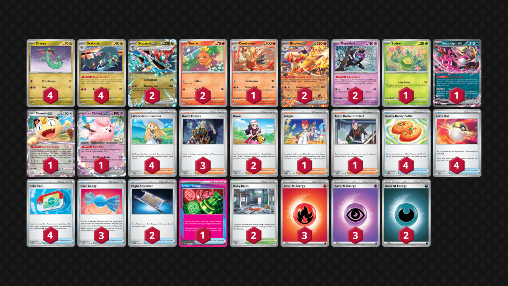

## Decklist


```decklist
Pokémon: 21
4 Dreepy TWM 128
4 Drakloak TWM 129
2 Dragapult ex TWM 130
2 Torchic DRI 40
1 Combusken DRI 41
2 Blaziken ex JTG 24
2 Munkidori TWM 95
1 Budew ASC 16
1 Fezandipiti ex ASC 142
1 Meowth ex POR 62
1 Lillie's Clefairy ex JTG 56

Trainer: 31
4 Lillie's Determination MEG 119
3 Boss's Orders MEG 114
2 Dawn PFL 87
1 Crispin SCR 133
1 Team Rocket's Petrel DRI 176
4 Buddy-Buddy Poffin TEF 144
4 Ultra Ball MEG 131
4 Poké Pad POR 81
3 Rare Candy MEG 125
2 Night Stretcher ASC 196
1 Unfair Stamp TWM 165
2 Risky Ruins MEG 127

Energy: 8
3 Fire Energy MEE 2
3 Psychic Energy MEE 5
2 Darkness Energy MEE 7
```
<!-- PUBLIC -->
### Inclusions

- Clefairy is a very good tech against Dragapult and Lucario.
- The two Dawn were better than expected, and also go well with Rare Candy.
- Rare Candy is a card that is either useless or extremely impactful. There are some games where you don’t need it, but it’s very powerful and important to have on specific turns in various situations. I tried with two and three and found it to be strong enough to warrant the third.
- Crispin is extremely strong. I found myself using it a ton, despite the deck also playing Blaziken. I would seriously consider playing another one. A very underrated aspect of it is actually finding the Energy, which can sometimes be inconsistent otherwise.
- Petrel is mostly great for consistently getting Unfair Stamp. Sometimes it’s used for making a Rare Candy play or for general consistency, such as getting Poffin.
- PokePad makes the deck function so I don’t want to play less than four.
- Just like regular Dragapult, Risky Ruins is very useful and impactful. I think it’s the best Stadium by far.

### Exclusions

- Two Budew would be nice but it is sometimes a liability and the board space is a little tighter with the Blaziken line. The second would be good when one is prized, or sometimes to be used as a pivot. I’m also not sure what I would cut for it.
- A thicker Blaziken line isn’t necessary because you’re only using one Blaziken in most games. Having double Blaziken on the board is nice, but more of an unnecessary luxury. It would also be hard to leverage as it takes up another board spot (so less for Munkidori). Of course, in matchups where attacking with Blaziken is important, a thicker line would be good.
- Shaymin is a fraud. Most of the matchups that snipe are still manageable without Shaymin. The ones that aren’t are very fringe decks such as Slowking, which I’m not concerned about.
- I think Judge and Harlequin are bad cards so I am not going to play them unless I find a good reason to do so.
- I tried four Boss because the card is broken, but didn’t find that to be necessary in testing.
- Team Rocket’s Watchtower could help against Slop Box decks in theory, but lining it up with hand disruption is basically impossible. Other matchups where Watchtower could be used, such as Alakazam, are already favorable anyway.
- Area Zero’s main problem is that it isn’t Risky Ruins. With the Blaziken and Munkidori, there are times where Area Zero can be useful, but Ruins’ utility is far more prevalent and common. There’s also a conflict of interest because you want the bench space for Munkidori, but can’t properly utilize them without Risky Ruins in play.

<!-- /PUBLIC -->
## Gameplay Tips

For this sections and for the matchups, a lot of the stuff is going to be the same as with the Dragapult guide since this is just a Dragapult deck. I’ll put the information relevant to Blaziken first, and then copy over the parts from the Dragapult page afterwards just to be thorough.

- For setting up, I usually prioritize two Dreepy and a Torchic on Turn 1. Blaziken is useful in most games, and I can get the third Dreepy later. However, if I think I’m likely going to get three Drakloak on the next turn, I’ll take the third Dreepy over the Torchic.
- I usually like to leave an extra board spot for Risky Ruins, Munkidori, or a support Pokemon, since I may need the flexibility. This is less true if the opponent is going to definitely get a KO on their next turn.
- If Torchic is in danger and you won’t be able to attack without Blaziken next turn, get the second Torchic. Otherwise, don’t bother with the second Torchic.
- Putting any random extra Energy in play is good so you can have a pivot. This is especially relevant in matchups where you need Clefairy.
- Budew isn’t as much of a priority in this build. It’s difficult to pivot in and out of, and the board space is also more of an issue. It can be situationally good in any matchup, but it really just depends.
- I think going blind first is best. There’s less of a reliance on Budew and the Turn 2 attack is somewhat common.
- I lean towards opening with Dreepy (compared to Torchic or Munkidori) when going first for the Turn 2 Dragon Headbutt (or even Phantom Dive) possibility. Turn 2 Blaziken can still happen even if you choose not to start with Torchic thanks to its Ability, but the inverse is not true for Dreepy. Going second, I often start with Torchic due to its Collect attack. You won’t use Collect that often, but it’s strictly better than Dreepy or Munkidori when going second due to the flexibility. Torchic is generally a better sacrifice than Dreepy as well, but it can still retreat into something like Budew or Munkidori if necessary.
- Opposite from regular Dragapult, putting Energy on the bottom with Recon is not as good since there’s only one Crispin. Stockpiling Energy in hand is actually quite good so you’ll have the attachment every turn. Furthermore, I occasionally use Ultra Ball to throw away Energy and combo with Blaziken’s Ability.
- Another difference is the Drakloak with Energy + Torchic board. If you know your Drakloak with Energy would get sniped, you wouldn’t want to bother attaching to it. But with Torchic/Blaziken on the board, the opposite is true. They cover for each other so that no matter what your opponent decides to take out, you’ll have a way to attack.

- The sequencing with this deck depends on what you’re trying to do. When reaching for combos, maximize the number of cards seen by starting with Lillie/Stamp, then Fezandipiti, and Recon Directives last. If you need more Pokemon than search cards you have, draw first. If not, search first. If you need to evolve into Dragapult before playing a shuffle-draw (like Lillie or Stamp), use the evolving Drakloak’s Recon first, then evolve, then go into the above sequence.
- Plan out your turn before you start playing cards. What are you trying to get done this turn? Most importantly, what Supporter to you want to play? If you’re using Crispin, best to start with that.
- Consider your prize map based on your opponent’s board. This can influence whether you need to use Risky Ruins or Munkidori to set up damage multiple turns in advance.
- Drakloak is a viable attacker! Don’t forget about it! This is even more common with the Blaziken build.
- Don’t mindlessly slam the Unfair Stamp as soon as you can. Depending on what you’re going to be able to do, or what the opponent’s board state looks like, sometimes it is tactically better to delay the Stamp by one turn. A good example is if you’re activating their Fez now, but can KO it next turn. If the opponent’s board is not developed, it may be better to slam it now even if you can’t attack because they might brick! Is the Stamp stopping them from doing something specific? If not, maybe hold it.
- Risky Ruins can be mostly used in three different ways: preemptively, reactively, or for instant value with Munkidori. Which one you prioritize typically depends on the matchup.

## Matchups

### Dragapult mirrors - Even

- If they go first and get Turn 2 Dragon Headbutt with Drakloak, you can punish them hard with a Rare Candy KO.
- Ideal board is Blaziken, two Munkidori, and the rest Drakloak or Dragapult. Evolving into extra Dragapult preemptively is sometimes necessary to stop them from getting a snipe KO on Drakloak with their Munkidori + Phantom Dive. If you’re getting a KO, try not to leave 30 damage increments on their board so they cannot snipe Drakloak.
- Munkidori can be a decent fast attacker for KO’ing Budew and getting a prize lead. It’s not as important to keep safe as an attacking Drakloak, but Drakloak can be a safe attacker if they have no Drakloak and don’t play Rare Candy.
- Against builds with Ursaluna (most non-Blaziken ones), try to avoid using Meowth or Fezandipiti. If they use Area Zero, you can use Risky Ruins to remove those liabilities from play.

- Clefairy introduces an interesting aspect because it can one-shot their Dragapult, but doesn’t necessarily put you ahead in the trade because it gets easily KO’d in return. The exception is early if they get a fast Phantom Dive but aren’t necessarily stabilized yet. It’s best to KO their Dragapult if they don’t have Energy on benched Drakloak, as they might whiff the response. This is particularly good with Stamp and is generally the best way to come back. Conversely, you don’t need to be scared of their Clefairy if you’re winning and can get the response KO on it. If you’re behind on the trade and they have response to Clefairy ready, consider just using Phantom Dive instead.
- On Turn 1, use Items preemptively to play around Budew. PokePad for Drakloak, Ultra Ball for Meowth, whatever is best in the situation. Just don’t let those Items get locked if you have the chance to play them.

```youtube
id: SmX3t4Se6hk
title: Blaziken v Pult 1
```
This was a very interesting game.

```youtube
id: YbrejTOUFNI
title: Blaziken v Pult 2
```

### Lucario - Favorable

- One-shot their Lucario with Clefairy whenever possible. You may need to have extra Energy in play or Budew for a pivot. Crispin can also work. You could also put Clefairy in play preemptively, but that’s a dangerous game because it can be gusted and KO’d fairly easily. I would be more inclined to put it in play if they have no Makuhita on the board.
- Play Risky Ruins ASAP. The 20 pings are extremely relevant. If they use Gravity Mountain too early for defense, you can bump it with your second Stadium so they don’t have it for offense. More likely they just won’t have the Gravity Mountain and have to eat the damage.
- Phantom Dive spread should usually go on Riolu/Lucario. If you can KO Riolu, that is almost always best. Putting 20 damage on Makuhita can also be good. Any extra damage can still be useful on Solrock/Lunatone.
- Play around late-game Solrock by not benching unnecessary small Pokemon. This is only relevant if they have no other attackers ready to go.
- Early Budew can be good in this matchup.
- If you don’t have the one-shot on Lucario, smacking it with Phantom Dive is still very good!
- Go second.

```youtube
id: yxInJvRcl4Q
title: Blaziken v Lucario 1
```

```youtube
id: 4Nk425YlP_8
title: Blaziken v Lucario 2
```

### Alakazam - Favorable

- Save Risky Ruins to bump Battle Cage. Also good with Munkidori later. Try to get two prizes per Phantom Dive. Ideally you can snipe Kadabra or Dunsparce with Munkidori’s help, but if not, sniping Abra is also fine.
- Use Stamp on a Phantom Dive turn, ideally the first one, but the second one is fine too.
- Using Pokemon like Fez/Meowth is generally fine in order to maintain tempo. Try to leave a spot for Munkidori in the mid- or late-game.
- Go first.

```youtube
id: bdMztyglVF4
title: Blaziken v Zam 1
```

```youtube
id: 3oqKTcPvTRs
title: Blaziken v Zam 2
```

### Garchomp - Unfavorable

- Chain Dragapult as much as possible. If they smack into one, try to attack with a fresh one.
- Getting Energy drops on Dreepy/Drakloak is very important. Sometimes it’s better to power them up in the early-game rather than retreating into Budew. If you’re going second and they didn’t get Gible, prioritize Budew. Otherwise, prioritize Energy drops on Dreepy/Drakloak. Of course, getting both is ideal.
- Budew is also not as good because it feeds Gabite early prize cards. It’s sometimes still worth going for if they have a weak board, but usually not a huge priority.
- Slamming Risky Ruins asap is very good.
- Try to keep double Roserade off the board! Make it difficult for them to KO Dragapult. Using Boss on Roserade or even Roselia is valid. Targeting their Energy can also be very strong if they don’t have much Energy in play.
- Munkidori is very good! Try to get it in play and use it to make relevant breakpoints such as sniping Roselia.
- Feeding one Spiritomb KO is unavoidable, just don’t feed them more than one.
- Unfair Stamp is best on turns where they don’t have a KO on board. If you’re attacking with Dragapult and they don’t want to use the first attack, or if you can make them whiff a relevant Boss or Energy drop is when Stamp is best.
- Turn 2 Drakloak Dragon Headbutt is especially good when they don’t have Gabite on the board and less than two Roselia! Look for this play when going first!
- Try to play without Fez/Meowth because they are big liabilities in this matchup.
- Go first.

```youtube
id: zgWVSoAduyg
title: Blaziken v Chomp 1
```

```youtube
id: UqhNx2eGSQg
title: Blaziken v Chomp 2
```

### Slop Box - Unfavorable

- Try to get a fast Blaziken. If they are threatening attacking Fezandipiti (or Wellspring), get both Torchic right away. If not, still get it relatively soon. Blaziken can take most two-prize KO’s (sometimes with Adrenabrain’s help) and does not worry about Clefairy.
- Attacking with Dragapult is still not terrible, and you’ll be doing it a decent amount anyway. It’s best along with Unfair Stamp as it’s less likely they’ll have the response.

- Two-prize Pokemon such as Fez and Meowth are more liabilities than normal since they can commonly start ahead in the trade and then finish with Ursaluna on the liabilities. Try to keep them out of play if you can! Of course, if you need them to play the game, so be it. It’s not an instant-loss, just don’t use them as liberally as normal.
- Budew is mostly used to stop them from finding Fez and/or Energy Switching onto it. If they already have an attacker, Item-lock is not as much of a priority.
- Save Risky Ruins for a strong play with Munkidori. This combo is very relevant. Can be used to one-shot the likes of Fez, or finish it off after a 200 hit plus snipe against Mist Energy. Munkidori is also very good for flinging damage back that they threw onto your board.
- This is one matchup where timing the Unfair Stamp is more relevant than yolo slamming it. Are you stopping them from using Fez and/or getting Clefairy? It’s all situational.
- Targeting the Clefairy is usually best. There’s a good chance they just won’t have the response to your Dragapult, especially if you Unfair Stamp them on the same turn.
- If you have Shaymin or Watchtower, this is the best matchup for them.
- I think going second is best in this matchup.

```youtube
id: IZFz1CYLWvw
title: Blaziken v Slop 1
```

### Meganium - Slightly Favorable

- This is another matchup where I tend to prioritize two Torchic. Blaziken can one-shot Arboliva, which is the biggest threat, but Arboliva can snipe off Torchic first, which is why you need two. 
- Turn 2 Blaziken can also be good, but it’s bait if you’re only getting one prize and if they have Ogerpon with two Energy, as they can get the return KO fairly easily in that scenario.
- Try to find or recover the other Torchic even if you already have Blaziken.
- If you aren’t using Blaziken to one-shot Arboliva, Dragapult is still the ideal attacker most of the time (although Blaziken is sometimes the only one available). Dragapult’s attack is generally better and it’s not as bad if it gets KO’d as opposed to an attacking Blaziken.
- If you’re behind in the prize trade, try to brick them with Stamp and/or KO Meganium. If they don’t have Meganium in play, it’s basically impossible for them to one-shot Dragapult/Blaziken.

- Ogerpon with four energy one-shots Dragapult, so be wary of any Ogerpon with two Energy and ping them for ten damage. Other spread damage should go onto Meowth. With Munkidori’s help, it’s not too hard to set up Meowth for a snipe KO. If they don’t have Meowth and you’ve already got ten on each Ogerpon/Fez, spread damage should pressure their lowest-HP single-prize Pokemon in play.
- Save Risky Ruins to bump Forest. Ruins isn’t that good preemptively and is likely to get bumped. If they already have all their Stage 2’s out, save Risky Ruins until you can benefit from it.
- Go first.

```youtube
id: Ibp6SWJNgX8
title: Blaziken v Meg 1
```

```youtube
id: 1pSNLuWc6y8
title: Blaziken v Meg 2
```

### Raging Bolt - Favorable

- This is another matchup where Blaziken is very good. You don’t need to get the second Torchic right away, and a lot of times you don’t need it at all.
- Blaziken is best used to attack pretty much any time it can get a KO. Ideally they don’t have a lot of Energy / Raging Bolt ex with Energy in play. It is possible for them to one-shot Blaziken with Raging Bolt. If they do that, respond with Unfair Stamp and Phantom Dive. If they have Fezandipiti, don’t take a KO right away and try to make them brick for a turn. Although Blaziken is good to attack with, you may not even attack with it more than once. It’s mostly just used to halt their tempo and deny a free Clefairy KO.

- Unfair Stamp is very strong unless they have both Fez and Hoothoot. Try to use it when they don’t have both of those. Save Unfair Stamp for when you start attacking, unless you can potentially stop them from attacking.
- In order of priority, spread damage should always put 10 on all Hoothoot (or 20 if it’s the 80 HP Hoothoot) and 40 on Raging Bolt ex if they have it. 10 is often good on Fan Rotom, Fez, or other 210 HP Pokemon. Extra damage can just go onto Hoothoot. KO’ing random single-prizes that you set up is also good.
- I would choose second because they play so many Crispin now and have a good chance of getting Turn 1 KO.

```youtube
id: b_n36dgxdPo
title: Blaziken v Bolt 1
```

```youtube
id: v568uuMMVyM
title: Blaziken v Bolt 2
```

### Mewtwo - Favorable

- Blaziken is a good attacker to KO their attacking Spidops. When Blaziken needs to recharge after it attacks, use Drakloak to KO Mimikyu or Tarountula. Attacking with Drakloak is also good if they have either of those in their active.
- If they have Mewtwo active, try to Itchy Pollen it on Turn 1, Dragon Headbutt it Turn 2, and then KO it Turn 3. Otherwise, just two-shot it normally. Attacking into it with Blaziken is generally good and then you can finish it off with Dragon Headbutt plus Adrenabrain or another Blaziken.
- Dragapult is not that great in this matchup but still gets used a decent amount.

- Go first. If you’re going first and they open with Mimikyu or Tarountula, don’t leave Budew in the active on Turn 1.
- Usually you need to slam Unfair Stamp as soon as you start attacking. However, using it earlier can sometimes be good if they have a crummy board and might brick.
- Assuming they have Articuno in play, the Munkidori damage should go on Mewtwo. Once you get that relevant 10 or so damage on Mewtwo, start using Adrenabrain on Spidops or Tarountula.
- Risky Ruins is best used reactively to bump their Stadium. This improves the chance of them bricking/whiffing. If you play Ruins preemptively, they can easily bump it.

```youtube
id: _g3NT0sbFGo
title: Blaziken v Mewtwo 1
```

```youtube
id: bwkleD_as9E
title: Blaziken v Mewtwo 2
```

### Zoroark - Favorable

- Munkidori with Dark is usually the biggest threat that you want to KO.
- Smacking a Zoroark and feeding the Reshiram KO is totally fine as long as you have a follow-up to finish it off.
- Spread damage usually goes on Zorua/Zoroark. There are tons of random relevant damage breakpoints and ways to take advantage of damage on Zoroark. Pinging Darumaka for 20 can sometimes be fine.
- Itchy Pollen to stop N’s PP Up is very good if they don’t have much Energy on board. This is most relevant after they use Darmanitan’s Flamebody Cannon. Of course, Budew is also very good early as it can stop Darmanitan from coming into play.
- Go second.

### Crustle - Unfavorable

- Combusken can one-shot Crustle if you flip double heads. Use Stretchers for Torchic and Combusken. You may need Blaziken for Energy acceleration despite the opportunity cost of Combusken. Even one heads on Combusken sets up Crustle for a Dragon Headbutt. Combusken is best used on Crustle with multiple Energy and full HP.

- Pick off any Dwebble on sight before they evolve into Crustle.
- Pressure them with a fast attacker. If they don’t have Crustle yet, Dragapult is best. If they have Crustle without Mist, Mind Bend is best. Otherwise, Drakloak. Sometimes it is just a matter of whatever you have easy access to, and that’s fine. We want to force them to respond so that we can use Stamp and hopefully make them brick.
- Go second and try to cheese them with a Turn 1 Itchy Pollen.

## Personal Thoughts

This deck is just a slightly-worse straight Pult, which is still very good. I’ve found that regular Dragapult is weirdly more efficient with getting Energy into play, and it doesn’t have to worry about the extra deck space or board space with Blaziken. This build also lacks the insane utility of Ursaluna and Latias, which is sad. However, Blaziken does improve some fringe matchups such as Raging Bolt and Mewtwo because it is not threatened by Clefairy, which is nice.
