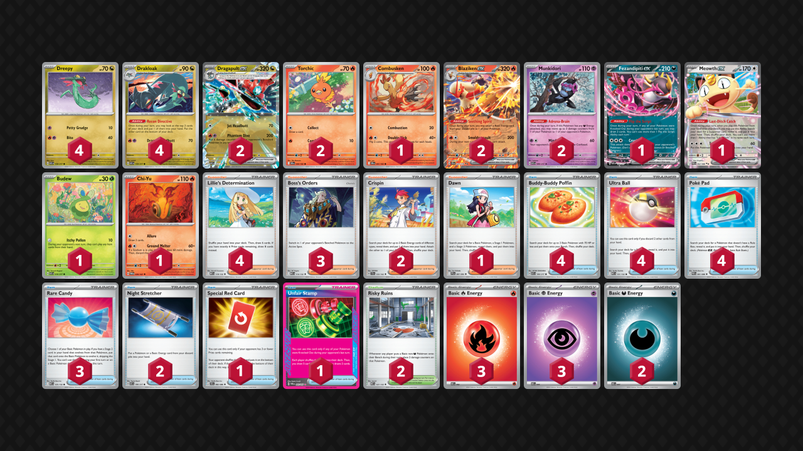
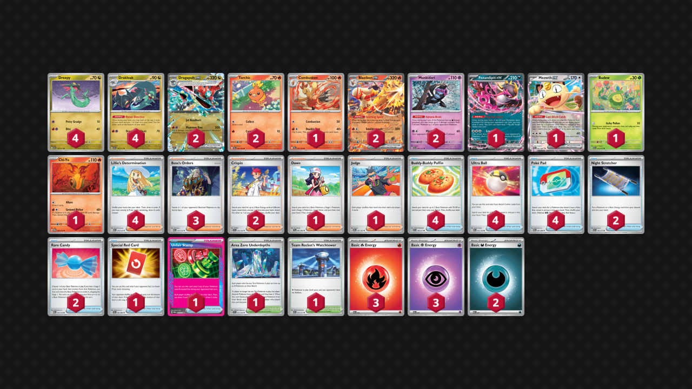

## Decklist


```decklist
Pokémon: 21
4 Dreepy ASC 158
4 Drakloak ASC 159
2 Dragapult ex ASC 160
2 Torchic DRI 40
1 Combusken DRI 41
2 Blaziken ex JTG 24
2 Munkidori ASC 99
1 Fezandipiti ex ASC 142
1 Meowth ex POR 62
1 Budew ASC 16
1 Chi-Yu TWM 39

Trainer: 31
4 Lillie's Determination MEG 119
3 Boss's Orders MEG 114
2 Crispin SCR 133
1 Dawn PFL 87
4 Buddy-Buddy Poffin ASC 184
4 Ultra Ball MEG 131
4 Poké Pad POR 81
3 Rare Candy MEG 125
2 Night Stretcher ASC 196
1 Special Red Card CRI 82
1 Unfair Stamp TWM 165
2 Risky Ruins MEG 127

Energy: 8
3 Fire Energy MEE 2
3 Psychic Energy MEE 5
2 Darkness Energy MEE 7
```
<!-- PUBLIC -->
### Inclusions

- Added Chi-Yu to counter Crustle for now.
- Dawn is better than expected. I would like to add the second one back in but not sure where the space is since I also want second Crispin.
- Rare Candy is a card that is either useless or extremely impactful. There are some games where you don’t need it, but it’s very powerful and important to have on specific turns in various situations. I tried with two and three and found it to be strong enough to warrant the third.
- Crispin is extremely strong. I found myself using it a ton, despite the deck also playing Blaziken. A very underrated aspect of it is actually finding the Energy, which can sometimes be inconsistent otherwise.
- Special Red Card replaces Petrel since it's similar to Unfair Stamp. Although it would be nice to have Petrel to find Candy, it's ultimately not that strong of a card.
- Just like regular Dragapult, Risky Ruins is very useful and impactful. I think it’s the best Stadium for this build. They can be useful in any matchup and are particularly important against Alakazam. One Ruins could be a Watchtower.

### Possible Inclusions

- Second Dawn would be nice to have.
- Clefairy is still good but I felt it was the most cuttable card for Chi-Yu. It doesn't increase the winrate in mirror that much and is terrible to start with. It's a bit better in the Area Zero lists anyway.
- Team Rocket’s Watchtower is decent in the current meta. I am considering it more to deal with annoying Patrat in other Dragapult decks.

### Exclusions

- A thicker Blaziken line isn’t necessary because you’re only using one Blaziken in most games. Having double Blaziken on the board is nice, but more of an unnecessary luxury. It would also be hard to leverage as it takes up another board spot (so less for Munkidori). Of course, in matchups where attacking with Blaziken is important, a thicker line would be good.
- Shaymin isn't as necessary with the deck packing three Rare Candy.
- I think Judge and Harlequin are bad cards so I am not going to play them unless I find a good reason to do so.
- I tried four Boss because the card is broken, but didn’t find that to be necessary in testing.
- Area Zero is one of the worse Stadium options. It doesn't do enough. However, if you also played Chien-Pao, it could remove liabilities from the board.
- The Milotic build is sadly a failed experiment.

## Standard List


```decklist
Pokémon: 22
Pokémon: 21
4 Dreepy ASC 158
4 Drakloak ASC 159
2 Dragapult ex ASC 160
2 Torchic DRI 40
1 Combusken DRI 41
2 Blaziken ex JTG 24
2 Munkidori ASC 99
1 Fezandipiti ex ASC 142
1 Meowth ex POR 62
1 Budew ASC 16
1 Chi-Yu TWM 39

Trainer: 31
4 Lillie's Determination MEG 119
3 Boss's Orders MEG 114
2 Crispin SCR 133
1 Dawn PFL 87
1 Judge DRI 167
4 Buddy-Buddy Poffin ASC 184
4 Ultra Ball MEG 131
4 Poké Pad POR 81
2 Night Stretcher ASC 196
2 Rare Candy MEG 125
1 Special Red Card CRI 82
1 Unfair Stamp TWM 165
1 Area Zero Underdepths SCR 131
1 Team Rocket's Watchtower ASC 210

Energy: 8
3 Fire Energy MEE 2
3 Psychic Energy MEE 5
2 Darkness Energy MEE 7
```

Most Blaziken lists have Area Zero and / or Watchtower, as well as Judge. Shaymin is also a fairly common tech, although it's also common for them to not have it.

<!-- /PUBLIC -->
## Gameplay Tips

- Go first against everything.
- For setting up, I usually prioritize two Dreepy and a Torchic on Turn 1. Blaziken is useful in most games, and I can get the third Dreepy later. However, if I think I’m likely going to get three Drakloak on the next turn, I’ll take the third Dreepy over the Torchic.
- I usually like to leave an extra board spot for Risky Ruins, Munkidori, or a support Pokemon, since I may need the flexibility. This is less true if the opponent is going to definitely get a KO on their next turn.
- If Torchic is in danger and you won’t be able to attack without Blaziken next turn, get the second Torchic. Otherwise, don’t bother with the second Torchic.
- Putting any random extra Energy in play is good so you can have a pivot. This is especially relevant in matchups where you need Clefairy.
- Budew isn’t as much of a priority in this build. It’s difficult to pivot into, and the board space is also more of an issue. It can be situationally good in any matchup, but it really just depends.
- I lean towards opening with Dreepy (compared to Torchic or Munkidori) when going first for the Turn 2 Dragon Headbutt (or even Phantom Dive) possibility. Turn 2 Blaziken can still happen even if you choose not to start with Torchic thanks to its Ability, but the inverse is not true for Dreepy. Going second, I often start with Torchic due to its Collect attack. You won’t use Collect that often, but it’s strictly better than Dreepy or Munkidori when going second due to the flexibility. Torchic is generally a better sacrifice than Dreepy as well, but it can still retreat into something like Budew or Munkidori if necessary.
- Opposite from regular Dragapult, stockpiling Energy in hand is actually quite good so you’ll have the attachment every turn. Furthermore, I occasionally use Ultra Ball to throw away Energy and combo with Blaziken’s Ability.
- Another difference is the Drakloak with Energy + Torchic board. If you know your Drakloak with Energy would get sniped, you wouldn’t want to bother attaching to it. But with Torchic/Blaziken on the board, the opposite is true. They cover for each other so that no matter what your opponent decides to take out, you’ll have a way to attack.

For Dragapult in general:

- The sequencing with this deck depends on what you’re trying to do. When reaching for combos, maximize the number of cards seen by starting with Lillie/Stamp, then Fezandipiti, and Recon Directives last. If you need more Pokemon than search cards you have, draw first. If not, search first. If you need to evolve into Dragapult before playing a shuffle-draw (like Lillie or Stamp), use the evolving Drakloak’s Recon first, then evolve, then go into the above sequence.
- Plan out your turn before you start playing cards. What are you trying to get done this turn? Most importantly, what Supporter to you want to play? If you’re using Crispin, best to start with that.
- Consider your prize map based on your opponent’s board. This can influence whether you need to use Risky Ruins or Munkidori to set up damage multiple turns in advance.
- Drakloak is a viable attacker! Don’t forget about it! This is even more common with the Blaziken build.
- Slamming Unfair Stamp is better now that the deck has Special Red Card for later.
- Risky Ruins can be mostly used in three different ways: preemptively, reactively, or for instant value with Munkidori. Which one you prioritize typically depends on the matchup.

## Matchups

### Dragapult mirrors - Even

- If they go first and get Turn 2 Dragon Headbutt with Drakloak, you can punish them hard with a Rare Candy KO.
- Ideal board is Blaziken, two Munkidori (if you can get both Darks), and the rest Drakloak or Dragapult. Evolving into extra Dragapult preemptively is sometimes necessary to stop them from getting a snipe KO on Drakloak with their Munkidori + Phantom Dive. If you’re getting a KO, try not to leave 30 damage increments on their board so they cannot snipe Drakloak.
- When deciding whether to be aggressive mostly depends on which player is outscaling the other. If your setup is outscaling the opponent's, there's no reason to make yourself vulnerable to Hammers and Stamp. Set up a strong board before going in, ideally stalling them with Itchy Pollen. If your opponent is outscaling you, you have to go in as fast as possible and apply pressure (hoping they whiff something such as not finding Stamp or tails on Hammer). Against non-Hammer builds, you have more incentive to go in as long as you aren't particularly vulnerable to Stamp. There can be multiple metrics of scaling and it's not always immediately obvious, including but not limited to: number of Drakloak, Munkidori / overall Energy situation, optimal board setup (Meowth situation), and cards in hand / resources available.
- Opening aggression by KO'ing their Drakloak with Energy is ideal, especially with the Hammer build. If you have to KO Budew, best to do it with your Budew. If they have Munkidori established, Jet Headbutt or Dragon Headbutt is sometimes better than Phantom Dive to KO single-prizers (this doesn't apply if Patrat is in play).
- Munkidori is very strong. Try not to boardlock yourself out of it so that you can utilize it whenever you find it. Conversely, if they have Munkidori with Dark, consider KO’ing it to limit their options. With limited Stretchers, they might not be able to get it back. Munkidori can be a decent fast attacker for KO’ing Budew and getting a prize lead. It’s not as important to keep safe as an attacking Drakloak, but Drakloak can be a safe attacker if they have no Drakloak and don’t play Rare Candy.
- I still think going first is better because it opens up more options and allows you to get the first Phantom Dive, or just Itchy Pollen ten damage into their Budew first. KO'ing their Budew with your Budew is a very desirable situation, and therefore the opposite should also be avoided. Going second isn't bad, and it does feel better if you have Lillie into Items, but I'm still choosing first. Sometimes you choose not to attach Energy on Turn 1 going first in order to play around Crushing Hammer, but it's very situation-dependent.
- Fast Cruel Arrow can be good if it lines up, so sometimes it can be optimal to start with Fez. However, since this play is easily thwarted by Crushing Hammer, it shouldn't be relied on. If they are threatening a fast Fez attack, respond with Hammer, Mind Bend, or Boss.
- On Turn 1, use Items preemptively to play around Budew. PokePad for Drakloak, Ultra Ball for Meowth, whatever is best in the situation. Just don’t let those Items get locked if you have the chance to play them. If they might play Watchtower, consider using Meowth preemptively. I'd prefer not to, but it's better than dead drawing to a Watchtower. Conversely, you should slam Watchtower on Turn 1 because it can sometimes make the opponent brick.
- Budew is not necessarily ALWAYS needed. If you’re going second, especially if you have Stamp (or if they don’t have any Energy), it is a priority on Turn 1. If you don’t have some reason to go for Budew, it’s not necessarily needed. Using an Energy to retreat into it can result in significant tempo loss, especially if Budew gets immediately KO’d or Bossed around. Even if it doesn’t, it is a liability on the board for later. They also used their Items on Turn 1 going first, so it only matters if they use Lillie and draw search Items. Budew can protect your Energy from opposing Hammers, but this is only situationally relevant. In other words, don’t mindlessly prioritize Budew, but it can be useful if you have a reason to do so.
- When they 30-30 your two Drakloak, the ideal response is to heal one with Adrenabrain and evolve the other. In general, you’ll often have to preemptively evolve a Drakloak in order to protect it. Going 30-30 on their Drakloak is generally good because it pressures them to find a lot of cards as a response, and if they evolve Drakloak, that's less draw they have to recover from hand disruption. If you think they can protect both Drakloak and you need a guaranteed snipe target, it's sometimes fine to dump damage onto their Dreepy instead.
- Since most play Judge now, try to play around that to the best of your ability (using cards for value that you would otherwise hold). There are also times where it's best to delay taking prize cards. This is especially true if they don't have Munkidori and you can spread damage. Be careful to play around cards such as Rosa's and Stamp.
- Do NOT evolve into Blaziken if there's a risk of it getting stuck and smacked for 200. Blaziken is very good in this matchup, but make sure it's not a liability before putting it into play. If they Boss Blaziken, you want to be able to retreat it and attack with something else. Sometimes you have no choice but to attack with it, which is still better than it getting stuck.
- Against Patrat, it can be a convenient snipe target, but it's not a priority to Boss up since they play lots of Night Stretchers.
- Against Dusknoir, you have additional incentive to go for a fast Phantom Dive since you can snipe down Duskull before they evolve. If they don't have a threat of Dusknoir, it's fine to play a slower game and go for a better setup. Of course, if they already evolved Duskull into Dusclops, the incentive to go fast is no longer there. The opposite is true because you don't want to walk into Dusknoir + Phantom Dive on your only Dragapult.

```youtube
id: SmX3t4Se6hk
title: Blaziken v Pult 1
```
This was a very interesting game.

```youtube
id: YbrejTOUFNI
title: Blaziken v Pult 2
```

### Raging Bolt - Slightly Favorable

- This is another matchup where Blaziken is very good. You don’t always need the second Torchic though.
- Early-game Mind Bend is sometimes good. Having Munkidori in the active is ok since it tanks a Waterpon attack.
- Blaziken is best used to attack pretty much any time it can get a KO. Ideally they don’t have a lot of Energy / Raging Bolt ex with Energy in play. It is possible for them to one-shot Blaziken with Raging Bolt. If they do that, respond with Unfair Stamp and Phantom Dive. If they have Fezandipiti, don’t take a KO right away and try to make them brick for a turn. Although Blaziken is good to attack with, you may not even attack with it more than once. It’s mostly just used to halt their tempo and deny a free Clefairy KO.
- Spread damage should go 40 to Raging Bolt, and sometimes 10 to 210 HP Pokemon. Having the option to KO their Fez is good, but there are some occasions where smacking it for 200 and not taking the KO is better, so it just depends. If you're behind on the prize trade, you might need to go for the delay into double-KO.
- The best times to play Watchtower are at the very start of the game, when they have a low hand, or when you can pair it with hand disruption. In other words, don’t slam Watchtower when they have a big hand or you think they can easily bump it.
- Reyling on a big damage setup play is questionable because they can use Chien-Pao to clear off damage. However, it can be fine if they already used Chien-Pao to bump Watchtower. Another time it can be ok is if you can make them whiff something (or if you need them to whiff something), since delaying a KO limits their draw with Kang / Fez. If you disrupt their hand, they might not be able to get Chien-Pao, so going for a damage setup can be fine. In general, it just depends on the situation (you also might be forced to KO Clefairy since it's a big threat).

```youtube
id: b_n36dgxdPo
title: Blaziken v Bolt 1
```

```youtube
id: v568uuMMVyM
title: Blaziken v Bolt 2
```

### Zoroark - Slightly Unfavorable

- Munkidori is very good in this matchup. If you have board space for two along with Blaziken, that's great. Sometimes you'll only have space for one, which is fine.
- If they might play Reshiram and have an open board spot, try to play around Reshiram (Boss, Jet Headbutt, Mind Bend, Itchy Pollen). If they don't have an open board spot, keep in mind that it's hard for them to get a Tome play early, and some of them don't even play Tome to begin with.
- If you are able to make a winning prize trade, sometimes it's fine to play into Reshiram for tempo, depending on the situation. Other times, it's inevitable anyway.
- 60 damage snipes almost always go on Zoroark and / or Zorua.
- If they might play Tome, target down their weak two-prize liabilities before they get Tome'd away.

### Alakazam - Favorable

- Save Risky Ruins to bump their Stadiums and combo with hand disruption. Also good with Munkidori later. Try to get two prizes per Phantom Dive. Ideally you can snipe Kadabra or Dunsparce with Munkidori’s help, but if not, sniping Abra is also fine.
- Hand disruption is best when attacking with a big two-prize Pokemon because they probably won't be able to get the response KO. Hand disruption cards are premium in this matchup.
- Blaziken is a good option if you need it to attack through Nighttime Mine or are worried about Clefairy after disrupting their hand. I definitely don't attack with it every game, as it is quite situational.
- Using Pokemon like Fez/Meowth is generally fine in order to maintain tempo. Try to leave a spot for Munkidori in the mid- or late-game.
- Play around Eri by not grabbing important Items with early Recon Directives (namely Special Red Card) and by using Items as soon as you can get value. Now that many Alakazam decks have Eri, carefully consider the board state before deciding which Items to hang on to. Early Stamp is one that's usually fine to grab because they are more likely to use a setup Supporter instead of Eri, and you can punish them if they don't get Genesect fast enough. If you save the Stamp for later, they will just have Genesect by then. Of course, once Eri has been used, you don't need to play around it anymore. Some play two Eri, but it's fairly rare.
- Some of them also play Special Red Card now, which is important to play around by thinning as much as possible.
- If they ever attack with Elgyem, KO it immediately. You don't need to play around it particularly hard. Elgyem is bad and useless as long as you don't let it attack multiple times.
- Snipe damage should usually KO Abra whenever possible. Spreading 2 to multiple Kadabra is fine if possible. Otherwise, 5 to Genesect and / or 1 to Fez is generally good to set it up for another snipe.

Against the Dusknoir build:

- Blaziken is useful because it makes Torchic a threat, so you don’t necessarily lose even if all of your Drakloak are KO’d. Get as many Dreepy and Drakloak as possible. If you are able to get Torchic too, it’s good to have.
- Rare Candy is a good resource to keep around. After they wipe out your Drakloak and Red Card, you want to maximize your outs of drawing Rare Candy + Stage 2 (particularly Blaziken since it can charge itself up).
- Winning the Budew war is almost impossible so don’t even try. 
- Save Budew to use as a positional piece to deny the Rare Candy Dusknoir play. This can buy you an extra turn when you need it most (such as Turn 3 or so).
- If they Dusclops / Dusknoir to KO your active, you might think that you should keep your Drakloak with Energy safe on the bench. Most of the time, it’s actually correct to push it into the active, even if all of your instincts are screaming at you not to. If they take the KO with Alakazam too early, they severely compromise their fragile board and you can punish them. If you push something else, it will just get stuck, and you give them too much time to do as they like.
- Being aggressive is good. Evolving into Dragapult (even if you can’t attack with it this turn) is sometimes good (it’s hard for them to get 16 cards plus full Dusknoir and gust combo). Putting Fez down is good. The Shadow Bind line is not real and cannot hurt you.

```youtube
id: bdMztyglVF4
title: Blaziken v Zam 1
```

```youtube
id: 3oqKTcPvTRs
title: Blaziken v Zam 2
```

```youtube
id: ga6HDsFJovo
title: ZamNoir v PultBlaze 1
```

```youtube
id: yK97slQIa0g
title: ZamNoir v PultBlaze 2
```

```youtube
id: ElRlP72TodY
title: ZamNoir v PultBlaze 3
```

### Slowking - Slightly Unfavorable

- If you're expecting Trifrost, the ideal board is Budew, Dreepy, Fez (or just Budew Fez).
- Rare Candy can help with making fast Stage 2's or recovering off Trifrost. Ideally, you'll get a Turn 2 Phantom Dive or Blaziken, but of course that won't always happen.
- Fezandipiti can be a useful attacker or wall, especially early in the game. If you force them to Trifrost into Fez (by only having three Pokemon in play), Munkidori can use it to farm damage later.
- Blaziken can be a great attacker later in the game since they cannot easily one-shot it (it's not weak to Clefairy). They would need either Annihilape or Brave Bangle, which many lists don't play.
- Avoid giving them easy Trifrost lines to win the game. This is very situational based on the board. Sometimes it’s fine to bench extra Dreepy and stuff, and sometimes it’s game-losing.
- Munkidori is extremely important if they end up Trifrosting any two-prizer for less than a KO.
- Phantom Dive almost always puts six on the backup Slowpoke/King that is least likely to attack next turn unless you're setting up to win the game another way.
- Judge is very good early-game or whenever they have a big hand, or when they use Cipher to set up their next turn.
- If they play Zeraora, you have to constantly try to get Drakloak and Dragapult into play. They can punish you for sitting behind Budew with Fez and no Drakloak by sniping Fez. Zeraora is somewhat rare and bad, so I wouldn't play around it super hard unless you know they have it.

### Excadrill - Favorable

- I think going first is better but honestly not sure.
- Prioritize setting up Blaziken as fast as possible. Even better if you can get a second one eventually.
- Itchy Pollen is good if their board isn’t set up yet. It also gets relevant ten damage onto Fez if they decide to start attacking with it, so that you can finish it off with Phantom Dive. Mind Bend can also be a decent response to Fez.
- If they don’t have Excadrill in play, just attack with Drakloak or Dragapult, saving Blaziken to respond to Excadrill.
- Slam Ruins instantly.

```youtube
id: 8pYQpK3xHAQ
title: Drill v PultBlaze 1
```

### Crustle - Depends on Tech

With a tech such as Chi-Yu, this matchup is very favorable. Without it, it's very unfavorable.

With Chi-Yu:
- Save Chi-Yu to respond to a loaded Crustle.
- Munkidori is still good in this matchup.
- Attack with Dragapult normally to check their Kang and spread damage.
- Pressure their Energy with Boss or snipes whenever possible.

Without a tech:
- Combusken can one-shot Crustle if you flip double heads. Use Stretchers for Torchic and Combusken. You may need Blaziken for Energy acceleration despite the opportunity cost of Combusken. Even one heads on Combusken sets up Crustle for a Dragon Headbutt. Combusken is best used on Crustle with multiple Energy and full HP.
- Pressure them with a fast attacker. If they don’t have Crustle yet, Dragapult is best. If they have Crustle without Mist, Mind Bend is best. Otherwise, Drakloak. Sometimes it is just a matter of whatever you have easy access to, and that’s fine. We want to force them to respond so that we can use Stamp and hopefully make them brick.

### Hydrapple - Favorable

- Prioritize multiple Blaziken and run them over. Sometimes Phantom Dive is still better, depending on the situation.
- Early Budew can be good to slow them down, and its damage is relevant as well.
- If you find yourself in a losing prize trade, you may need to rely on disruption and KO'ing their Meganium.
- Watch out for Briar. That doesn't necessarily mean to stay on odd prizes, as they also need Meganium and the Briar itself (and a big Ogerpon). Disrupting their hand or board are other ways to play around Briar.
- Even though they play lots of Stadiums, slamming Watchtower on Turn 1 going first can make them brick. Otherwise, save Stadiums to combo with hand disruption and/or bump their Stadium.
- Stay aware of Hydrapple’s healing Ability. Because of this, sometimes it’s better to overdamage Pokemon with Phantom Dive’s snipe by 30 more than you’d otherwise need. For example, sniping Teal Mask for 40 instead of 10 can be relevant.
- If you ever get the chance to snipe down Applin or Chikorita before they evolve, that's very good.
- Judge can be very strong in the early-game, especially combined with Item-lock. If you're using Judge in response to a Celebi setup attack, it's ideal (but not necessarily required) to KO the Celebi that turn.

### Bronzong / Lopunny - Favorable

- Itchy Pollen is usually bait and not worth going for, but it can be good if you have Stamp in hand since it forces them to take an early KO.
- The most important thing is to get a fast response to Bronzong. Mind Bend is easiest and it works best along with hand disruption. Fast Fez is also very strong if you’re able to get to it. Chi-Yu can also work.
- Thanks to Rare Candy, this deck has a decent backup plan as long as you’re able to stop the Evo Jammer soon enough. Try to line up a Rare Candy play when they’re about to break the Evo Jammer lock (when you force them to).
- If you get lots of Dreepy and Torchic, there’s too many threats on the board. They cannot KO all of them, so something will eventually be able to Candy up.
- Sometimes it isn’t clear what to snipe with Fez. If they are threatening Dusknoir + Dusclops + Evo Jammer, you need to stop that. If they have triple Duskull and only one Brozong, KO Bronzong. If they have only two Duskull lines, KO’ing one of those is probably fine. Otherwise (such as if they have a small hand or low chance of getting the combo), KO’ing Buneary can be good as well (not recommended if they have two Buneary).
- When you’re going first, getting a fast Dragon Headbutt with Drakloak is also good.
- Boss-KO a Duskull with Mind Bend or Dragon Headbutt is generally good if you don’t have anything better to do.

```youtube
id: 2gVi8YZ6eMk
title: Bronz v PultBlaze 1
```

```youtube
id: uvzzRTEJp6s
title: Bronz v PultBlaze 2
```

```youtube
id: ZRBCLvhjB4w
title: Bronz v PultBlaze 3
```

```youtube
id: 93420PHKYco
title: Bronz v PultBlaze 4
```

### Clefairy Box - Slightly Unfavorable

- Try to get a fast Blaziken. If they are threatening attacking Fezandipiti (or Wellspring), get both Torchic right away. If not, still get it relatively soon. Blaziken can take most two-prize KO’s (sometimes with Adrenabrain’s help) and does not worry about Clefairy.
- Attacking with Dragapult is still not terrible, and you’ll be doing it a decent amount anyway. It’s best along with Unfair Stamp as it’s less likely they’ll have the response.
- Two-prize Pokemon such as Fez and Meowth are more liabilities than normal since the opponent can commonly start ahead in the trade and then finish Clefairy on the liabilities. Try to keep them out of play if you can! Of course, if you need them to play the game, so be it. It’s not an instant-loss, just don’t use them as liberally as normal.
- Budew is mostly used to stop them from making an attacker. If they already have an attacker, Item-lock is not as much of a priority.
- Save Risky Ruins for a strong play with Munkidori. This combo is very relevant. Can be used to one-shot the likes of Fez, or finish it off after a 200 hit.
- Targeting the Clefairy is usually best. There’s a good chance they just won’t have the response to your Dragapult, especially if you Unfair Stamp them on the same turn.
- If you have Shaymin or Watchtower, this is a good matchup to use them in.

### Festival Lead - Favorable

- Early Itchy Pollen is very good in this matchup. It helps stop Rabsca and disrupts their setup in general.
- KO Rabsca as soon as possible.
- Rare Candy is a very strong resource, as is Blaziken for accelerating the Energy.
- Getting Munkidori in play to use as a sponge is very good. It can be used as a sacrifice or as a promote after they use their first attack to get a KO. Later in the game, it will also be relevant for Adrenabrain.
- Save Risky Ruins for when you can get immediate value from it.
- Stamp is broken along with Boss Thwackey.
- If you're playing Risky Ruins, it's possible to do some diabolical setups. Boss on Thwackey plus hand disruption leads to better conversions. Jet Headbutt the Thwackey and Adrenabrain it, then finish with Adrenabrain and KO whatever you want. The best part is that this play can be done even if they have Rabsca in play. Therefore, Boss is a very important resource.
- If they don’t have a large hand and only two Thwackey, it may be better to target a Thwackey. Depending on the board, it may be more likely to get them to whiff a KO, but sometimes KO’ing their attacker is still best. If they have only one Thwackey, KO’ing it is usually best.
- If they don't have Shaymin or Rabsca in play, Boss + Stamp / Red Card + Cruel Arrow can be a win condition.

### Hide n Sneak - Favorable

- Set up multiple Blaziken and a Munkidori. Put them in the Blaziken spin cycle.
- Attacking with Dragapult once in the early-game is not too bad since it forces Clefairy down. You can KO the Clefairy with Blaziken and just use Blaziken from there. The early-game can be played various different ways.
- If you play Watchtower, save it to counter Patrat or use it alongside hand disruption.

```youtube
id: jBYBGKaGCxE
title: Sneak v PultBlaze 1
```

```youtube
id: SfY_1pp-vgs
title: Sneak v PultBlaze 2
```

### Lucario - Slightly Favorable

- Play Risky Ruins ASAP. The 20 pings are extremely relevant. If they use Gravity Mountain too early for defense, you can bump it with your second Stadium so they don’t have it for offense. More likely they just won’t have the Gravity Mountain and have to eat the damage.
- Phantom Dive spread should usually go on Riolu/Lucario. If you can KO Riolu, that is almost always best. Putting 20 damage on Makuhita can also be good. Any extra damage can still be useful on Solrock/Lunatone.
- Play around late-game Solrock by not benching unnecessary small Pokemon. This is only relevant if they have no other attackers ready to go.
- Early Budew can be good in this matchup.
- If you don’t play Clefairy, smacking Lucario with Phantom Dive or Mind Bend is still very good!
- If you play Clefairy, one-shot their Lucario with it whenever possible. You may need to have extra Energy in play or Budew for a pivot. Crispin can also work. You could also put Clefairy in play preemptively, but that’s a dangerous game because it can be gusted and KO’d fairly easily. I would be more inclined to put it in play if they have no Makuhita on the board.

```youtube
id: yxInJvRcl4Q
title: Blaziken v Lucario 1
```

```youtube
id: 4Nk425YlP_8
title: Blaziken v Lucario 2
```

### Mewtwo - Favorable

- Blaziken is a good attacker to KO their attacking Spidops. When Blaziken needs to recharge after it attacks, use Drakloak to KO Mimikyu or Tarountula. Attacking with Drakloak is also good if they have either of those in their active.
- If they have Mewtwo active, try to Itchy Pollen it on Turn 1, Dragon Headbutt it Turn 2, and then KO it Turn 3. Otherwise, just two-shot it normally. Attacking into it with Blaziken is generally good and then you can finish it off with Dragon Headbutt plus Adrenabrain or another Blaziken.
- Dragapult is not that great in this matchup but still gets used a decent amount.
- If you’re going first and they open with Mimikyu or Tarountula, don’t leave Budew in the active on Turn 1.
- Assuming they have Articuno in play, the Munkidori damage should go on Mewtwo. Once you get that relevant 10 or so damage on Mewtwo, start using Adrenabrain on Spidops or Tarountula.
- Risky Ruins is best used reactively to bump their Stadium. This improves the chance of them bricking/whiffing. If you play Ruins preemptively, they can easily bump it.

```youtube
id: _g3NT0sbFGo
title: Blaziken v Mewtwo 1
```

```youtube
id: bwkleD_as9E
title: Blaziken v Mewtwo 2
```

### Lopunny - Unfavorable

- The main win condition is Stamp. Try to set up a turn where you can KO Dudunsparce and Stamp at the same time. Ideally, you’ll KO their only Dudunsparce and then they’ll brick.
- If they have two Dudunsparce, prioritize KO’ing them. Whether you want to use Stamp on the first KO or the next one depends. It’s best to set up a situation where you’re KO’ing their only one, but if the game is going too fast, you may need to Stamp before you get to do that.
- Try to set up as many Blaziken as possible. This allows you to easily rotate attackers when one of them gets smacked. By constantly attacking with a new attacker, it forces them to use Wally so they can’t use Boss to finish off the damaged one.
- KO Dunsparce with snipes whenever possible.
- Extra snipe damage is generally best on Buneary/Lopunny. If you build up enough damage, you can threaten both Lopunny at the same time, which can be game-winning. Generally best to put damage on the backup Buneary and not actually KO it, but it depends. It can also be good to ping 10 to multiple 70 HP Dunsparce to pressure them, or 10 to Fan Rotom for an easy KO option later.
- Munkidori is very good in general. Save Risky Ruins to bump Battle Cage for a relevant snipe play.
- If you have Watchtower, try to set up for a Watchtower + hand disruption play and make them brick.

### Garchomp - Unfavorable

- Chain Dragapult as much as possible. If they smack into one, try to attack with a fresh one.
- Getting Energy drops on Dreepy/Drakloak is very important. Sometimes it’s better to power them up in the early-game rather than retreating into Budew. If you’re going second and they didn’t get Gible, prioritize Budew. Otherwise, prioritize Energy drops on Dreepy/Drakloak. Of course, getting both is ideal.
- Budew is also not as good because it feeds Gabite early prize cards. It’s sometimes still worth going for if they have a weak board, but usually not a huge priority.
- Slamming Risky Ruins asap is very good.
- Try to keep double Roserade off the board! Make it difficult for them to KO Dragapult. Using Boss on Roserade or even Roselia is valid. Targeting their Energy can also be very strong if they don’t have much Energy in play.
- Munkidori is very good! Try to get it in play and use it to make relevant breakpoints such as sniping Roselia.
- Feeding one Spiritomb KO is unavoidable, just don’t feed them more than one.
- Unfair Stamp is best on turns where they don’t have a KO on board. If you’re attacking with Dragapult and they don’t want to use the first attack, or if you can make them whiff a relevant Boss or Energy drop is when Stamp is best.
- Turn 2 Drakloak Dragon Headbutt is especially good when they don’t have Gabite on the board and less than two Roselia! Look for this play when going first!
- Try to play without Fez/Meowth because they are big liabilities in this matchup.

```youtube
id: zgWVSoAduyg
title: Blaziken v Chomp 1
```

```youtube
id: UqhNx2eGSQg
title: Blaziken v Chomp 2
```

### Arboliva - Slightly Favorable

- This is a matchup where I tend to prioritize two Torchic. Blaziken can one-shot Arboliva, which is the biggest threat, but Arboliva can snipe off Torchic first, which is why you need two. 
- Turn 2 Blaziken can also be good, but it’s bait if you’re only getting one prize and if they have Ogerpon with two Energy, as they can get the return KO fairly easily in that scenario.
- Try to find or recover the other Torchic even if you already have Blaziken.
- If you aren’t using Blaziken to one-shot Arboliva, Dragapult is still the ideal attacker most of the time (although Blaziken is sometimes the only one available). Dragapult’s attack is generally better and it’s not as bad if Dragapult gets KO’d as opposed to an attacking Blaziken.
- If you’re behind in the prize trade, try to brick them with Stamp and/or KO Meganium. If they don’t have Meganium in play, it’s basically impossible for them to one-shot Dragapult/Blaziken.
- Ogerpon with four energy one-shots, so be wary of any Ogerpon with two Energy and ping them for ten damage. Other spread damage should go onto Meowth. With Munkidori’s help, it’s not too hard to set up Meowth for a snipe KO. If they don’t have Meowth and you’ve already got ten on each Ogerpon/Fez, spread damage should pressure their lowest-HP single-prize Pokemon in play.
- Save Risky Ruins to bump Forest. Ruins isn’t that good preemptively and is likely to get bumped. If they already have all their Stage 2’s out, save Risky Ruins until you can benefit from it.

```youtube
id: Ibp6SWJNgX8
title: Blaziken v Meg 1
```

```youtube
id: 1pSNLuWc6y8
title: Blaziken v Meg 2
```

### Ogerpon - Slightly Unfavorable

- Itchy Pollen is very strong in the early-game to slow them down. Double Torchic is also good, as you want to attack with Blaziken quickly.
- Blaziken is typically better to attack with than Dragapult since it does not get one-shot by Clefairy. If they Sob the Blaziken (or anything else), use Adrenabrain to offset the damage.
- Unfair Stamp is best when KO’ing their Fez (or if they have no Fez).
- Risky Ruins is best to bump their Area Zero and get rid of any of your two-prize liabilities. Of course, if you need damage on their board for Dragapult, it may be best not to use it.

## Personal Thoughts

I think Blaziken is actually quite good in the current meta. It is good at dealing with stuff like Clefairy, Hydrapple, and Crushing Hammer. It's still a Dragapult deck, which is good. It has a solid matchup spread overall and does fine into other Dragapult.
