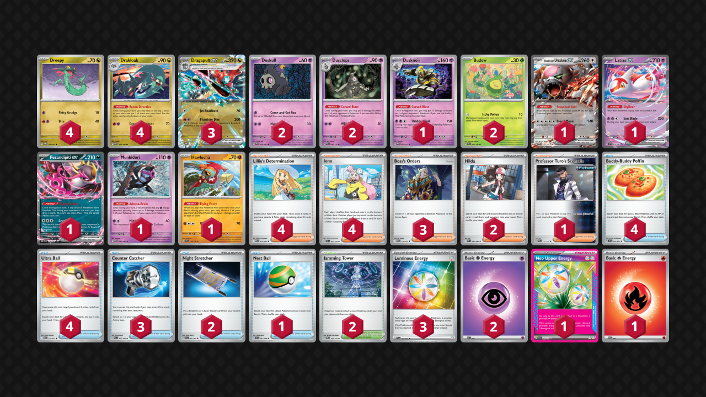
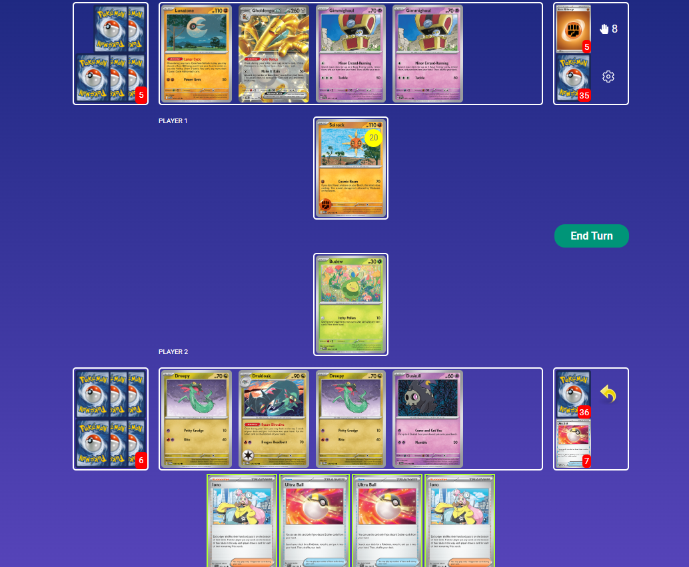
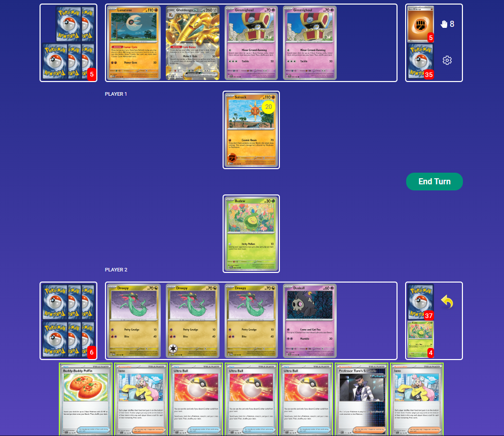
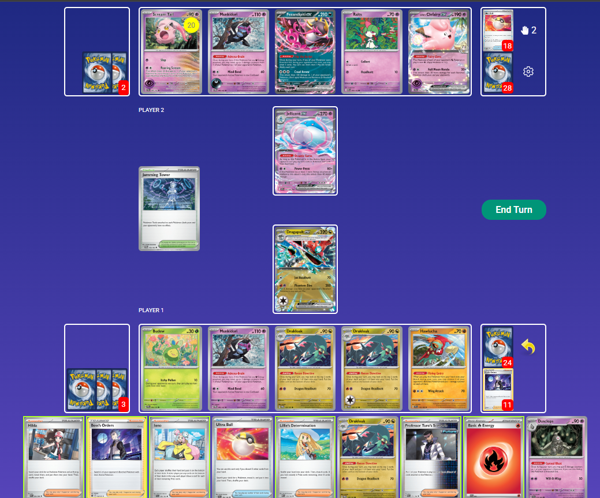

## Decklist

- This is just the standard Dragapult list because it is too good and nothing is cuttable.
- The only cuttable card in the list is Munkidori. It is strong against Grimmsnarl, but that matchup is bad either way. It is mostly relevant for the mirror match, which may be enough of a reason to keep it around. Could possibly cut Munkidori for Stretcher or a consistency card.
- I initially thought it would be ok to cut Jamming Tower, but that is no longer the case. Jamming Tower is too useful in too many matchups.
- I don't think there is any merit in swapping any Lillie's for Research
- I don't think there is any merit in swapping any Hilda for Dawn, but there is definitely an argument to play Brock's Scouting instead

**To try:** Brock's Scouting

## Gameplay

- The sequencing with this deck depends on what you're trying to do. When reaching for combos, maximize the number of cards seen by starting with draw Supporter, then Fezandipiti, and Recon Directives last. If you need more Pokemon than search cards you have, draw first. If not, search first. If you need to evolve into Dragapult before playing a draw Supporter, use the evolving Drakloak's Recon first, then evolve, then go into the above sequence.
- Plan out your turn before you start playing cards. If you're going to use Dusclops/Dusknoir, you usually want to pop it before playing Iono to give your opponent one less card. However, if you're taking a prize card off it, consider how badly you want the extra card yourself (such as if you're reaching for something specific off Iono).
- This deck relies on making efficient use of damage. Carefully consider your opponent's board and plan out how you'll take six prizes against it. Usually you can do so with two Phantom Dives plus the extra damaging Abilities. Do not mindlessly attack. Since this deck's attacks are so committal, each attack should meaningfully contribute to the prize map you have set out for yourself.
- If your opponent's deck is capable of one-shotting Dragapult, you want to set up to be able to chain Phantom Dives. Attacking before you are ready with this setup can screw you over. The exception is if you can win with Ursaluna.
- With two Night Stretcher, be very careful about what you discard off Ultra Ball. If you play three Night Stretcher, you can more aggressively discard a toolbox of Pokemon for easy Night Stretcher access.
- Splitting Psychic and Luminous on two different Drakloak isn't always correct, especially if you have access to Neo Upper or if the chance of a Boss-KO is low.
- Dreepy and Budew are much higher priority in the early-game than Duskull. I usually prioritize third Dreepy over first Duskull.
- Drakloak is a viable attacker! Don't forget about it! Of course it is situational.

## Matchups

### Gholdengo - Slightly Unfavorable

- In the mid- to late-game, try to have a board of stuff that Solrock can't easily kill. Don't put down Duskull/Dreepy/Hawlucha unnecessarily. That said, Hawlucha is very good and often gets used at some point.
- In general, looking to start chaining Phantom Dive as soon as possible. Look for a wombo turn of Counter Catcher + Iono + Jamming Tower. These cards all all premium resources that you want to keep around.
- Neo Upper is also a premium resource because they can easily one-shot Dragapult.
- If you can pop their 50 HP Gimmighoul with Dusclops, that's usually good to go for. However, Dusclops/Dusknoir aren't necessarily used in every game.
- If they have something that isn't an attacker in the Active, slam Jamming. Otherwise, save it for the combo.
- Phantom Dive usually goes for 200 on Gholdengo and 60 on another Gholdengo/Gimmehoul. Occasionally you can go for a 0-4-2 prize map, taking four on two Gholdengo with two Phantom Dives and then two on Genesect with Ursaluna. This line requires no Dusknoir or Hawlucha, and of course is situational.

### Gardevoir / Jellicent - Slightly Favorable (against the build with 2-1-2 Gardevoir and no TM EVO), Very Unfavorable (against the TM: Evo build with 3-2-2 Gardevoir)

- Ralts is usually the biggest threat. Your biggest priority is to prevent Gardevoir from coming into play. Even scary Pokemon like Jellicent or Clefairy with Energy are nothing compared to Gardevoir. Save resources like Dusclops, Hawlucha, and Jamming Tower for when you need to wipe out Ralts and Kirlia.
- If they are playing TM: Evo, Jamming Tower can be used preemptively. Otherwise, save it to bump their Stadium when they put one in play.
- If they have Munkidori with an Energy, respect the Mind Bend on Dragapult. I often choose to wipe out double Ralts plus their Munkidori with the first Phantom Dive.
- Your own Munkidori is very helpful in this matchup
- Try to play around Mew ex Phantom Dive if they have it available. This can be done by limiting the targets in play or attacking with something besides Dragapult.
- If they attack into Dragapult for some damage, be aware of a possible Devo follow up and play around it if possible. This can be done by preemptively evolving into a second Dragapult or having some other follow up plan.
- Clefairy is generally more threatening in the early-game (and therefore a higher priority to KO), because in the late-game, it can easily be return-KO'd by Ursaluna
- Ursaluna is a lot more useful in this matchup than you might expect. They often have to put two-prize Pokemon in play and they can sometimes one-shot Dragapult, so Ursaluna can often close out the game. Sometimes you'll have to plan your prize map so that you can use Counter Catcher at the end of the game!

### Charizard / Secret Box - Favorable

- Keeping opponent's Duskull out of play is a high priority. It can be a big threat.
- Dusknoir is important. Unless you're fully boardwiping them with Dusclops, try to get it evolved into Dusknoir for maximum value.
- Dusclops is sometimes good for KO Pidgeot via Phantom Dive snipe + Dusclops + 200 over two turns.
- Ursaluna can be good if they don't have a backup Charizard/Charmeleon, otherwise it is a liability
- Don't forget that Charizard can one-shot with Defiance Band if you're at 2, or if they're playing Maximum Belt when you're on 3, so try to play around that and Briar.
- Slam Jamming Tower whenever you see it. It is extremely strong on Turn 1/2.
- Even though Latias is a big liability, getting a fast Budew is worth putting it down for if you have to.

### Charizard / Noctowl - Very Favorable

- Denying Charmander is good but not always necessary, especially if they have another attacking threat online such as Terapagos or Pidgeot.
- If they have Charizard set up, you can usually just ignore it and take six prizes elsewhere.
- Basic two-prize Pokemon are significant liabilities, so be careful about using them. We want to limit them to one prize per turn, and abuse the fact that they cannot KO Dragapult.
- KO any Duskull on sight every single time.
- Using Phantom Dive into Terapagos or Fezandipiti is extremely strong.
- Dusknoir is not as important as you might think but still occasionally useful. Going for double Duskull early is usually not worth prioritizing.
- Hawlucha is usually more important than Dusknoir!
- Watch out for Blustery Wind to remove benched damaged Pokemon and try to play around it. Usually you'll just keep Pidgey off the board to begin with.
- It is fairly easy to play around Briar so just don't forget about it!

### Absol - Favorable

- Jamming Tower is a premium resource. You can use it early to stop the Turbo Energize, but if you miss that window, save it for Charm later.
- Budew is extremely strong before they get Trolley/Nest Balls, and not very important if they already got the Trolley/Nest Balls.
- Need to be aggressive before they get the god board. First Phantom Dive needs to either be into Absol or a single-prizer. There's no real point in spending Boss on an Absol with less than two Energy.
- If you use your first Phantom Dive into Absol, you need to have an immediate second Phantom Dive lined up, as you are accepting a Terminal Period to the face.
- Otherwise, your first Phantom Dive can be into a single-prize target like Munkidori or Psyduck. If you spread out the damage (or put it onto Mist), you can avoid a retaliatory Terminal Period.
- If they Penny the Absol after you punch it, keep the pressure on. Iono plus Phantom Dive is a decent follow up.
- Having a Duskull on board is fine if there's any chance you are going to KO Psyduck (such as if it does not have Mist). Otherwise, it can be a liability. Do NOT evolve into Dusclops if you're not immediately using it, as it will get stuck.
- Be careful about benching liabilities like Fez, Munkidori, and Hawlucha because they can get Yveltal trap. This is especially dangerous if they have a lot of damage on the board because they can heal it all off. Benching these Pokemon is sometimes ok if a) you can get value from them, b) they don't have a bench space for Yveltal and / or c) you have Turo in hand. Keeping Turo around for this option is very good.
- If Psyduck does not have Mist, try to snipe it off. Snipe damage is usually best on Absol, but can also be utilized on Latias, Kang, or Psyduck.

### Grimmsnarl - Unfavorable

- Munkidori is very important
- Duskull is a high priority. Usually want Dusclops when using the first Phantom Dive. Going for double Duskull early is good in this matchup.
- Play around their Devo by preemptively evolving to a second Dragapult when your first Dragapult takes a hit. Preemptively evolving can be good in general because it stops the guy from taking Froslass damage. Can sometimes stagger Drakloak for this reason as well.
- Latias, Fez, and Ursaluna are big liabilities because it lets them potentially win with Ursaluna, so only put them down if you have to. OR play around Ursaluna by prize mapping to not go to 2 or 1. Try to also avoid activating their Counter Catcher.
- Try to keep them from getting second Grimmsnarl in play.
- Jamming Tower is a premium card in this matchup. Can be used proactively to stop TM/Balloon, and/or reactively to bump their Stadium.
- KO'ing both of their Munkidori + using Iono can be a very strong play that limits their options. I usually prioritize KO'ing Munkidori over Froslass. Of course, Snorunt can be easily KO'd before it evolves which is sometimes more convenient.

### Dragapult Mirror - Even

- Munkidori is very strong. Try not to boardlock yourself out of it so that you can utilize it whenever you find it.
- Try to get one Duskull out and evolved early. Dusknoir is very good in this matchup, but there's no real point in putting Duskull down once they start using Phantom Dive because it will get spawn trapped.
- Dusknoir is best used to either one-shot their attacking Dragapult with Phantom Dive or prevent them from getting to an attacking Dragapult in the first place (sometimes as Dusclops)
- KO their Duskull on sight before they can evolve whenever possible
- If they have Munkidori with Luminous, be very careful and consider their available options next turn. Sometimes KO'ing the Munkidori is best.

## Personal thoughts

Dragapult performs alright into the field. However, it is very bad against Jelly Garde with TM:Evo. However, a lot of people are currently on the 2-1-2 Garde list with no Evo (which is favorable for Dragapult), but the Evo build did get first and second at LAIC, so it could still be risky to take a loss to. The Gholdengo matchup also leaves a lot to be desired (even though it isn't terrible), and with how insanely popular Gholdengo is, that is another thing going against Dragapult. The best thing about Dragapult is that it is basically the only deck that owns Charizard. Dragapult also has some consistency issues, but it can still win those games when it draws bad. I probably wouldn't play Dragapult myself, but it's not bad.
