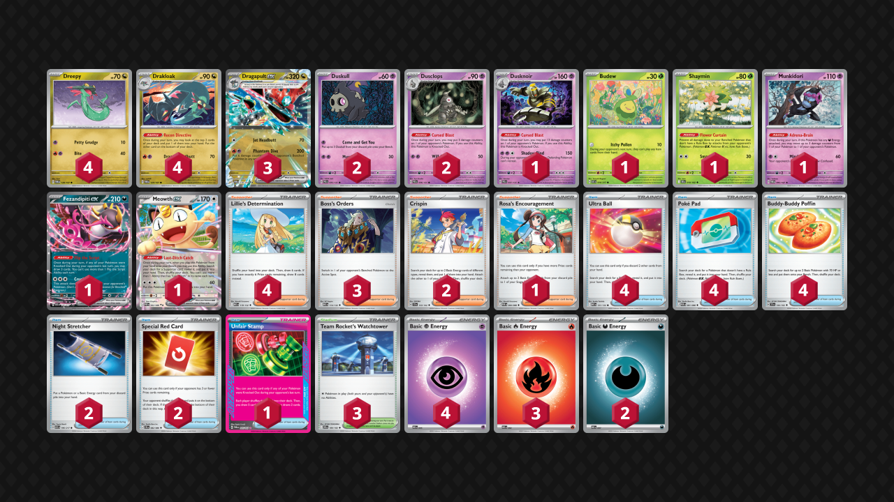

<!-- PUBLIC -->
## Decklist


```decklist
Pokémon: 21
4 Dreepy TWM 128
4 Drakloak TWM 129
3 Dragapult ex TWM 130
2 Duskull PRE 35
2 Dusclops PRE 36
1 Dusknoir PRE 37
1 Budew ASC 16
1 Shaymin DRI 10
1 Munkidori TWM 95
1 Fezandipiti ex ASC 142
1 Meowth ex POR 62

Trainer: 30
4 Lillie's Determination MEG 119
3 Boss's Orders MEG 114
2 Crispin SCR 133
1 Rosa's Encouragement POR 84
4 Ultra Ball MEG 131
4 Poké Pad POR 81
4 Buddy-Buddy Poffin TEF 144
2 Night Stretcher ASC 196
2 Special Red Card CRI 82
1 Unfair Stamp TWM 165
3 Team Rocket's Watchtower DRI 180

Energy: 9
4 Psychic Energy MEE 5
3 Fire Energy MEE 2
2 Darkness Energy MEE 7
```
### Inclusions

- Shaymin is mostly to help against fast snipers such as Fez and Wellspring, since this deck has no other response such as Moltres, Candy, or Hammer. It's also great against Slowking.
- Meowth is often needed to play the game and is amazing for consistency. It might look awkward with three Watchtower, but in reality, the two cards rarely end up clashing with each other.
- Rosa’s Encouragement is oftentimes just what you need on a specific turn, especially in the late-game. I don’t end up using it for attacking with Dusknoir very often, but that is a viable option, especially against decks like Lucario. It’s mostly still used on Dragapult though.
- I added a second Special Red Card because I often found myself needing it, and one wasn’t enough. This is the best deck to utilize Red Card, as it needs to make comebacks and disrupt the opponent. Red Card also has nice synergies with Dusknoir and Watchtower.
- I think Unfair Stamp is still the best Ace Spec because the card is completely broken and you don’t really need another Ace Spec.
- Watchtower is very good in the current meta, especially against decks like Raging Bolt or anything with Dudunsparce. It goes well with all of the disruption in this deck and solves lots of problems. I tried with two Watchtower and it was not enough because it’s hard to find at the right time, so I added a third one.

### Possible Inclusions

- Second Budew is ok but wasn’t doing much for me in testing so I think it’s fine to not have it.
- Dawn is a fine consistency card, but just like many of the other cards in this section, it wasn’t impressing me in testing so I ended up cutting it.
- Risky Ruins is still a pretty good card, and it makes Dragapult overall stronger. However, the absence of Watchtower opens up some concerning vulnerabilities and makes the hand disruption less effective.
- Crushing Hammer is a very good card and works well alongside the other disruption. However it is awkward to fit them in, and playing three instead of four isn’t very consistent. When I tested with them, they weren’t helping as much as I’d hoped, and the matchup against the Hammer build is still tough with or without them.

### Exclusions

- Moltres wasn’t doing anything against Raging Bolt, and Dusknoir helps enough against Hydrapple.
- Rare Candy isn’t necessary although it isn’t bad either.
- Jamming Tower is just bad in the current meta, by far the worst of the main Stadium options.
<!-- /PUBLIC -->
## Gameplay Tips

- Dusclops / Dusknoir should be used for a very powerful play that accomplishes something specific. Don’t pop them just because you can. If you don’t have a power play available, saving Cursed Blast is generally fine. There aren’t a lot of ways to for opponents to punish a Dusclops or Dusknoir sitting there, waiting for the right moment.
- The exception is against Psyduck. Against decks with Psyduck, you have to be very careful about evolving into Dusclops, since it can get trapped. Only evolve into Dusclops/Dusknoir if you’re sure they won’t be able to trap it, such as if you’re KO’ing Psyduck, or if you’re able to instantly use the Ability with Psyduck not currently in play. KO’ing Psyduck is sometimes a priority and sometimes not, depending on how badly you need access to Dusknoir’s Ability.
- Most of the time you’ll prioritize getting three Dreepy before the first Duskull in the early-game. The second Duskull is even less of a priority, but exceptions to all of these generalizations exist.
- Slamming Watchtower on Turn 1 is usually fine as it can make the opponent brick a decent percent of the time. You might want to save it against decks that don’t play Meowth or Kang, especially Alakazam.

For Dragapult in general:

- Go first.
- The sequencing with this deck depends on what you’re trying to do. When reaching for combos, maximize the number of cards seen by starting with Lillie/Stamp, then Fezandipiti, and Recon Directives last. If you need more Pokemon than search cards you have, draw first. If not, search first. If you need to evolve into Dragapult before playing a shuffle-draw (like Lillie or Stamp), use the evolving Drakloak’s Recon first, then evolve, then go into the above sequence.
- Plan out your turn before you start playing cards. What are you trying to get done this turn? Most importantly, what Supporter to you want to play? If you’re using Crispin, best to start with that.
- Putting extra Energy on the bottom with Recon Directive is generally good for Crispin.
- You may want to attach Energy to Drakloak on autopilot. However, there are some situations where you know your opponent is going to snipe your Drakloak with Energy. If that’s the case, don’t attach the Energy or attach it somewhere else instead.
- Consider your prize map based on your opponent’s board. This can influence whether you need to use something to set up damage in advance.
- Drakloak is a viable attacker! Don’t forget about it!
- If you start with Fezandipiti and Crispin, a fast Cruel Arrow can be good in some matchups such as mirrors.
- Don’t mindlessly slam the Unfair Stamp as soon as you can. Depending on what you’re going to be able to do, or what the opponent’s board state looks like, sometimes it is tactically better to delay the Stamp by one turn. A good example is if you’re activating their Fez now, but can KO it next turn. If the opponent’s board is not developed, it may be better to slam it now even if you can’t attack because they might brick! Is the Stamp stopping them from doing something specific? If not, maybe hold it. This is slightly less true with two Red Card in the list but it can still apply sometimes.

## Matchups

### Dragapult Mirror - Unfavorable

Of course, the mirror against Dusknoir is about even, but against other builds such as Blaziken or straight Hammers, it’s unfavorable or slightly unfavorable.

- Try to establish Munkidori with Dark Energy. It is very strong in the mirror.
- Prioritize getting a Duskull early, even over third or sometimes second Dreepy. Dusclops can be good for various reasons, such as clearing off two Drakloak with one Phantom Dive, or Dusknoir enabling a one-shot on their Dragapult. You want to get a Duskull down quickly so that it can evolve before they can spawn trap it.
- Budew is particularly good early-game if the aren’t threatening an immediate KO on it. Retreating into it can be risky because if they do KO it you’re at a big tempo loss and behind on Energy attachments, so it just depends on the situation. Of course, naturally starting with Budew is ideal, which is one reason why playing two could be viable.
- Go first and try to get the first Phantom Dive.
- On Turn 1, use Items preemptively to play around Budew. PokePad for Drakloak, Ultra Ball for Meowth, whatever is best in the situation. Just don’t let those Items get locked if you have the chance to play them. If you need Meowth, using it preemptively can also be good since a lot of lists play Watchtower now. This could also let you play your own Watchtower on the same turn to potentially brick them.

```youtube
id: AiNuvyA0Yrw
title: Hammers v Noir 1
```

```youtube
id: aUJFp8ykZHE
title: Hammers v Noir 2
```

### Raging Bolt - Unfavorable

- The best times to play Watchtower are at the very start of the game, when they have a low hand, or when you can pair it with hand disruption. In other words, don’t slam Watchtower when they have a big hand or you think they can easily bump it.
- Dusknoir is very good in this matchup, primarily if they have Meowth in play. If you Cursed Blast a Meowth, you can win with just two Phantom Dive attacks. If you’re able to line this up, you can go behind quite a few prize cards in order to set up this play. You do have to be careful about Chien-Pao clearing off liabilities. Don’t leave damage in play if you can avoid it, and if you do, and spam hand disruption to minimize the risk of Chien-Pao. Random Budew damage can also be relevant, and lots of times you’ll need an additional attack anyway, so don’t tunnel too hard on one particular line.
- Shaymin is very good to protect from Fez or Wellspring, but if you’re Item locking them and they don’t have a threat established, you don’t necessarily need it right away.

```youtube
id: xtyhdTqg5eI
title: Pultnoir v Bolt 1
```
These games were before I added Shaymin.

```youtube
id: NolNmY62jDY
title: Pultnoir v Bolt 2
```

### Alakazam - Favorable

- Save Stadiums to bump their Stadiums. If you can’t get immediate value by removing their Stadium, it can be viable to save a Stadium to combo it with hand disruption.
- This is one matchup where you want to pop Dusclops immediately because it will be hard to get value from them once Psyduck hits the board.
- Don’t delay Dusclops/Dusknoir pops because if they get Psyduck with Boss and Elgyem on the Clops/Noir, the game is over. Even just Psyduck Boss can be troublesome.
- Against the disruption build of Alakazam, getting ahead on Energy attachments is even more important, so retreating into Budew has less value. Prioritizing Itchy Pollen is good if you have Unfair Stamp in hand, as you can let it get KO’d and then body them with Stamp. Of course, Itchy Pollen is always a net positive if they can’t threaten an immediate KO on it, but usually they can easily KO it with Kadabra.
- If they ever attack with Elgyem, KO it immediately.

```youtube
id: VL0a9wzxKwI
title: Pultnoir v Zam 1
```

```youtube
id: KKp9jEXXOdI
title: Pultnoir v Zam 2
```

### Hydrapple - Favorable

- Dusknoir is important in this matchup. Random spread damage can be good on two-prize Pokemon such as Ogerpon and Meowth. Dusknoir can be used to KO those Pokemon or to one-shot Hydrapple, depending on the situation.
- Itchy Pollen in the early-game is extremely strong. The Item-lock and damage are both relevant.
- If you’re in a bad spot, you can always go for KO on Meganium plus hand disruption. They might not be able to reestablish Meganium, which makes it hard for them to one-shot Dragapult. Prioritizing KO’ing Meganium isn’t the go-to plan because it only gives up one prize, and you’re in big trouble if they get it back immediately or have a second one. However, it works well as a backup plan if things aren’t going smoothly.
- Stay aware of Hydrapple’s healing Ability. Because of this, sometimes it’s better to overdamage Pokemon with Phantom Dive’s snipe.

```youtube
id: SfQtd8mZFbE
title: Pultnoir v Hydrap 1
```

### Slowking - Slightly Unfavorable

- Dusknoir is usually very good if you can set it up, but it doesn’t get used in every game. It’s possible to win with Dusknoir and two Phantom Dives, depending on their board configuration. All random damage can potentially make a difference.
- Try to play around Trifrost especially in the mid- and late-game. Usually you have to go for basics early and just hope they don’t get it.
- Budew and Hammer (if you play it) are extremely effective at delaying Trifrost, as well as enabling a recovery if you do get hit by a fast Trifrost.
- Watchtower + hand disruption is a very strong combo that will likely make them brick. If they have Fez in play and you’re using Phantom Dive, try not to take a KO unless it’s necessary or severely cripples them. Setting up the board with multiple KO’s at once is one of the main ways to win.

```youtube
id: FEuncXxevBc
title: King v Pultnoir 1
```

```youtube
id: DuCHkNj08Rw
title: King v Pultnoir 2
```

### Crustle - Slightly Favorable

- Dusknoir pieces, Night Stretchers, and Energy are the most premium resources.
- If you can KO Dwebble before they evolve, do that. Otherwise, use Drakloak or Munkidori to pressure Crustle before they have enough Energy in play. Mind Bend is very good if they don’t have Mist Energy yet.
- Slam Watchtower instantly every time.
- Eventually will want to KO Psyduck and Kang, but not necessarily a priority. Just make sure Dusclops/Dusknoir doesn’t get stuck.
- Sometimes you’ll use Dusknoir to attack and sometimes you won’t. If you have two Dusclops, evolve the one without Energy to blow up and then use Stretcher to make an attacking Dusknoir with the second one. In some scenarios, you’ll want to blow up both Dusknoir and attack with Drakloak/Munkidori.
- Using Dragapult to apply fast pressure is allowed, but whether or not you want to depends on the situation (sometimes using Drakloak/Munki to swing into their Crustle with Energy is better). Going fast is actually more important than it might seem.

```youtube
id: B9PD3eYk2jo
title: Pultnoir v Crustle 1
```

```youtube
id: fCWrj9O2oiw
title: Pultnoir v Crustle 2
```

### Mewtwo - Even

- Your win condition is to make them whiff. Item-lock is the highest priority. Feeding Budew to Tarountula feels bad, but you need to keep them Item-locked until you start attacking.
- Slamming Unfair Stamp whenever you can is generally good. Sometimes you might save it for when you start attacking.
- Dusknoir is very good because it opens various plays. Sniping Clefairy is probably best, but you can also one-shot Mewtwo or remove Articuno to open up snipe KO’s on the likes of Mimikyu.
- It is usually best to target their Psychic attacker that has Energy, especially since you have to two-shot Mewtwo regardless. If you go after Clefairy and leave a loaded attacker, it’s not hard for them to simply Stretcher the Clefairy back.
- If their only loaded attacker is Mimikyu, a good way to play around it is to not have Dragapult on the board and just attack with something else.
- Watchtower is best used reactively to bump their Stadium. This improves the chance of them bricking/whiffing. If you play Watchtower preemptively, it does nothing and they can easily bump it.

### Lucario - Even

- 20 snipes on Riolu, Lucario, and Makuhita is generally good.
- Mind Bend is often good against Lucario, but less so if they just used Mega Brave last turn. Smacking them with Phantom Dive is also fine.
- Early Budew is very useful in this matchup to slow down their setup.
- Play around late-game Solrock by not benching Pokemon in KO range. If they don’t get a second Lucario, we don’t want to let them close out the game with Solrock.
- Try to play without Fez and Meowth. Oftentimes you have to put one down in order to play the game, which is fine, but avoid it if you can.

```youtube
id: ES4sVc3cpL0
title: Pultnoir v Lucario 1
```

```youtube
id: tX125zkIRpw
title: Pultnoir v Lucario 2
```

### Festival Lead - Favorable

- Set up Dusknoir as soon as possible and use it to blow up Rabsca. Dusclops on Rellor also works. If you can’t, at least KO Rabsca normally. Then you can use Dusclops/Noir to wipe out all of the Dipplin/Applin, which is game over.
- Getting Munkidori in play to use as a sponge is very good. It can be used as a sacrifice or as a promote after they use their first attack to get a KO. Later in the game, it will also be relevant for Adrenabrain.
- Hand disruption is very broken. Use it when you get to start attacking with Dragapult, or with Boss to slow them down. If you Boss up Thwackey and reset their hand, they are unlikely to get out of it and you can buy time that way.

### Lopunny - Favorable

- Try to be aggressive and set up a Dusknoir. Even if you can’t get the one-shot play, you still want to attack and apply pressure. Smacking into their Lopunny is still fine. They can’t Wally and Boss Duskull/Clops at the same time.
- Use Dusknoir to one-shot their Lopunny. If you can get three single-prize KO’s, that is ideal, but you an also potentially set up a second Dusknoir to KO their next Lopunny.
- If they have Psyduck, KO it as soon as you can, as you’ll eventually want to use Dusknoir.
- Watchtower, Boss, and hand disruption cards are all very useful resources in this matchup. Watchtower is generally fine to just slam whenever you have it, unless they have a big hand that you can’t disrupt.

### Garchomp - Unfavorable

- Try not to let them get any easy KO’s with Gible or Gabite within the first two turns.
- Set up Dusknoir. Ideally two, and use them as the situation demands.
- Keeping Roserade off the board is typically a good strategy since it makes it harder for them to one-shot Dragapult. Hand disruption can also be very useful against them.
- If they smack Dragapult for less than a KO, try to get another Dragapult and retreat into it. This denies an easy two-shot and also provides damage for Munkidori.
- Just like Lucario, try to play without Fez or Meowth if possible.
- Feeding one Spiritomb KO is sometimes unavoidable, just try not to give them any more than that.

## Personal Thoughts

In the current meta, I think Dusknoir is the worst of the main Dragapult variants. However, it is still a Dragapult deck, which is very good. The only thing Dusknoir really does that is lacking in the straight disruption build is covering for the Crustle matchup, which isn’t that big of a deal. Being worse against mirrors is also concerning.
