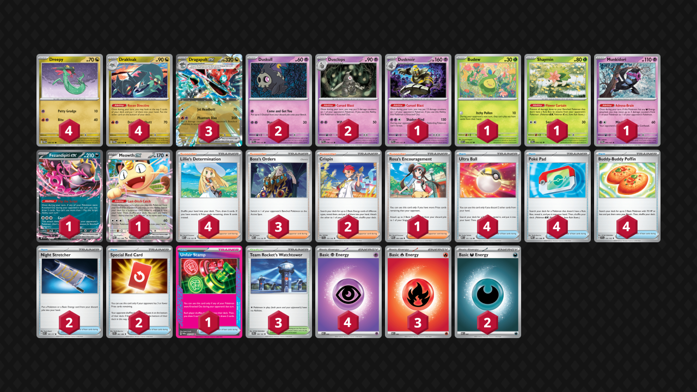
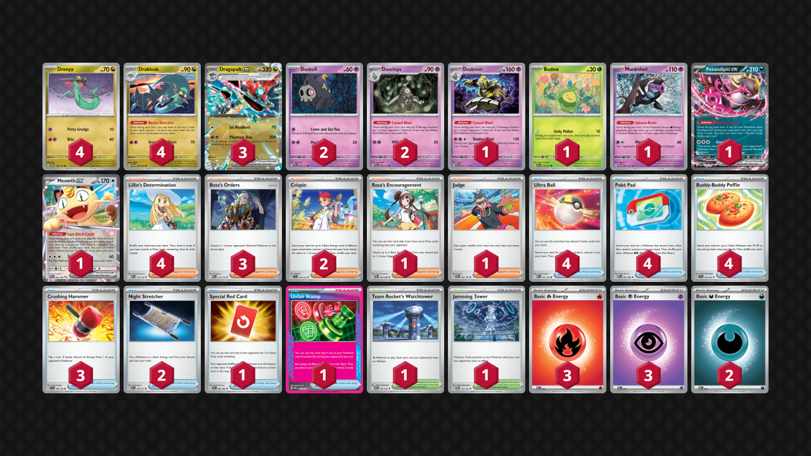
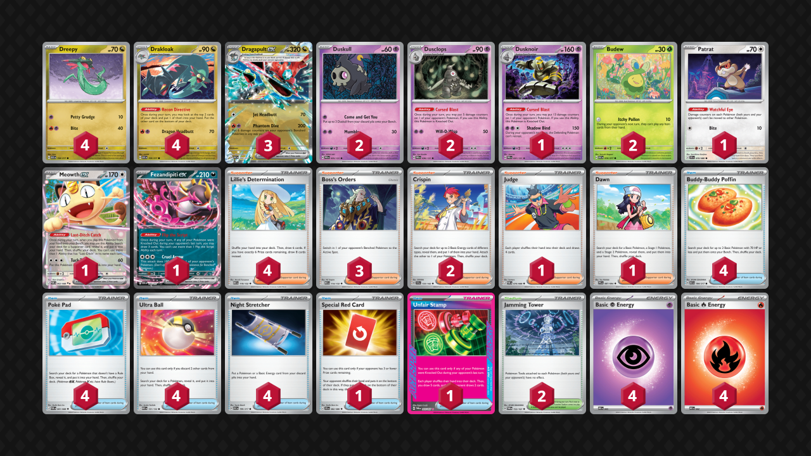

<!-- PUBLIC -->
## Decklist


```decklist
Pokémon: 21
4 Dreepy TWM 128
4 Drakloak TWM 129
3 Dragapult ex TWM 130
2 Duskull PRE 35
2 Dusclops PRE 36
1 Dusknoir PRE 37
1 Budew ASC 16
1 Shaymin DRI 10
1 Munkidori TWM 95
1 Fezandipiti ex ASC 142
1 Meowth ex POR 62

Trainer: 30
4 Lillie's Determination MEG 119
3 Boss's Orders MEG 114
2 Crispin SCR 133
1 Rosa's Encouragement POR 84
4 Ultra Ball MEG 131
4 Poké Pad POR 81
4 Buddy-Buddy Poffin TEF 144
2 Night Stretcher ASC 196
2 Special Red Card CRI 82
1 Unfair Stamp TWM 165
3 Team Rocket's Watchtower DRI 180

Energy: 9
4 Psychic Energy MEE 5
3 Fire Energy MEE 2
2 Darkness Energy MEE 7
```
### Inclusions

- Shaymin is mostly to help against fast snipers such as Fez and Wellspring, since this deck has no other response such as Moltres, Candy, or Hammer. It's also great against Slowking.
- Meowth is often needed to play the game and is amazing for consistency. It might look awkward with three Watchtower, but in reality, the two cards rarely end up clashing with each other.
- Rosa’s Encouragement is oftentimes just what you need on a specific turn, especially in the late-game. I don’t end up using it for attacking with Dusknoir very often, but that is a viable option, especially against decks like Lucario. It’s mostly still used on Dragapult though.
- I added a second Special Red Card because I often found myself needing it, and one wasn’t enough. This is the best deck to utilize Red Card, as it needs to make comebacks and disrupt the opponent. Red Card also has nice synergies with Dusknoir and Watchtower.
- I think Unfair Stamp is still the best Ace Spec because the card is completely broken and you don’t really need another Ace Spec.
- Watchtower is very good in the current meta, especially against decks with Mega Kangaskhan or Dudunsparce. It goes well with all of the disruption in this deck and solves lots of problems. I tried with two Watchtower and it was not enough because it’s hard to find at the right time, so I added a third one.

### Possible Inclusions

- Second Budew is ok but wasn’t doing much for me in testing so I think it’s fine to not have it.
- Dawn is a fine consistency card, but just like many of the other cards in this section, it wasn’t impressing me in testing so I ended up cutting it.
- Risky Ruins is still a pretty good card, and it makes Dragapult overall stronger. However, the absence of Watchtower opens up some concerning vulnerabilities and makes the hand disruption less effective.
- Crushing Hammer is a very good card and works well alongside the other disruption. However it is awkward to fit them in, and playing three instead of four isn’t very consistent. When I tested with them, they weren’t helping as much as I’d hoped, and the matchup against the Hammer build does not seem to change that much.

### Exclusions

- Moltres wasn’t doing anything against Raging Bolt, and Dusknoir helps enough against Hydrapple.
- Rare Candy isn’t necessary although it isn’t bad either.
- Jamming Tower not that good in the current meta. I think it's the worst of the main Stadium options.

## Standard List


```decklist
Pokémon: 20
4 Dreepy TWM 128
4 Drakloak TWM 129
3 Dragapult ex TWM 130
2 Duskull PRE 35
2 Dusclops PRE 36
1 Dusknoir PRE 37
1 Budew ASC 16
1 Munkidori TWM 95
1 Fezandipiti ex ASC 142
1 Meowth ex POR 62

Trainer: 32
4 Lillie's Determination MEG 119
3 Boss's Orders MEG 114
2 Crispin SCR 133
1 Rosa's Encouragement POR 84
1 Judge DRI 167
4 Ultra Ball MEG 131
4 Poké Pad POR 81
4 Buddy-Buddy Poffin TEF 144
3 Crushing Hammer SVI 168
2 Night Stretcher ASC 196
1 Special Red Card CRI 82
1 Unfair Stamp TWM 165
1 Team Rocket's Watchtower DRI 180
1 Jamming Tower TWM 153

Energy: 8
3 Fire Energy MEE 2
3 Psychic Energy MEE 5
2 Darkness Energy MEE 7
```

The normal list often includes Jamming Tower and / or Watchtower. Judge is sometimes present and sometimes not. A fourth Crushing Hammer is also common.

## Standard List 2


```decklist
Pokémon: 21
4 Dreepy ASC 158
4 Drakloak ASC 159
3 Dragapult ex ASC 160
2 Duskull PRE 35
2 Dusclops PRE 36
1 Dusknoir PRE 37
2 Budew ASC 16
1 Patrat CRI 70
1 Meowth ex POR 62
1 Fezandipiti ex ASC 142

Trainer: 31
4 Lillie's Determination MEG 119
3 Boss's Orders MEG 114
2 Crispin SCR 133
1 Judge POR 76
1 Dawn PFL 87
4 Buddy-Buddy Poffin ASC 184
4 Poké Pad POR 81
4 Ultra Ball MEG 131
4 Night Stretcher ASC 196
1 Special Red Card CRI 82
1 Unfair Stamp TWM 165
2 Jamming Tower TWM 153

Energy: 8
4 Psychic Energy MEE 5
4 Fire Energy MEE 2
```

This build has become somewhat common lately, based off Henry Chao's Top 4 Worlds list. Patrat is good against Munkidori decks such as mirror and Zoroark. As a result, neither Ruins or Watchtower makes any sense here, meaning Jamming Tower is the only real Stadium option.

<!-- /PUBLIC -->
## Gameplay Tips

- Dusclops / Dusknoir should be used for a very powerful play that accomplishes something specific. Don’t pop them just because you can. If you don’t have a power play available, saving Cursed Blast is generally fine. There aren’t a lot of ways to for opponents to punish a Dusclops or Dusknoir sitting there, waiting for the right moment.
- The exception is against Psyduck. Against decks with Psyduck, you have to be very careful about evolving into Dusclops, since it can get trapped. Only evolve into Dusclops/Dusknoir if you’re sure they won’t be able to trap it, such as if you’re KO’ing Psyduck, or if you’re able to instantly use the Ability with Psyduck not currently in play. KO’ing Psyduck is sometimes a priority and sometimes not, depending on how badly you need access to Dusknoir’s Ability.
- Most of the time you’ll prioritize getting three Dreepy before the first Duskull in the early-game. The second Duskull is even less of a priority, but exceptions to all of these generalizations exist.
- Slamming Watchtower on Turn 1 is usually fine as it can make the opponent brick a decent percent of the time. You might want to save it against decks that don’t play Meowth or Kang, especially Alakazam.

For Dragapult in general:

- Go first.
- The sequencing with this deck depends on what you’re trying to do. When reaching for combos, maximize the number of cards seen by starting with Lillie/Stamp, then Fezandipiti, and Recon Directives last. If you need more Pokemon than search cards you have, draw first. If not, search first. If you need to evolve into Dragapult before playing a shuffle-draw (like Lillie or Stamp), use the evolving Drakloak’s Recon first, then evolve, then go into the above sequence.
- Plan out your turn before you start playing cards. What are you trying to get done this turn? Most importantly, what Supporter to you want to play? If you’re using Crispin, best to start with that.
- Putting extra Energy on the bottom with Recon Directive is generally good for Crispin.
- You may want to attach Energy to Drakloak on autopilot. However, there are some situations where you know your opponent is going to snipe your Drakloak with Energy. If that’s the case, don’t attach the Energy or attach it somewhere else instead.
- Consider your prize map based on your opponent’s board. This can influence whether you need to use something to set up damage in advance.
- Drakloak is a viable attacker! Don’t forget about it!
- If you start with Fezandipiti and Crispin, a fast Cruel Arrow can be good in some matchups such as mirrors.
- Don’t mindlessly slam the Unfair Stamp as soon as you can. Depending on what you’re going to be able to do, or what the opponent’s board state looks like, sometimes it is tactically better to delay the Stamp by one turn. A good example is if you’re activating their Fez now, but can KO it next turn. If the opponent’s board is not developed, it may be better to slam it now even if you can’t attack because they might brick! Is the Stamp stopping them from doing something specific? If not, maybe hold it. This is slightly less true with two Red Card in the list but it can still apply sometimes.

## Matchups

### Dragapult Mirror - Even

- Prioritize getting a Duskull early, even over third or sometimes second Dreepy. Dusclops can be good for various reasons, such as clearing off two Drakloak with one Phantom Dive, or Dusknoir enabling a one-shot on their Dragapult. You want to get a Duskull down quickly so that it can evolve before they can spawn trap it with their Phantom Dive. Don't feed them Duskull once they already have Dragapult established, unless you have a particular reason to do so (such as creating a double threat).
- Early Dusclops to KO their Budew can be a pretty strong play, especially while you're using Itchy Pollen.
- When deciding whether to be aggressive mostly depends on which player is outscaling the other. If your setup is outscaling the opponent's, there's no reason to make yourself vulnerable to Hammers and Stamp. Set up a strong board before going in, ideally stalling them with Itchy Pollen. If your opponent is outscaling you, you have to go in as fast as possible and apply pressure (hoping they whiff something such as not finding Stamp or tails on Hammer). Against non-Hammer builds, you have more incentive to go in as long as you aren't particularly vulnerable to Stamp. There can be multiple metrics of scaling and it's not always immediately obvious, including but not limited to: number of Drakloak, Munkidori / overall Energy situation, optimal board setup (Meowth situation), and cards in hand / resources available.
- Opening aggression by KO'ing their Drakloak with Energy is ideal, especially with the Hammer build. If you have to KO Budew, best to do it with your Budew or Dusclops. If they have Munkidori established, Jet Headbutt or Dragon Headbutt is sometimes better than Phantom Dive to KO single-prizers (this doesn't apply if Patrat is in play). Since Dusclops can KO their Budew, you're more incentivized to wait around and outscale their setup while Item locking them, but sometimes it can still be better to go in.
- Munkidori is very strong. Try not to boardlock yourself out of it so that you can utilize it whenever you find it. Conversely, if they have Munkidori with Dark, consider KO’ing it to limit their options. With limited Stretchers, they might not be able to get it back. KO'ing something with Energy and Hammering the other threat is a very strong play. Sometimes Hammering the Munki is better than KO'ing it.
- Hammers are best either in the early-game when you have them Item locked, or when you can neutralize two threats at once by KO'ing one and Hammering the other. When they have a Dragapult active and Munki on bench, Hammer isn't very effective if you aren't also taking a KO.
- I still think going first is better because it opens up more options and allows you to get the first Phantom Dive, or just Itchy Pollen ten damage into their Budew first. KO'ing their Budew with your Budew is a very desirable situation, and therefore the opposite should also be avoided. Going second isn't bad, and it does feel better if you have Lillie into Items, but I'm still choosing first. Sometimes you choose not to attach Energy on Turn 1 going first in order to play around Crushing Hammer, but it's very situation-dependent.
- Fast Cruel Arrow can be good if it lines up, so sometimes it can be optimal to start with Fez. However, since this play is easily thwarted by Crushing Hammer, it shouldn't be relied on. If they are threatening a fast Fez attack, respond with Hammer, Mind Bend, or Boss.
- On Turn 1, use Items preemptively to play around Budew. PokePad for Drakloak, Ultra Ball for Meowth, whatever is best in the situation. Just don’t let those Items get locked if you have the chance to play them. If they might play Watchtower, consider using Meowth preemptively. I'd prefer not to, but it's better than dead drawing to a Watchtower. Also, you should slam Watchtower on Turn 1 because it can sometimes make the opponent brick.
- Budew is not necessarily ALWAYS needed. If you’re going second, especially if you have Stamp or Hammer heads (or if they don’t have any Energy), it is a priority on Turn 1. If you don’t have some reason to go for Budew, it’s not necessarily needed. Using an Energy to retreat into it can result in significant tempo loss, especially if Budew gets immediately KO’d or Bossed around. Even if it doesn’t, it is a liability on the board for later. They also used their Items on Turn 1 going first, so it only matters if they use Lillie and draw search Items. Budew can protect your Energy from opposing Hammers, but this is only situationally relevant. In other words, don’t mindlessly prioritize Budew, but it can be useful if you have a reason to do so.
- When they 30-30 your two Drakloak, the ideal response is to heal one with Adrenabrain and evolve the other. In general, you’ll often have to preemptively evolve a Drakloak in order to protect it. Going 30-30 on their Drakloak is generally good because it pressures them to find a lot of cards as a response, and if they evolve Drakloak, that's less draw they have to recover from hand disruption. If you think they can protect both Drakloak and you need a guaranteed snipe target, it's sometimes fine to dump damage onto their Dreepy instead.
- Since most play Judge now, try to play around that to the best of your ability (using cards for value that you would otherwise hold). There are also times where it's best to delay taking prize cards. This is especially true if they don't have Munkidori and you can spread damage. Be careful to play around cards such as Rosa's and Stamp.
- Against the Blaziken build, if they put Blaziken in play too early, you can Boss it and smack with Phantom Dive. This is particularly strong if you can Hammer their bench to stop a retreat + attack. Blaziken is somewhat of a liability on the Bench. Conversely, if they don't evolve it, you can snipe down the Torchic or Boss up Combusken. Dealing with Blaziken is somewhat of a priority for the Hammer build, and not as much with others.
- Against Patrat, it can be a convenient snipe target, but it's not a priority to Boss up since they play lots of Night Stretchers.
- Against Dusknoir, you have additional incentive to go for a fast Phantom Dive since you can snipe down Duskull before they evolve. If they don't have a threat of Dusknoir, it's fine to play a slower game and go for a better setup. Of course, if they already evolved Duskull into Dusclops, the incentive to go fast is no longer there. The opposite is true because you don't want to walk into Dusknoir + Phantom Dive on your only Dragapult.
- If you're playing Patrat, get it out as soon as possible. Many of the other principles for the mirror still apply, but make sure to adjust based on the fact that Munkidori is now a non-factor in the games. For example, 30-30 on two Drakloak is more likely to convert to a snipe KO on one of them, and you can freely leave damage around and delay KO's more often.

```youtube
id: AiNuvyA0Yrw
title: Hammers v Noir 1
```

```youtube
id: aUJFp8ykZHE
title: Hammers v Noir 2
```

### Raging Bolt - Even

- If you can use Itchy Pollen + Hammer to stop them from attacking in the early-game, that is the ideal situation. If you don't play Hammer, Itchy Pollen is more situational.
- Early-game Mind Bend is sometimes good. Having Munkidori in the active is ok since it tanks a Waterpon attack.
- Shaymin is very good to protect from Fez or Wellspring, but if you’re Item locking them and they don’t have a threat established, you don’t necessarily need it right away.
- The best times to play Watchtower are at the very start of the game, when they have a low hand, or when you can pair it with hand disruption. In other words, don’t slam Watchtower when they have a big hand or you think they can easily bump it.
- Dusknoir is very good in this matchup, primarily if they have Meowth in play. If you Cursed Blast a Meowth, you can win with just two Phantom Dive attacks. If you’re able to line this up, you can go behind quite a few prize cards in order to set up this play. You do have to be careful about Chien-Pao clearing off liabilities. Don’t leave damage in play if you can avoid it, and if you do, and spam hand disruption to minimize the risk of Chien-Pao. Random Budew damage can also be relevant, and lots of times you’ll need an additional attack anyway, so don’t tunnel too hard on one particular line.
- Reyling on a big damage setup play is questionable because they can use Chien-Pao to clear off damage. However, it can be fine if they already used Chien-Pao to bump Watchtower. Another time it can be ok is if you can make them whiff something (or if you need them to whiff something), since delaying a KO limits their draw with Kang / Fez. If you disrupt their hand, they might not be able to get Chien-Pao, so going for a damage setup can be fine. In general, it just depends on the situation (you also might be forced to KO Clefairy since it's a big threat). If they have Chien-Pao and Kang in play, you can target those two for four prizes and possibly use Moltres for an easy two. Usually you'll go for a simple 2-2-2 prize map though.
- With extra Crushing Hammers, removing random Water or Psychic Energy from the board is very good because it takes away possible Energy Switch plays.

```youtube
id: xtyhdTqg5eI
title: Pultnoir v Bolt 1
```
These games were before I added Shaymin.

```youtube
id: NolNmY62jDY
title: Pultnoir v Bolt 2
```

### Zoroark - Slightly Unfavorable

- Early Budew is often good. If they have any two prize liabilities such as Pech or Meowth, you want to target them with your first Phantom Dive before they get Tome'd away.
- Dusknoir can be good to go with your first Phantom Dive to one-shot a Zoroark. This isn't as relevant if they don't have Reshiram, but many of them do currently play Reshiram.
- Applying fast pressure is generally good because we don’t want to let them set up a massive hand and perfect board.
- Phantom Dive six almost always goes onto their backup Zoroark.
- Munkidori is very good in this matchup, as is KO’ing their Munkidori with Dark.
- In games where you want to use both Dusknoir and Budew, be careful about the opponent's prize map as they might be able to win more easily. This is one reason why Budew isn't an insta-play early. If it doesn't look too important, it may not be worth becoming a liability.

```youtube
id: aCS_bCuLyEw
title: Zoro v Pultnoir 1
```

```youtube
id: MDcEZJCONKQ
title: Zoro v Pultnoir 2
```

### Alakazam - Favorable

- Save Stadiums to bump their Stadiums. If you can’t get immediate value by removing their Stadium, it can be viable to save a Stadium to combo it with hand disruption.
- This is one matchup where you want to pop Dusclops immediately to KO any Abra or Kadabra (with Phantom Dive snipe) since we'd rather not let those Pokemon evolve. Popping Dusclops immediately is also good because some of them play Psyduck, so we want to get value before they get the Psyduck.
- Don’t delay Dusclops/Dusknoir pops because if they get Psyduck with Boss and Elgyem on the Clops/Noir, the game is over. Even just Psyduck Boss can be troublesome. Of course, if they don't play Psyduck, these points don't apply. Sometimes they play Psyduck and sometimes they don't.
- Against the Nighttime Mine build of Alakazam, getting ahead on Energy attachments is even more important, so retreating into Budew has less value. Prioritizing Itchy Pollen is good if you have Unfair Stamp in hand, as you can let it get KO’d and then body them with Stamp. Of course, Itchy Pollen is always a net positive if they can’t threaten an immediate KO on it, but usually they can easily KO it with Kadabra.
- If they ever attack with Elgyem, KO it immediately.
- Play around Eri by not grabbing important Items with early Recon Directives (namely Special Red Card) and by using Items as soon as you can get value. Now that many Alakazam decks have Eri, carefully consider the board state before deciding which Items to hang on to. Early Stamp is one that's usually fine to grab because they are more likely to use a setup Supporter instead of Eri, and you can punish them if they don't get Genesect fast enough. If you save the Stamp for later, they will just have Genesect by then. Of course, once Eri has been used, you don't need to play around it anymore. Some play two Eri, but it's fairly rare.
- Snipe damage should usually KO Abra whenever possible. Spreading 2 to multiple Kadabra is fine if possible. Otherwise, 5 to Genesect and / or 1 to Fez is generally good to set it up for another snipe.

Against the Dusknoir build:

- If you have a good start, it’s possible to win the Budew war if you play two Budew and get a fast Dusclops.
- Dusclops is generally good for getting cheap KO’s in the early-game. If you are Item-locking them, consider using Dusclops to KO Budew. Otherwise, use it to KO Abra. Later on, it’s not as useful.
- If you aren’t trying to win the Budew war with double Budew, save Budew to use as a positional piece to deny the Rare Candy Dusknoir play. This can buy you an extra turn when you need it most (such as Turn 3 or so).
- If they Dusclops / Dusknoir to KO your active, you might think that you should keep your Drakloak with Energy safe on the bench. Most of the time, it’s actually correct to push it into the active, even if all of your instincts are screaming at you not to. If they take the KO with Alakazam too early, they severely compromise their fragile board and you can punish them. If you push something else, it will just get stuck, and you give them too much time to do as they like.
- Being aggressive is good. Evolving into Dragapult (even if you can’t attack with it this turn) is sometimes good (it’s hard for them to get 16 cards plus full Dusknoir and gust combo). Putting Fez down is good. The Shadow Bind line is not real and cannot hurt you.

```youtube
id: VL0a9wzxKwI
title: Pultnoir v Zam 1
```

```youtube
id: KKp9jEXXOdI
title: Pultnoir v Zam 2
```

```youtube
id: QUVOtrELjnU
title: ZamNoir v PultNoir 1
```

```youtube
id: ubV4nAw_8KM
title: ZamNoir v PultNoir 2
```

### Slowking - Depends

With Shaymin, this matchup is trivially easy. With Hammers, it's around slightly favorable. Without either of those, the matchup is slighly unfavorable.

- Dusknoir is usually very good if you can set it up, but it doesn’t get used in every game. It’s possible to win with Dusknoir and two Phantom Dives, depending on their board configuration. All random damage can potentially make a difference.
- Try to play around Trifrost especially in the mid- and late-game. Usually you have to go for basics early and just hope they don’t get it. If you play Shaymin, just slam it.
- Budew and Hammer (if you play it) are extremely effective at delaying Trifrost, as well as enabling a recovery if you do get hit by a fast Trifrost.
- Watchtower + hand disruption is a very strong combo that will likely make them brick. If they have Fez in play and you’re using Phantom Dive, try not to take a KO unless it’s necessary or severely cripples them. Setting up the board with multiple KO’s at once is one of the main ways to win.
- Phantom Dive almost always puts six on the backup Slowpoke/King that is least likely to attack next turn. Alternatively, if you have Dusknoir lined up, you can plan around that instead.
- Judge is very good early-game or whenever they have a big hand, or when they use Cipher to set up their next turn.

```youtube
id: FEuncXxevBc
title: King v Pultnoir 1
```

```youtube
id: DuCHkNj08Rw
title: King v Pultnoir 2
```

### Excadrill - Unfavorable

- Go second.
- Itchy Pollen is good if they don’t have their Basics in play, especially Genesect, since you can lock Trolley. However, if they already have the squad, the Item lock is useless. The 20 damage onto Drilbur is very good if it lines up (now Dusknoir + Phantom Dive KO's Excadrill).
- Crushing Hammer is typically not that important. It can be useful but it’s not a resource you need to save or plan around.
- Early Mind Bend is occasionally good. Sometimes you have a random Dark Energy with nothing better to do but attach to Munkidori, and sometimes they have not much Energy in play and struggle against Mind Bend. Can also use a Munkidori as an early-game meat shield because it does not die to the mill attack.
- Dusknoir is very good, especially if you get any random damage onto Drilbur or Excadrill because it sets up a Cursed Blast + Phantom Dive KO.
- 3-2-1 prize map is the most common because they will always have Genesect in play. Sometimes you can set this up to win in two Phantom Dives thanks to Dusknoir and Dusclops.
- Crispin is even more important than normal because Dragapult gets one-shot and also to sometimes use Munkidori. Load as much Energy in play as possible as soon as the game begins so that you can always have access to the best attack for the situation.

```youtube
id: gmyPPy-tr3w
title: Drill v Pultnoir 1
```

```youtube
id: sRuPcTQZjVc
title: Drill v Pultnoir 2
```

### Festival Lead - Favorable

- Early Itchy Pollen is very good in this matchup. It helps stop Rabsca and disrupts their setup in general.
- Set up Dusknoir as soon as possible and use it to blow up Rabsca. Dusclops on Rellor also works. If you can’t, at least KO Rabsca normally. Then you can use Dusclops/Noir to wipe out all of the Dipplin/Applin, which is game over. If they have too many, wiping out the Thwackeys also works.
- Getting Munkidori in play to use as a sponge is very good. It can be used as a sacrifice or as a promote after they use their first attack to get a KO. Later in the game, it can also be relevant for Adrenabrain.
- Hand disruption is very broken. Use it when you get to start attacking with Dragapult, or with Boss to slow them down. If you Boss up Thwackey and reset their hand, they are unlikely to get out of it and you can buy time that way. This lets you set up double KO on Thwackey with Dusclops / Dusknoir which is basically game over.
- If they don't have Shaymin or Rabsca in play, Boss + Stamp / Red Card + Cruel Arrow can be a win condition.

### Crustle - Slightly Favorable

- I think going first is actually better for the heavy Watchtower build because you can slam Watchtower and get a Turn 2 attacking Drakloak. For other builds, go second and try to get Turn 1 Itchy Pollen. Otherwise, use a fast Drakloak to pressure their Crustle with Energy. Hammer can deny them Ice Cream and let you bring it down. If you aren't playing Watchtower, going second is better.
- Attacking with Drakloak as fast as possible is also good because it forces them to enable Stamp, which you slam on sight. Watchtowers are also slammed on sight. Itchy Pollen is better if you're able to do it before they get Dwebble in play because it locks Poffin.
- Dusknoir pieces, Night Stretchers, and Energy are the most premium resources.
- If you can KO Dwebble before they evolve, do that. Otherwise, use Drakloak or Munkidori to pressure Crustle before they have enough Energy in play. Mind Bend is very good if they don’t have Mist Energy yet.
- Eventually will want to KO Psyduck (if they play it) and Kang, but not necessarily a priority. Just make sure Dusclops/Dusknoir doesn’t get stuck.
- Sometimes you’ll use Dusknoir to attack and sometimes you won’t. If you have two Dusclops, evolve the one without Energy to blow up and then use Stretcher to make an attacking Dusknoir with the second one. In some scenarios, you’ll want to blow up both Dusknoir and attack with Drakloak/Munkidori. Most of the time, it's fine to use the Dusknoir for the Ability and just attack with Drakloak.
- Using Dragapult to apply fast pressure is allowed, but whether or not you want to depends on the situation (sometimes using Drakloak/Munki to swing into their Crustle with Energy is better). Going fast is actually quite good.
- Watch out for Eri and Xerosic’s! How much you want to play around them is very situation-specific, but be aware of them and play around them when it’s convenient!

```youtube
id: B9PD3eYk2jo
title: Pultnoir v Crustle 1
```

```youtube
id: fCWrj9O2oiw
title: Pultnoir v Crustle 2
```

### Hydrapple - Favorable

- Dusknoir is important in this matchup. Random spread damage can be good on two-prize Pokemon such as Ogerpon and Meowth. Dusknoir can be used to KO those Pokemon or to one-shot Hydrapple, depending on the situation. You want to eventually set up at least Dusknoir and use it to win the prize trade.
- Itchy Pollen in the early-game is extremely strong. The Item-lock and damage are both relevant.
- If you’re in a bad spot, you can always go for KO on Meganium plus hand disruption. They might not be able to reestablish Meganium, which makes it hard for them to one-shot Dragapult. Prioritizing KO’ing Meganium isn’t the go-to plan because it only gives up one prize, and you’re in big trouble if they get it back immediately or have a second one. However, it works well as a backup plan if things aren’t going smoothly.
- Stay aware of Hydrapple’s healing Ability. Because of this, sometimes it’s better to overdamage Pokemon with Phantom Dive’s snipe.
- If you ever get the chance to snipe down Applin or Chikorita before they evolve, that's very good.
- Judge can be very strong in the early-game, especially combined with Item-lock. If you're using Judge in response to a Celebi setup attack, it's ideal (but not necessarily required) to KO the Celebi that turn.

```youtube
id: SfQtd8mZFbE
title: Pultnoir v Hydrap 1
```

### Bronzong / Lopunny - Slightly Unfavorable

If you’re playing the Patrat build, it’s even more unfavorable.

- Itchy Pollen is usually bait and not worth going for, but it can be good if you have Stamp in hand since it forces them to take an early KO.
- The most important thing is to get a fast response to Bronzong. Mind Bend is easiest and it works best along with hand disruption. Fast Fez is also very strong if you’re able to get to it.
- Sometimes it isn’t clear what to snipe with Fez. If they are threatening Dusknoir + Dusclops + Evo Jammer, you need to stop that. If they have triple Duskull and only one Brozong, KO Bronzong. If they have only two Duskull lines, KO’ing one of those is probably fine. Otherwise (such as if they have a small hand or low chance of getting the combo), KO’ing Buneary can be good as well (not recommended if they have two Buneary).
- When you’re going first, getting a fast Dragon Headbutt with Drakloak is also good.
- Boss-KO a Duskull with Mind Bend or Dragon Headbutt is generally good if you don’t have anything better to do.
- With the Patrat build, prioritize getting to Fez as fast as possible (or Dragon Headbutt, if you’re going first).

### Clefairy Box - Favorable

- Budew and Munkidori are usually not good in this matchup. Shaymin is sometimes good if they’re threatening Fez / Wellspring, but not always since you want a slim board later.
- Fez and Meowth are massive liabilities. Do not put them down unless absolutely necessary.
- Play to have a slim board at the end of the game. Save a Stadium and hand disruption card for when you have only one benched Pokemon and an attacking Dragapult. Bump their Stadium and disrupt their hand. This makes it hard for them to get the KO on a Dragapult.
- If you play Crushing Hammer, it is generally best on their backup attacker to prevent them from building up too much Energy in play.
- Dusknoir is generally good. It can bypass Pearl along with Phantom Dive snipe. Dusclops can be good if you end up having to smack a Kang for 200 and then finish it with Dusclops + Phantom Dive snipe.

```youtube
id: PADRK5BOGhQ
title: Slop v Pultnoir 1
```

### Hide n Sneak - Depends on Watchtower

The heavy Watchtower build is favored against Hide n Sneak. Most lists will be closer to even.

- Early Itchy Pollen is good, but it’s usually best on Turn 2 instead. If you hard retreat into it on Turn 1, it will easily get KO’d by Dhelmise or Banette, and then you’re still not ready to attack. This gives up an extra prize and Energy. If you can Itchy Pollen on Turn 2 (particularly after they use Banette) and follow it up with Stamp Phantom Dive it can be game-winning.
- Munkidori can be a good sponge for Banette in the early-game. Otherwise Munkidori is not very useful. Occasionally you can use Mind Bend to stall a Dhelmise for time if necessary. Drakloak also works as an early-game Banette sponge if you can KO Clefairy as a response.
- Hand disruption and Watchtower are the cards that win this matchup. Try to combo them together.
- KO Clefairy on sight. Some rare exceptions exist.
- Dusknoir is typically best used on Clefairy, allowing you to Phantom Dive to KO their attacker and their Clefairy, which is very strong. Some exceptions exist, such as if you can wipe both Dhelmise and leave them without a pivot (but most have Latias now).

```youtube
id: OCWjClJUqlc
title: Sneak v Pultnoir 1
```

```youtube
id: N8Xy_vhzbnI
title: Sneak v Pultnoir 2
```

### Lucario - Even

- 20 snipes on Riolu, Lucario, and Makuhita is generally good.
- Mind Bend is often good against Lucario, but less so if they just used Mega Brave last turn. Smacking them with Phantom Dive is also fine.
- Early Budew is very useful in this matchup to slow down their setup.
- Play around late-game Solrock by not benching Pokemon in KO range. If they don’t get a second Lucario, we don’t want to let them close out the game with Solrock.
- Try to play without Fez and Meowth. Oftentimes you have to put one down in order to play the game, which is fine, but avoid it if you can.
- Dusknoir can be good if you managed to ping the Riolu for 10, as that makes Cursed Blast + Phantom Dive KO. Otherwise, Dusknoir can KO Lunatone / Solrock to make them brick off a Stamp.

```youtube
id: ES4sVc3cpL0
title: Pultnoir v Lucario 1
```

```youtube
id: tX125zkIRpw
title: Pultnoir v Lucario 2
```

### Mewtwo - Slightly Favorable

- Dusknoir is very good because it opens various plays. Sniping Clefairy is probably best, but you can also one-shot Mewtwo or remove Articuno to open up snipe KO’s on the likes of Mimikyu.
- Early-game Budew is good. Attacking Drakloak can be good at any time if it can get a KO, especially if you don’t have Dragapult on the board.
- Slamming Unfair Stamp as soon as you can is generally best.
- There are lots of times where Phantom Dive is the best attack, but there’s also lots of times where it isn’t due to the threat of Mimikyu. Only put Dragapult in play if you need to use Phantom Dive for the turn, as it can be a liability.
- If you’re going first and they open with Mimikyu or Tarountula, don’t leave Budew in the active on Turn 1 because it will just get KO’d.
- It is usually best to target their Psychic attacker that has Energy, especially since you have to two-shot Mewtwo regardless. If you go after Clefairy and leave a loaded attacker, it’s not hard for them to simply Stretcher the Clefairy back. Hammer can enable you to handle both at once. Hammers are generally very strong in this matchup, as is hand disruption.
- Assuming they have Articuno in play, any Munkidori damage should go on Spidops or Tarountula.
- Stadiums are best used reactively to bump their Stadium. This improves the chance of them bricking/whiffing. Ideally you have hand disruption too, but still worth bumping their Stadium immediately either way.

### Lopunny - Favorable

- Try to be aggressive and set up a Dusknoir. Even if you can’t get the one-shot play, you still want to attack and apply pressure. Smacking into their Lopunny is still fine. They can’t Wally and Boss Duskull/Clops at the same time.
- Use Dusknoir to one-shot their Lopunny. If you can get three single-prize KO’s, that is ideal, but you an also potentially set up a second Dusknoir to KO their next Lopunny.
- If they have Psyduck, KO it as soon as you can, as you’ll eventually want to use Dusknoir.
- Watchtower, Boss, and hand disruption cards are all very useful resources in this matchup. Watchtower is generally fine to just slam whenever you have it, unless they have a big hand that you can’t disrupt.

### Garchomp - Unfavorable

- Try not to let them get any easy KO’s with Gible or Gabite within the first two turns.
- Set up Dusknoir. Ideally two, and use them as the situation demands.
- Keeping Roserade off the board is typically a good strategy since it makes it harder for them to one-shot Dragapult. Hand disruption can also be very useful against them.
- If they smack Dragapult for less than a KO, try to get another Dragapult and retreat into it. This denies an easy two-shot and also provides damage for Munkidori.
- Just like against Lucario, try to play without Fez or Meowth if possible.
- Feeding one Spiritomb KO is sometimes unavoidable, just try not to give them any more than that.
- Hammers are very strong in this matchup if you play them. Use Hammer to stop them from one-shotting Dragapult with the second attack.

## Personal Thoughts

In the current meta, I think Dusknoir is the worst of the main Dragapult variants. However, it is still a Dragapult deck, which is very good. I think the space allocated to Dusknoir is more efficient elsewhere, but it's not bad.
