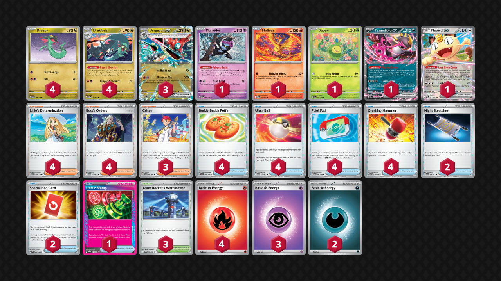

## Decklist


```decklist
Pokémon: 16
4 Dreepy TWM 128
4 Drakloak TWM 129
3 Dragapult ex TWM 130
1 Munkidori TWM 95
1 Moltres PFL 14
1 Budew PRE 4
1 Fezandipiti ex SFA 38
1 Meowth ex POR 62

Trainer: 35
4 Lillie's Determination MEG 119
4 Boss's Orders MEG 114
3 Crispin SCR 133
4 Buddy-Buddy Poffin TEF 144
4 Ultra Ball MEG 131
4 Poké Pad POR 81
4 Crushing Hammer POR 71
2 Night Stretcher ASC 196
2 Special Red Card CRI 82
1 Unfair Stamp TWM 165
3 Team Rocket's Watchtower DRI 180

Energy: 9
4 Fire Energy MEE 2
3 Psychic Energy MEE 5
2 Darkness Energy MEE 7
```
<!-- PUBLIC -->
### Inclusions

- Moltres has really grown on me and works well in the current meta. It is mostly good against Hydrapple as well as a way to respond to fast threats such as Fezandipiti or random Caped Pokemon before you have a chance to establish Dragapult. It also occasionally gets used in other matchups such as Raging Bolt and Slowking.
- Boss’s Orders is extremely important in literally every matchup. Lots of times I’m forced to discard one off Ultra Ball, but with four copies, that’s fine. Playing four lets you have it when you need it, and gives more flexibility to outmaneuver single-prize decks. Also works well in prolonged games, which is often relevant. Four Boss is definitely a good play.
- Crushing Hammer is pretty broken. One or two timely heads can be game-winning, and if you flip tails, you’re still a powerful Dragapult deck. Early heads can be particularly devastating against Slop Box/Raging Bolt and Slowking. Also gives a chance to win against Crustle or come back in the mirror.
- Special Red Card is very good in this deck. You may think that you’ll never use two in a game, but sometimes you end up doing so anyway, especially if you hit the Stamp early. This deck ends up in lots of longer games, so having two Red Card is very nice. Even if you only need one in a game, it’s very important to have at the right time and has nice synergy with all of the other disruption.
- Stamp is absurdly broken, especially with all of the other disruption and how much effort opponents have to put in to deal with a Dragapult. At best, it can instantly win games, but at least it stops opponents from hitting combos and doing what they want. I think it’s the best Ace Spec, even though you sometimes won’t have it when you want it.
- Three Watchtower is a lot, but with fewer, it wasn’t as consistent. Slamming it Turn 1 can make a lot of other decks brick such as mirror and Kangaskhan decks. Later, you’ll need it to combo with hand disruption, which has a high chance of making opponents brick. Watchtower is good in the current meta, and other Stadiums aren’t particularly needed.

### Possible Inclusions

- Chi-Yu would be a good tech to destroy Crustle. Paldean Tarous also does this, but I think Chi-Yu is better for this build.
- Rosa’s Encouragement would probably be really good. I am considering swapping a Crispin for it. Having Crispin can be relevant in the early-game, but this deck somehow runs out of Energy often, so Rosa’s can also be relevant later.
- Judge could be played over a Red Card. I think Red Card is better overall, but it’s pretty close. Xerosic’s Machinations is a similar consideration for the same reasons.

### Exclusions

- Shaymin would be considerable if the Slowking matchup wasn’t already good. Against other fast snipers, Moltres helps cover for them.
- Second Munkidori is probably fine but I never really need it.
- Yveltal is too hard to use, especially with just two Dark and one Munki.
- Risky Ruins and Dudunsparce is basically a separate version, and the deck would have to be adjusted quite a bit for them. I think the Watchtower version has a much better matchup spread, even if it’s slightly less efficient overall.
- Dawn or Brock’s Scouting would help a bit with consistency but the cards just aren’t that good.
<!-- /PUBLIC -->
## Gameplay Tips

- Go first against everything.
- The sequencing with this deck depends on what you’re trying to do. When reaching for combos, maximize the number of cards seen by starting with Lillie/Stamp (unless you want to play a different Supporter for the turn), then Fezandipiti, and Recon Directives last. If you need more Pokemon than search cards you have, draw first. If not, search first. If you need to evolve into Dragapult before playing Lillie/Stamp, use the evolving Drakloak’s Recon first, then evolve, then go into the above sequence.
- Plan out your turn before you start playing cards. What are you trying to get done this turn? Most importantly, what Supporter to you want to play? If you’re using Crispin, best to start with that.
- Putting extra Energy on the bottom with Recon Directive is generally good for Crispin.
- With two Night Stretcher, be very careful about what you discard off Ultra Ball. If you play three Night Stretcher, you can more aggressively discard a toolbox of Pokemon for easy Night Stretcher access. Lots of times I discard Dragapult with an early Ultra Ball to increase my overall number of outs to it.
- Drakloak is a viable attacker! Don’t forget about it! Of course it is situational.
- You may want to attach Energy to Drakloak on autopilot. However, there are some situations where you know your opponent is going to snipe your Drakloak with Energy. If that’s the case, don’t attach the Energy or attach it somewhere else instead.
- Fez is now a viable Turn 2 attacker. Don’t forget about that option! Munkidori can also be a decent attacker sometimes.
- Slamming Stamp is generally good now because you have Red Card for later. Stamp now has more value to be played early.
- On the other hand, sometimes it’s better to save Hammer. Defaulting to slamming Hammer isn’t too bad, since you usually do want to slam it. However, if you can make a better play later, such as Hammering the bench while KO’ing the Active to clear lots of Energy, or combo’ing all of the disruptive cards at once, it can sometimes be better to save Hammer for that.
- Prebenching Moltres if you don’t need the bench space can often be good, unless it’s a matchup where Moltres is strictly bad (such as mirror or Alakazam).
- Slamming Watchtower on Turn 1 going first can be quite good in matchups such as the mirror or Kang decks. You won’t usually get punished for it unless your hand is dead and you’re looking to topdeck Ultra Ball for Meowth (in that case, better not to play it). Only in rare scenarios do you need to worry about locking your own Meowth. If your opponent has a large hand or you think they have an immediate counter to Watchtower, you may want to save it to combo with hand disruption. If you end up with hand disruption but no Watchtower later, you’ll be sad and punished.

## Matchups

### Dragapult Mirror - Even

Slightly favorable against Dusknoir, about even against the rest. Possibly slightly unfavorable against Blaziken.

- Munkidori is very strong. Try not to boardlock yourself out of it so that you can utilize it whenever you find it. Conversely, if they have Munkidori with Dark, consider KO’ing it to limit their options. With limited Stretchers, they might not be able to get it back.
- We want to be the first one to attack with Phantom Dive. Choose to go first as there are plenty enough outs to Dreepy. Going first also opens up the option to shut them out of the game with Watchtower or Fez.
- Fast Fezandipiti Cruel Arrow is good in this matchup if it lines up with Crispin. Of course, it’s not very good if they play Shaymin. If you don’t have a likely fast Cruel Arrow, it’s generally not worth putting Fez in play early. Going for Fez is slightly less good now since everyone plays Hammer. Look for the play, but don’t rely on it.
- On Turn 1, use Items preemptively to play around Budew. PokePad for Drakloak, Ultra Ball for Meowth, whatever is best in the situation. Just don’t let those Items get locked if you have the chance to play them. Similarly, playing Meowth preemptively to play around Watchtower is often good if you have no other way to draw cards.
- Budew is sometimes good and sometimes not. If you’re going second, especially if you have Stamp or Hammer heads (or if they don’t have any Energy), it is a priority on Turn 1. If you don’t have some reason to go for Budew, it’s not necessarily needed. Using an Energy to retreat into it can result in significant tempo loss, especially if Budew gets immediately KO’d or Bossed around. Even if it doesn’t, it is a liability on the board for later. They also used their Items on Turn 1 going first, so it only matters if they use Lillie and draw search Items. Budew can protect your Energy from opposing Hammers, but this is only situationally relevant. In other words, don’t mindlessly prioritize Budew, but it can be useful if you have a reason to do so.
- When they 30-30 your two Drakloak, the ideal response is to heal one with Adrenabrain and evolve the other. In general, you’ll often have to preemptively evolve a Drakloak in order to protect it.

```youtube
id: AiNuvyA0Yrw
title: Hammers v Noir 1
```
These games I was testing with the Dudunspace version but I think that’s close enough for the purposes of the mirror. Most of the other matchups will feature the Watchtower version.

```youtube
id: aUJFp8ykZHE
title: Hammers v Noir 2
```

### Raging Bolt - Favorable

- Putting Moltres down early can be great, especially if they’re threatening a fast attack before you can get Dragapult. It can be a good response to a fast Fez, but it’s not as good if they have Waterpon with any Energy already.
- However, if you can use Itchy Pollen + Hammer to stop them from attacking in the first place, that’s even better.
- The best times to play Watchtower are at the very start of the game, when they have a low hand, or when you can pair it with hand disruption. In other words, don’t slam Watchtower when they have a big hand or you think they can easily bump it.
- Reyling on a big damage setup play is questionable because they can use Chien-Pao to clear off damage. However, it can be fine if they already used Chien-Pao to bump Watchtower. If they have Chien-Pao and Kang in play, you can target those two for four prizes and possibly use Moltres for an easy two.
- With extra Crushing Hammers, removing random Water or Psychic Energy from the board is very good because it takes away possible Energy Switch plays.

```youtube
id: tauR3pT-QbY
title: Pult v Bolt 1
```
Close game but pretty standard. The next three are some interesting games that go in ways you might not expect.

```youtube
id: dcyAmSbMJFY
title: Pult v Bolt 2
```

```youtube
id: 5mFaaXLnZEk
title: Pult v Bolt 3
```

```youtube
id: cYkI-nNI1OU
title: Pult v Bolt 4
```

### Alakazam - Favorable

This matchup is favorable or very favorable with three hand disruption cards. It should be roughly the same whether the second Red Card is a Judge or not. With fewer hand disruption cards, the matchup becomes much closer.

- Save Stadiums to bump their Stadiums. If you can’t get immediate value from a Stadium bump (such as if you can attack normally under Nighttime Mine), save the Stadium to combo it with hand disruption.
- Against the Nighttime Mine build of Alakazam, getting ahead on Energy attachments is even more important, so retreating into Budew has less value. Prioritizing Itchy Pollen is good if you have Unfair Stamp in hand, as you can let it get KO’d and then body them with Stamp. Since you assume they can get the immediate Kadabra KO in most scenarios, Budew is not a priority unless you have Stamp to go with it.
- Build up as much Energy in play against the Mine build. Even attaching Dark Energy to random Drakloak is good.
- If they ever attack with Elgyem, KO it immediately.

```youtube
id: 2pwoICz5MAs
title: Zam v Pult 1
```

```youtube
id: WqRUQWNB7HU
title: Zam v Pult 2
```
This is one of the most interesting and confusing games I’ve ever played.

### Hydrapple - Even

- Early Budew can be good to slow them down, and its damage is relevant as well. If they have Applin or any two-prize Pokemon in their Active, Moltres might be better. In general, Moltres is very good and should be slammed on the board as soon as possible.
- Hydrapple is a big threat. Usually you have to two-shot it, but if you have a good position, it may be possible to go around it multiple times and ignore it entirely.
- If you’re in a bad position, you can try to hand disrupt + KO their Meganium, and it’s unlikely they’ll get Meganium back. KO’ing their Meganium isn’t the ideal plan because it only gives up one prize (and it’s bad if they get another), but it can be a functional backup plan if things are going poorly.
- Even though they play lots of Stadiums, slamming Watchtower on Turn 1 going first can make them brick. Otherwise, save Watchtower to combo with hand disruption and/or bump their Stadium.
- Stay aware of Hydrapple’s healing Ability. Because of this, sometimes it’s better to overdamage Pokemon with Phantom Dive’s snipe by 30 more than you’d otherwise need.

### Zoroark - Slightly Unfavorable

- Moltres is generally good for smacking Zoroark. Jet Headbutt is similarly good if they don’t have easy access to Munkidori, but not great if they do.
- Sometimes it is acceptable to Phantom Dive into Zoroark knowing they can respond with Reshiram copy for a one-shot. This depends on the board and how much pressure you can apply. Sometimes the increased tempo works in your favor, but it is situational (such as if they don’t have much Energy in play and you do).
- Budew is often good in the early-game. The damage and Item lock are both relevant, but sometimes it’s better not to go for it, depending on the situation.
- Applying fast pressure is generally good because we don’t want to let them set up a massive hand and perfect board.
- Phantom Dive six almost always goes onto their backup Zoroark.
- Munkidori is very good in this matchup, as is KO’ing their Munkidori with Dark.

```youtube
id: eAgzMk0ev4Q
title:  Zoro v Pult 1
```

### Slowking - Favorable

- After a lot of games, I still find it hard to tell if it’s better to slam or save Watchtower. It’s quite likely that an early Watchtower will not trouble them much, and you really need to have Watchtower when you disrupt their hand. I lean towards saving Watchtower, but if all of the circumstances seem like you should play it (none are prized, you have an extra in hand, they started Kang and you’re going first, etc.), there could be some exceptions.
- Budew is insane against them and it’s a huge priority. It’s much harder for them to get the Kyurem play while Item locked. Similarly, Hammer is also insanely good in the early-game, and helps delay their attack. Budew is also the ideal response after they use Trifrost (if you don’t have Phantom Dive, of course).
- I usually try to make them whiff Trifrost, but occasionally, you can let them have it. If your board is something like Fez and two Dreepy, and they cannot KO three Pokemon with Trifrost, sometimes you can let them have it and respond with Budew + re-setup. This is most likely if they used Smoochum or Ciphermaniac (or if Budew is prized), and you don’t think you can realistically stop them from using Trifrost anyway. If that’s the scenario, best to minimize the damage. Again, usually it’s best to try and stop it in the first place by Item-locking them, but it’s not the end of the world if they do get it. It’s worth noting that even if they do get the Smoochum or Cipher, it’s still fairly likely they won’t have the Trifrost play ready if Item locked.
- Moltres is generally a safe Pokemon to have in play and can occasionally get a good hit on something like Clefairy. The only punish to having Moltres in play is if you end up needing to make them whiff a Clefairy KO on Dragapult, which is possible. I didn’t find that to be as common as you might expect, since you usually have two benched Pokemon anyway. Getting some value from Moltres is actually more common than getting punished for having it.
- Avoid giving them easy Trifrost lines to win the game. This is very situational based on the board. Sometimes it’s fine to bench extra Dreepy and stuff, and sometimes it’s game-losing.
- Munkidori is extremely important if they end up Trifrosting any two-prizer for less than a KO.
- Do not overly respect them. Get the three Dreepy and Item lock them if you can. They are unlikely to get what they need while Item-locked, especially if you have some additional help from Hammer or Watchtower.
- Phantom Dive almost always puts six on the backup Slowpoke/King that is least likely to attack next turn.

```youtube
id: lRVe5drKOyU
title: Pult v King 1
```
A good portion of games of this matchup are jank spaghetti-fests.

```youtube
id: wFXYpr6UAaA
title: Pult v King 2
```
This game was funny because Pult prized all of its Psychics and still nearly won.

### Crustle - Unfavorable

This matchup is basically an auto-win if you tech Chi-Yu. I think teching for it is reasonable, but not teching is also fine.

- I think going first is actually better because you can slam Watchtower and get a Turn 2 attacking Drakloak. Use a fast Drakloak to pressure their Crustle with Energy. Hammer can deny them Ice Cream and let you bring it down.
- Attacking with Drakloak as fast as possible is also good because it enables Stamp, which you slam on sight. Watchtowers are also slammed on sight.
- If you aren’t using them to deny Ice Cream for a crucial Crustle KO, save Hammers to remove Mist Energy, so that you can use Mind Bend to respond to a loaded Crustle. Similarly, use Boss to Mind Bend a loaded Crustle before it gets Mist Energy, if possible!
- If they put Spiky Energy in play but aren’t able to attack, you can use various attackers (particularly Budew) to generate damage for Adrenabrain.
- Dragapult is only used when you need to KO their Kang, which isn’t much of a priority unless they start attacking with it or threatening to do so.
- All Energy and Stretchers are premium resources, as are Bosses.
- Watch out for Eri and Xerosic’s! How much you want to play around them is very situation-specific, but be aware of them and play around them when it’s convenient!

```youtube
id: WXh9piB2o4Q
title: Pult v Crustle 1
```

```youtube
id: hvIAKTD9SGA
title: Pult v Crustle 2
```

### Mewtwo - Slightly Favorable

- Early-game Budew is good. Attacking Drakloak can be good at any time if it can get a KO, especially if you don’t have Dragapult on the board.
- Moltres is exceptionally good into their Mewtwo.
- Slamming Unfair Stamp as soon as you can is generally best.
- There are lots of times where Phantom Dive is the best attack, but there’s also lots of times where it isn’t due to the threat of Mimikyu. Only put Dragapult in play if you need to use Phantom Dive for the turn, as it can be a liability.
- If you’re going first and they open with Mimikyu or Tarountula, don’t leave Budew in the active on Turn 1 because it will just get KO’d.
- It is usually best to target their Psychic attacker that has Energy, especially since you have to two-shot Mewtwo regardless. If you go after Clefairy and leave a loaded attacker, it’s not hard for them to simply Stretcher the Clefairy back. Hammer can enable you to handle both at once. Hammers are generally very strong in this matchup, as is hand disruption.
- Assuming they have Articuno in play, any Munkidori damage should go on Spidops or Tarountula.
- Watchtower is best used reactively to bump their Stadium. This improves the chance of them bricking/whiffing. Ideally you have hand disruption too, but still worth bumping their Stadium immediately either way.

### Slop Box - Slightly Favorable

- At the end of the game, you would like to only have one benched Pokemon so that Clefairy cannot KO Dragapult without the Area Zero. This is makes it difficult for them to get the KO after disrupting them. This means you need to be careful about putting Pokemon down. Don't put down extra stuff like Munkidori or Moltres if you don't need to. Hoard the disruption combo for when you have slim board.
- Fez and Meowth are huge liabilities so don't put them into play unless absolutely necessary.
- Use Hammer if it has a reasonable chance of stopping an attack. Otherwise, save for a disruptive combo. Double Hammer on their Clefairy plus Boss Phantom Dive on Fez (along with hand disruption and Watchtower) is the ideal play as they have to get lucky in order to respond.
- It’s unlikely to win a trade, so we have to rely on hand disruption plus Watchtower. These cards are premium resources.
- Moltres is a good response if they’re threatening a fast Fez attack. It can also be very good if you can get the smack on their Kang. This lets Phantom Dive KO and prize trade ignoring Lillie’s Pearl. If you aren’t getting value from Moltres, don’t put it down for no reason so we can have a slim board in the late-game.
- They have plenty of outs to Watchtower, so save one or two for a combo with hand disruption.

```youtube
id: zvBAEEaoVNA
title: Slop v Pult 1
```

```youtube
id: sa8Ah2uxEz4
title: Slop v Pult 2
```

### Hide n Sneak - Favorable

This build is favored against Sneak because of heavy hand disruption and Watchtower. Most lists will be closer to even or unfavorable depending on Watchtower count. Risky Ruins is also useful in this matchup but it’s not as strong as Watchtower.

- Early Itchy Pollen is good, but it’s usually best on Turn 2 instead. If you hard retreat into it on Turn 1, it will easily get KO’d by Dhelmise or Banette, and then you’re still not ready to attack. This gives up an extra prize and Energy. If you can Itchy Pollen on Turn 2 (particularly after they use Banette) and follow it up with Stamp Phantom Dive it can be game-winning.
- Munkidori can be a good sponge for Banette in the early-game. Otherwise Munkidori is not very useful. Occasionally you can use Mind Bend to stall a Dhelmise for time if necessary. Drakloak also works as an early-game Banette sponge if you can KO Clefairy as a response.
- Hand disruption and Watchtower are the cards that win this matchup. Try to combo them together.
- KO Clefairy on sight. Some rare exceptions exist.

```youtube
id: GPgmQZNwuUg
title: Sneak v Pult 1
```

```youtube
id: KrIuQQ5Y2Fc
title: Sneak v Pult 2
```

```youtube
id: O5GnPSfiIww
title: Sneak v Pult 3
```

### Excadrill - Even

- Go second.
- Itchy Pollen is good if they don’t have their Basics in play, especially Genesect, since you can lock Trolley. However, if they already have the squad, the Item lock is useless. The 20 damage onto Drilbur can be relevant though.
- Moltres is very important for dealing damage and also helping with the prize trade. Save Stretchers and Fire Energy so you can use Moltres multiple times. 
- 3-2-1 prize map is the most common because they will always have Genesect in play. Moltres can one-shot Genesect if needed for two easy prizes, leaving you to just KO an Excadrill and random single-prize Pokemon
- Early Mind Bend can be a good response to a fast Excadrill, especially if they don’t have much Energy established in play. Moltres is usually better if you can follow up with a Phantom Dive immediately. Mind Bend is not reliable as an overall gameplan because they play enough Energy to comfortably retreat Excadrill a couple times. Can also use a Munkidori as an early-game meat shield because it does not die to the mill attack.
- Crushing Hammer is typically not that important. It can be useful but it’s not a resource you need to save or plan around.
- Crispin is even more important than normal because Dragapult gets one-shot and also because you need to use alternative attackers such as Moltres and sometimes Munkidori. Load as much Energy in play as possible as soon as the game begins so that you can always have access to the best attack for the situation.
- Moltres can help you reverse prize trade optimally. Be sure to keep a single prize board or at least disrupt their hand (when you have two-prize Pokemon in play) to keep them off Boss’s Orders on crucial turns, such as when they’re on even prize cards.

```youtube
id: Z4mtndt9xIk
title: Drill v Pult 1
```

```youtube
id: 9G-DkC9q-5o
title: Drill v Pult 2
```

```youtube
id: HnsxI7wf-Dg
title: Drill v Pult 3
```

### Lucario - Slightly Favorable

- Phantom Dive spread should usually go on Riolu/Lucario. If you can KO Riolu, that is almost always best. 20 on Lucario sets it up for Mind Bend into Phantom Dive. Putting 20 damage on Makuhita can also be good. Any extra damage can still be useful on Solrock/Lunatone.
- Play around late-game Solrock by not benching unnecessary Dreepy. This is only relevant if they have no other attackers ready to go.
- Save Hammers for their first Aura Jab. If you can Hammer their active Lucario after it uses Aura Jab (and also use Phantom Dive), it can be game winning. Another good time to use Hammers early is if you can get something stuck in the active (if they start Lunatone and attach to benched Riolu Turn 1, Hammer can be a valid play).
- Early Budew is often strong in this matchup.
- When they have Lucario active, smack it with Phantom Dive or Mind Bend.
- Hammers can sometimes be relevant for Rocky Fighting Energy, but it doesn’t come up too often and isn’t part of the main game plan.

### Festival Lead - Slightly Favorable

- Early Itchy Pollen is very good in this matchup. It helps stop Rabsca and disrupts their setup in general.
- Get a fast Moltres or Munkidori into play to use as a sponge to deny a double KO. Moltres can also KO Applin, which is occasionally relevant (and usually better than Itchy Pollen, given the option). Munkidori’s Adrenabrain is sometimes relevant later in the game. Mind Bend is fairly rare in this matchup.
- KO their Rabsca as soon as possible.
- Save Watchtower to combo with hand disruption (they have to play Festival Grounds to attack anyway).
- Hand disruption plus Boss Thwackey can easily buy time if you need to. Converting off of it isn’t easy though. Slam Stamp on sight. It is broken.
- If they don’t have a large hand and only two Thwackey, it may be better to target a Thwackey. Depending on the board, it may be more likely to get them to whiff a KO, but sometimes KO’ing their attacker is still best. If they have only one Thwackey, KO’ing it is usually best.

### Lopunny - Favorable

- If you’re doing good on Energy attachments, you can retreat Dragapult after they smack it into another one and start attacking with that. This forces them to Wally so they can’t Boss, so it’s quite effective if you’re able to pull it off.
- KO Dunsparce with snipes whenever possible.
- Extra snipe damage is generally best on Buneary/Lopunny. If you build up enough damage, you can threaten both Lopunny at the same time, which is nice. It can also be good to ping 10 to multiple 70 HP Dunsparce to pressure them, or 10 to Fan Rotom for an easy KO option later.
- Munkidori is very good in general.
- Spam Watchtowers unless they have a big hand and you can’t disrupt them (in that case, save it for disruption combo). If you don’t have Watchtower, Boss KO Dudunsparce plus hand disruption can accomplish the same thing.
- Early Hammer can make it annoying for them to attack, otherwise Hammer is best on Enriching Energy to make Wally no longer draw cards.

```youtube
id: kpIBOnfXjLE
title: Lop v Hammers 1
```
These games were played with the Risky Ruins build. It’s not exactly relevant for the Watchtower build since it’s a huge difference in the matchup, but the Ruins build is still meta-relevant overall.

```youtube
id: bcg3aRUL5lg
title: Lop v Hammers 2
```

```youtube
id: -dkLl5npZaE
title: Lop v Hammers 3
```

```youtube
id: btqClFVMizE
title: Lop v Hammers 4
```

### Garchomp - Slightly Favorable

- Hammers are very important in this matchup. Use it to stop them from one-shotting Dragapult with the second attack.
- Chain Dragapult as much as possible. If they smack into one, try to attack with a fresh one.
- Getting Energy drops on Dreepy/Drakloak is very important. Sometimes it’s better to power them up in the early-game rather than retreating into Budew. If you’re going second and they didn’t get Gible, prioritize Budew. Otherwise, prioritize Energy drops on Dreepy/Drakloak. Of course, getting both is ideal.
- Budew is also not as good because it feeds Gabite early prize cards. It’s sometimes still worth going for if they have a weak board, but usually not a huge priority.
- Try to keep double Roserade off the board! Make it difficult for them to KO Dragapult. Using Boss on Roserade or even Roselia is valid. Targeting their Energy can also be very strong if they don’t have much Energy in play.
- Munkidori is very good! Try to get it in play and use it to make relevant breakpoints such as sniping Roselia.
- Feeding one Spiritomb KO is unavoidable, just don’t feed them more than one.
- Unfair Stamp is best on turns where they don’t have a KO on board. If you’re attacking with Dragapult and they don’t want to use the first attack, or if you can make them whiff a relevant Boss or Energy drop is when Stamp is best.
- Turn 2 Drakloak Dragon Headbutt is especially good when they don’t have Gabite on the board and less than two Roselia! Look for this play when going first!
- Try to play without Fez/Meowth because they are big liabilities in this matchup.

## Personal Thoughts

This is the best deck. When I’m playing this deck I’m only scared of Crustle, and even that is winnable with a bit of luck (or a tech). This build might not be the most consistent way to play Dragapult, but the list solves a lot of problems and covers most matchups. The disruption is extremely strong. Although somewhat luck-based, the disruption is also good at punishing opponent’s mistakes.
