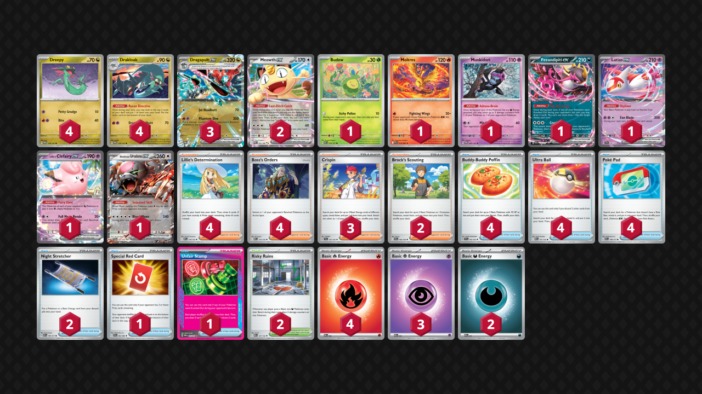
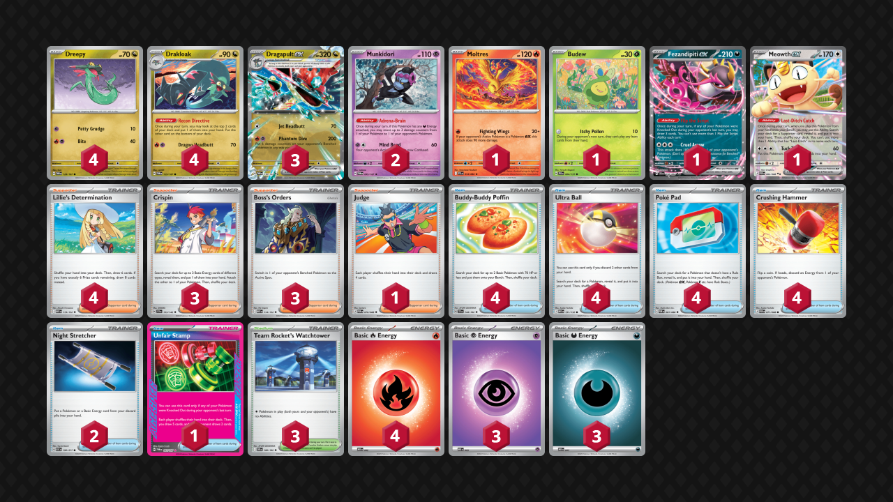

## Decklist


```decklist
Pokémon: 20
4 Dreepy TWM 128
4 Drakloak TWM 129
3 Dragapult ex TWM 130
2 Meowth ex POR 62
1 Budew ASC 16
1 Moltres PFL 14
1 Munkidori TWM 95
1 Fezandipiti ex ASC 142
1 Latias ex SSP 76
1 Lillie's Clefairy ex JTG 56
1 Bloodmoon Ursaluna ex TWM 141

Trainer: 31
4 Lillie's Determination MEG 119
4 Boss's Orders MEG 114
3 Crispin SCR 133
2 Brock's Scouting JTG 146
4 Buddy-Buddy Poffin TEF 144
4 Ultra Ball MEG 131
4 Poké Pad ASC 198
2 Night Stretcher ASC 196
1 Special Red Card CRI 82
1 Unfair Stamp TWM 165
2 Risky Ruins MEG 127

Energy: 9
4 Fire Energy MEE 2
3 Psychic Energy MEE 5
2 Darkness Energy MEE 7
```
<!-- PUBLIC -->
### Inclusions

- Meowth is so insanely good in this deck. It makes it easy to do whatever you want and it’s useful in basically any spot. I often use it to get Lillie to start off the game. I thought Meowth would be a liability due to its low HP and bench spot occupation, but this is hardly noticeable. The only real downside is sometimes starting with it, but I still think it is easily worth it to play both copies.
- Risky Ruins is acutally good in basically every single matchup and it can replicate what Hawlucha did. Risky Ruins is mostly better than Area Zero because it activates relavant Munkidori uses in most matchups. Without it, Munkidori is still good in mirror but basically useless everywhere else. The preemptive Risky Ruins damage is also very good against Fighting decks.
- Latias and Ursaluna are still very useful and relevant. Aside from Ursaluna’s normal uses, it has additional utility with Crispin. Having an attacker that isn’t weak to Clefairy comes up very often in this format.
- Clefairy is particularly strong for the mirror and Lucario matchups. Having an easy access attacker that isn't Dragapult can also be useful at times.
- This deck relies on Boss’s Orders on specific turns and sometimes likes to spam it. I am firmly in the four Boss camp, and this also helps compensate for the loss of Counter Catcher.
- Swapped Rosa for third Crispin because I think it's better in the current format, especially with more of a reliance on Clefairy.
- Brock’s Scouting is for general consistency as well as finding the Pokemon ex that can be annoying to search out. The card isn't that good but helps play the game more often.
- Special Red Card is a good replacement for Petrel as an additional out to hand disruption.
- Moltres is quite nice to help against Hydrapple which is seeing some popularity for the time being.

### Possible Inclusions

- Dudunsparce ex can be very useful to help against Raging Bolt and Crustle. It comes with the Run Away Draw Dudunsparce which is very nice utility. It is fairly easy to cut cards such as Brock's Scouting, Ursaluna, or the Moltres for the Dudunsparce package. Azumarill and Mega Lopunny have similar applications as Dudunsparce ex.
- Paldean Tauros can be a one-card counter to Crustle should the need arise.
- Crushing Hammers can be very good in Dragapult mirrors and the Garchomp matchup.
- Yveltal can help with board positioning, comebacks, or alternate win conditions. Dragapult can capitalize on Yveltal very well, but the list has to change quite a bit to accommodate it (more Munkidori and Dark Energy, maybe Dudunsparce, Area Zero, or Pecharunt ex).
- A second Budew helps to not start with two-prize liabilities. Although Budew isn't as important as before, it is still useful in most games.
- Bronzong is something I need to try out. I got wrecked by it at LA and have been intrigued ever since.
- Dusknoir is a very strong card, but not necessarily in this meta. It's mostly only relevanta against single-prize decks, which should already be manageable. It can also be used to help swing the matchups against Crustle or Lopunny, so it can be good depending on the meta.

### Exclusions

- Second Munkidori is good for the mirror but with Clefairy this list can often force faster games that don't require double Munki. I have not found two Munki to be needed.
- Rare Candy is a good card but not necessary in my experience.
- Hero's Cape is very strong but I still think Stamp is better. Not having Stamp exposes some vulnerabilities and makes some matchups a lot worse (Single-prize decks, Mewtwo, etc.).
- Area Zero has some uses but it's far less useful and impactful than Risky Ruins. If you do play Area Zero, I would also play Chien-Pao to make sure to get the upside of getting rid of liabilities.
- I don’t think there are any legitimate use cases for Jamming Tower. There aren’t any real Tools in this format, and the card feels completely useless. Risky Ruins is miles better.
<!-- /PUBLIC -->
## Decklist 2


```decklist
Pokémon: 17
4 Dreepy TWM 128
4 Drakloak TWM 129
3 Dragapult ex TWM 130
2 Munkidori TWM 95
1 Moltres PFL 14
1 Budew PRE 4
1 Fezandipiti ex SFA 38
1 Meowth ex POR 62

Trainer: 34
4 Lillie's Determination MEG 119
3 Crispin SCR 133
3 Boss's Orders MEG 114
4 Buddy-Buddy Poffin TEF 144
4 Ultra Ball MEG 131
4 Poké Pad POR 81
4 Crushing Hammer POR 71
2 Night Stretcher ASC 196
2 Special Red Card CRI 82
1 Unfair Stamp TWM 165
3 Team Rocket's Watchtower DRI 180

Energy: 9
4 Fire Energy MEE 2
3 Psychic Energy MEE 5
2 Darkness Energy MEE 7
```
The disruption build is very nice and I played it to Indianapolis as a last-minute decision. I only finished Top64 due to some atrocious variance but the deck does somewhat rely on luck to an extent. Nonetheless the deck felt extremely strong. Playing three Watchtower makes it more reliable and has a lot of uses in the meta. I think Special Red Card is very useful in this deck, replacing Judge and the fourth Boss. That said, a fourth Boss may end up going back in. I will probably add a more detailed writeup for this variant once I have more testing with it.

## Gameplay Tips

- Go first blind. Go first against everything except some matchups that can attack on Turn 1, such as Lucario or Raging Bolt. Notables will be mentioned in the matchups.
- The sequencing with this deck depends on what you’re trying to do. When reaching for combos, maximize the number of cards seen by starting with draw Supporter, then Fezandipiti, and Recon Directives last. If you need more Pokemon than search cards you have, draw first. If not, search first. If you need to evolve into Dragapult before playing a draw Supporter, use the evolving Drakloak’s Recon first, then evolve, then go into the above sequence.
- Plan out your turn before you start playing cards. What are you trying to get done this turn? Most importantly, what Supporter to you want to play? If you’re using Crispin, best to start with that.
- This deck relies on making efficient use of damage. Carefully consider your opponent’s board and plan out how you’ll take six prizes against it. Ask yourself if you’ll need to use Ursaluna this game. If so, account for not having an additional turn of Phantom Dive snipe damage. Sometimes you need to set up Munkidori damage preemptively or multiple turns in advance.
- Putting extra Energy on the bottom with Recon Directive is generally good for Crispin.
- With two Night Stretcher, be very careful about what you discard off Ultra Ball. If you play three Night Stretcher, you can more aggressively discard a toolbox of Pokemon for easy Night Stretcher access.
- Drakloak is a viable attacker! Don’t forget about it! Of course it is situational.
- You may want to attach Energy to Drakloak on autopilot. However, there are some situations where you know your opponent is going to snipe your Drakloak with Energy. If that’s the case, don’t attach the Energy or attach it somewhere else instead.
- Fez is now a viable Turn 2 attacker. Don’t forget about that option! Munkidori can also be a decent attacker more often now.
- Some late-games will require multiple Bench spots! (Ursaluna, Latias, Meowth, Fez) Don’t bench random stuff for no reason!
- Don’t mindlessly slam the Unfair Stamp as soon as you can. Depending on what you’re going to be able to do, or what the opponent’s board state looks like, sometimes it is tactically better to delay the Stamp by one turn. A good example is if you’re activating their Fez now, but can KO it next turn. If the opponent’s board is not developed, it may be better to slam it now even if you can’t attack because they might brick! Is the Stamp stopping them from doing something specific? If not, maybe hold it.
- Against most decks, they only play Unfair Stamp as disruption, so you can hoard cards and not thin. However, decks like Lucario or Meganium can play Judge, so it’s best to thin out random garbage against those decks.
- Risky Ruins can be mostly used in three different ways: preemptively, reactively, or for instant value with Munkidori. Which one you prioritize typically depends on the matchup.

## Matchups

### Dragapult Mirror - Even

Clefairy helps give a slight edge in the mirror, although the lack of second Munkidori is relevant sometimes.

- Munkidori is very strong. Try not to boardlock yourself out of it so that you can utilize it whenever you find it. Conversely, if they have Munkidori with Dark, consider KO’ing it to limit their options. With limited Stretchers, they might not be able to get it back.
- We want to be the first one to attack with Phantom Dive. Choose to go first as there are plenty enough outs to Dreepy. Going first also opens up the option to shut them out of the game with Fez depending on what your hand looks like.
- Fast Fezandipiti Cruel Arrow is VERY good in this matchup if it lines up with Crispin. Of course, it’s not very good if they play Shaymin. If you don’t have a likely fast Cruel Arrow, it’s generally not worth putting Fez in play early.
- Clefairy introduces an interesting aspect because it can one-shot their Dragapult, but doesn’t necessarily put you ahead in the trade because it gets easily KO’d in return. The exception is early if they get a fast Phantom Dive but aren’t necessarily stabilized yet. It’s best to KO their Dragapult if they don’t have Energy on benched Drakloak, as they might whiff the response. This is particularly good with Stamp and is generally the best way to come back. Conversely, you don’t need to be scared of their Clefairy if you’re winning and can get the response KO on it.
- On Turn 1, use Items preemptively to play around Budew. PokePad for Drakloak, Ultra Ball for Meowth, whatever is best in the situation. Just don’t let those Items get locked if you have the chance to play them.

```youtube
id: SmX3t4Se6hk
title: Blaziken v Pult 1
```
This was a very interesting game.

```youtube
id: YbrejTOUFNI
title: Blaziken v Pult 2
```

### Raging Bolt - Slightly Unfavorable

This matchup is a bit better with Shaymin but it's still tough overall.

- Early Item-lock can slow them down and is very relevant. Shaymin protects from Fez or Waterpon.
- Unfair Stamp is very strong unless they have both Fez and Hoothoot. Try to use it when they don’t have both of those (most don't play Noctowl nowadays, so that's most of the time). Save Unfair Stamp for when you start attacking, unless you can potentially stop them from attacking.
- In order of priority, spread damage should always put 10 on all Hoothoot (or 20 if it’s the 80 HP Hoothoot) and 40 on Raging Bolt ex if they have it. 10 is often good on Fan Rotom, Fez, or other 210 HP Pokemon. Extra damage can also set up Noctowl to get KO’d from snipe. KO’ing random single-prizes that you set up is also good.
- Crispin for Clefairy or Ursaluna can be decent attackers in a pinch. If you can take a fast lead with Clefairy, that is actually quite good, but it doesn’t line up all that often. Responding to a Raging Bolt ex with Clefairy is actually not that good unless you just don’t have Dragapult ready yet.
- I would choose second because they play so many Crispin now and have a good chance of getting Turn 1 KO, but I'm not sure if that is correct.

```youtube
id: iBgJKAXktFk
title: Pult v Bolt 1
```

```youtube
id: szk1791lO-s
title: Pult v Bolt 2
```

### Mewtwo - Even

This matchup is weird because they will destroy you if they draw well but they often brick or randomly whiff things.

- Your win condition is to make them whiff. Item-lock is the highest priority. Feeding Budew to Tarountula feels bad, but you need to keep them Item-locked until you start attacking.
- Usually you need to slam Unfair Stamp as soon as you start attacking. However, using it earlier can sometimes be good if they have a crummy board and might brick.
- I think going first is best because they can use Proton on Turn 1 going first. If you go first, they can use Lillie or Ariana on Turn 1, but that’s not even that great for them without getting the Proton off. If you’re going first and they open with Mimikyu or Tarountula, don’t leave Budew in the active on Turn 1.
- It is usually best to target their Psychic attacker that has Energy, especially since you have to two-shot Mewtwo regardless. If you go after Clefairy and leave a loaded attacker, it’s not hard for them to simply Stretcher the Clefairy back.
- If their only loaded attacker is Mimikyu, a good way to play around it is to not have Dragapult on the board and just attack with something else.
- Assuming they have Articuno in play, the Munkidori damage should go on Spidops or Tarountula. If you can somehow get Mewtwo in range of Ursaluna for a one-shot, that is great, but I never had it line up personally.
- Risky Ruins is best used reactively to bump their Stadium. This improves the chance of them bricking/whiffing. If you play Ruins preemptively, they can easily bump it.

```youtube
id: EuEq39RGns8
title: Pult v Mewtwo 1
```

```youtube
id: fusMKkbOseU
title: Pult v Mewtwo 2
```

```youtube
id: osdV2FPSiDI
title: Pult v Mewtwo 3
```

```youtube
id: rKnuz-k3Qxw
title: Pult v Mewtwo 4
```

### Festival Lead - Even

The current Dragapult list is one of the worse ones against Festival Lead, along with the Cape and Hammer builds, but it's still not too bad.

- Getting Munkidori in play to use as a sponge is very good. It can be used as a sacrifice or as a promote after they use their first attack to get a KO. Later in the game, it will also be relevant for Adrenabrain.
- Save Risky Ruins for when you can get immediate value from it (or if you can combo it with Stamp).
- Stamp is very broken. Use it when you get to start attacking with Dragapult, or with Boss to slow them down. If you Boss up Thwackey and Stamp them, they are unlikely to get out of it and you can buy time that way. If they have Genesect and aren’t board locked, just use Stamp as soon as possible and try to do the Boss play.
- KO Rabsca as soon as possible. It’s basically impossible to win if that thing stays in play for too long. Sometimes you KO it with Drakloak, or with just one Energy on Dragapult.
- If you play Moltres, it can be very good to get fast KO’s on Applin.
- If you play Maractus or Yveltal, it can buy time in the early-game by Boss trapping Thwackey. This obviously does not work if they have Kieran in hand.
- If they don’t have a large hand and only two Thwackey, it may be better to target a Thwackey. Depending on the board, it may be more likely to get them to whiff a KO, but sometimes KO’ing their attacker is still best. If they have only one Thwackey, KO’ing it is usually best.

```youtube
id: tcf2S94_PRY
title: Festival v Pult 1
```

```youtube
id: ImXsejPjQFE
title: Festival v Pult 2
```

```youtube
id: ZwTtfOhLMS0
title: Festival v Pult 3
```

### Alakazam - Very Favorable

- Save Risky Ruins to bump Battle Cage. Also good with Munkidori later. Try to get two prizes per Phantom Dive. Ideally you can snipe Kadabra or Dunsparce with Munkidori’s help, but if not, sniping Abra is also fine.
- Use Stamp on a Phantom Dive turn, ideally the first one, but the second one is fine too.
- Ursaluna to close out the game is somewhat common, especially if they have Fez.
- Using Pokemon like Fez/Meowth is generally fine in order to maintain tempo. Try to leave a spot for Munkidori in the mid- or late-game.

```youtube
id: N7C96e59bMc
title: Zam v Pult 1
```

```youtube
id: HJZBgT8hcF0
title: Zam v Pult 2
```

### Lopunny - Unfavorable

- The main win condition is Stamp. Try to set up a turn where you can KO Dudunsparce and Stamp at the same time. Ideally, you’ll KO their only Dudunsparce and then they’ll brick.
- If they have two Dudunsparce, prioritize KO’ing them. Whether you want to use Stamp on the first KO or the next one depends. It’s best to set up a situation where you’re KO’ing their only one, but if the game is going too fast, you may need to Stamp before you get to do that.
- If you’re doing good on Energy attachments, you can retreat Dragapult after they smack it into another one and start attacking with that. This forces them to Wally so they can’t Boss, so it’s quite effective if you’re able to pull it off.
- KO Dunsparce with snipes whenever possible.
- Extra snipe damage is generally best on Buneary/Lopunny. If you build up enough damage, you can threaten both Lopunny at the same time, which can be game-winning. Generally best to put damage on the backup Buneary and not actually KO it, but it depends. It can also be good to ping 10 to multiple 70 HP Dunsparce to pressure them, or 10 to Fan Rotom for an easy KO option later.
- Munkidori is very good in general. Save Risky Ruins to bump Battle Cage for a relevant snipe play.

```youtube
id: kpIBOnfXjLE
title: Lop v Hammers 1
```

```youtube
id: bcg3aRUL5lg
title: Lop v Hammers 2
```

```youtube
id: -dkLl5npZaE
title: Lop v Hammers 3
```

```youtube
id: btqClFVMizE
title: Lop v Hammers 4
```

```youtube
id: gCResoCcZb8
title: Lop v Pultnoir 1
```

```youtube
id: tjyW4TJ4Grg
title: Lop v Pultnoir 2
```

### Lucario - Favorable

This matchup is favorable with Clefairy, and about even without it.

- One-shot their Lucario whenever you can. This can be done with Clefairy or Latias. If you don’t have the Clefairy, attaching Energy to Latias early is good. We can easily find Crispin whenever with the Meowth, so Latias works whenever you get the preemptive Energy.
- Play Risky Ruins ASAP. The 20 pings are extremely relevant. If they use Gravity Mountain too early for defense, you can bump it with your second Stadium so they don’t have it for offense. More likely they just won’t have the Gravity Mountain and have to eat the damage.
- Phantom Dive spread should usually go on Riolu/Lucario. If you can KO Riolu, that is almost always best. Putting 20 damage on Makuhita can also be good. Any extra damage can still be useful on Solrock/Lunatone.
- Play around late-game Solrock by not benching unnecessary Dreepy. This is only relevant if they have no other attackers ready to go.
- Early Budew is extremely strong in this matchup and is a high priority.
- If you don’t have the one-shot on Lucario, smacking it with Phantom Dive is still very good!

```youtube
id: KrC_xNmpJrg
title: Pult v Lucario 1
```

```youtube
id: tFMrLmjER0Y
title: Pult v Lucario 2
```

```youtube
id: peMLpGQQT9o
title: Pult v Lucario 3
```

### Garchomp - Unfavorable

- Chain Dragapult as much as possible. If they smack into one, try to attack with a fresh one.
- Getting Energy drops on Dreepy/Drakloak is very important. Sometimes it’s better to power them up in the early-game rather than retreating into Budew. If you’re going second and they didn’t get Gible, prioritize Budew. Otherwise, prioritize Energy drops on Dreepy/Drakloak. Of course, getting both is ideal.
- Budew is also not as good because it feeds Gabite early prize cards. It’s sometimes still worth going for if they have a weak board, but usually not a huge priority.
- Slamming Risky Ruins asap is very good. If you have Jamming Tower, it’s very good at strategic times in this matchup.
- Try to keep double Roserade off the board! Make it difficult for them to KO Dragapult. Using Boss on Roserade or even Roselia is valid. Targeting their Energy can also be very strong if they don’t have much Energy in play.
- Munkidori is very good! Try to get it in play and use it to make relevant breakpoints such as sniping Roselia.
- Feeding one Spiritomb KO is unavoidable, just don’t feed them more than one.
- Unfair Stamp is best on turns where they don’t have a KO on board. If you’re attacking with Dragapult and they don’t want to use the first attack, or if you can make them whiff a relevant Boss or Energy drop is when Stamp is best.
- Turn 2 Drakloak Dragon Headbutt is especially good when they don’t have Gabite on the board and less than two Roselia! Look for this play when going first!
- Try to play without Fez/Meowth/Ursaluna because they are big liabilities in this matchup.

```youtube
id: L91Px7smMls
title: Chomp v Pult 1
```

```youtube
id: GLj-hxbxidE
title: Chomp v Pult 2
```

```youtube
id: WIPj56l63IE
title: Chomp v Pult 3
```

### Meganium - Favorable

This matchup is much better now with Shaymin, but it's still mostly luck-based.

- Early Item-lock is a huge priority since your only lose-condition is them getting a fast Arboliva. This is less relevant if you have Shaymin.
- The other priority is getting as many Drakloak as possible, although that’s basically true in any game. If you draw well enough and get lots of Drakloak, you can still win even against a fast Arboliva.
- If they use Arboliva you’ll usually need to just two-shot it with Phantom Dive.
- Ogerpon with four energy one-shots Dragapult, so be wary of any Ogerpon with two Energy and ping them for ten damage. Other spread damage should go onto Meowth. With Munkidori’s help, it’s not too hard to set up Meowth for a snipe KO. If they don’t have Meowth and you’ve already got ten on each Ogerpon/Fez, spread damage should pressure their lowest-HP single-prize Pokemon in play.
- Save Risky Ruins to bump Forest. Ruins isn’t that good preemptively and is likely to get bumped. If they already have all their Stage 2’s out, save Risky Ruins until you can benefit from it.
- Another good play I found is the preemptive Crispin. If you have a Fire or Psychic already in hand, you can play Crispin to load the same type of Energy on two different Drakloak. You know they're going to snipe the one with the Energy, so this way you can play a different Supporter on the next turn, such as Petrel for Stamp. Otherwise, if they have Arboliva, there's no point attaching Energy to Drakloak (if that is your only Energy in play), since you know they will just snipe it. This is mostly relevant if you don't have Shaymin.

```youtube
id: q32sS-zVUb8
title: Pult v Meganium 1
```

```youtube
id: EiOSHaWnuqs
title: Pult v Meganium 2
```

```youtube
id: dt4M6CfciwA
title: Pult v Meganium 3
```

```youtube
id: QjIFFi2LNgI
title: Pult v Meganium 4
```

### Crustle - Very Unfavorable

- Pick off any Dwebble on sight before they evolve into Crustle.
- Pressure them with a fast attacker. If they don’t have Crustle yet, Dragapult is best. If they have Crustle without Mist, Mind Bend is best. Otherwise, Drakloak. Sometimes it is just a matter of whatever you have easy access to, and that’s fine. We want to force them to respond so that we can use Stamp and hopefully make them brick.
- Go second and try to cheese them with a Turn 1 Itchy Pollen.

### Zoroark - Favorable

- Munkidori with Dark is usually the biggest threat that you want to KO.
- Smacking a Zoroark and feeding the Reshiram KO is totally fine as long as you have a follow-up to finish it off.
- Spread damage usually goes on Zorua/Zoroark. There are tons of random relevant damage breakpoints and ways to take advantage of damage on Zoroark. Pinging Darumaka for 20 can sometimes be fine.
- Itchy Pollen to stop N’s PP Up is very good if they don’t have much Energy on board. This is most relevant after they use Darmanitan’s Flamebody Cannon. Of course, Budew is also very good early as it can stop Darmanitan from coming into play.
- Go second.

```youtube
id: VJXxkFjhhtA
title: Pult v Zoroark 1
```

```youtube
id: VJXxkFjhhtA
title: Pult v Zoroark 2
```

```youtube
id: zG_aBiWOZDM
title: Pult v Zoroark 3
```

### Ogerpon - Unfavorable

- Itchy Pollen is a big priority in the early-game to slow them down.
- Try to Stamp when KO’ing Clefairy or Fez with Phantom Dive. Otherwise, use Stamp at the end of the game when attacking with Ursaluna to try and stop them from getting what they need to win.
- Don’t leave anything up that you don’t want to get Sobbed. If they do go for Sob, Munkidori can offset all of the damage from it.
- Shaymin protects from Fez/Waterpon.

```youtube
id: WjBDGAt49G8
title: Ogerpon v Pult 1
```

```youtube
id: EwB6s6nUu8A
title: Ogerpon v Pult 2
```

```youtube
id: K9E4AWBJng4
title: Ogerpon v Pult 3
```

### Slop Box - Slightly Unfavorable

This matchup gets a bit better with Shaymin.

- Two-prize Pokemon such as Fez and Meowth are more liabilities than normal since they can commonly start ahead in the trade and then finish with any random attacker on the liabilities. Try to keep them out of play if you can! Of course, if you need them to play the game, so be it. It’s not an instant-loss, just don’t use them as liberally as normal.
- Budew is mostly used to stop them from finding Fez and/or Energy Switching onto it. If they already have an attacker, Item-lock is not as much of a priority. It's also less important if you have Shaymin, as that can also stop their Fez/Waterpon.
- Save Risky Ruins for a strong play with Munkidori. This combo is very relevant. Can be used to one-shot the likes of Fez, or finish it off after a 200 hit. Rosa’s Encouragement can also be very relevant in this matchup.
- This is one matchup where timing the Unfair Stamp is more relevant than yolo slamming it. Are you stopping them from using Fez and/or getting Clefairy? It’s all situational.
- Targeting the Clefairy is usually best. There’s a good chance they just won’t have the response to your Dragapult, especially if you Unfair Stamp them on the same turn.
- I think going second is best in this matchup.

```youtube
id: mlxrooxjTrg
title: Pult v Absol 1
```

```youtube
id: xpa-XDUyuyk
title: Pult v Absol 2
```

```youtube
id: 3CKGTQowFjM
title: Pult v Absol 3
```

## Personal Thoughts

Dragapult is clearly very dominant and there are all kinds of different builds going around. I don't know for sure which one is best, but my results and logic are all presented here which have led me to believe in a list similar to this, though it can still be tweaked here and there. I don't think regular Dudunsparce is necessarily all that good, as this deck doesn't care about randomly drawing three cards sometimes. What appeals to me the most is the tech potential of Dudunspace ex, and it happens to come with a decent draw option. Being able to constantly extract value from extra search cards throughout the game (synergy with Run Away Draw) is cool though.
