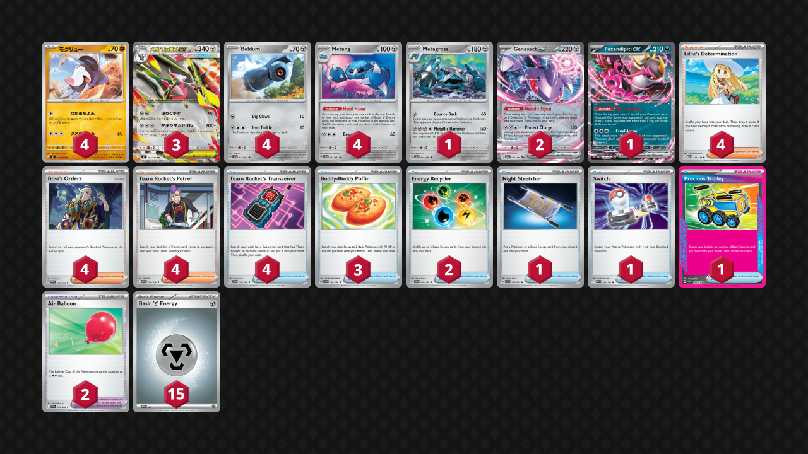

## Decklist


```decklist
Pokémon: 19
4 Drilbur M5 44
3 Mega Excadrill ex M5 63
4 Beldum TEF 113
4 Metang TEF 114
1 Metagross CRI 61
2 Genesect ex BLK 67
1 Fezandipiti ex SFA 38

Trainer: 26
4 Lillie's Determination MEG 119
4 Boss's Orders PAL 172
4 Team Rocket's Petrel DRI 176
4 Team Rocket's Transceiver DRI 178
3 Buddy-Buddy Poffin TEF 144
2 Energy Recycler DRI 164
1 Night Stretcher ASC 196
1 Switch MEG 130
1 Precious Trolley SSP 185
2 Air Balloon BLK 79

Energy: 15
15 Metal Energy MEE 8
```
<!-- PUBLIC -->
### Inclusions

- Four Drilbur is nice to have it early and easy access to Call for Family, but it would probably be fine to play three. The Call for Family is a relevant buff to consistency.
- Metagross is insane but you never need more than one.
- Fezandipiti is hard to find but sometimes you get it early and it can help get Boss. It can also be a decent fast attacker in some situations.
- Lillie’s Determination is not as important in this deck as some others, but the card is still very good and helps a lot with overall consistency.
- Four Boss’s Orders is necessary with how often this deck wants to have Boss at the right time. Without four I would never have it when I needed it. It can also help with reverse prize mapping. Sometimes you don’t want to attack with Excadrill since it’s good for your opponent’s prize map, but Excadrill is the only thing that gets a big KO, so you can use Boss to get value from a different attacker on that turn.
- Three Poffin helps make the deck consistent. Sometimes Trolley is prized or you only have Lillie in the early-game instead of Petrel, or you are forced to go first against a deck with Budew and can’t Trolley.
- Energy Recycler is needed in basically every game, especially since sometimes the need arises to retreat Excadrill. I tried with one, and you can certainly get away with it, but I found the card to be too important that I wanted a second one make sure I always get value from it. It’s also possible to use both every once in awhile.
- Night Stretcher is nice utility, usually used for Drilbur or Beldum if KO’d early, Genesect, or Metagross.
- Precious Trolley makes the deck very smooth and consistent. I didn’t try other Ace Specs but I can’t really imagine myself doing so. This deck needs to quickly find lots of Basics and Evolutions, and Trolley does everything at once. It’s so insane with Genesect.
- Air Balloon is especially valuable for early-game mobility. Switch can be good against early-game Sob which allows us to sometimes play around Torrential Pump by leaving Genesect active. This isn’t necessarily the go-to if you think they can just KO the Genesect though.

### Possible Inclusions

- Ultra Ball could be decent utility, but when I tried it, it was not very relevant.
- Lana’s Aid would sometimes be nice but it’s difficult to pull off.
- Pokegear would be very good to have Boss at the right time (and also increase the rate of finding early Trolley).
- Special Red Card might occasionally be useful, though it didn’t get used much against Dragapult.
- Shaymin might be a decent tech for Slowking. You’d have to delay evolving into the backup Excadrill.
- Transformation Tome sounds awful in this deck but Genesect is such a big liability that gives opponents an easy prize map, so it could be worth trying out. It would also allow us to benefit from Fez without the downside. However, that could be exploitable since there is no way to discard cards to activate Tome, so you’d be relying on the opponent to KO something else first and then Tome out the Genesect. It would also be hard to piece together the Tome play.

### Exclusions

- Jumbo Ice Cream’s breakpoints are atrocious because it’s very hard to have multiple of them at once. Moltres + Phantom Dive still KO’s after an Ice Cream, for example. This deck does not draw cards very well so it won’t have multiple Ice Creams very often, especially against hand disruption. They also aren’t relevant in lots of matchups, although they can be good in some others. In general, if they aren’t one-shotting Excadrill, we’re already having a good time anyway.
- Stadiums don’t work well with this deck. Gravity Mountain might seem ok to allow Metagross to hit some breakpoints such as Blaziken ex, but I don’t think it would really do much to save that matchup anyway.
- Poke Pad is just not good in this deck.
<!-- /PUBLIC -->
## Gameplay Tips

- Go second against anything that can attack Turn 1 or use Itchy Pollen. The exception is decks that have Wellspring Ogerpon. Go first against those.
- Pay attention to your opponents prize map and make it as difficult as possible for them to take six prizes. Metagross and Genesect can help with this. Although Genesect is a liability, it’s also a viable attacker. Attacking with Excadrill when your opponent is on two prizes is generally good. If you let them go to one prize, they can easily win with Boss on Metang since it’s basically impossible for you to not have any Metang in play. Excadrill -> Metagross -> Excadrill is pretty standard but many exceptions exist.
- I would always prioritize getting three Beldum on the board. The second Drilbur isn’t all that important if the first one isn’t in danger of getting KO’d, but usually you just grab it for free off the Trolley anyway.
- Evolving into the backup Excadrill can sometimes be punished, so whether you want to immediately evolve it depends on the situation and matchup. Against Dragapult, instantly evolve it so it doesn’t get sniped. Against other decks, it is often better to wait.
- Pay attention to your Metal Makers. Genesect can shuffle your deck if you put good cards like Boss on the bottom that you want to topdeck or draw off Fez or an opponent’s Special Red Card.
- Burning Transceivers on sight to thin out Petrel is usually best. Exceptions are when you really want to see Transceiver off an opponent’s Stamp/Judge.
- Using Petrel preemptively is extremely common. There aren’t many targets in this deck besides Boss and Recycler, and you often Petrel for those cards even if you can’t use them immediately. If you played Special Red Card, that would also be a good preemptive search so that you can later Red Card and Boss on the same turn.
- Retreating Excadrill is fairly common. It’s not as painful as it looks once you get used to it. Usually it’s good to retreat when Excadrill is damaged or confused, depending on the situation.
- Milling the top two cards off your opponent’s deck may be tempting, but usually it doesn’t make much of an impact. Only use Excadrill’s first attack when you don’t have any better attacking options. This deck doesn’t usually get to prolonged games, but if the opponent is careless and draws too many cards, it might be possible to deck them out over the course of two or three attacks. It’s worth looking for a few turns in advance, as you won’t get handed a free win with them just having two cards left.
- Starting with Drilbur is almost always best because it has Call for Family and is the most expendable Pokemon. The main exception would be the rare aggressive Fezandipiti opportunity.

## Matchups

### Dragapult - Favorable

Against versions without a Fire-type, the matchup is favorable. If they have Moltres, it’s about even. If they have Blaziken, it’s very unfavorable.

- Metagross usually isn’t used for attacking in this matchup, but it’s still useful in another way. When they sprinkle some damage onto a Metang to set it up for a snipe KO, evolve it out of range!
- Pile as much Energy as possible onto Excadrill so that you can one-shot Dragapult on sight, even if you don’t need to for another turn or two. In this matchup, you’ll almost always attack with Excadrill instead of the other attackers.
- Second Drilbur is a priority to get evolved quickly so that they cannot spawn trap Drilbur.
- Fast attacking Fezandipiti can occasionally be good, especially if they are threatening an instant Mind Bend response (which is more annoying against Excadrill), or if you prized double Excadrill / Metang / Beldum. However, the opportunity cost is very high, as you also want a board of two Excadrill, three Metang, and Genesect. If you’re against the Blaziken version, prioritize getting a fast Cruel Arrow to pick off Torchic and Combusken.
- Metal Maker and then choosing to shuffle or not can help play against Special Red Card, though oftentimes hand disruption won’t matter anyway.
- Using Call for Family to stabilize is often better than being aggressive, but being aggressive can sometimes be better depending on the situation (such as if the opponent’s board is very weak).

```youtube
id: Z4mtndt9xIk
title: Drill v Pult 1
```

```youtube
id: 9G-DkC9q-5o
title: Drill v Pult 2
```

```youtube
id: HnsxI7wf-Dg
title: Drill v Pult 3
```

```youtube
id: gmyPPy-tr3w
title: Drill v Pultnoir 1
```

```youtube
id: sRuPcTQZjVc
title: Drill v Pultnoir 2
```

```youtube
id: 8pYQpK3xHAQ
title: Drill v PultBlaze 1
```

### Raging Bolt - Slightly Favorable

- Metagross is insane in this matchup. You’ll want to start attacking with it pretty much whenever you get the chance. Of course, early Excadrill is still the go-to main attacker for the matchup since Metagross is a bit slow.
- Genesect can one-shot Clefairy. This is mostly relevant if the opponent is on three prize cards and you don’t have access to Metagross, or if they Sob trap Genesect. If they have Clefairy in their active, Boss’ing around it leaves the attacking Genesect plays open. Of course, this is all very situational.
- Wellspring Ogerpon is a huge threat! If they attached an Energy to Wellspring, you may want to send up Genesect and not put a fifth Pokemon on your bench in order to play around Clefairy. If they Sob, you can Petrel for Switch and get out. If they don’t already have Energy on Wellspring, it might be best to just leave Drilbur active, fill the board, and hope they don’t get the Pump off from nowhere, as it is harder to pull off than one might think.

```youtube
id: dkbC_f9YsAc
title: Drill v Bolt 1
```

```youtube
id: hb0QJ851_EY
title: Drill v Bolt 1
```

### Alakazam - Very Unfavorable

- If they start with a random bad Pokemon like Dedenne or Genesect, it’s possible to cheese them by sniping around it with Fez and Boss stalling.
- Another possible win con is milling important cards (recovery or Boss) while taking early KO’s with Excadrill, and then pivoting to Metagross -> Stretcher Metagross. Even Metang can KO Abra if you must attack with a single-prizer, but KO’ing their Alakazam is usually ideal.

### Festival Lead - Unfavorable

- The ideal attacking lineup is Genesect -> Metagross -> Metagross -> Excadrill. They have to Boss around at some point, so make them get through the Metagross. There are many exceptions. Sometimes they get the first attack or you have an easy Excadrill attack instead. Getting some mills isn’t bad. If you mill a Gladion you basically win on the spot.
- The fundamental principle here is to make their prize map as difficult as possible. They need Gladion to one-shot anything, so they’ll have to use Boss to take six prizes. Attacking with Excadrill is fairly risky because they can smack it and then Boss it for three prizes.
- If they’re at three prizes and have both Boss plus a Bangle left, don’t evolve into Excadrill as you lose to Boss Boss. In general, don’t evolve into Excadrill unless you’re immediately attacking with it.
- Pay attention to their resources, especially Boss, damage modifiers, and Dipplin / recovery. Sometimes they need to have awkward discards in order to use Gladion, and sometimes you hit something good off a mill. Depending on what’s in their discard, you can punish them appropriately.

```youtube
id: llimXRrSMbA
title: Drill v Festival 1
```

### Zoroark - Favorable

- If they play Darmanitan do not put down the second Drilbur right away as that is a good way to instantly lose and feed them an easy prize map. Sometimes you need to wait awhile for the second Drilbur.
- Darmanitan allows for nasty prize maps that you need to be aware of. Get three Beldum in play and evolved as soon as possible along with the initial Excadrill. Do not let them use Darmanitan’s attack for 90 on Excadrill and a single-prize KO. If they smack Excadrill for 250, don’t put down a single-prize Pokemon just yet. Also do not let them go 90-90 on two Excadrill (the second Excadrill should not even be in play).
- Metagross is very important as it allows you to play without Excadrill and mess with their prize map.
- Recycler can easily play around Darmanitan’s first attack.
- If they don’t play Darmanitan, you can ignore everything I just said and play normally. If you don’t know their list, you still need to be careful since Darmanitan can come out of nowhere via Transformation Tome.

```youtube
id: tJWxvGKRHtg
title: Drill v Zoro 1
```

### Hydrapple - Slightly Unfavorable

- This is another matchup where Metagross is extremely important. Use it whenever possible.
- Excadrill is needed but it is also very easy for the opponent to KO it. Try to get mileage from Excadrill in the early-game before they get set up, and then go into Metagross. The best case scenario is to KO an Applin or Chikorita with the mill attack. Milling anything from those evolution lines or a recovery card can be very strong and you can exploit it by targeting those Pokemon. 
- Only load the extra Energy on Excadrill when necessary to get a KO, as Ogerpon can benefit from all of that Energy.
- KO’ing Meganium is a play you should be looking for when you’re on the losing side of the prize trade, and sometimes it’s the only way to avoid losing. They might just replace the Meganium and one-shot you anyway, but there’s a decent chance of them whiffing it. Without Meganium, it’s very hard for them to one-shot Excadrill.

```youtube
id: jvtO0P-BdgY
title: Drill v Hydrap 1
```

### Slowking - Unfavorable

- Don’t bother trying to tiptoe around Trifrost. Our best chance is to go fast and aggressive, and hope they don’t draw great. Play normally and try to prize race them by going 3-2-1.
- Boss is very important as you’ll need to snipe down Kang and Latias to rush prize cards.

### Slop Box - Even

- Boss is very important to take an efficient prize map. Try to KO their Kang before they remove it from the board with Chien-Pao.
- Metagross is great in this matchup. Genesect can also sometimes attack for similar reasons as against Raging Bolt.
- Wellspring Ogerpon is a huge threat! If they attached an Energy to Wellspring, you may want to send up Genesect and not put a fifth Pokemon on your bench in order to play around Clefairy. If they Sob, you can Petrel for Switch and get out. If they don’t already have Energy on Wellspring, no need to worry about it.

```youtube
id: yXZhZKazbs8
title: Drill v Slop 1
```

### Crustle - Very Favorable

- Use Excadrill to remove their Kang, and then use Metagross to run through Crustle. Target down their Energy and make sure you do not somehow lose the Metagross!

### Mewtwo - Slightly Favorable

- Start attacking with Excadrill. If they smack Excadrill, retreat it for a fresh one. Make them work hard for every KO.
- Metagross is good and even Genesect can sometimes be used for one-shotting Spidops.
- Boss around Lucky Helmet. KO Max Belt on sight.
- Sniping Mewtwo aggressively with Excadrill (or Metagross) is very good.
- Milling can be risky to give them Energy, but if it’s getting a KO, still go for the mill. Hitting Pokemon, recovery, or Max Belt / Petrel is game-winning.

```youtube
id: 1wwt0VOC4Rc
title: Drill v Mewtwo 1
```

## Personal Thoughts

This deck is very simple and consistent. Overall, it is not bad but not amazing. It beats some relevant decks but also has quite a few tough matchups. One thing that is annoying is that Genesect a massive liability along with a Mega Pokemon and always having Metang in play. The 3-2-1 prize map is literally always available to opponents, which is a massive downside of the deck. I would not be surprised to see this deck do well if it hit the right matchups.
