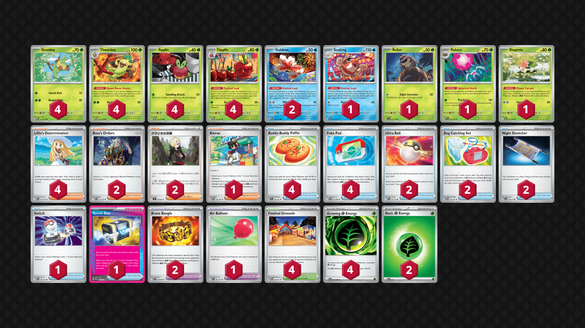

## Decklist


```decklist
Pokémon: 22
4 Grookey TWM 14
4 Thwackey TWM 15
4 Applin TWM 17
4 Dipplin TWM 18
2 Goldeen TWM 44
1 Seaking PRE 21
1 Rellor TEF 23
1 Rabsca TEF 24
1 Shaymin DRI 10

Trainer: 32
4 Lillie's Determination MEG 119
2 Boss's Orders MEG 114
2 Gladion's Final Battle M5 76
1 Kieran TWM 154
4 Buddy-Buddy Poffin TEF 144
4 Poké Pad POR 81
2 Ultra Ball MEG 131
2 Bug Catching Set TWM 143
2 Night Stretcher ASC 196
1 Switch MEG 130
1 Secret Box TWM 163
2 Brave Bangle WHT 80
1 Air Balloon ASC 181
4 Festival Grounds TWM 149

Energy: 6
4 Growing Grass Energy POR 86
2 Grass Energy MEE 1
```
<!-- PUBLIC -->
### Inclusions

- I like playing four Thwackey because the deck needs to see it early to function, always needs two in play, and sometimes even needs three. This is even more important now with Gladion.
- Rabsca is a necessary tech for Dragapult and it works well.
- Shaymin flips the matchup against decks that have Wellspring Ogerpon, Slowking, or Darmanitan. It is quite efficient for only one deck spot.
- Seaking is much better now, especially with Goldeen naturally boosting consistency. With Bangle and Gladion, Seaking can now KO basically everything. It also draws some cards to refresh the hand after emptying it for Gladion, though this can sometimes make subsequent Gladion harder to use.
- Gladion is a very strong damage modifier and even makes Seaking dangerous. Also allows for one-shots on Excadrill and Metagross.
- Ultra Ball is needed for Gladion and is not as invasive for consistency as I expected.
- Secret Box is definitely the best Ace Spec for this deck. It grabs four combo pieces for the price of one search, which allows us to stabilize or reach for a big KO even with a weaker board, early in the game, or after getting Stamped. It is the ultimate consistency card.
- Growing Energy stops Excadrill from KO'ing with the mill attack, and also sometimes makes relevant breakpoints against Dragapult. Also allows Rellor to survive Dusclops or Phantom Dive snipe. The only real downside of Growing is that it cannot be found off Bug Catching Set, which we cut back on anyway for Seaking and Ultra Ball.

### Possible Inclusions

- More Rellor and Rabsca could help against Dragapult, which may be worthwhile.
- Could reasonably play two Switch or two Air Balloon instead of one of each. If you cut Goldeen just play two Switch and no Balloon.
- Tool Scrapper is better when Alakazam with Fan (or Fan in general) is more popular.
- Dawn, Lana's Aid, or more Bug Catching Set would still be nice.

### Exclusions

- Genesect can be useful against Dragapult and mirror, but now that Dragapult has Red Card anyway, it's not as good.
- Rillaboom isn't as relevant now with Gladion enabling Rellor to easily slay Cornerstone.
- Lilligant is also nonsense now with access to Gladion.
- Psyduck does not really work against Dragapult / Dusknoir since the matchup is still unfavorable even with it.
- Brock’s Scouting is worse than Dawn. Of course, there are some situations where you’d wish that you had Brock instead, but the same could be said for any random card.
- Other Ace Specs are far inferior to Secret Box. Honorable mention to Maximum Belt for saving two deck spots, which is pretty cool.
- Other random cards such as Sacred Ash, Judge, or Forest of Vitality are just bad and pointless.
<!-- /PUBLIC -->
## Gameplay Tips

- The most important thing when playing this deck is to always make sure you have a way to use Thwackey’s Boom Boom Groove Ability. Ideally, you’ll have a backup Dipplin on the bench in case your attacking one gets KO’d and you get Stamped. If you only have Applin, make sure to at least have a way to search out Dipplin in hand. Saving cards like Bug Catching Set can help draw out of Stamp. You can also have Goldeen on the bench with Air Balloon as another way to play around Stamp.
- If all of your ducks are in a row, try to preemptively search out Switch or Air Balloon so that you won't get stuck by a random Boss.
- In general, three Thwackey on the board is better than three Apples, but many exceptions exist.
- Secret Box is a valuable resource. Don’t use it unless you have to in order to get the KO (or to set up/play the game).
- Since this deck has such good prize trades into most matchups, it is ok to spend a turn getting set up and “doing nothing” as long as you can stabilize and convert that off-turn into a winning prize trade. This requires a bit of matchup and situational awareness.
- When you start with Grookey and one Energy, you often want to attach to the Grookey for maximum flexibility. If the Applin will be safe, retreat into it preemptively. They are unlikely to use Boss on Turn 1, and you need Thwackey’s Ability to get the deck going, which requires Dipplin in the active. Attaching to Applin first might leave you stuck.
- Deciding whether or not to use the double attack has some implications. Against any deck without Munkidori, you’re almost always using it. If they do have Munkidori and use it (or another single-prizer) as a sponge, it is sometimes better to cancel the second attack in order to not leave damage on their board. However, if you foresee that you can get value from that damage yourself by using it for a KO on the next turn, it can still be ok to smack into it. This depends on their likelihood/ease of access for Adrenabrain (they might have to attach to Dragapult instead), the value/effect on the board that Adrenabrain has (they could retreat it and get lots of free damage), and of course how weak/strong the opponent’s overall board state is. 
- As an extension of this, you can also hold Festival Grounds for a turn if you won’t get any value from the double attack and are worried about the Stadium getting bumped (maybe you prized two Festival Grounds). One important thing is that there is inherent value in forcing the opponent to push up a sponge, as they will have to expend further resources to move it from the active. The most common example is against Dragapult when they have vulnerable Drakloak and Munkidori as a sponge.
- Sometimes you do need to play around random Xerosic. If you have what you need for next turn and a somewhat large hand, don’t search out more good resources.
- Assume that you’ll never attack with Goldeen or Rabsca.
- Go first against everything besides decks that can often KO Grookey on Turn 1 (Lucario, Raging Bolt, or some other Crispin decks). Consider starting with non-Applin Pokemon when going first against decks like Dragapult (this can depend on your hand). They can reasonably KO Applin but are unlikely to KO anything else on Turn 1.

## Matchups

### Dragapult - Depends

This matchup is slightly favorable against lists without Rare Candy or Dusknoir. The more Rare Candy they have, the more difficult it gets. Against Dusknoir (even with no Candy), it is unfavorable.

- Rabsca is absolutely imperative to get quickly. Of course, you also need Dipplin and Thwackey first in order to play the game, but Rabsca is also a priority. It can be annoying to get under Item lock, so try to get the Rellor right away. Rellor takes priority even over the second Applin or second Grookey. It takes priority even over the first Applin if you happen to start with Goldeen or have to use it to set up, though Goldeen is quite bad in this matchup overall so I would avoid it if possible.
- Ideal board is two Thwackey, three apples, and Rabsca. Once they KO Rabsca, you’ll want to have as many Dipplin in play as possible.
- Leaving damage on their board is generally bad. Usually I don’t use the double attack against Munkidori if I can’t get the KO, but if their board is weak or they’re not doing great on Energy attachments, I may smack into it instead to set up a stronger turn next turn. Smacking into Dragapult is a big no-no. We always want to one-shot Dragapult.
- If you don’t mind getting rid of your hand, use Gladion to get the one-shot. Otherwise, using Kieran is fine. This applies to most matchups, so I won’t mention it every time.
- Rabsca will inevitably die. With all of these Growing Energy and both Stretcher available, recovering it is not necessarily out of the question. If they don't Hammer you while KO'ing Rabsca, it's possible to get Rellor back with a Growing Energy, which forces them to flip heads or use another Boss. That said, it isn't necessarily the go-to play, but it is an option.

```youtube
id: tcf2S94_PRY
title: Festival v Pult 1
```

```youtube
id: ImXsejPjQFE
title: Festival v Pult 2
```

```youtube
id: ZwTtfOhLMS0
title: Festival v Pult 3
```

### Raging Bolt - Very Favorable

- Get Shaymin as soon as possible to counter Wellspring or Boss + Fez.
- Ideal board is Shaymin, double Thwackey, and triple apple to play around Stamp (or two apples and Goldeen). If they don’t play Stamp or have already used it, third Thwackey takes priority over third apple/Genesect.
- Stabilizing and setting up for a winning prize trade is the most important thing. Try not to get cheesed or leave any openings.

```youtube
id: X6nTeKlYEVE
title: Festival v Bolt 1
```

### Alakazam - Even

This matchup is about even if they don't play Fan or slightly unfavorable if they do.

- Festival Grounds is a resource since they often play four Stadiums. Don’t put it in play until you’re ready to attack.
- They don’t play hand disruption. Be as fast and aggressive as possible.
- If they bump your Stadium, consider using Boss to KO something small while saving a Stadium. If you play all the Stadiums early, you might run out, and they can create an endgame board that cannot be KO’d by a single-attack Dipplin. If they don’t have Kadabra in play, KO’ing their active Alakazam is still best to force them to find Rare Candy.
- If you ever have an extra Energy attachment, attaching to a backup apple is generally good. When you have two apples each with Energy, you can get through the Handheld Fan because you can attach another Energy when you need to. If you didn’t get the initial two-prize lead, saving Energy for Dipplin is usually better since you may run low on Energy. They may or may not play Handheld Fan, so it's best to play around it if you get the opportunity to.

```youtube
id: g5-pKFaJc_Y
title: Festival v Zam 1
```

```youtube
id: X3YpsKBoBBI
title: Festival v Zam 2
```

### Zoroark - Very Favorable

- Shaymin is very good against the version with Darmanitan.
- Preemptively search out Switch so Thwackey doesn’t get stuck in the active. Balloon isn’t good enough because they might use Yveltal, but ideally you have both to react to the situation. Believe it or not, Thwackey/Shaymin getting stuck can be a loss if they’re also able to build up damage on the board, so we need Switch or Kieran.
- One-shotting the Zoroark with just the first attack is possible but not worth the resources if they have a sponge ready on the bench. If they don’t have a sponge, you can destroy them.

```youtube
id: nqiBklziLiw
title: Festival v Zoroark 1
```

### Crustle - Favorable

- Try to play around Xerosic and Eri.
- Switching cards are premium resources so you don't get permanently stuck.
- Some lists have Handheld Fan, which is a big threat. If they have Fan on a loaded attacker, try to load extra Energy on a backup Dipplin. If you have access to both Boss, you can use the first to buy a turn for an extra attachment, and then use the second to target and KO the Pokemon with Fan.

Against Cornerstone:

- The best way to KO Cornerstone is Rellor. If they have Kangaskhan, you may be tempted to one-shot it with two damage modifiers. I did this and always lost. However, if they don’t yet have Cornerstone, it’s fine to one-shot the Kang as you can run them off the board. If they have Cornerstone, save all of the damage mods for that and just two-shot the Kangaskhan. Putting Bangle on Dipplin also locks it out of Balloon which is very annoying.
- Recovery, switching cards, damage mods, and Energy are all premium resources for getting multiple big Rellor attacks into their Cornerstone.
- If you run out of Rellor or prize it, flipping heads with Applin accomplishes the same thing.

```youtube
id: s16Xk0eqB8c
title: Festival v Crustle 1
```

### Mewtwo - Favorable

- They have easy access to Archer which is basically a Stamp. Playing around Archer is the main thing in this matchup. Try to get a backup Dipplin as soon as possible. If you can’t, Goldeen with Air Balloon can be a good way to play around Archer (or can help set up). Ideal board is triple apple and 2-3 Thwackey depending if you need Goldeen.
- All of the Pokemon techs are useless. Just attack normally every turn. Gladion (or Kieran + Bangle) can get the KO on Mewtwo if they attack with it.

```youtube
id: YT4891TzjBk
title: Festival v Mewtwo 1
```

### Lucario - Favorable

- Prioritize getting triple Thwackey. They are needed for recovering off Judge and getting the one-shot on Lucario. Ideally you’ll also get triple apples. Goldeen can help set up and stabilize if needed.
- Boss is a good late-game resource for closing out the game.
- Gladion to one-shot Lucario. If you can’t win by gusting around their second Lucario, you can use the second Gladion for it.
- Play around Judge but not Stamp. Being fast and aggressive is good because they don’t play Stamp or Fez.

```youtube
id: plt2swbYZCQ
title: Festival v Lucario 1
```

```youtube
id: BQW03QYb1X0
title: Festival v Lucario 2
```

### Festival Lead Mirror - Even

- This matchup relies entirely on sponges. If you play anything with more than 100 HP, it is a huge priority. When they take a KO, promote it. Rinse and repeat. When it gets KO’d, get it back. The current list has Seaking for this. If they use the Gladion, just promote some random sacrifice and save the Seaking for when they don't use Gladion.
- Switching cards are premium resources if you play any such damage sponges.
- Ideal board is Goldeen, Seaking, two apple, and two Thwackey. Attack with Dipplin, use Seaking as a sponge, and use the Goldeen to immediately evolve into Seaking when it gets KO'd.

### Excadrill - Favorable

- Set up triple Thwackey and triple apple or double apple plus Seaking. Seaking is useful in this matchup because it can still one-shot anything with the right modifiers. It is similar to another Dipplin and Goldeen has Festival Lead. However, the draw effect of Seaking can be very bad if you need to use Gladion in the future!
- It’s fine to chip an Excadrill early if you can’t get a one-shot on it and have nothing better to do.
- Damage modifiers and Boss are premium resources that you’ll need in order to get KO’s. Once you’re set up, every turn should be a Gladion or Boss one-shot.
- Excadrill doesn’t play many Stadiums, but they can easily Petrel for them. If they mill a Stadium, you might need to be careful. Otherwise, you can probably toss one or two Stadiums. If you know they don’t play any Stadiums, then you only need one Festival Grounds for the whole game.

```youtube
id: llimXRrSMbA
title: Drill v Festival 1
```

### Lopunny - Very Favorable

- If you have two Gladion, just play normally and set up for two big one-shots on Lopunny. Easy win.
- If you go first, you can get a Turn 2 double KO, and then you don’t have to get through two Lopunny. If that happens, try to use Boss as soon as possible for the third prize before they clean up all the single-prizers off their board. If you can get three single-prize KO’s, you’ll only have to get one big KO on a Lopunny.
- If you prize a Gladion, I would still go for the big KO right away and hope to get it off the prizes.

```youtube
id: UMCYykyzajc
title: Lop v Festival 1
```

```youtube
id: wcW8QeFjgtE
title: Lop v Festival 2
```

```youtube
id: 7W-YVpWEcL4
title: Lop v Festival 3
```

### Garchomp - Very Favorable

- This matchup is just as free as you would expect. Focus on setting up and stabilizing so that you cannot lose. Get triple Thwackey and at least two apples. Passing or utilizing Goldeen are also options to stabilize. If you know they do not play Stamp, you don’t need to be as careful.
- Slamming Festival Grounds instantly is usually fine. They often don’t play Stadiums, or sometimes just one. They do sometimes play Judge or Stamp though.

```youtube
id: Jimw7-gidwk
title: Festival v Chomp 1
```

### Arboliva - Slightly Favorable

- Damage modifiers are premium resources. You’ll most likely need all of them to win.
- Use Gladion to one-shot Arboliva. Use Bangle or Kieran for Ogerpon, saving Gladion for Arboliva.
- It’s important to make use of their Forest to ensure that you always have a backup Dipplin. Thanks to their Forest, you don’t necessarily need triple apple and can prioritize triple Thwackey instead.
- Ideal board is triple Thwackey, Shaymin, double apple. The triple Thwackey are important because you need a lot of cards after getting disrupted. Using their Forest can make the backup Applin always become Dipplin.

```youtube
id: hCIQ25JKocE
title: Festival v Meganium 1
```

```youtube
id: 6Xz91WQNidc
title: Festival v Meganium 2
```

## Personal Thoughts

I actually still think this deck is pretty good right now. It can hang with most non-Dusknoir Dragapult decks and has a good matchup spread overall. The only real issue with it is being very shaky against Dragapult overall.
