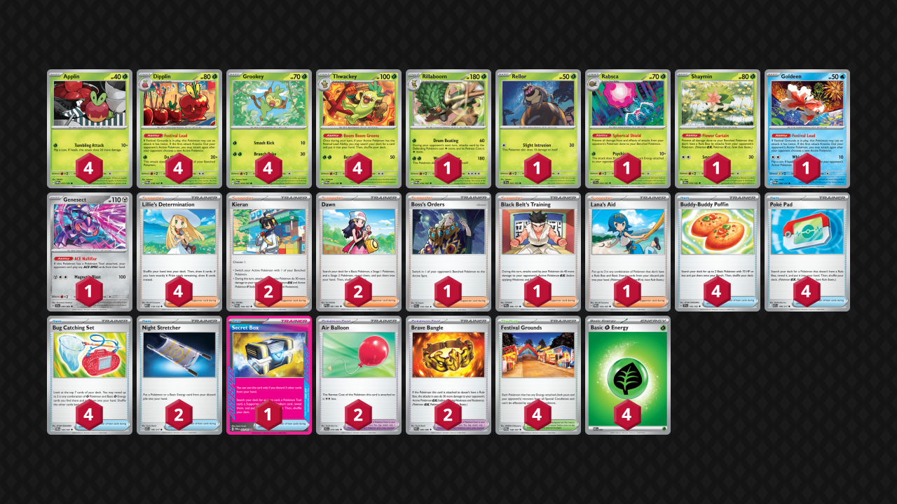

## Decklist


```decklist
Pokémon: 22
4 Applin TWM 17
4 Dipplin TWM 18
4 Grookey TWM 14
4 Thwackey TWM 15
1 Rillaboom TWM 16
1 Rellor TEF 23
1 Rabsca TEF 24
1 Shaymin DRI 10
1 Goldeen TWM 44
1 Genesect SFA 40

Trainer: 34
4 Lillie's Determination MEG 119
2 Kieran TWM 154
2 Dawn PFL 87
1 Boss's Orders PAL 172
1 Black Belt's Training PRE 96
1 Lana's Aid TWM 155
4 Buddy-Buddy Poffin TEF 144
4 Poké Pad ASC 198
4 Bug Catching Set TWM 143
2 Night Stretcher ASC 196
1 Secret Box TWM 163
2 Air Balloon BLK 79
2 Brave Bangle WHT 80
4 Festival Grounds TWM 149

Energy: 4
4 Grass Energy MEE 1
```
<!-- PUBLIC -->
### Inclusions

- I like playing four Thwackey because the deck needs to see it early to function, always needs two in play, and sometimes even needs three.
- Rillaboom is an optional tech for Crustle with Cornerstone. It does that job very well, as Rellor alone isn’t enough to beat that deck. It’s useless against most other things besides decks with Handheld Fan, or unless you somehow run out of Festival Grounds. You could cut it for something like another Boss.
- Rabsca is a necessary tech for Dragapult and it works well.
- Shaymin flips the matchup against decks that have Wellspring Ogerpon, Arboliva, or Darmanitan. It is quite efficient for only one deck spot.
- Goldeen helps with early-game consistency. This deck has a fantastic matchup spread but can sometimes brick, and Goldeen helps brick less often. You can theoretically use it as a pivot on the board to help against hand disruption, but that didn’t come up for me very often.
- Genesect is another tech for Dragapult. It is very strong against Dragapult decks with Cape specifically, and also Stamp. It can theoretically be good against other decks with Stamp, but I found it did not come up that often.
- Dawn is equally good regardless if Rillaboom is in the deck or not. It is just for early-game consistency and is usually better than Brock’s Scouting since this deck needs two different Stage 1 Pokemon in play to function.
- Black Belt’s Training enables relevant breakpoints against Mega Lucario and Mega Starmie. Against other decks, it’s still used as a generic damage modifier while Kieran can be reserved for an emergency switching card.
- Lana’s Aid has excellent synergy with this deck and you’ll want to use it for value when you don’t need another Supporter for the turn. However, since this deck usually needs to use a different Supporter, we only play one Lana to not rely on it too much.
- Secret Box is definitely the best Ace Spec for this deck. It grabs four combo pieces for the price of one search, which allows us to stabilize or reach for a big KO even with a weaker board, early in the game, or after getting Stamped. It is the ultimate consistency card.

### Exclusions

- Seaking can be a good response to an opposing tech Chi-Yu, but I don’t want to put Goldeen down randomly, so it requires advance knowledge of the opponent’s list for full effectiveness. Drawing cards on Turn 2 sounds nice, but requires multiple searches to get it online, Energy, and a Stadium. If you have all of those prerequisites, you’re already stable and don’t need the draw.
- Lilligant is too much commitment, and that’s something I’m scared of. The effect is not bad. I would play it if it was a basic.
- Psyduck would be good against Dusknoir decks, but those aren’t too popular right now. Bench space would also get a bit clogged against Dragapult/Dusknoir since you need the Rabsca and just forego the Genesect. Starting Psyduck against anything else is absolutely miserable too.
- Brock’s Scouting is worse than Dawn. Of course, there are some situations where you’d wish that you had Brock instead, but the same could be said for any random card.
- Gusting is not that important in this deck, so playing one Boss is fine. Another one would be nice though since it can help make comebacks.
- Other Ace Specs are far inferior to Secret Box. Honorable mention to Maximum Belt for saving two deck spots, which is pretty cool.
- Switch is worse than two Kieran and two Air Balloon, especially with Genesect in the list.
- Other random cards such as Sacred Ash, Judge, or Forest of Vitality are just bad and pointless.
<!-- /PUBLIC -->
## Gameplay Tips

- The most important thing when playing this deck is to always make sure you have a way to use Thwackey’s Boom Boom Groove Ability. Ideally, you’ll have a backup Dipplin on the bench in case your attacking one gets KO’d and you get Stamped. If you only have Applin, make sure to at least have a way to search out Dipplin in hand. Saving cards like Bug Catching Set can help draw out of Stamp. You can also have Genesect or Goldeen on the bench with Air Balloon as other ways to play around Stamp.
- If all of your ducks are in a row, try to preemptively search out Air Balloon. If your Thwackey gets gusted, it may get stuck there for a very long time. If your opponent’s deck plays retreat-lock, preemptively search out Kieran instead of Balloon (having both is great).
- In general, three Thwackey on the board is better than three Apples, but many exceptions exist.
- Secret Box is a valuable resource. Don’t use it unless you have to in order to get the KO (or to set up/play the game).
- Since this deck has such good prize trades into most matchups, it is ok to spend a turn getting set up and “doing nothing” as long as you can stabilize and convert that off-turn into a winning prize trade. This requires a bit of matchup and situational awareness.
- When you start with Grookey and one Energy, you often want to attach to the Grookey for maximum flexibility. If the Applin will be safe, retreat into it preemptively. They are unlikely to use Boss on Turn 1, and you need Thwackey’s Ability to get the deck going, which requires Dipplin in the active. Attaching to Applin first might leave you stuck.
- Deciding whether or not to use the double attack has some implications. Against any deck without Munkidori, you’re almost always using it. If they do have Munkidori and use it (or another single-prizer) as a sponge, it is sometimes better to cancel the second attack in order to not leave damage on their board. However, if you foresee that you can get value from that damage yourself by using it for a KO on the next turn, it can still be ok to smack into it. This depends on their likelihood/ease of access for Adrenabrain (they might have to attach to Dragapult instead), the value/effect on the board that Adrenabrain has (they could retreat it and get lots of free damage), and of course how weak/strong the opponent’s overall board state is. 
- As an extension of this, you can also hold Festival Grounds for a turn if you won’t get any value from the double attack and are worried about the Stadium getting bumped (maybe you prized two Festival Grounds). One important thing is that there is inherent value in forcing the opponent to push up a sponge, as they will have to expend further resources to move it from the active. The most common example is against Dragapult when they have vulnerable Drakloak and Munkidori as a sponge.
- Sometimes you do need to play around random Xerosic. If you have what you need for next turn and a somewhat large hand, don’t search out more good resources.
- Assume that you’ll never attack with Goldeen or Rabsca.
- Go first against everything besides decks that can often KO Grookey on Turn 1 (Lucario, Raging Bolt, or some other Crispin decks). Although Garchomp technically can get the KO on Turn 1, go first against it anyway. Consider starting with non-Applin Pokemon when going first against decks like Garchomp or Dragapult (this can depend on your hand). They can reasonably KO Applin but are unlikely to KO anything else on Turn 1.

## Matchups

### Dragapult - Depends

This matchup is favorable against lists without Rare Candy. It is particularly favorable against the winning Prague list (Dudunsparce) because it is a bit slower and its only trick (Hero’s Cape) is locked by Genesect. The more Rare Candy they have, the more difficult it gets. Against the Tord list (three Rare Candy), it is still pretty close or slightly unfavorable. Against Dusknoir, it is unfavorable.

- Rabsca is absolutely imperative to set up quickly. Of course, you also need Dipplin and Thwackey first in order to play the game, but Rabsca is also a priority. It can be annoying to get under Item lock, so try to get the Rellor right away. Rellor takes priority even over the second Applin or second Grookey. It takes priority even over the first Applin if you happen to start with Goldeen or have to use it to set up, though Goldeen is quite bad in this matchup overall so I would avoid it if possible.
- Genesect is best for this matchup. Ideal board is two Thwackey, two apples, Rabsca, and Genesect w/ Balloon. If they have already used their Ace Spec, Genesect is obviously useless, so that spot should be another apple instead. Once they KO Rabsca, you’ll want to have as many Dipplin in play as possible.
- Leaving damage on their board is generally bad. Usually I don’t use the double attack against Munkidori if I can’t get the KO, but if their board is weak or they’re not doing great on Energy attachments, I may smack into it instead to set up a stronger turn next turn. Smacking into Dragapult is a big no-no. We always want to one-shot Dragapult.
- If you don’t already have Kieran in hand, use Black Belt first to get the one-shot. This lets us save Kieran in case we need to switch, but of course, using Kieran is totally fine if it’s more convenient in the situation. This applies to most matchups, so I won’t mention it every time.
- Rabsca will inevitably die. Don’t bother recovering it. There may be very rare exceptions.

```youtube
id: tcf2S94_PRY
title: Festival v Pult 1
```

```youtube
id: ImXsejPjQFE
title: Festival v Pult 2
```

```youtube
id: ZwTtfOhLMS0
title: Festival v Pult 3
```

### Garchomp - Very Favorable

- This matchup is just as free as you would expect. Focus on setting up and stabilizing so that you cannot lose. Get triple Thwackey and at least two apples. Ideally, I would go for an extra apple over Genesect, but if your board is a bit fragile and you’re vulnerable to Stamp, getting Genesect is fine. Passing or utilizing Goldeen are also options to stabilize. If you know they do not play Stamp, you don’t need to be as careful.
- Slamming Festival Grounds instantly is usually fine. They often don’t play Stadiums, or sometimes just one. They do sometimes play Judge or Stamp though.

```youtube
id: Jimw7-gidwk
title: Festival v Chomp 1
```

### Alakazam - Even

This matchup is pretty close. However, if they have Handheld Fan and you don’t have Rillaboom, it’s very unfavorable. If you do, it’s still unfavorable.

- Festival Grounds is a resource since they often play four Battle Cage. Don’t put it in play until you’re ready to attack.
- They don’t play hand disruption. Be as fast and aggressive as possible.
- If they bump your Stadium, consider using Boss to KO something small while saving a Stadium. If you play all the Stadiums early, you might run out, and they can create an endgame board that cannot be KO’d by a single-attack Dipplin. If they don’t have Kadabra in play, KO’ing their active Alakazam is still best to force them to find Rare Candy.
- Early Genesect can be ok if the opportunity presents itself. However it is very bad to have in play if they play Fan. Against Fan, you want to force them to put Energy on Thwackey.
- Rillaboom is very good for one-shotting through Fan. If they don’t play Fan, you may want to preemptively attach an extra Energy to Thwackey to play around the possibility of running out of Stadiums, but this might be irrelevant depending on how many resources you have left. If you didn’t get the initial two-prize lead, saving Energy for Dipplin is usually better since you may run low on Energy.

```youtube
id: g5-pKFaJc_Y
title: Festival v Zam 1
```

```youtube
id: X3YpsKBoBBI
title: Festival v Zam 2
```

### Mewtwo - Very Favorable

- They have easy access to Archer which is basically a Stamp that you can’t lock with Genesect. Playing around Archer is the main thing in this matchup. Try to get a backup Dipplin as soon as possible. If you can’t, Goldeen with Air Balloon can be a good way to play around Archer (or can help set up). Ideal board is triple apple and 2-3 Thwackey depending if you need Goldeen.
- All of the techs are useless. Just attack normally every turn. Black Belt (or Kieran + Bangle) can get the KO on Mewtwo if they attack with it.

```youtube
id: YT4891TzjBk
title: Festival v Mewtwo 1
```

### Zoroark - Very Favorable

- Leave a spot for Shaymin and make sure to get it as soon as they put down Darumaka. If they don’t play Darmanitan, Shaymin is obviously useless but I would assume they do until proven otherwise.
- Preemptively search out Kieran so Thwackey doesn’t get stuck in the active. Balloon isn’t good enough because they might use Yveltal, but ideally you have both to react to the situation. Believe it or not, Thwackey/Shaymin getting stuck can be a loss if they’re also able to build up damage with Pecharunt, so we need Kieran.
- Black Belt Bangle combo can be used to one-shot Lopunny if they play it.
- One-shotting the Zoroark with just the first attack is possible but not worth the resources if they have a sponge ready on the bench. If they don’t have a sponge, you can destroy them.

```youtube
id: nqiBklziLiw
title: Festival v Zoroark 1
```

### Lucario - Favorable

- Prioritize getting triple Thwackey. They are needed for recovering off Judge and getting the one-shot on Lucario. Ideally you’ll also get triple apples. Goldeen can help set up and stabilize if needed.
- Boss is a good late-game resource for closing out the game.
- Black Belt + Bangle to one-shot Lucario. If you can’t win by gusting around their second Lucario, you’ll just have to two-shot it.
- Play around Judge but not Stamp. Being fast and aggressive is good because they don’t play Stamp or Fez.
- The Pokemon techs are mostly useless but Genesect can be good to start with since it tanks Solrock.

```youtube
id: plt2swbYZCQ
title: Festival v Lucario 1
```

```youtube
id: BQW03QYb1X0
title: Festival v Lucario 2
```

### Meganium - Slightly Favorable

- Damage modifiers are premium resources. You’ll most likely need all of them to win.
- Use Bangle + Kieran/Black Belt to one-shot Arboliva. Use Kieran/Black Belt to KO Ogerpon, saving Bangle for Arboliva.
- It’s important to make use of their Forest to ensure that you always have a backup Dipplin. You will usually not have space for Genesect and they will use hand disruption such as Stamp/Judge. Thanks to their Forest, you don’t necessarily need triple apple and can prioritize triple Thwackey instead.
- Ideal board is triple Thwackey, Shaymin, double apple. The triple Thwackey are important because you need a lot of cards after getting disrupted. Using their Forest can make the backup Applin always become Dipplin. If the ideal board isn’t possible, Genesect can make an appearance.
- Early Shaymin is extremely important assuming they are playing Arboliva.

```youtube
id: hCIQ25JKocE
title: Festival v Meganium 1
```

```youtube
id: 6Xz91WQNidc
title: Festival v Meganium 2
```

### Raging Bolt and Turbo Ogerpon - Very Favorable

- Get Shaymin as soon as possible, as many of them are playing Wellspring Ogerpon now. Even if they aren’t, they might have baby Bolt and can get the Boss + Stamp play, so Shaymin is still good against that. I would assume they have Wellspring until proven otherwise.
- Ideal board is Shaymin, double Thwackey, and triple apple to play around Stamp (or two apple and Genesect/Goldeen). If they don’t play Stamp or have already used it, third Thwackey takes priority over third apple/Genesect.
- Stabilizing and setting up for a winning prize trade is the most important thing. Try not to get cheesed or leave any openings.

```youtube
id: X6nTeKlYEVE
title: Festival v Bolt 1
```

### Festival Lead Mirror - Even

At worst, this matchup is even. Since we have Genesect and Rillaboom, we are favored against any list that does not have sufficient sponges. Other lists will often have Seaking for this purpose.

- This matchup relies entirely on sponges. Get Genesect in play as soon as possible. It doesn’t necessarily need a tool, as its purpose is a sponge. When they take a KO, promote Genesect. Rinse and repeat. When Genesect gets KO’d, get it back. The same concept can apply for Rillaboom, though you’re permanently losing a Thwackey, so save that one for later. Sometimes you’ll need it earlier if you can’t afford to sacrifice Genesect in two hits.
- Switching cards are premium resources. You’ll need Air Balloon to retreat Genesect and Kieran to switch out Rillaboom after using them to sponge.

### Crustle - Rillaboom

If you have Rillaboom you win and if you don’t, the matchup is unfavorable. Here’s some notes for if you don’t have Rillaboom.

- Without Rillaboom, the best way to KO Cornerstone is Rellor. If they have Kangaskhan, you may be tempted to one-shot it with two damage modifiers. I did this and always lost. However, if they don’t yet have Cornerstone, it’s fine to one-shot the Kang as you can run them off the board. If they have Cornerstone, save all of the damage mods for that and just two-shot the Kangaskhan. Putting Bangle on Dipplin also locks it out of Balloon which is very annoying.
- Recovery, switching cards, damage mods, and Energy are all premium resources for getting multiple big Rellor attacks into their Cornerstone.
- If you run out of Rellor or prize it, flipping heads with Applin accomplishes the same thing.

```youtube
id: s16Xk0eqB8c
title: Festival v Crustle 1
```

## Personal Thoughts

I think this deck is stupid but it is insanely good right now. It has an obscene matchup spread and beats everything. Even the Dragapult matchups are fine overall and this deck does not brick nearly as much as I was expecting. This deck is actually a massive threat in the current metagame and people might tech stuff like Chi-Yu or Handheld Fan for it. I haven’t tested the Chi-Yu so I’m not sure if it’s that big of a deal. If it becomes popular, I’ll consider adding Seaking to deal with it. Since most Festival Lead players already have Seaking, I don’t know if Chi-Yu will be that relevant.
