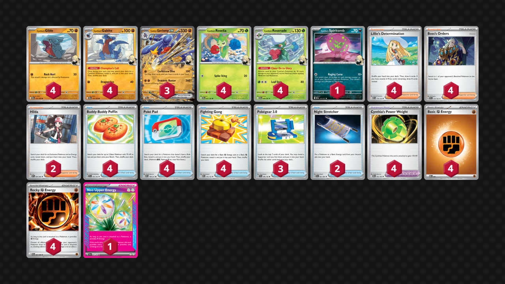

## Decklist


```decklist
Pokémon: 20
4 Cynthia's Gible DRI 102
4 Cynthia's Gabite DRI 103
3 Cynthia's Garchomp ex DRI 104
4 Cynthia's Roselia DRI 7
4 Cynthia's Roserade DRI 8
1 Cynthia's Spiritomb ASC 133

Trainer: 31
4 Lillie's Determination MEG 119
4 Boss's Orders PAL 172
2 Hilda WHT 84
4 Buddy-Buddy Poffin TEF 144
4 Poké Pad ASC 198
4 Fighting Gong MEG 116
3 Pokégear 3.0 SVI 186
2 Night Stretcher SFA 61
4 Cynthia's Power Weight DRI 162

Energy: 9
4 Fighting Energy MEE 6
4 Rocky Fighting Energy POR 87
1 Neo Upper Energy TEF 162
```
<!-- PUBLIC -->
### Inclusions

- I think four Roserade is best because it’s very hard to find Premium Power Pro on demand, and there’s not enough space to accommodate for them. Roserade is easy to search, and a Roselia often gets KO’d early when you start it. There are also some matchups where you need three or even four Roserade.
- Spiritomb is broken at random times. Although it’s situational, it’s only a one-card commitment and can often get big KO’s for free. Very strong card.
- Four Boss is necessary, as this deck likes to spam Boss. It’s important on turns where you’re forced into the first attack so you can get a KO with it, and also used to close out games most of the time.
- Similarly, Pokegear 3.0 provides a nice boost to consistency and more importantly makes it easier to find Boss on the right turns.
- Hilda is situational but helps get the deck going by finding two very important pieces: Gabite and an Energy drop. It can also be useful to find Neo Upper in some spots for a big play.
- Poffin is the best setup card for obvious reasons. PokePad is necessary as our main way to find Gabite, which gest the deck online. Fighting Gong helps us not miss Energy drops and gets Gible in case we don’t have Poffin.
- Stretcher is fairly weak but helps us maintain our optimal board. It is mostly used to cover for bad prize cards or early KO’s. Use it whenever you can get value, as it’s not a premium resource like it is in other decks.
- I wasn’t sure about four Power Weight at first, but now I’m certain that all four are necessary. This card is broken. It’s important to draw early to protect the little ones, and some matchups require them to be on all of your Garchomp.
- Rocky Energy is very relevant against Dragapult and Alakazam, but best of all, there’s basically no downside to playing them.
- I think Neo Upper is the best Ace Spec because it allows us to do powerful plays that would otherwise be impossible. It has great synergy with the deck and none of the other Ace Specs are all that enticing. However, it is possible to play another Ace Spec if you can find a good reason to, as Neo Upper isn’t completely integral for the deck to function.

### Exclusions

- Surfer, Judge, and other Supporters are bad and useless. Surfer does basically nothing and I don’t care about retreat lock for the time being because it has to be an extremely specific situation for you to actually lose to it. Even if that does happen, there’s a good chance you won’t actually have the Surfer anyway. You can also play around retreat lock to some extent by not evolving into Roserade. Judge actually does nothing.
- Stadiums are bad and useless too. Having counter Stadiums against Dragapult is good but since that matchup is favored anyway I don’t see the point. Watchtower could be good if Raging Bolt becomes popular, but that is not the case right now. Watchtower plus Judge could theoretically scam some wins against Alakazam but that would require playing both of them and drawing them at the right time, and hoping they whiff a Battle Cage. Not worth playing. Forest of Vitality actually does have a use case. There are some games where you’re slow to get Roserade out or they get snpied off, so it could be good then, but ultimately still not worth the space in my opinion.
- Premium Power Pro is nice in theory. However, there’s no good way to search them, so you’d have to play quite a few for it to be relevant. I think Roserade is more reliable and you need four Roselia anyway, so it’s hard to find the space. Playing with just 1-2 Premium Power Pro felt pointless.
- Prime Catcher actually seems pretty good but I haven’t tried it. It’s the only Ace Spec I’d seriously consider over Neo Upper right now. Unfair Stamp is a great card but this deck really doesn’t care about hand disruption or lack draw power.
- Rare Candy could be nice for some random high roll or recovery potential but I think it’s too situational. Skipping the Gabite also somewhat kneecaps this deck.
<!-- /PUBLIC -->
## Gameplay Tips

- I prefer to start with Roselia to Gible because I would rather it get KO’d than Gible. Starting with Spiritomb is generally bad because you might get locked out of that bench spot.
- If Garchomp gets damaged, it’s usually better to retreat and attack with an undamaged one. An exception would be if you’re chaining the big attack and need to preserve Energy, particularly if you are utilizing the Neo Upper.
- Neo Upper should be treated like a power-play type card rather than just a normal Energy drop. Usually I prefer attaching Fighting instead to preserve the flexibility of Neo Upper, though sometimes it is better to put it on the board if you’re worried about hand disruption or have no other Energy to attach.
- Working in an attack with single-prize Pokemon such as Gabite or Roselia is a valid way to win prize trades, though it’s not all that common since Garchomp is usually immune to one-shots with the Power Weight.
- Slamming Power Weights early, especially on your active, is a great way to protect the small Pokemon in the early-game. This can make it more annoying or difficult for the opponent in a variety of matchups.
- If you suspect your opponent might be playing retreat lock and can punish you with it, don’t evolve into Roserade. If you need Roserade to get a KO, that’s fine, but don’t throw them down carelessly or evolve into more than necessary. If your Roselia gets retreat locked, simply evolve and retreat it.
- Once your board is fully set up, consider evolving extra Gabite into Garchomp. If Gabite can get sniped off (especially with Energy), evolving them can be good for protection. If there is no apparent risk to leaving Gabite unevolved, then you can leave them unevolved for the potential flexibility of a single-prize board. If your opponent can take advantage of extra Garchomp in play for their prize map, that is another reason to leave them unevolved. This is all situation dependent but often relevant.
- Boss KO on Meowth/Fez with the first attack is extremely strong and should mostly be used when you cannot get two prizes on their active. This is an important part of prize racing with this deck.
- In matchups where Fighting and Rocky are the same, usually attach Fighting Energy first (especially when you need to retreat). I’ve had enough situations where I need to Stretcher for a retreated Fighting Energy that I’ve been conditioned to default attach Fighting before Rocky.
- Go first unless except against Lucario or other favorable matchups that can get a KO on Turn 1.

## Matchups

### Dragapult - Favorable

- Go for triple Gabite and double Roserade. I sometimes like to leave a spot open for Spiritomb if it isn’t prized, but this does become awkward because if they target down Roserade you won’t be able to get the KO. This is generally fine though since you can Boss around their Dragapult if that happens. Sometimes it is better to prioritize the third Roserade instead of the open spot for Spiritomb, such as if they have a superior start or they have no two-prize liabilities that Garchomp’s first attack can pick off.
- Attacking with an undamaged Garchomp is usually best whenever possible. If you can get a big one-shot with Spiritomb, that’s usually good to go for.
- Try to get Energy drops every turn. Rocky Energy is very good on Gabite/Gible as it is basically invincible and can keep searching stuff out. They won’t use a Boss on it because there are better things for them to be doing.
- Dusclops (or lone Duskull if they’re likely to have Candy Dusknoir) can be good to target down, as Dusknoir is a big threat. However, if you already have a good prize map, you can leave it be since it gives you a prize card. This is easier to evaluate later in the game and is very situational.
- If you cannot one-shot their Dragapult, try to Boss around it. If you cannot do that either, sometimes it’s better to pass. Smacking into their Dragapult for less than a KO can be a good way to pressure them if their board/hand is not fully stabilized (or if they’re board locked out of Munkidori). Otherwise, you’re giving them a damage bank for Adrenabrain and they can punish you for it. It’s important to evaluate the situation when deciding. Another thing is that sometimes you just need to use the first attack to draw cards.

The game count in the videos is so bad because I was using a bad list at first. I end up fixing it later on to reflect the current list.

```youtube
id: L91Px7smMls
title: Chomp v Pult 1
```

```youtube
id: GLj-hxbxidE
title: Chomp v Pult 2
```

```youtube
id: WIPj56l63IE
title: Chomp v Pult 3
```

### Lucario - Favorable

- Early Power Weight on your active is insanely strong, protects it from Aura Jab and Solrock. You’ll also want it on Garchomp to make it hard for Lucario to KO it.
- Don’t evolve into extra Garchomp without a Power Weight as they can easily one-shot it with Lucario.
- Get triple Roserade to one-shot Lucario. If you don’t have three Roserade, Boss around it and then one-shot them when you do have them.
- If they put two Lucario in play, go for a 3-3 prize map. Otherwise, scoop up single-prize KO’s whenever possible to go for a 1-1-1-3 line.
- Gible/Gabite with double or triple Roserade can get certain single-prize KO’s. If you are worried about Garchomp getting KO’d or in danger of losing a trade, this can be relevant.

```youtube
id: hUTwVpazbKw
title: Chomp v Lucario 1
```

```youtube
id: fzdEVpj8fSg
title: Chomp v Lucario 2
```

### Alakazam - Even

Assuming they play two Enhanced Hammer, this matchup is about even, or slightly favorable. If they play fewer Hammer, it’s a free win, and if they play more, it’s basically unwinnable.

- Your win condition is getting N + 1 Rocky Energy in play, where N is the number of Enhanced Hammer they play. Fighting Energy is bad because it isn’t Rocky Energy, so only attach it if you definitely can’t get a Rocky for the turn.
- Garchomp is generally bad to get into play before you’ve achieved your win condition. It speeds up the game and gives them a two-prize KO, which is more lose conditions. Only use it if your hand is dead and you need to draw cards to stay in the game.
- Playing Lillie instead of Hilda is better for finding the first Rocky or two. Hilda is better when you only need one or two more Rocky to win the game.
- Benching a few random Pokemon to thin is fine, but don’t give up too many. Be mindful of how many Boss they have left and don’t let them win by using Boss. How many Pokemon you can put down depends on how many prizes and how many Bosses they have left. You also need to account for them getting one or two free KO’s with Enhanced Hammer.
- Your active Pokemon should have Rocky Energy to force them to find Hammer or Boss. If you don’t have any Rocky Energy, sacrifice Roselia/Roserade over Gible/Gabite.

```youtube
id: 8q94dnhtquM
title: Chomp v Zam 1
```

```youtube
id: sAhw5oGWVZE
title: Chomp v Zam 2
```

### Meganium - Unfavorable

- Power Weight is good on the bench to protect Energy drops and Gible/Gabite from Arboliva. It’s also good on Garchomp to force them to chain three-Energy Ogerpon.
- Prioritize three Gabite, but later you can get the quad Roserade board which lets you one-shot Ogerpon with the first attack. You can use their Forest for instant Roserade whenever.
- If you don’t get early Power Weight and also didn’t start with Gible, you’ll want to attach to your Active. If you attach to the bench your Energy might get spawn trapped by Arboliva and your active gets stuck.
- Winning a prize trade is possible and that’s the ideal game plan.
- If they get a good start they will be ahead on the prize trade, so you’ll have to go to a backup plan. KO Meganium can be a viable play because it’s hard for them to KO Garchomp without it. Alternatively, if you don’t think they can chain three-Energy Ogerpon, you can try KO’ing back to back Ogerpon and hoping they whiff something.

```youtube
id: hZzfYs-eYcI
title: Chomp v Meg 1
```

```youtube
id: Tyoe8uv-E4c
title: Chomp v Meg 2
```

```youtube
id: A0I3I8FeHYw
title: Chomp v Meg 3
```

### Garchomp Mirror - Even

- Get triple Roserade and one-shot any Garchomp that doesn’t have Power Weight. Don’t let them do the same to you. Don’t put down extra Garchomp without Power Weight. If you have to in order to attack, KO’ing Roserade can stop an incoming one-shot.
- Do not let them get a free Spiritomb one-shot. You’ll inevitably have to smack a Garchomp for a two-shot, so use the first attack first and then Boss to finish it off.

### Raging Bolt - Unfavorable

This matchup is pretty bad if they play the Iron Leaves plus Jamming Tower combo. If they don’t play either, it’s still unfavorable but a lot closer.

- Early Power Weight on your active is very good to make it annoying to KO. As usual, you’ll also need them on Garchomp. Even if they play Jamming Tower, they won’t always have it in play.
- Like with Meganium, it’s possible to win a prize trade outright, and that’s the ideal game plan.
- If they put down Fez, using Gabite with three Roserade to KO it is a very strong play that can swing the prize trade back.
- Targeting their Energy or support is generally good. They can one-shot Garchomp with either Ogerpon or Raging Bolt, but either option requires a lot of Energy.

```youtube
id: 6pt514ByFc8
title: Chomp v Bolt 1
```

```youtube
id: hk89SR43qCE
title: Chomp v Bolt 2
```

### Absol / Slop Box - Favorable

- Weights can be good in the early-game to protect Gabite and Energy drops from a fast Fezandipiti.
- If they play Absol, be wary of Terminal Period. If you have to smack into it to draw cards, that’s one thing, but if you don’t, better to Boss or wait for a one-shot.
- Triple Roserade allows Garchomp to one-shot Clefairy with its first attack, which is relevant.

```youtube
id: MNNf2n41tB0
title: Chomp v Slop 1
```

```youtube
id: aGzRod7FXUs
title: Chomp v Slop 2
```

```youtube
id: YhIOn0kE4ko
title: Chomp v Slop 3
```

### Mewtwo - Unfavorable

- Prioritize multiple Gabite. You also want to get two or three Roserade eventually. Only one Roserade is needed to KO Spidops, two for Mewtwo, and three for Gabite to KO Spidops. 
- Try to keep them on odd prizes and get a KO every turn. Gabite Boss KO on Tarountula (if you don’t have three Roserade) is another possible way to get them on odd prizes.
- Weight on Garchomp is extremely important. Don’t use the Weights early (especially on your active) because they might get KO’d before you evolve into Garchomp. Don’t evolve into extra Garchomp without Weight. Just try to play in such a way that you’ll always have Weight for Garchomp!
- The one exception is that Power Weight on an active Roserade can buy you a turn before you’re set up because it can survive Spidops or even Mewtwo.

```youtube
id: 9FyEwjGxUZE
title: Chomp v Mewtwo 1
```

```youtube
id: cGdmwR51CxI
title: Chomp v Mewtwo 2
```

```youtube
id: LvY_9sbjIjQ
title: Chomp v Mewtwo 3
```

### Zoroark - Favorable

- Early Power Weight on your active is very good to protect from Darmanitan. Try to not let them get value from Darmanitan as it is a way to actually lose. In the mid- or late-game, put Power Weight on benched Pokemon that are within Darmanitan range. Power Weight is also useful on Garchomp because they can one-shot it with Mochi plus Black Belt. However, since this combo is kind of hard for them to pull off, I prioritize using Weight for protecting Pokemon from Darmanitan if they are threatening it.
- Load up as much Energy in play as possible and try to protect them so that you can chain the second attack. If they have Pech or Meowth, Boss KO it when you can’t one-shot Zoroark. For the most part, you should be one-shotting Zoroark.
- Later in the game, don’t put down extra Pokemon that you don’t need, as Darmanitan can punish them. You only need two Roserade. One to one-shot Zoroark, and the second in case the first gets KO’d. If they are threatening retreat lock, only get the one Roserade and two Roselia.

```youtube
id: nYKMJsbXtIQ
title: Chomp v Zoro 1
```

```youtube
id: s3PdNIgy3AY
title: Chomp v Zoro 2
```

### Crustle - Unfavorable

- Get as many Roserade as possible. Ideally all four of them, so you can one-shot Crustle.
- Attack fast and use Boss to apply pressure on their Energy.

```youtube
id: JxbWBGACztg
title: Crustle v Garchomp 1
```

## Personal Thoughts

This deck is surprisingly good. Its matchup spread is solid, and overall the deck seems better than everything else besides Dragapult. It has a great built-in engine and insane stats. Of course, it’s weak to some of the Grass decks, but I don’t think there’s anything you can do about it. Playing Garchomp is very strong if the Grass decks aren’t as popular. I think they aren’t very good, so perhaps they will see a decrease in play if other people think the same way.
