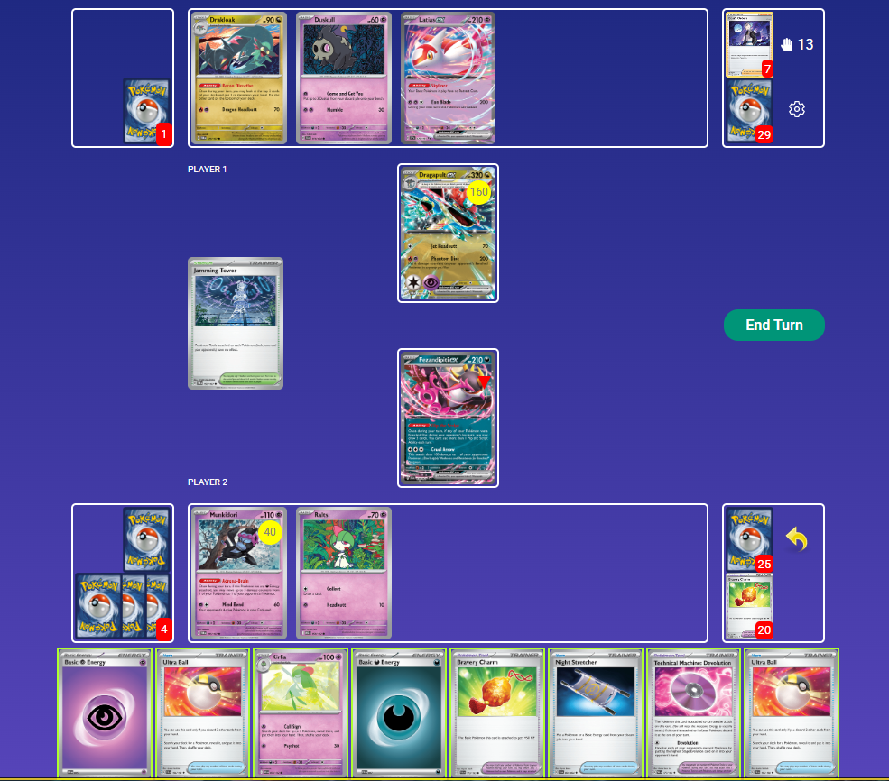
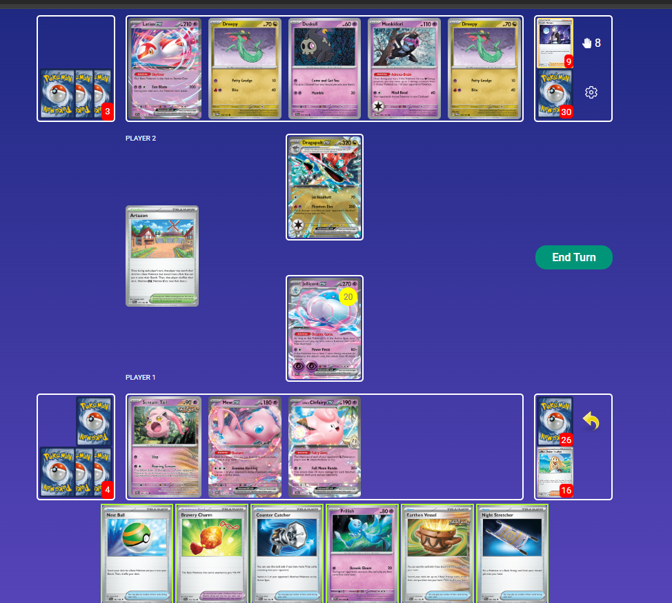
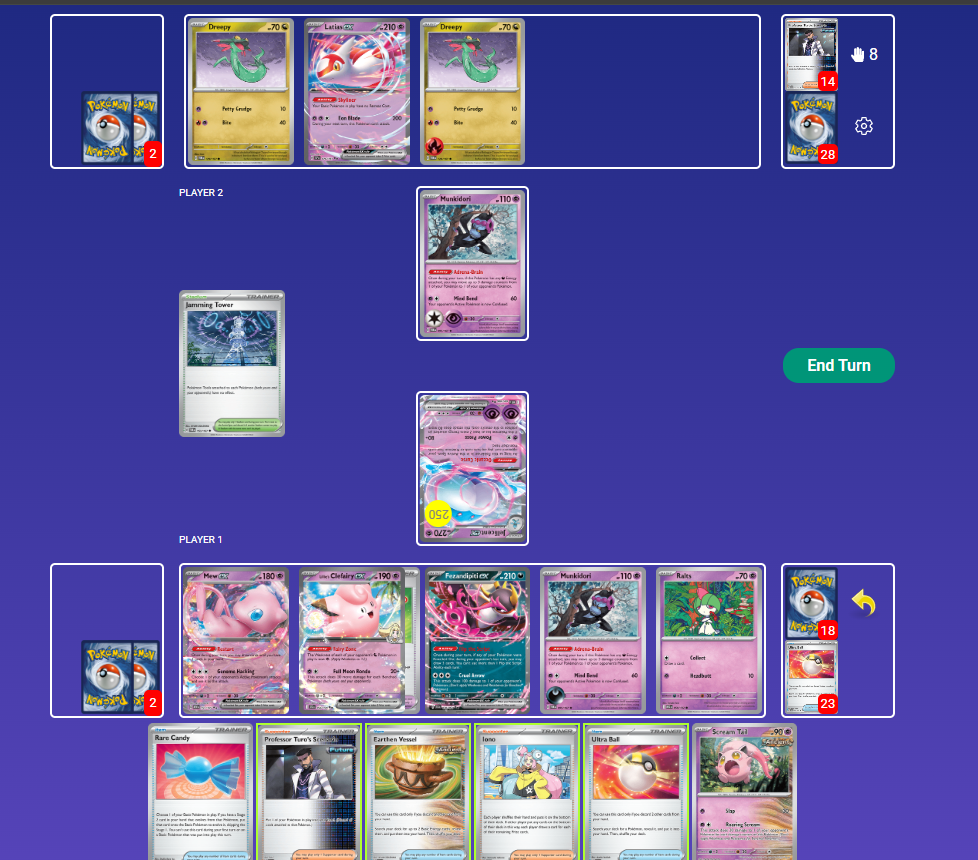
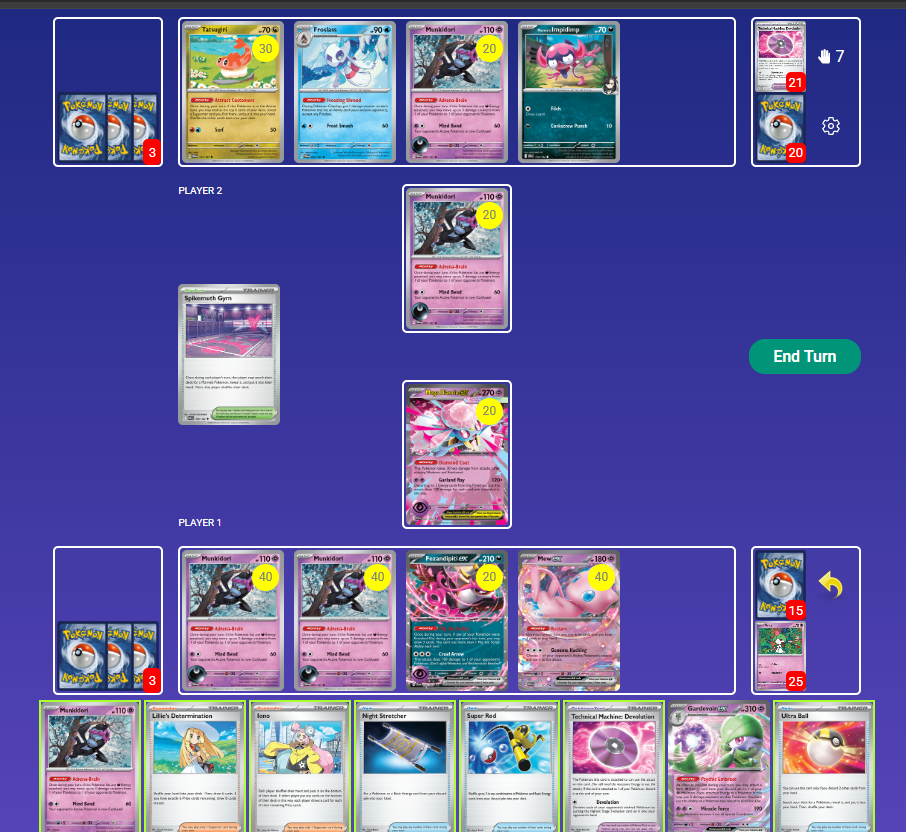

## Decklist


```decklist
Pokémon: 17
3 Ralts MEG 58
2 Kirlia MEG 59
2 Gardevoir ex SVI 86
3 Munkidori TWM 95
1 Frillish WHT 44
1 Mew ex MEW 151
1 Lillie's Clefairy ex JTG 56
1 Latias ex SSP 76
1 Mega Diancie ex PFL 41
1 Fezandipiti ex SFA 38
1 Scream Tail PAR 86

Trainer: 33
4 Lillie's Determination MEG 119
4 Iono PAL 185
1 Arven OBF 186
1 Professor Turo's Scenario PAR 171
4 Ultra Ball MEG 131
3 Earthen Vessel PAR 163
2 Rare Candy MEG 125
2 Nest Ball SVI 181
2 Night Stretcher SFA 61
2 Counter Catcher PAR 160
1 Super Rod PAL 188
1 Secret Box TWM 163
2 Bravery Charm PAL 173
1 Technical Machine: Devolution PAR 177
1 Technical Machine: Evolution PAR 178
2 Artazon PAL 171

Energy: 10
7 Psychic Energy MEE 5
3 Darkness Energy MEE 7
```
### Inclusions

- I prefer the Evo build with two Kirlia because it makes a huge difference in the Dragapult matchup. Evo'ing is also generally better in slower matchups, and Jellicent isn't that important overall.
- I tried without the Latias, but getting a consistent Turn 1 Frillish is crucial against Charizard, Absol, and mirror.
- Even without Jellicent, Devo is nearly just as good. It's particularly important against Charizard, Gholdengo, and Grimmsnarl.
- Turo gets used a decent amount. Mostly against Gholdengo and decks with retreat lock. It is very strong for endgames against Gholdengo that involve Frillish comebacks. It's also good for board fixing, though hard to find at the right time. Finally, it's better with Latias because that's a liability that can be removed, and also because Latias makes Energy get stuck, which Turo can unstick.
- I'm convinced that second Artazon is better than Mystery Garden, though they do different things so it's weird to compare them. Artazon helps set up and stabilize, and also makes the Turn 1 Frillish a lot more likely. Mystery Garden is more situational and not very good in the early-game. I did not use it that much when I had it, and never missed it when playing without it.
- I changed my mind about the second Counter Catcher because it is actually very important against Gholdengo, especially the Lopunny build. That is the only reason I've added the second one back in.
- Swapped Cape back for second Charm, but I'm not sure if this is correct. Cape opens up some power options to close out games, specifically against Gholdengo. However, playing only one Charm carries considerable risks such as prizing it or not finding it at the right time. Charm is also very nice against Gholdengo and Absol and playing two makes it more consistent.

### Exclusions

- I decided to cut Jellicent for now, but since I did a lot of testing with it (and it's still relevant), the  notes still include notes for Jellicent. Jellicent is mostly relevant in the mirror. It's also good against Charizard on the Devo turn, and against Dragapult for the non-Evo build. I wasn't using it very much but it could go back in. It's more important to have in the non-Evo build. Also, the Charizard and mirror matchups are compensated for in other ways.
- 8th Psychic and 2nd Arven are certainly useful, but it's a matter of space. I'd rather have some power options (Diancie and Devo) and a better Charizard matchup. I don't think the lack of Arven compromises the Dragapult matchup all that much.
- Drifloon would most likely require another Psychic and Vessel, and doesn't really help as much against Gholdengo as one might think. However, it can be useful against other things, so playing a deck more focused on that isn't necessarily bad.

**To try: Team Rocket's Watchtower.**

## Gameplay

- Going for Turn 1 Latias plus Frillish is generally worth it when the opponent did not have a strong Turn 1 and you can cut off their options. For example, if Gholdengo or Absol did not get their key Pokemon into play, Frillish can cripple them. If they did, Frillish isn't as necessary on Turn 1. Against decks like Charizard and Gardevoir that rely on Items to set up, you basically always want a Turn 1 Frillish.
- Jellicent is sometimes bait because it can be Bossed around or KO'd by Dark-types. However, if there is no incoming punish, it can be a very strong option for applying early pressure.
- Utilizing manual Energy attachments can save games where you don't get Gardevoir as fast as you want, particularly attaching to Diancie, Munkidori, or Clefairy can be helpful.
- Sometimes you need to leave damage in play and/or preload Pokemon with Energy if the opponent is capable of KO'ing Gardevoir. Many games are won by accurately preparing for worst-case scenarios and thinking ahead.
- In general, try to keep multi-prize Basics away from the board in the early-game. They are usually ok to put down later, especially if you have a winning prize trade mapped out and need to stay on tempo. The main exception is an early Fezandipiti if the opponent is applying fast pressure. Another exception is if you can get a fast manual Diancie with no better options.
- Go second against everything besides Fan Rotom decks and Ceruledge.



This scenario is interesting because the game is most likely doomed, but there's still some decisions to be made to maximize the chance of salvaging the game. We can empty our hand and use Mew's Restart off Ultra Ball, so the questions are where to attach the Energy and if we should evolve into Kirlia. Worth noting is that there's only one Stadium out left in the deck, as a Stadium and Secret Box are already gone.

Attaching to Fez opens the copium Candy Garde or Stadium Devo lines. Attaching to Munkidori stops immediate death to Hawlucha, but still loses to Dusclops or Boss (one of each are already in their discard). Either way, we'll most likely need Iono off of this Mew since the opponent has 13 cards in hand. Evolving to Kirlia is also needed to avoid death to Hawlucha, but closes off the Candy Garde line. Since I thought the offensive lines were so unlikely, I opted to play the entire hand down, evolving to Kirlia and attaching to Munki. Restart for 3 hoping for Iono, but whiffed and Adrenabrain to Duskull. I believe there were either three or four Iono left in deck. If there were only one or two, going for an offensive line would probably be more likely to hit.



Here we have a spot that looks dire but is actually not terrible. Their Dragapult has Neo Upper and their Munkidori has Luminous, which means we'll need a Munkidori of our own in order to two-shot their Dragapult with Jellicent. Both Ralts are in the discard, so we may be tempted to Stretcher for one and Charm it, but that is feeding it to Jamming Tower plus Adrenabrain. They have eight cards in hand, but thanks to Jellicent, we know their hand isn't very good, as they would have evolved into Stage 1s if they had any. There's a good chance that they won't be able to progress next turn, so we can see what happens, and play the Ralts when it's safer after taking out the Pult.

We could grab Fez and draw three, but we need space for Munkidori and Ralts next turn. Artazon for Munkidori in case of Jamming Tower, and smack for 160. Vessel for Dark and attaching it now is feeding it to Dusclops unnecessarily, so we save that. Charm can go onto Scream Tail to stop that free prize from Adrenabrain plus Phantom Dive. Hold the rest of the hand.



Continuing from the last position, we did get the two-shot on their Dragapult as well as the Ralts recovery. They did have Jamming Tower to get our Scream Tail (which was apparently recovered in the interim), but thanks to Jellicent's Item lock, they had no choice but to Mind Bend for the turn, and now we can Candy Garde. With plenty of options, we have to identify the correct end result and sequence appropriately. Our only Pokemon that isn't at risk of Ursaluna is Gardevoir, so we should attack with that.

Vessel away Scream Tail for two Psychic, Ultra Ball away a Psychic and Turo for Garde, and use Candy. Manually attach to Jellicent to retreat, so that Adrenabrain gets it out of range of Dreepy's Bite. Adrenabrain to their active so they can't recover Munki and KO Gardevoir with Adrenabrain plus Ursaluna. Play Iono on their 8-card hand now that we're releasing the Item lock, draw one with Mew, load up Gardevoir, retreat, and KO. If they get it, they get it.



My first inclination here was to get Ralts, maybe use Iono, and attack with manual Munkidori. However, we do not need Gardevoir for the rest of this game. In fact, that bench spot is better off used for the third Munkidori. We can use Stretcher for Dark and triple Adrenabrain to KO + spawntrap their Impidimp, ensuring that no Grimmsnarl come into play to close out this game. This completely forgoes an attack for the turn. Even though we could attack with Diancie or Munkidori, KO'ing the Impidimp is just better. Leaving the Diancie in the Active leaves it at risk of Ursaluna, so retreating it and using Iono minimizes the risk. There's also the chance of drawing Bravery Charm to make it completely safe.

## Matchups

### Gholdengo - Slightly Favorable

This matchup is a bit more difficult if they are playing Lopunny. With the second Counter Catcher, I think it is slightly favorable. Against non-Lopunny, the matchup is more favorable.

Against non-Lopunny:

- Oftentimes only need one Gardevoir. If your second one is a Kirlia, don't evolve into the second Gardevoir unnecessarily because they won't disrupt your hand. Try to avoid having things in play that Solrock can KO, especially when Item locking. Bravery Charm or delaying Ralts can be good for this.
- Every turn consider the board state and see if you can pivot into a prize trade. If you can put together a winning prize map, there isn't much they can do about it.
- Ideal board is Gardevoir, Frillish, two Munkidori (extremely important), and then whatever else. Second Frillish is good when they are stalled out and not attacking, but not always necessary. Second Ralts/Kirlia is often good in the early-game! And then a leftover spot for Fez which is often needed, or a random attacker for prize trading.
- If you cannot start prize trading, just keep attacking with Frillish and set up for a Devo play.
- Devo play is very strong but not the main plan, it just sometimes works out that way and is a reliable comeback option.
- Attacking with an early Gardevoir can be strong as it sets up for Frillish gameplan. However, if you do not have the proper follow-up ready, attacking with Gardevoir might be too risky/premature.
- In general, Frillish is your main/default attacker.
- Do not use Jellicent at all in the early- or mid-game. It is best used with the Devo play, but doesn't always matter.
- If they are ahead in prizes and threatening a Mawile attack to escape Frillish lock, try to hit CC Iono Mew on their Mawile for 260. Make sure you do not damage the Mawile before hitting it with Mew, and just hope they don't get Turo. This is pretty situational.
- Charm almost always gets slammed on Frillish.

Against Lopunny:

- This matchup plays a bit differently than above. The win condition is to keep Lopunny off the board and then use Frillish.
- Ideal board is double Munkidori, double Gardevoir, Fez, and your single-prize attacker which should be Scream Tail or Frillish depending on the situation.
- Early attacking Gardevoir is good if either a) there is no Lopunny present or b) you can Counter Catcher smack the Lopunny for 190 with Gardevoir. Otherwise, use Scream Tail to damage the Lopunny as much as possible. If they have Buneary, use Scream Tail to KO it.
- If you're behind in prizes, make sure to save the Turo! It is very important for converting Frillish endgames.
- When they are low on Energy and don't have Lopunny, use Frillish and Adrenabrain for a couple of turns to set up a winning play where you take the rest of your prize cards!
- Putting random extra damage on Lunatone or Solrock is generally good.
- If they have not used Vitality Band yet, make sure to keep Frillish protected with Charm. Once Lopunny is removed, Charmed Frillish is basically invincible.
- Frillish can also be randomly used at some points to buy time or be annoying if you don't have a better play.
- Using Devo to KO the Lopunny is acceptable if it's your only method of doing so. I'd rather have the three prizes, but removing Lopunny is what's important. If you have Jellicent and second Frillish or Turo, you can KO Lopunny with Jellicent + Devo + Iono and then go into Frillish for a very strong play.

```twitch
id: 2676733822
title: Garde v Dengo (Mawile) 1
```
Me learning the matchup, Devo game.

```twitch
id: 2676733831
title: Garde v Dengo (Mawile) 2
```
Looking at alternate timelines in the same game, still learning the matchup. This game is a good example of pivoting from Frillish into prize trade, which is a common win condition.

```twitch
id: 2676733824
title: Garde v Dengo (Mawile) 3
```
Mew plus Counter Catcher Iono can be useful to copy Mawile's second attack if they're building Mawile on the Bench. You don't always have to do this but it is a viable options in some situations.

```twitch
id: 2676733825
title: Garde v Dengo (Mawile) 4
```
Another instance of Mew against Mawile. Jelly Devo game.

```twitch
id: 2676733817
title: Garde v Dengo (Mawile) 5
```
This was a Devo game but it didn't end up working.

```twitch
id: 2676733820
title: Garde v Dengo (Mawile) 6
```
Different endgame routes.

```twitch
id: 2676733830
title: Garde v Dengo (Mawile) 7
```
Rare Diancie checkmate. Lots of options open up for prize trading if they do not get a big lead.

```twitch
id: 2677358602
title: Garde v Dengo (Lopunny) 1
```
Lopunny is very effective at countering Frillish, which applies a lot of pressure and is quite annoying.

```twitch
id: 2677358604
title: Garde v Dengo (Lopunny) 2
```
This game highlights a lot of the issues with this matchup.

```twitch
id: 2683711308
title: Garde v Dengo (Lopunny) 3
```
Interesting game that shows how to come back as Gardevoir.

```twitch
id: 2683711305
title: Garde v Dengo (Lopunny) 4
```
I neglected to put Charm on Fez at the end of the game. This protects it from Lopunny, but this does not come up very often. Not sure if Gardevoir would have necessarily won anyway though.

```twitch
id: 2683711304
title: Garde v Dengo (Lopunny) 5
```
This game shows how Cape can generate a win in a tough spot. However, I did not count that I had exact damage with Adrenabrain and Cape Scream Tail so I initially missed it.

```twitch
id: 2683711307
title: Garde v Dengo (Lopunny) 6
```
This game showcases an interesting line and endgame lethal play.

### Gardevoir Mirror - Even / Depends on lists

- Get Turn 1 Frillish. Fast attacking Jellicent is extremely strong. The non-Evo build has the Jellicent advantage while the Evo build has a better chance of setting up Gardevoir under Item lock.
- If you don't have Gardevoir, try to respond to Jellicent with manual Mind Bend. Manual Diancie plus Adrenabrain does KO, but that is very situational. In any case, getting Darks on Munkidori is a high priority.
- When Gardevoir is set up, KO'ing their Munkidori with Darks via Scream Tail is usually a good play. KO'ing their Jellicent is also good whenever possible.
- Charm is usually best on Scream Tail to prevent Adrenabrain from KO'ing it. Charm can also be good to protect two-prize Pokemon such as Fezandipiti or Latias if they happen to be on the board. Another underrated use for Charm is to protect your only Munkidori with Dark from Scream Tail.
- Mew can copy Scream Tail for tons of damage. This is generally best for closing out the game because Mew is a liability and all the Energy can get stuck on it. Watch out for your opponent doing this to you and try to play around it.
- Counter Catcher can be useful for KO'ing a big two-prize Pokemon such as Gardevoir or something with a Charm. Even if you are the initial aggressor, sometimes the prize trade flips back depending on the Munkidori situation. Activating your opponent's Counter Catcher is generally fine since being ahead in the prize trade is better. But don't activate it unnecessarily in the mid-game if there's potential for a big punish such as instantly losing to them KO'ing Gardevoir.

### Dragapult / Dusknoir - Favorable

This list is favored against Dragapult, but the build with 2-1-2 Gardevoir and no TM: Evo is unfavored against it.

- Early Frillish into attacking Jellicent is generally good. If they ignore the Jellicent and wipe out the Ralts, use Clefairy's Ability to make Jellicent two-shot their Dragapult. If you're not playing Jellicent, Frillish is a low prioritiy.
- Sometimes you won't be able to get Gardevoir out for awhile. Try to manually power up relevant attackers such as Jellicent, Munkidori, or Clefairy. You'll eventually need Gardevoir at some point, so try to find openings to put down double Ralts.
- Using Devo after hitting into their Dragapult once can also be a strong play, depending on the situation. It takes one fewer prize card than KO'ing the Dragapult, but makes it difficult or impossible for them to attack on the next turn, which can allow for Gardevoir to be set up.
- Setting up a Gardevoir is usually a win. If you're playing the build with TM: Evo, prioritize that over early Item lock.
- Scream Tail's first attack can apply fast pressure by KO'ing their Budew. This is situational but can sometimes be the best play. If they whiff a follow up Budew/Phantom Dive, Gardevoir can be set up.
- If you have Gardevoir set up, look for a big play with Mew ex Phantom Dive plus Clefairy.
- Clefairy is generally more useful in the early-game, because in the late-game, it can easily be return-KO'd by Ursaluna. If they choose to target it down, that takes some heat away from Ralts/Kirlia.

```twitch
id: 2676468354
title: Dragapult v Jelly/Garde (no Evo) 1
```
This is an interesting aggro Scream Tail game.

```twitch
id: 2676468363
title: Dragapult v Jelly/Garde (no Evo) 2
```
Sometimes you need to go for Mind Bend.

```twitch
id: 2676468358
title: Dragapult v Jelly/Garde (no Evo) 3
```
Hedging for various scenarios when you're in a bad spot.

```twitch
id: 2676468364
title: Dragapult v Jelly/Garde (no Evo) 4
```
How to (almost) win without Gardevoir.

```twitch
id: 2676468350
title: Dragapult v Jelly/Garde (no Evo) 5
```
This game shows a situation where it comes down to a confusion flip off Mind Bend.

```twitch
id: 2676468365
title: Dragapult v Jelly/Garde (no Evo) 6
```
Interesting endgame. Overlook me getting confused.

```twitch
id: 2676733823
title: Dragapult v Garde (with Evo) 1
```
Manual Mind Bend can be very strong. Ignore my brain fart at the end.

```twitch
id: 2676733819
title: Dragapult v Garde (with Evo) 2
```
Two timelines of the same game, one where each deck wins.

```twitch
id: 2676733832
title: Dragapult v Garde (with Evo) 3
```

```twitch
id: 2676733821
title: Dragapult v Garde (with Evo) 4
```

### Charizard / Noctowl - Unfavorable

- Choose to go first!
- Try to spawn trap Duskull from ever evolving 
- Use Mew to one-shot Charizard along with Adrenabrain when they get to three prizes.
- Turn 2 Jellicent is bait if they have Terapagos in play. They can use Boss and pop off with Noctowl if their setup is decent. Early Frillish is the way to go. Attacking with Jellicent can be good if they don't have access to Tera Pokemon.
- Keep Frillish unevolved until you have a relevant reason to use Jellicent.
- If they do not get an early Charmeleon, Frillish double Munkidori can apply a lot of pressure to their board.
- If they have Charmeleon but no other Charmander, use Scream Tail to KO it. Scream Tail is a generally good attacker.
- Devo is only good if you can entirely wipe out all Charmander lines from the board OR if they are out of Boss's Orders (since Devo Jellicent stops Charizard from coming back into play). If you can do that, it's extremely strong. Charizard is an enormous threat.
- Mega Diancie with Bravery Charm can survive a max power Charizard.
- Always consider pre-loading Pokemon on your Gardevoir turns, as Gardevoir tends to disappear against Charizard.
- Randomly pivoting into Frillish can be very useful, as it stops Rare Candy plays for Charizard or Dusknoir.

```twitch
id: 2684926209
title: Chaoxty v DawnZard 1
```
I spend a very long time analyzing this unique and brain-melting game.

```twitch
id: 2676410869
title: DawnZard v Gardevoir 1
```
This game shows a good instance to use Jellicent plus Devo.

```twitch
id: 2676410867
title: DawnZard v Gardevoir 2
```
I wasn't really sure what to do here, maybe I could have played it differently.

```twitch
id: 2676410872
title: DawnZard v Gardevoir 3
```
Different early-game lines involving Jellicent.

```twitch
id: 2676410871
title: DawnZard v Gardevoir 4
```
Trying different lines and having an aneurysm.

### Charizard / Secret Box - Unfavorable

- Early Frillish/Jellicent can be strong, but don't use Jellicent if they already have Charmeleon in play.
- Diancie is a useful attacker, especially when there are no two-prize liabilities on your bench. You can use it to attack without Gardevoir if you preload it and/or manual attach to it. With a Charm, it even survives full power Charizard.
- If you have a fast start, Scream Tail is extremely strong for KO'ing Pidgeotto or Charmeleon, or for smacking their Pidgeot. If you have an opportunity to keep Pidgeot off the board, that is very important!
- Endgame prize trades usually revolve around attacking Mew ex, which sometimes needs to be preloaded.
- If you're too far behind, try setting up for a Devo play. It doesn't have to be a full board wipe, but at least try to get rid of the Pidgeot and a Charizard, and then Mew can finish their remaining Charizard.
- Many options such as Mind Bend, Iono, and Diancie are much stronger when they do not have Pidgeot on the board.
- Manually attaching to threats such as Diancie, Mew, and even Munkidori can be very useful as the opponent will KO Gardevoir aggressively.
- Devo is often best used with Jellicent if possible.

```twitch
id: 2677185403
title: Garde v BoxZard 1
```
Back and forth game. Optimizing and trying different lines.

```twitch
id: 2677185407
title: Garde v BoxZard 2
```
Looking at different timelines of the same game.

```twitch
id: 2677185402
title: Garde v BoxZard 3
```
Looking at different timelines, almost made an insane comeback.

### Absol - Even or Slightly Favorable

- Item lock is extremely strong before they get their Basics out, otherwise basically useless.
- Scream Tail is usually the best attacker. Be very careful managing Scream Tail's HP and pay attention to their board state with Energy. The main thing you're trying to avoid is allowing them to KO Scream Tail with Adrenabrain and attack with Absol in the same turn. You want to open aggression by smacking their benched Absol with Scream Tail, which inevitably allows them to use Adrenabrain. Scream Tail is also the optimal attacker even into the mid- and late-game, as it allows you to pressure the most relevant Pokemon and stay on a convenient prize map.
- Sometimes you want to keep their Lively Stadium in play. It allows some relevant breakpoints and lets you do more damage with Scream Tail. Usually you only bump their Stadium when you need the relevant damage or Stadium use. You have control over when the Lively gets bumped and can utilize that HP.
- If they start attacking with Absol before you are set up, Mew ex can one-shot it by copying Terminal Period if they don't have Mist attached. If you can't get this play, just smack into the Absol for a lot of damage. In general, getting the Mew one-shot on Absol is very strong and you should do it if possible, but it doesn't line up very often.
- Diancie can be a good attacker if you're not leaving damage on their board or if they're short on Energy. Otherwise, be very careful not to let the Diancie get hit by Terminal Period. Most of the time, Diancie shouldn't be in play, especially in the early-game.
- Mind Bend is strong if they are boardlocked out of Pecharunt and only have one attacker (that doesn't have Mist), which does come up every so often.
- Save the Turo in case of Yveltal's Clutch.
- For the most part, use Charm exclusively on Scream Tail, as it allows extra damage and keeps it out of Adrenabrain range.
- Keeping damage around on the board can be very relevant in this matchup for when you want to reach with Adrenabrain.

```twitch
id: 2677185410
title: Garde v Absol 1
```
Me being a headless chicken.

```twitch
id: 2677185406
title: Garde v Absol 2
```
Almost an insane comeback.

```twitch
id: 2677185405
title: Garde v Absol 3
```
This was a kind of weird game.

```twitch
id: 2677185404
title: Garde v Absol 4
```
Dominating to start into an interesting endgame.

### Grimmsnarl - Slightly Unfavorable

- Devo is extremely important. It can be used either as a board wipe or tempo if they used Candy on their Grimmsnarl.
- KO any Morgrem with Scream Tail on sight.
- Try to keep Scream Tail out of range of Grimmsnarl snipe. This can be done with Charm or by being careful.
- Get as many Munkidori with Darks as possible.
- Frillish is low priority, but can be good on Turn 1 if they whiffed everything.
- Manual Mind Bend is a good response to a fast aggressive Grimmsnarl.
- If they have one Froslass in play, double Munki plus Diancie one-shots Grimmsnarl.
- Avoid activating Counter Catcher if you have Gardevoir in play, unless they have a slow start and you can get the jump on them with Scream Tail.
- Watch out for their Devo play.
- Plan ahead for if they Boss KO Gardevoir. Try to have some sort of follow up or backup plan.

```twitch
id: 2677185408
title: Garde v Grimm 1
```
Interesting game. Not sure if I played it correctly.

```twitch
id: 2677221307
title: Garde v Grimm 2
```
This game showcases how Gardevoir can pick apart their board.

```twitch
id: 2677221308
title: Garde v Grimm 3
```
This game demonstrates how Grimmsnarl can punish weak boards if we do not set up well.

```twitch
id: 2677221310
title: Garde v Grimm 4
```
This game shows the power of Diancie in this matchup, as well as a cool endgame scenario.

## Personal thoughts

This deck is obviously very good. It just has an unfortunate weakness to Charizard, though it is reasonable into the rest of the field. I strongly prefer the TM Evo build with 3-2-2 Gardevoir as opposed to the other one, as the difference in the Dragapult matchup is massive. Having three Ralts also helps avoid lots of awkward situations and the presence of TM:Evo improves consistency. I would definitely consider playing this deck despite its bad Charizard matchup.
