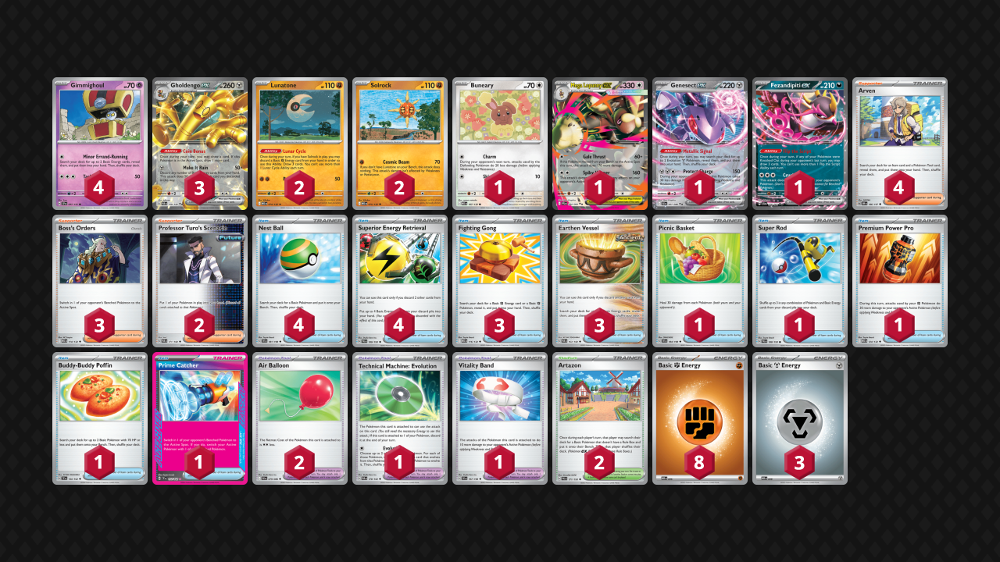

## Decklist


```decklist
Pokémon: 15
4 Gimmighoul SSP 97
3 Gholdengo ex PAR 139
2 Lunatone MEG 74
2 Solrock MEG 75
1 Buneary MEG 107
1 Mega Lopunny ex PFL 84
1 Genesect ex BLK 67
1 Fezandipiti ex SFA 38

Trainer: 34
4 Arven OBF 186
3 Boss's Orders MEG 114
2 Professor Turo's Scenario PAR 171
4 Nest Ball SVI 181
4 Superior Energy Retrieval PAL 189
3 Fighting Gong MEG 116
3 Earthen Vessel PAR 163
1 Picnic Basket SVI 184
1 Super Rod PAL 188
1 Premium Power Pro MEG 124
1 Buddy-Buddy Poffin TEF 144
1 Prime Catcher TEF 157
2 Air Balloon BLK 79
1 Technical Machine: Evolution PAR 178
1 Vitality Band SVI 197
2 Artazon PAL 171

Energy: 11
8 Fighting Energy MEE 6
3 Metal Energy MEE 8
```
### Inclusions

- Lopunny is extremely important against Gardevoir and still handles Cornerstone, which is why I think it's better than Mawile.
- Charm Buneary is optimal!
- I still think Prime Catcher is the best Ace Spec with Lopunny and it has synergy with Lopunny's attack. Prime allows us to consistently access gust via Arven, a well as pull off powerful Prime + Turo plays.
- TM: Evo is nuts. Extremely useful in many games, especially (but not limited to) when you need Lopunny. Also very handy against Dragapult.
- Vitality Band and Premium Power Pro are very strong and give the deck a little bit of agency. By making Solrock more powerful, you can more easily pressure Pokemon like Munkidori/random Stage 1s. This also helps navigate single-prize boards, which is very good in the mirror or against Charizard.
- Second Artazon is very nice to bump annoying Stadiums as well as help get the early Lunatone + Solrock, which is the highest priority.

### Exclusions

- Secret Box was underwhelming. It works well in Stage 2 decks because we often Arven for it and get value from the follow-up Supporter. In this deck we rarely Arven for it, but it is handy when we draw into it naturally. The deck is consistent enough already, and Box is unnecessarily sacrificing the power of Prime Catcher. Playing Prime also allows us to cut the fourth Boss.
- I basically never used the Ultra Ball, so I cut it. Using TM: Evo for Lopunny is sufficient.
- Mawile could still be reasonable to play over Lopunny. It is better at countering Cornerstone and doesn't rely as much on prize cards. It is also a little more flexible at closing out endgames. If I did play Lopunny, I would probably play Lana's Aid with it to help against Gardevoir. I did a lot of testing with Mawile, and it's still relevant, so I've included lots of notes about it.
- The fourth Gholdengo is not necessary.
- 50 HP Gimmighoul is a huge liability in many situations. Although Call for Family is useful, I found the card's downsides to outweight the benefits. I did include some matchup notes about the 50 HP one because it's still relevant.
- Team Rocket's Watchtower sounds good on paper to counter Charizard, but it didn't improve the winrate very much when I tried it out.  It maybe adds a few percentage points in that matchup, but it's still unfavorable, so I don't think it's worth it. I also did not enjoy having to play Secret Box.
- Munkidori could be considered over Picnic Basket, as it can be set up preemptively, whereas Picnic Basket has to be drawn at the right time. However, with Lunatone and Solrock now in the deck, there is not much bench space for Munkidori, especially considering it is mostly useful against Dragapult (which requires three Gholdengo/Gimmi and is an already favorable matchup).

**To try: Bravery Charm**

## Gameplay

- If you're going to use Superior Energy Retrieval, pay attention to how much Energy is in your discard. Sometimes you need to discard Energy with Vessel/Retrieval to get maximum value/"free" Energy from each Superior.
- Sequence based on what you need for the turn. If you don't need to draw into any more Energy for the KO, use Fighting Gong and Vessel to get the Energy out, then draw. If you have Fighting Gong but already have Solrock, Lunatone, and Fighting Energy, usually draw first. If you need to fill your board, draw before using Nest Ball, etc.
- Active Coin Bonus/Fez first, then Lunar Cycle or benched Coin Bonus. If there's a chance you won't want to use Lunar Cycle, benched Coin Bonus first. If there's a chance you'll make the benched one active for extra card, Lunar Cycle first. Arven is usually last in any sequence.
- Keeping extra Earthen Vessel/Gong around can help against Iono at any point as long as there's Fighting Energy in the deck.
- If you have an extra attachment for the turn, consider if you could close out the game with Mawile. Sometimes it's easier to get lethal off Iono by using Mawile if you pre-attach to it.
- Always look for opportunities to use Solrock or single-prize boards to throw off your opponent's prize trade.
- Prioritize discarding Metal Energy off Make it Rain because Fighting is more useful to have around. You'll need to use Superior anytime you need Metal anyway. With Vessel, search out enough Fightings for the immediate future, then prioritize searching out Metals to make Fighting Gong retain its usefulness.
- Preemptively using Arven for Prime Catcher can enable powerful Prime+Turo plays later.

## Matchups

### Gholdengo Mirror - Even

- Do not feed them Gimmighoul unnecessarily. Sometimes it's better to wait a turn before putting Gimmighoul down because Solrock cannot KO it. When you do put Gimmighoul down, you definitely want to put down at least two. Usually don't put down just one, better to wait. In the same way, don't put down unnecessary Gimmighoul when you already have Gholdengo established.
- Pay attention to their prize map and make it difficult for them depending on the prize count, utilizing single prize board, no Gimmie board, or Turo depending on the situation.
- Premium Power + Vitality is obviously broken for getting a Solrock KO on a turn you wouldn't otherwise be able to do anything, but don't use it if you have another available play because you might need it later.
- Gusts and Turo are premium resources

### Gardevoir / Jellicent - Depends on lists

This matchup is favorable for the Lopunny build and unfavorable for all others.

We need to get an aggressive start, try and get as much of a prize lead as possible. This will make it difficult for them to pivot into a prize trade and force them to rely on Frillish and Devo.

- If you're playing Lopunny, try to get it in play as soon as possible. It completely invalidates their Frillish strats and is difficult for them to KO. Use Lopunny to respond to Frillish. Otherwise, play normally and use Turos for healing/prize denial. Pre-attaching to Lopunny can also be good. Use the Lopunny to immediately KO any attacking Frillish.
- Ideal board depends on the situation, but usually it's 3 Dengo (or 2 and Lopunny if you're playing it), LunaRock, and an open spot for Fez, Genesect, or Mawile. Genesect always gets used, but sometimes you want to Turo it up. Three Stage 1s is good because it's easier for them to Devo the fewer Stage 1s you have, which is very relevant.
- If not using Turo on Genesect, using it on any damaged Pokemon can be good. Even using it on damaged Luna/Rock can deny a free prize from Adrenabrains.
- Watch out for their opportunities to pivot into an aggressive prize trade. Sometimes you need to Turo or avoid benching single-prizers because after they kill your first Solrock, they only need to pick off one more single-prize Pokemon to then go 2-2 to close out the game.
- Try to play Picnic Basket on any turn you can get value from it and aren't Item locked. It's very strong but difficult to use.
- Mawile can be very strong if they are trying to spam Frillish, just watch out for Mew Counter Catcher (and try to Turo the Mawile if they hit you with that).
- Don't hit the Frillish for less than a KO for no reason. It's ok to punch it if you're applying relevant pressure, but if they have Munkidori with Dark, it's usually best to not hit into it.
- Try to one-shot the Frillish whenever possible. If they have Charm, use Gholdengo with three Energy (if you're not playing Lopunny), otherwise use Solrock with Vitality Band.
- If you decide to KO their Gardevoir, make sure you have enough resources left to deal with the Frillish. Lana's Aid plus Mawile can help with this.
- If you do not have a secondary attacker available (such as Mawile or Lopunny), power up Fezandipiti to deal with their Frillish.

### Dragapult / Dusknoir - Favorable

- When multiple Energy are prized, be careful with managing Energy so that you can always one-shot Dragapult.
- Sometimes pre-loading Genesect with an Energy can be good to play around the stall. This is very situational.
- Putting the 50 HP Gimmighoul down (if you play it) is ok if you can immediately evolve it before it gets sniped. Otherwise, try to avoid putting it down at all. If no Gimmighoul are prized, you can sometimes play the game without ever benching the 50 HP one.
- Even though Genesect is a liability, it's still good to slam into play as soon as possible. We ideally want triple Gholdengo.
- If you get the chance to Turo the Genesect later, even if it doesn't have any damage, it still avoids the trap or Ursaluna lose-cons

### Charizard / Noctowl - Unfavorable

The winning prize trade is pretty idealistic. You need the first KO (usually with Solrock). If they take one prize, get a two-prize KO in response. They take two back. Take two more prizes, going to one, profit. This successfully plays around Dusknoir and Briar, but it's hard to pull off. In other words: 1-2-2-1 prize map.

- If that prize map does not line up, you can make use of multiple Solrock to KO important Pokemon like Hoothoot or Duskull while trying to keep the two-prize Pokemon safe.
- Another cheeky way to win is by super aggressively targeting the Charmander lines and trying to run them out of Charizard. If you are going for that, try to avoid feeding Fez or Genesect to Terapagos by using Turo or not putting them down. If the anti-Charizard line isn't feasible, KO'ing Hoothoot or Duskull are generally good options.
- Pay attention to both players' prize counts and Charizard's breakpoints.
- Utilize Gholdengo's HP in the early-game, as they cannot one-shot it (especially if you KO Duskull). This is especially strong in the rare scenario you have only Gholdengo in play so they cannot KO anything.
- If for some reason they punch Gholdengo for less than a KO and put it into Dusknoir range, use Turo to heal it. Keeping one Turo around is generally good to stop plays like that, or for the above-mentioned plays.

### Charizard / Secret Box - Favorable

- KO Pidgeot so they cannot find Briar
- Solrock is great in the early-game, but try to take two-prize KO's with Gholdengo whenever possible, pressuring their Charizard or KO'ing their Pidgeot.
- Sometimes delay benching Genesect so they cannot get a two-prize KO. Sometimes stagger Gholdengos so you can play with a single-prize board, but this is situational because they can Iono you.
- Premium Power Pro and Vitality Band can be good to allow Solrock to trade into Chi-Yu or KO Pidgeotto/Charmeleon.
- Apply fast pressure to their board, using Prime Catcher if necessary. The most consistent way to win is by getting far ahead at the beginning. If they only have one Pidgey, KO that. KO'ing Tatsugiri and Charmander can also be good.
- Turo can very situationally be useful to make a single-prize board, otherwise it is basically useless. Gust cards are extremely important and can be used aggressively (but not discarded!).

### Absol - Favorable

- If they go only Cornerstone board, do not attack. Solrock never makes any real progress and it disables Mawile's second attack. If they only have single-prize targets, ignore them because you don't want to proc Counter Catcher. If this scenario happens, just load up Mawile and sweep them with its second attack.
- If they have two- or three-prize targets on their board, play normally and KO them with Gholdengo. If they start putting Energy on Cornerstone, then start powering up Mawile.
- Save Turos for if they try to smack Mawile (or for retreat lock). Use Picnic Basket on Mawile if you are about to start attacking with it. Picnic Basket can also be good on Gholdengo to deny prizes. Saving Prime Catcher for retreat lock is also good so that you can use Turos elsewhere such as on Mawile.
- Save Super Rod because you might need to dig for cards like Artazon/Turo and not deck out later.
- Save Artazon for when you need to one-shot through Charm+Lively Stadium!
- Ideal board is two Gholdengo, Solrock, Lunatone, Mawile, and Genesect if you need it (which you usually do).
- Try to not give too many prizes up to Cornerstone or else they can just win a normal prize trade.

- If you're playing Lopunny, try to get it in play as soon as possible if they are going with Cornerstone. If they are already powered up, you'll need TM: Evo to prevent the Buneary from getting sniped. 
- Save Picnic Basket for when they punch Lopunny with Cornerstone, as you need it to survive double Adrenabrain.
- Pre-attach Energy to Lopunny so you might not need Turo+Balloon. Hitting for 160 twice is sufficient if you have Boss and the Stadium to bump their Lively.
- If they have two Munkidori with Dark, KO one before going in with Lopunny. We do not want them getting the triple Adrenabrain as it makes both offensive and defensive breakpoints.

### Grimmsnarl - Favorable

- Leave backup Gimmighouls unevolved for awhile so they don't take Froslass damage.
- Genesect on board ensures you can always get Gholdengo even if you get Iono'd.
- Save Turos for retreat lock. Saving Prime is good too, but using it for fast pressure is fine as well.
- Ideal board is Gholdengo, two Gimmighoul, Solrock, Lunatone, Genesect.
- Premium Power Pro is often useful for applying pressure with Solrock.
- One-shot their Grimmsnarl whenever possible, otherwise target Froslass and Snorunt!

## Personal thoughts

Gholdengo is extremely strong. Its matchups are overall quite good even though it's weak to Charizard/Noctowl. I would usually prefer a deck with more agency such as Charizard or Gardevoir but I would consider this deck anyway because it's so broken. Gholdengo has basically no skill expression, so you're more at the mercy of luck than with other decks. Overall, it is a great deck and definitely worth playing.
