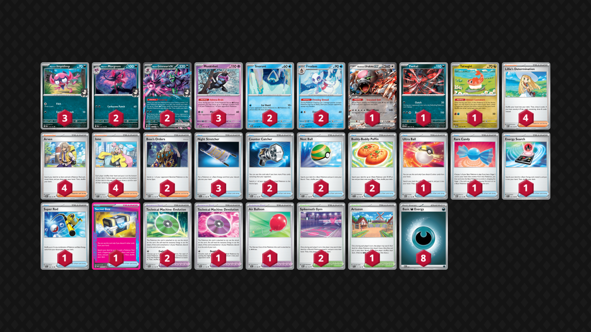

## Decklist


```decklist
Pokémon: 17
3 Marnie's Impidimp DRI 134
2 Marnie's Morgrem DRI 135
2 Marnie's Grimmsnarl ex DRI 136
3 Munkidori TWM 95
2 Snorunt PAR 37
2 Froslass TWM 53
1 Bloodmoon Ursaluna ex TWM 141
1 Yveltal MEG 88
1 Tatsugiri TWM 131

Trainer: 35
4 Lillie's Determination MEG 119
4 Arven OBF 186
4 Iono PAL 185
2 Boss's Orders MEG 114
3 Night Stretcher SFA 61
2 Counter Catcher PAR 160
2 Nest Ball SVI 181
2 Buddy-Buddy Poffin TEF 144
1 Ultra Ball MEG 131
1 Rare Candy MEG 125
1 Energy Search SVI 172
1 Super Rod PAL 188
1 Secret Box TWM 163
2 Technical Machine: Evolution PAR 178
1 Technical Machine: Devolution PAR 177
1 Air Balloon BLK 79
2 Spikemuth Gym DRI 169
1 Artazon PAL 171

Energy: 8
8 Darkness Energy MEE 7
```

- 3 Stretcher is so insanely good, you always want to have Stretcher, and get value from all of them when you draw them. Sacrificing the fourth Munkidori for third Stretcher is good, it just sucks when you prize two Munkidori but that is rare. I don't think you need four Munkidori in this meta, but it's still fine if you're so inclined.
- I'm considering cutting Yveltal and a search card for another line of Froslass. 2-2 Froslass is enough, but sometimes it really sucks when you prize a piece into specific matchups (Gholdengo, Charizard), which happens often.
- Yveltal is mostly used to punish specific board states/resources (such as used Turo). Oftentimes you won't use it at all, but the threat of it restricts your opponent's options. It can also be useful against decks that have a hard time finding their Turo to buy time.
- Tatsugiri is needed for consistency.
- Energy Search is relevant way too often. I would never cut it.
- The only cuttable cards are Yveltal, Poffin/Ultra Ball, and Super Rod. Could maybe cut Super Rod for another Dark Energy.

**To try:** Moltres

## Gameplay

- You do not have to yolo attack with Grimmsnarl just because you can. You are allowed to play this deck slow, like a Froslass/Munkidori deck. Attacking with Grimmsnarl when they can one-shot it and you don't have a follow up plan is generally bad. Saving Candy and evolving the first Grimmsnarl through Morgrem allows for a better late-game. However, if you're going first and/or the opponent has a weak start, using the Candy to be aggressive can be game-winning. Try not to walk into manual Mind Bend (or just flip heads).
- Devo is a very powerful win con or just to take multiple prizes with a single-prizer. Can also use it for tempo reset against opponents who use Candies aggressively.
- Grimmsnarl is sometimes used for prize racing and sometimes used for board control/precise damage placement (removing Duskull/Munkidori). It depends on the situation and matchup. You aren't always trying to straight up prize race with Grimmsnarl.
- Pay careful attention to the board state. Watch for opportunities to pivot into a prize trade. Sometimes you can also use aggressive Devo as part of a prize race.
- Sometimes you leave ten damage on Munkidori so that after a full turn of Froslass you'll have 30 for the next turn. The 30 damage increments are extremely relevant, especially combined with Grimmsnarl's snipe attack.
- In general, try to avoid situations where Grimmsnarl gets one-shot, unless it's part of a winning prize trade. A Grimmsnarl that gets to fire off more than one attack can be devastating.

## Matchups

### Gholdengo - Unfavorable

- Prioritize getting double Froslass into play. Recover them when the opponent KO's them.
- Yveltal is very useful because it makes them burn Turos and they cannot Boss on the turn they Turo.
- Fast Grimmsnarl is sometimes good, sometimes not. If their board is established and they can likely get the return KO, it's not as good. However if you can get off multiple attacks with the same Grimmsnarl, it's usually worth it just to get some prizes and make the late-game easier to clean up.
- Pay attention to their prize map and make it awkward for them. Don't use Grimmsnarl when they're on two prizes (usually).
- Devo can be useful if you are able to buy enough time, or if the opponent foolishly evolves all of their Gimmighoul immediately.
- Having Munkidori in the Active on Turn 1 is very good because Solrock cannot KO it, and it is a bit awkward for them.
- Counter Catcher is a premium resource.

### Dragapult / Dusknoir - Favorable

- Two Froslass is good, but if it isn't conveniently available, one Froslass is fine. For example, it's usually better to prioritize Morgrem and Froslass instead of double Froslass.
- Usually putting the second Snorunt down isn't worth it because it immediately dies to Phantom Dive, but if that threat isn't present and you can evolve it, then it can be fine to put down.
- Attacking with Grimmsnarl as fast as possible is just good because it's difficult for them to deal with it. Use Adrenabrain to pick off their Active Budew and / or benched Duskull.
- If they have Munkidori with Luminous in play, it is often good to prioritize KO'ing that.
- Look for opportunities to land a devastating Devo for tempo. If they do not play Rare Candy, Devo can oftentimes prevent them from using Phantom Dive on the next turn. You almost never need Devo for a full board wipe, so it's better used whenever an opportunity arises.
- If they have any two prize liabilities in play, Yveltal can be very strong. Otherwise, it is basically useless.

### Gardevoir / Jellicent - Slightly Favorable

- Impidimp and Morgrem are premium resources and so is Boss's Orders.
- One Froslass is the go-to, but it's not a big deal if you don't get it. Sometimes getting double Morgrem is better. Benching Snorunt if they have already have a Munkidori with a Dark is usually not worth it because it will get KO'd by double Adrenabrain.
- Attacking with Morgrem in the early-game is usually best because it does not get punished by Mind Bend or Adrenabrain while Grimmsnarl does. Of course, Grimmsnarl is the better attacker if Morgrem is not a getting a KO. Do not neglect the option of manual Morgrem.
- The ideal scenario is evolving the first two Impidimp through Morgrem, then manually evolving into Grimmsnarl and having Candy as a backup. If a Morgrem is prized, you'll inevitably have to use the Candy aggressively. Using the Candy aggressively can be ok in general if they have a weak start.
- When using Secret Box in the early-game, you usually want to get Boss for the follow up. Boss KO their Gardevoir whenever possible.
- Watch out for their Devolution, it can punish Candy and is their main win con. If they are not playing Devo, using the Candy aggressively is good.
- Don't forget that Diancie can one-shot Grimmsnarl with two Munkidori and a Froslass in play, so don't put yourself in a position to easily lose to that.

### Charizard / Noctowl - Unfavorable

- Devo can be used for tempo if they use two Candy early, this slows down subsequent Dusknoir.
- Try to KO/spawn trap Duskull on sight as it is the biggest threat.
- Retreat lock is bait unless they're out of switching cards or maybe if they only have one left. Chaining Yveltal+gust is basically impossible.
- Try to get double Froslass and Grimmsnarl/Morgrem quickly. The main way to win is by matching tempo and denying Duskull. One Adrenabrain + Grimmsnarl snipe KO's Duskull.

### Charizard / Secret Box - Favorable

- Watch out for Duskull/Clops/Noir and KO them whenever possible.
- Devo is very important, you'll eventually wipe out the Pidgeot with Devo. Make sure they don't have a Pidgey alive after this. Sometimes you'll get the Charizard too, sometimes not. Occasionally you can use the Devo for early tempo if they go double Candy, otherwise use it later for KO's.
- Be careful with using Grimmsnarl. Sometimes you use it for tempo, sometimes for setting up prize map/Devo play. Don't walk into a Charizard one-shot and let them back into the game. You don't have to attack with Grimmsnarl every turn.
- Double Froslass is a big priority in this matchup, even more than Grimmsnarl.
- If you need to make a bigger comeback than usual, removing Pidgeot and using Yveltal can buy some time.

### Absol - Unfavorable

- Punching into their Absol is good if you are for sure able to 2HKO it AND can also out Munki them (because Yveltal can stall you for them to heal off).
- Try to KO their Munkis very aggressively. Whenever possible, snipe off their Munki with Fros+Adrena+Grimmsnarl's attack.
- Get two Froslass, two Munki, Grimm, and backup Imp/Morg. Sometimes third Munki is better, but very situational.
- You are trying to prize race while they are trying to control. If you can pick up an early KO on Latias/Pech and a Munki, all you need to do from there is KO a Mega with Ursaluna+Adrenabrain. You can force them to activate Ursaluna by continuing to attack with Grimm.
- Use Boss for either aggressive KO on Munki/two-prizer, otherwise save it for getting around Cornerstone.
- Do not punch into their Mega (usually Kang) for no reason because they will just get a Terminal Period KO for free.

### Grimmsnarl Mirror - Even

- Get literally as many Munki as possible. You actually want four Munki if you can (and if you're playing four in your list), but go for at least three. Prioritize setting up all of them with Energy.
- Gusts are premium. Use them to KO Munkidori.
- Sometimes you want/need one Froslass and sometimes you don't. Sometimes it's ok/necessary to punch into their Grimmsnarl and sometimes it's not.
- I honestly haven't played this mirror enough to know exactly when to do everything.

## Personal thoughts

Grimmsnarl is a very potent deck with some good matchups. However, it's biggest glaring issue is its problem with Gholdengo. It also isn't great into Charizard/Noctowl. For these reasons, I wouldn't play it in the current meta.
