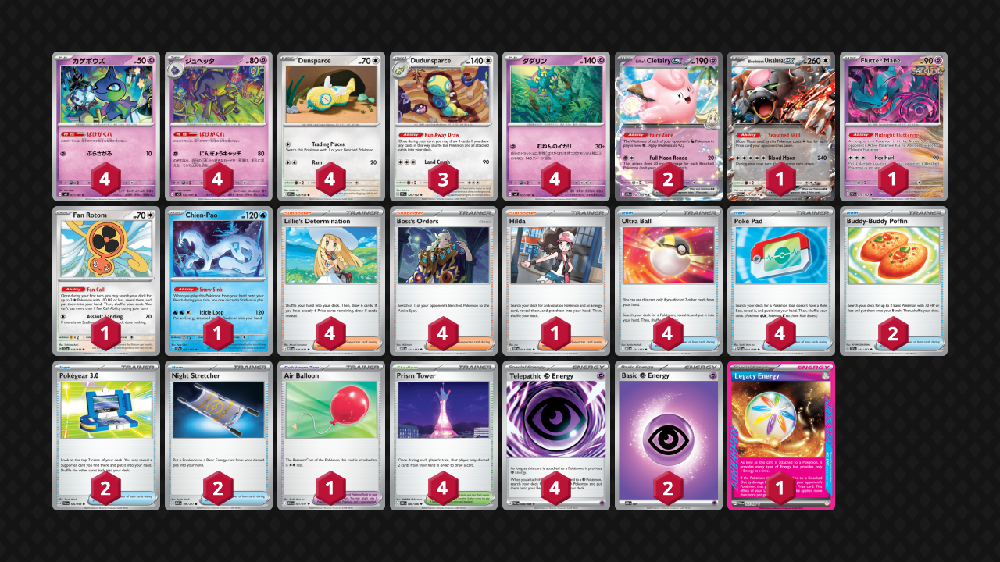

## Decklist


```decklist
Pokémon: 25
4 Shuppet M5 31
4 Banette M5 32
4 Dunsparce JTG 120
3 Dudunsparce TEF 129
4 Dhelmise M5 37
2 Lillie's Clefairy ex JTG 56
1 Bloodmoon Ursaluna ex TWM 141
1 Flutter Mane TEF 78
1 Fan Rotom SCR 118
1 Chien-Pao SSP 56

Trainer: 28
4 Lillie's Determination MEG 119
4 Boss's Orders MEG 114
1 Hilda WHT 84
4 Ultra Ball MEG 131
4 Poké Pad POR 81
2 Buddy-Buddy Poffin TEF 144
2 Pokégear 3.0 SVI 186
2 Night Stretcher ASC 196
1 Air Balloon ASC 181
4 Prism Tower CRI 80

Energy: 7
4 Telepathic Psychic Energy POR 88
2 Psychic Energy MEE 5
1 Legacy Energy TWM 167
```
<!-- PUBLIC -->
### Inclusions

- Heavy Dudunsparce line is the best way to make this deck work and also helps against threatening hand disruption.
- Two Clefairy is definitely terrible but it is necessary for the Dragapult matchup. I would like to just play one and have another Stretcher, but when Dragapult is disrupting us, using Telepathic to find the second Clefairy is very common and relevant.
- Ursaluna is absolutely required for closing out games. It is very good.
- Flutter Mane is a very good tech for the Festival Lead matchup, which is getting some hype due to Gladion. Of course, if Festival Lead ends up not being very popular, Flutter is an easy cut. It’s basically useless against everything else aside for some fringe scenarios against Latias ex.
- Fan Rotom is surprisingly good. I didn’t have it at first but ended up needing it. With the lower Poffin count, searching for individual Dunsparce is a huge strain on resources. Fan Rotom can also attack on Turn 1 fairly often when you happen to start with it.
- Chien-Pao is solely a tech for Watchtower. It can occasionally be good against Festival Lead too. If you don’t fear Watchtower in any given metagame, Chien-Pao can be an easy cut.
- Hilda is a way to find Legacy Energy, which is very nice. Without Hilda, I often had games where I would never even see the Legacy. Aside from that, generally searching for evolutions and Energy is still good on its own anyway.
- Four Boss is absolutely required. Dhelmise needs to get consistent two-shots since it doesn’t one-shot most things, and Ursaluna Boss is a very common way to close out games.
- Pokegear is good consistency and helps access Boss on key turns.
- Air Balloon is good general utility. Useful for pivoting into Ursaluna especially if the opponent leaves Dhelmise active. Extremely handy if you ever need to move Ursaluna from the active, which doesn’t happen often but game-winning when it does. Also particularly nice with Flutter Mane in the Festival matchup, although not always required.
- Prism Tower and Ultra Ball are mandatory four-ofs to make the deck start functioning. Prism Tower also lets you win Stadium wars which occasionally makes a difference.
- Legacy Energy is a very powerful Ace Spec. Dhelmise does not get many one-shots, so games can become longer and you might not be able to close them out quickly. Legacy gives a massive advantage against other single-prize decks too.

### Possible Inclusions

- I would really like a third Night Stretcher. It would be good in basically every game and I feel like I’m always cutting it close with just two. I don’t know what to cut though.
- Prism Energy over basic Psychic would enable some toolbox options such as Moltres, and it’s completely non-invasive.
- Special Red Card would probably be fine but it doesn’t make that much sense in this deck.

### Exclusions

- Sinischa is redundant. It can only be used if you’re drawing well, in which case the game should be winning anyway. Getting six in the discard is a massive chore. It can also be played around fairly easily. Seeing Sneak cards more often in the early-game would be nice, but I don’t think it’s worth playing cards that do absolutely nothing.
- Gwynn is just bad and useless and unnecessary. Do not play it. Same with other random bad cards like Naveen. It makes a little more sense if you’re playing heavier counts of Sneak cards.
- Patrat is atrocious. It is a huge liability in the matchups where it’s supposed to be good. The one matchup where it is actually relevant is Dragapult / Blaziken, but that one is bad either way. It’s not as relevant against normal Dragapult or Zoroark as it would seem in theory.
- I don’t see the point of Kieran. It does allow for a one-shot on Clefairy but that is not a good reason to play it. Kieran plus Bangle would hit some breakpoints but you don’t get to Boss the targets where the damage would be relevant.
<!-- /PUBLIC -->
## Gameplay Tips

- Banette isn’t needed every game. Ideally, I would prefer to never even put Shuppet in play, but it is often necessary. If your hand is good and you’re in a matchup where Banette isn’t that useful, you can just start with Dhelmise and never put Shuppet in play. Otherwise, go for a Turn 2 KO with Banette. I almost never put a second Shuppet in play, except against Alakazam.
- The ideal board is as many Dhelmise and Dunsparce as possible. If you ever need to put something else down, Dudunsparce can easily make room for it.
- I prefer to save Air Balloon in most games because there are occasionally odd spots later on where you need to retreat a Dhelmise or Ursaluna (or go into Ursaluna). Of course, if you can ever get value from Air Balloon at any point in the game, even early, it’s fine to just slam it and you probably won’t get punished. If you foresee yourself needing Ursaluna, attaching an extra Energy to Dhelmise is totally reasonable so that it can hard retreat if needed.
- Against decks with hand disruption, make sure to always keep one or two Dudunsparce on the bench! Bricking off Stamp is a very common way to lose! You still want to aggressively use Run Away Draw to cycle through the deck, but make sure not to leave yourself high and dry.
- Prism Tower can make the deck very thin in prolonged games, which is great! This repurposes junk cards like extra Pokemon or Prism Towers, and also ensures hitting the Bosses to close out games.
- Many games involve using all four Dhelmise, Ursaluna, and both Stretcher (usually for Dhelmise)! Try not to discard these important resources and also account for Legacy Energy prolonging the game. Legacy on Ursaluna can allow for an Ursaluna chain, but that’s mostly for very specific comeback scenarios. Usually I just slam Legacy on Dhelmise the first chance I get.
- The 30 damage poke from Dhelmise is often relevant, particularly against Clefairy or Budew. Two 30 pokes sets up a Mega Kang for an Ursaluna KO! Of course, it’s not the go-to option, but sometimes you have nothing better to do on the first two turns or so.

## Matchups

### Dragapult - Depends

This matchup mostly depends on how many Watchtowers they have. The more they have, the worse it gets. Against the Dusknoir build with Watchtower, the matchup is about even. Against the Blaziken build, regardless of how many Watchtower, the matchup is unfavorable.

- Do not put Clefairy down until you’re getting the Dhelmise one-shot. High counts of Telepathic Energy and Ultra Ball make it easy to find Clefairy at the right time. We are not attacking with Clefairy unless we are forced to start with it.
- Stretchering the first Clefairy once it gets KO’d makes it easier to find the subsequent one via Telepathic Energy if needed. If you search out the second Clefairy immediately, and it gets Boss KO’d while your hand gets disrupted, it’s much harder to find Stretcher instead.
- Play around Unfair Stamp as much as possible since it is a huge threat. You do have to take KO’s regardless, but if you can stabilize better by waiting one turn, sometimes that’s worth it. For the most part, just try to set up your board and thin out useless cards. You usually still want to attack whenever possible.
- Going for Turn 2 Banette is generally good. If you have to use Boss or Clefairy to get a KO with it, so be it. 
- Don’t leave damage on their board! It should be one-shot or pass in most situations.
- Using the initial Prism Tower to get set up is fine if you can get value from it. Otherwise, save Stadiums and Chien-Pao to counter Watchtower or Risky Ruins.
- If they put down Fez, Ursaluna can be an alternative way to close out the game. Otherwise, Ursaluna is pretty useless.
- Although Dragapult is a slower deck, this matchup is actually one of the fastest ones because you’re forced to put Clefairy into play, which speeds up the game. This means that you should plan for a shorter game. Resources in general aren’t as important, and Boss doesn’t get used as much in this matchup. This matchup plays a lot differently than the others. Tempo and aggression are what’s most important. 
- Against Blaziken, Boss is more important. Try to Boss around their Blaziken and take KO’s with a single-prize board. Of course, if they have Dragapult in play, just KO that. Smacking into Blaziken is very bad because Adrenabrain heals it out of range, unless you’re finishing with Ursaluna, which is what you should go for at the end of the game.

```youtube
id: GPgmQZNwuUg
title: Sneak v Pult 1
```

```youtube
id: KrIuQQ5Y2Fc
title: Sneak v Pult 2
```

```youtube
id: O5GnPSfiIww
title: Sneak v Pult 3
```

```youtube
id: OCWjClJUqlc
title: Sneak v Pultnoir 1
```

```youtube
id: N8Xy_vhzbnI
title: Sneak v Pultnoir 2
```

```youtube
id: jBYBGKaGCxE
title: Sneak v PultBlaze 1
```

```youtube
id: SfY_1pp-vgs
title: Sneak v PultBlaze 2
```

### Raging Bolt - Even

- The general game plan is to get two two-shot KO’s and then a one-shot with Ursaluna. Legacy Energy and Boss are very important. Prioritize getting a one-shot on Meowth whenever possible, and don’t leave damaged Pokemon on their board for too long before trying to KO it because they can remove Pokemon with Chien-Pao.
- Clefairy is useless in this matchup unless they put down Raging Bolt for some reason. In theory, Clefairy can get some one-shots, but it’s very unlikely you’ll ever power it up. Worst case, they Boss KO it. Just don’t put it in play.
- Set up as many Dudunsparce as possible. You do want to use Run Away Draw a decent amount, but you also need to make sure to play around Stamp. If they are amassing a large hand or already used Ciphermaniac, you may need to watch out for Boss KO Dudunsparce plus Unfair Stamp. Keeping two Dudunsparce in play is ideal to play around that. If it’s in the early-game or they have a small hand, it’s much less likely they’ll have the Boss KO and Stamp play.
- You’ll use Ursaluna to close out the game basically every time. Legacy on Ursaluna when they’re at two prizes is a very viable line (but not necessarily what you go for every time). If you can get value from Legacy on Dhelmise, that’s usually fine. Keep Air Balloon around for various possibilities in the late-game. Also keep in mind that it’s hard for them to KO Ursaluna, which might be relevant occasionally even though it’s mostly used to end the game. They typically would need Raging Bolt or Passimian to one-shot it.
- Banette isn’t as good in this matchup since it doesn’t get any KO’s, but the 80 damage is relevant. Only use Banette if you need it to set up and can’t get many Sneak guys in the discard quickly. If they Boss around it, it becomes troublesome because then it doesn’t go to the discard and having to hit for 80 again becomes worse and worse.
- Dhelmise 30 poke is mostly relevant against Clefairy (and Kang if you get two of them). Only to be used if you have nothing better to do.

```youtube
id: Fo118BBrdLY
title: Sneak v Bolt 1
```

```youtube
id: 33oUkHZ-5qE
title: Sneak v Bolt 2
```

### Zoroark - Unfavorable

- The main thing to keep in mind is playing around Darmanitan. This is mostly done by keeping Dudunsparce in play instead of Dunsparce when they’re likely to attack with Darmanitan, but that is very difficult to actually do in reality since you need to keep drawing cards. The point is to play around Darmanitan when possible, even though it sometimes isn’t.
- Legacy Energy is best in the early-game when they’re least likely to have Ruffian.
- If they put down Meowth, KO it asap before it gets Tome’d away. If they have Fez or Pech, there’s nothing you can do until Ursaluna gets in range, and then you can one-shot them with it. If you have an extra attachment for the turn, it could be viable to preattach to Ursaluna, but this is very situational.
- Ideally you can get a cheeky fast KO on a single-prizer, Boss another single-prizer (such as Darmanitan to take it off the board), two-shot a Zoroark, and then Ursaluna something for 1-1-2-2, but often you’ll have to two shot two Zoroark. Boss is a very important resource no matter what.

```youtube
id: CgJXA_BAEVg
title: Sneak v Zoro 1
```

### Festival Lead - Slightly Favorable

- Flutter Mane is very important to always have on the bench, but don’t attach Energy or Balloon to it until you’re actually using it to pivot.
- Try to build up extra Energy in play (one on each Dhelmise). As soon as you get ahead on attachments, you can easily retreat the Flutter Mane when you need to use it.
- Flutter Mane might not end up doing anything or just getting KO’d, but the important point is that it’s a deterrent. If they use Gladion to threaten a double-KO, promote Flutter Mane to shut off their double attack.
- Save Night Stretchers for Flutter Mane. Use Dudunsparce aggressively to amass a large hand. When they KO Flutter Mane, use Stretcher to put it back into play immediately.
- Stadiums and Bosses can be good resources. Using the first Prism Tower to set up is fine if needed, otherwise save the Stadiums to always bump Festival Grounds and make it annoying for them.
- Using Flutter in the early-game can potentially slow them down, but it’s quite a dangerous gamble. I typically avoid this unless it looks like a particularly good spot, or if my start is so bad that I need a desperation option.
- Banette is a fine attacker on average. If they use Growing Energy, you might need to use Boss to get a KO with it. If you aren’t getting a KO with Banette, attacking with it is generally bad.
- If they do get a double KO via Gladion and they’re too far ahead on prizes, Boss up Thwackey and start powering up Flutter Mane. After they play to zero cards in hand, they likely won’t have a Switch. With two Flutter Mane attacks and two Bosses, you can clear off two of their Pokemon and severely cripple them. I never actually powered up Flutter Mane in testing but this scenario sounds plausible.

```youtube
id: MNVwYHWVNFI
title: Sneak v Festival 1
```

```youtube
id: nRwJ9R4LPNw
title: Sneak v Festival 2
```

### Slowking - Slightly Favorable

- Try to play with a slim board to play around Trifrost. The ideal board is a Dudunsparce and two Dhelmise with literally nothing else. You always want to prioritize getting a Dudunsparce into play. This will result in some Dunsparce falling to Trifrost, which is a necessary sacrifice, just don’t put more than one in play at once. The exception is Turn 1 when you’re unlikely to get Trifrosted next turn. That’s a prime opportunity to get many Dunsparce down and evolved to safety.
- Trade Dhelmise into Slowking and make them work hard to chain attackers. If you have lots of Boss, it’s possible to line up a two-shot on Kang and then an Ursaluna one-shot on Latias to close out the game. However, this is rare because you won’t have unlimited Dudunsparce draw. Therefore, it’s usually better to just KO their attacking Slowking and save Boss for Ursaluna or for finishing off damaged Pokemon. If you managed to get a fast Dhelmise attack into their Kang, using Boss to finish it off is obviously great.
- If they don’t have Kang or Fez draw available, keep in mind that Prism Tower can greatly help them (with their Ciphermaniac). Chien-Pao is also pretty reasonable in this matchup to bump Festival Grounds without giving them a useful Stadium (and it has a good HP number).

```youtube
id: J96IFKJc8gg
title: Sneak v King 1
```

```youtube
id: it6-5D9h9vA
title: Sneak v King 2
```

### Alakazam - Favorable

- Start attacking with Banette as soon as possible. You’ll also need to get four Sneak guys in the discard quickly so that you can respond to an attacking Fez with Dhelmise. Bossing the Fez before it’s powered up and smacking it once with Banette is generally good if possible.
- You still want a normal board of multiple Dun / Dudun and one or two Dhelmise in addition to the Banette. Use Dudunsparce aggressively to amass a large hand.
- If you aren’t using Dhelmise to KO Fez, Dudunsparce, or other threat, Banette should be attacking in all other situations.
- The second Shuppet is good to have in play, but prioritize getting the Dhelmise online first, and then you can get the backup Shuppet and Banette.
- If they start powering up Dunsparce / Dudunsparce, Boss KO it once it gets two Energy.
- Legacy is best on Banette since Alakazam bypasses it anyway, but Alakazam can’t hit Banette.

```youtube
id: rlDTFg8czno
title: Sneak v Zam 1
```

```youtube
id: g6O65XUmUxM
title: Sneak v Zam 2
```

### Hydrapple - Even

This matchup is basically the same as Raging Bolt. The main difference is that Hydrapple can heal itself into three-shot range (and there’s nothing you can do about it), but they cannot clear Pokemon with Chien-Pao.

- The general game plan is to chip down the Hydrapple and KO it in three hits, find two prizes somewhere else at any point, and then finish with an Ursaluna Boss one-shot for two prizes. Legacy Energy and Boss are very important. It’s very good if you can get a fast single-prize KO (such as Celebi) and then another one (Meganium) via Boss. Of course, Boss KO Meowth with Dhelmise is also great.
- Set up as many Dudunsparce as possible. You do want to use Run Away Draw a decent amount, but you also need to make sure to play around Stamp. If they are amassing a large hand or already used Ciphermaniac, you may need to watch out for Boss KO Dudunsparce plus Unfair Stamp. Keeping two Dudunsparce in play is ideal to play around that. If it’s in the early-game or they have a small hand, it’s much less likely they’ll have the Boss KO and Stamp play.
- You’ll use Ursaluna to close out the game basically every time. Legacy on Ursaluna when they’re at two prizes is a very viable line (but not necessarily what you go for every time). If you can get value from Legacy on Dhelmise, that’s usually fine. Keep Air Balloon around for various possibilities in the late-game.

```youtube
id: RJyhSaM8zik
title: Sneak v Hydrap 1
```

```youtube
id: A0Iu5EHrh88
title: Sneak v Hydrap 2
```

### Slop Box - Favorable

- Dhelmise 30 poke or Banette 80 poke is good on Clefairy or Kang.
- Just smack whatever is active, unless they have Pokemon in KO range on their bench. If that’s the case, Boss-KO whenever you can before Chien-Pao removes them permanently.
- Play normally and use Ursaluna to close out the game.
- They often play Prime Catcher, so playing around Stamp isn’t as important as usual. However this also means they can pull off Prime + Crispin Waterpon, so make sure there aren’t two Pokemon within Waterpon range on your board.

### Crustle - Favorable

- Get Dhelmise online as soon as possible and target their Kang with Energy. Smack it as much as possible for as much damage as you can. Crustle is a non-issue and can mostly be ignored (and easily KO’d when it’s active).
- Flutter Mane or Banette are good in the active while you’re setting up, but as soon as you can attack with Dhelmise, do so. Putting Banette in play can be risky since it might make it harder to set up Dhelmise, but it depends on the situation.

### Mewtwo - Favorable

- Banette can be a good early attacker since it can KO Tarountula or Mimikyu. It is worth using Boss to ensure Banette gets these KO’s. Of course, in some games, using Banette isn’t necessary in the first place, so it is situational.
- Legacy is premium.
- All of the extra tech Pokemon are bad and useless. Ursaluna can close for one prize but usually does not get used.

```youtube
id: GhgZwgT1mEo
title: Sneak v Mewtwo 1
```

```youtube
id: _wQ-3u4MEpE
title: Sneak v Mewtwo 2
```

### Excadrill - Depends

If they have Ice Creams, this matchup is unfavorable. If they do not have Ice Creams, the matchup is favorable.

- Smacking Excadrill with Dhelmise is generally good whether they have Ice Cream or not. You’ll have to KO it eventually anyway.
- Save Boss to get around Metagross. If you can close out the game with all four Boss and not have to go through Metagross, that is ideal. Two-shotting a single-prize Pokemon is extremely inefficient.
- Leaving Genesect in play is generally good since Ursaluna can one-shot it (if it did not use Protect Charge last turn). However, if they’re smart, they’ll attack with Genesect. In that case, two-shot it as normal (including Boss to finish it off).
- Use Boss to finish off damaged Pokemon as soon as possible in order to play around possible Ice Creams.

```youtube
id: XcVEM5eOs8I
title: Sneak v Drill 1
```

## Personal Thoughts

This deck is a bit inconsistent and very linear. Its matchup spread is actually not too bad. It struggles with Unfair Stamp despite having lots of Dudunsparce. My opinion on the deck goes up the more I play it. At first I thought it was literal garbage. I think it would be better in less-competitive environments because it’s bad against good Dragapult and Zoroark players, but beats most of the random other decks. So I think it’s a terrible play for Worlds but could do well elsewhere.
