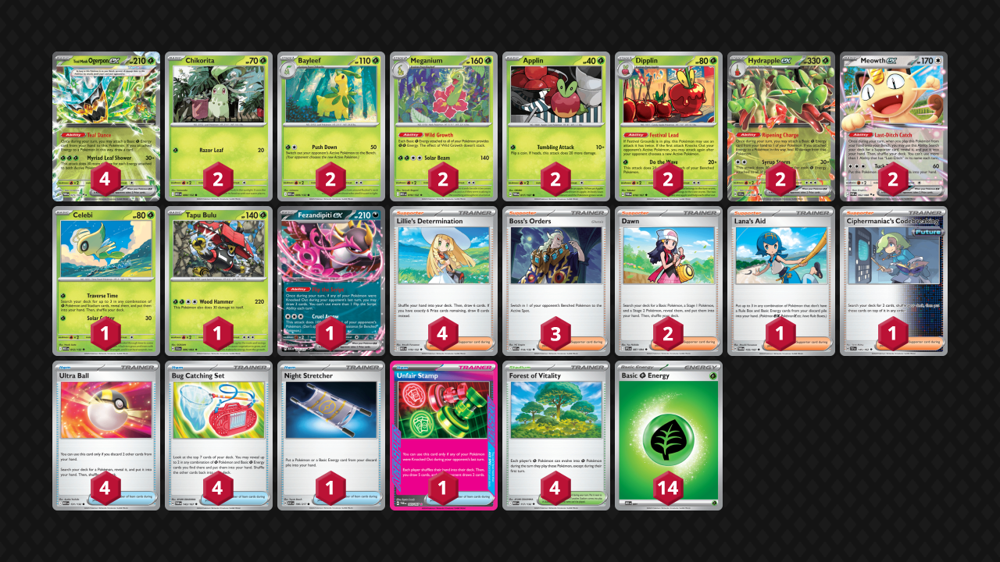

## Decklist


```decklist
Pokémon: 21
4 Teal Mask Ogerpon ex TWM 25
2 Chikorita MEG 8
2 Bayleef MEG 9
2 Meganium MEG 10
2 Applin TWM 17
2 Dipplin TWM 18
2 Hydrapple ex SCR 14
2 Meowth ex POR 62
1 Celebi MEG 12
1 Tapu Bulu SFA 6
1 Fezandipiti ex ASC 142

Trainer: 25
4 Lillie's Determination MEG 119
3 Boss's Orders MEG 114
2 Dawn PFL 87
1 Lana's Aid TWM 155
1 Ciphermaniac's Codebreaking TEF 145
4 Ultra Ball MEG 131
4 Bug Catching Set TWM 143
1 Night Stretcher ASC 196
1 Unfair Stamp TWM 165
4 Forest of Vitality MEG 117

Energy: 14
14 Grass Energy MEE 1
```
<!-- PUBLIC -->
### Inclusions

- Celebi is extremely good for setting up in many different matchups. This deck requires a lot of pieces to get set up, which can be difficult without Celebi. That said, more than one Celebi is never needed (unless it’s prized, in which case there is still a decent chance of the deck functioning).
- Tapu Bulu is just a tech for Crustle, since Meganium alone is not enough. If you don’t care about Crustle, the Bulu is an easy cut.
- Three Boss’s Orders is very good since this deck heavily relies on it to win prize trades and close out games.
- Lana’s Aid can be very convenient if you need to reestablish a KO’d Meganium or Hydrapple (although it doesn’t get the Hydrapple itself). If you end up discarding an evolution piece for any reason, the opponent can punish you by targeting the remaining line. With Lana’s Aid, you can recover from such scenarios.
- Ciphermaniac’s Codebreaking goes well with Teal Dance. It is primarily used to find cards such as Unfair Stamp or Forest of Vitality.
- Unfair Stamp is very broken and the deck doesn’t need any other particular Ace Spec.
- Some lists play only three Forest of Vitality, but I think the card is too critical for the deck’s functionality and it need four, even with Celebi.

### Possible Inclusions

- I did not find Briar to be very useful since it’s too hard to get it to line up, but in theory, it does not sound bad. I couldn’t fault anyone for wanting the option.
- Special Red Card would be the more appealing tech in my opinion, but usually Stamp is good enough for hand disruption. Hand disruption can be nice in this deck because it makes it harder for opponents to deal with a big Hydrapple or gust around a single-prize attacker.
- Poke Pad is a good consistency card but hard to fit in the deck.

### Exclusions

- Judge, as usual, is just bad.
- Noctowl is a bit less useful in this deck than Arboliva since we also need to accommodate Hydrapple, so there’s less space in the deck and on the board. It’s better to rely on Meowth in a pinch.
- Budew can be a liability and provides very little output. Since Teal Mask Ogerpon is a common starter (and it can retreat via Teal Dance), you’d almost always rather be using Celebi over Budew given the option.
- Festival Grounds is gimmicky and bad overall, though it can be situationally strong against Festival Lead to get the jump on them before they play their own Festival Grounds.
<!-- /PUBLIC -->
## Gameplay Tips

- Looking for a 2-2-2 (or 1-1-2-2) prize map from the start of the game is fairly common. This is a straightforward prize trade deck. Single-prize attackers such as Meganium, Dipplin, or Tapu Bulu are commonly good options for swinging the prize trade back into your favor. Try to line this up with Unfair Stamp so the opponent can’t gust around your single-prize attacker!
- Fezandipiti can be a useful attacker in some occasions. I wouldn’t say it’s frequent, but it’s not particularly rare either.
- Unlike Arboliva, this deck needs both Stage 2’s in play at once in order to achieve peak output. This means there’s a higher reliance on Dawn and Celebi to set up, so that sometimes takes priority over attacking right away. That said, Hydrapple is powerful enough to get big one-shots even without Meganium in play, so keep that in mind.
- Delaying Chikorita and Applin is a very common tactic. If you put them into play right away, they might get sniped off. Oftentimes it is better to hold onto them until you can immediately evolve via Forest of Vitality.
- In general, the ideal board is double Ogerpon, Hydrapple, Meganium, and two spots for support options such as Celebi, Fezandipiti, Meowth, or another Ogerpon. This can vary based on the matchup. There are a few where double Hydrapple is optimal, albeit a bit unrealistic.

## Matchups

### Dragapult - Depends

Against the normal build, the matchup is favorable if they don’t have Moltres, and about even if they do. Against Dusknoir or Blaziken, it’s unfavorable to slightly unfavorable.

- Celebi is very often used to set up, especially while Item-locked. Celebi’s second attack can easily one-shot Budew, but be careful about doing that. If your board isn’t established yet, you could lose outright to Unfair Stamp. It’s typically better to use the first attack to fully set up first.
- Hydrapple is the key to this matchup. It heals off snipe damage and is difficult for them to KO. It also easily one-shots Dragapult. If you can get both Hydrapple set up, that’s ideal, but at least prioritize one. Against Blaziken, try to KO the Blaziken with Hydrapple so they can’t respond easily. Don’t throw Hydrapple into harm’s way of a Blaziken.
- Don’t leave Applin on the board since it will just get sniped. When you put it down, be sure that you can instantly evolve it via Forest. The same strategy applies to Chikorita and Dipplin against builds with Risky Ruins, as they can reach for a bigger snipe thanks to Risky Ruins.
- Against the normal build, don’t leave Ogerpon in the active if there’s a chance they play Moltres.
- Fast Fezandipiti can be a very useful attacking option if it lines up in the early-game.
- If you don’t have access to Celebi or an attacking Fez, it’s still good to attack with a fast Ogerpon (or anything that can get a KO) to apply lots of early pressure.

```youtube
id: SfQtd8mZFbE
title: Pultnoir v Hydrap 1
```

### Festival Lead - Slightly Unfavorable

- Dipplin is the key to this matchup since it can take two KO’s at once by utilizing the opponent’s Festival Grounds. As such, all Dipplin pieces and Lana’s Aid are premium resources. In this matchup, you do need to put Applin down preemptively since you may not be using Forest to evolve it.
- If you can’t get a double KO, prioritize targeting their Seaking, Goldeen, or anything with Growing Energy that could be a sponge capable of absorbing a Dipplin’s second attack. If they have a Growing Energy in play, a second Growing takes their Dipplin out of range of our own.
- Fezandipiti can occasionally be a good fast attacker or win condition. If they do not have Shaymin or Rabsca on the board, Stamp + Boss + Fez can be game winning.

### Slowking - Favorable

- Celebi is a premium card because it allows you to set up your hand without putting single-prize Pokemon in play. This is ideal because you’d rather not feed them single-prize Pokemon to Trifrost. If you aren’t able to get Celebi, you may have to risk being vulnerable to Trifrost, depending on the situation.
- Hydrapple is also very strong in the matchup because healing the 30 can be relevant, particularly on itself, Meowth, or Fez if they got hit by Trifrost. It’s also good to attack with because it forces them to have Bangle. Even if they do get the response, if you respond with a second Hydrapple, they probably do not play another Bangle.
- Meganium can be a great attacker to swing the prize trade in some situations. Sometimes it isn’t necessary though.
- It is possible to blitz prize cards by going 3-2-1 if they have Kangaskhan in play. If not, you may not even need Meganium for Hydrapple to KO Slowking. It might be better to prioritize another Hydrapple since it’s hard for them to KO.

```youtube
id: mVqDByjCGiU
title: King v Hydrap 1
```

```youtube
id: IAtSXBDV-Hc
title: King v Hydrap 2
```

### Zoroark - Favorable

- This is a straightforward prize trade matchup. Be careful not to feed them any Darmanitan plays. Play around BOTH of its attacks. Don’t forget that it can utilize the first attack along with our Fire weakness.
- Hydrapple is generally the best attacker since it is more difficult for them to KO, but Ogerpon can also get some KO’s if Hydrapple is unavailable.
- Meganium is a very good attacker since it it only gives up one prize card and it one-shots Zoroark. Try to use it to get a KO on Zoroark sooner rather than later. Hydrapple’s Ability can accelerate extra Energy to it. It’s also not a big deal if Meganium gets KO’d because our attackers can still one-shot Zoroark even without it in play.

### Excadrill - Slightly Favorable

- Meganium pieces are premium so try not to discard them or put Chikorita down before getting value from it.
- Celebi to set up is incredible as usual.
- If they have lots of Energy on Excadrill, Ogerpon can easily KO it. You still want to load lots of Energy in play for Hydrapple though. KO’ing Excadrill with Hydrapple is ideal because they can’t return KO it as easily (Excadrill does, but Metagross needs a damage modifier).
- Boss is a very important resource for closing out games, as you can snipe off a Genesect and take advantage of the 3-2-1 prize map.

```youtube
id: jvtO0P-BdgY
title: Drill v Hydrap 1
```

### Crustle - Favorable

- Use Boss to apply pressure on their Energy drops.
- Tapu Bulu and Meganium are the best attackers for disposing of Crustle. Bulu is better when they don’t have Cape + 2-3 Energy, while Meganium is better when they don’t have Spiky (or double Spiky) Energy. Dipplin can also be a very efficient attacker against Crustle if necessary, while Hydrapple can one-shot their Kangaskhan.
- Using Celebi to set up can be good, but be sure to play around Xerosic’s Machinations and Eri. Preemptively putting pre-evolutions in play is generally safe and helps play around Xerosic.
- Recovery cards and Meganium pieces are premium resources.

### Alakazam - Unfavorable

- Apply fast pressure and try to cheese them.
- On the Stamp turn, KO their on-board draw support with Hydrapple to minimize the chance of them having the response. If they have Genesect in play, you may need to KO it so that you can Stamp later.
- Attacking with Hydrapple is best when they are unlikely to get enough cards to KO it, such as the early-game or after a Stamp. Don’t attack with it when they have a big hand.
- In general, attack with single-prizers such as Tapu Bulu or Meganium. As such, recovery cards are very important resources.
- If you play Briar, it can be quite good in this matchup.

### Slop Box - Favorable

- Celebi is premium for getting set up. Use it whenever possible in the early-game. If you’re using Celebi, you may need to avoid putting down Chikorita / Applin so they can’t get two prizes with Wellspring Ogerpon. Then you can use Forest to put down everything at once.
- KO their Kang whenever possible. This is fairly easy with Hydrapple and very doable with Ogerpon as well. We want to get three prizes on their Kang before they get a chance to remove it with Chien-Pao. 3-2-1 prize map is convenient because we don’t mind KO’ing a Moltres or Lillie’s Pearl.
- Hydrapple is insanely good in this matchup. You usually don’t need more than one though.
- Boss and Meowth are premium resources for closing out the game. Briar can occasionally be useful if you play it.

```youtube
id: ReNNpTcJ4MA
title: Slop v Hydrap 1
```

### Hide n Sneak - Even

- Try to get a fast attacking Hydrapple. Heal it out of two-shot range, and then after it gets hit twice, retreat it and heal it out of Fan Rotom range (if they play it). If you can’t get Hydrapple quickly, attack with whatever you can (usually Teal Mask).
- Getting a second Hydrapple can be good as a backup attacker.
- Meganium can be a good attacker to help with the prize trade. The awkward part is that it’s better early (because they can’t Boss around it infinitely), so then you have to make do without a Meganium for the rest of the game to keep them on odd prizes. As a result, it’s fairly situational.
- Use Stamp when they have no Dudunsparce in play. Sometimes you need to set this up a turn or two in advance, and oftentimes need to Boss KO Dudunsparce on the same turn. This play is especially strong when they need to hit Boss on the next turn.
- Try to limit Meowth usage.
- Play around Ursaluna in the late-game.

```youtube
id: RJyhSaM8zik
title: Sneak v Hydrap 1
```

```youtube
id: A0Iu5EHrh88
title: Sneak v Hydrap 2
```

## Personal Thoughts

Hydrapple is a mid deck, but definitely not bad. Its matchup spread is alright, but the deck is not great into most Dragapult variants as well as Festival Lead, which is a bit too suspect for my liking.
