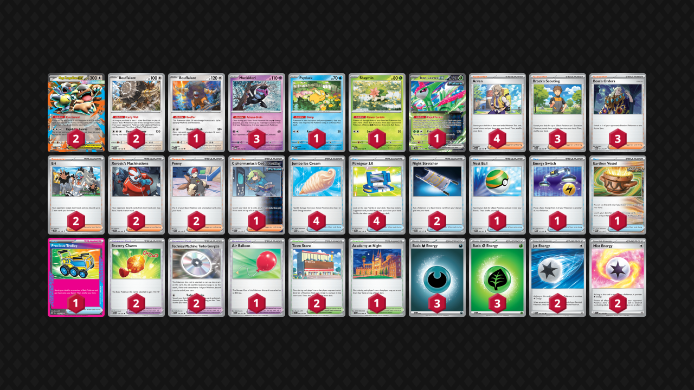

## Decklist


```decklist
Pokémon: 11
2 Mega Kangaskhan ex MEG 104
2 Bouffalant SCR 119
1 Bouffalant OBF 174
3 Munkidori TWM 95
1 Psyduck ASC 39
1 Shaymin DRI 10
1 Iron Leaves ex TEF 25

Trainer: 39
4 Arven OBF 186
3 Brock's Scouting JTG 146
3 Boss's Orders MEG 114
2 Eri TEF 146
2 Xerosic's Machinations SFA 64
2 Penny SVI 183
1 Ciphermaniac's Codebreaking TEF 145
4 Jumbo Ice Cream PFL 91
4 Pokégear 3.0 SVI 186
2 Night Stretcher ASC 196
1 Nest Ball PAF 84
1 Energy Switch MEG 115
1 Earthen Vessel PAR 163
1 Precious Trolley SSP 185
2 Bravery Charm PAL 173
2 Technical Machine: Turbo Energize PAR 179
1 Air Balloon ASC 181
2 Town Store OBF 196
1 Academy at Night SFA 54

Energy: 10
3 Darkness Energy MEE 7
3 Grass Energy MEE 1
2 Jet Energy PAL 190
2 Mist Energy TEF 161
```

### Inclusions

- There’s no reason not to play one mismatching Bouffalant, since you only need one Curly Wall in play. The OBF one is the best as it can occasionally be useful as a single-prize attacker.
- Iron Leaves is actually very important in the Absol matchup. Many other Pokemon are Weak to Grass, but don’t take those KO’s just because you can. Lots of times it’s better not to use Leaves, except against Absol, when you always want to KO the Absol.
- Shaymin is very important against Gardevoir.
- Brock’s Scouting increases the overall consistency of the deck and helps make up for some of Trolley’s weaknesses. Sometimes you’ll get Item locked or prize Trolley, so Brock comes to the rescue. It is also a good way to search out Iron Leaves.
- Boss’s Orders is quite important, so I like having three. Charizard matchup, Gholdengo matchup (with Megas), and closing out games in general. This is a grindy, control-ish deck, and Boss to remove something is a good way to pressure resources and control the board.
- Eri and Xerosic are primarily to beat Gholdengo. Eri them early and use Xerosic if they play around Eri by using their Items and stockpiling Energy. These cards can occasionally be good in other matchups and situations, especially in slower games or if the opponent ever builds a large hand.
- Penny is extremely good for board manipulation and healing. I found it also come up occasionally against Gholdengo for messing up their prize map.
- Ciphermaniac is a nice consistency card and can also be timed when an Iono/Watchtower/other disruption would be most likely or most devastating. Having an out to a Stadium off Pokegear can be nice as well.
- Stretcher is far better than Lana’s Aid. It is very useful for recovering KO’d Boufflant, Munkidori, or getting an Energy attachment for turn. Lana’s Aid is situationally better for getting Munki+Dark, but it’s inconvenient and very hard to use. I happily use both Stretcher in most games.
- Nest Ball is for general consistency, flexibility off Arven, and can make games playable when Trolley is prized.
- Energy Switch and Earthen Vessel are both very handy Items. Second copies would be nice, but space does not permit.
- The Stadiums are mostly for defensive purposes, attempting to deal with Watchtower and Jamming Tower. They are occasionally helpful and slightly increase consistency.
- Academy at Night is very handy against decks with Watchtower and / or Iono, and it lessens the impact of suddenly going from a large hand to a small one. Unfortunately it is card-negative, so you don't want to spam it all the time.
- Jet Energy has nice utility and basically negates the various ways opponents may attempt to play against this deck.
- Mist Energy is just better than Therapeutic. Mind Bend is not a big enough threat to sacrifice a significant help against Absol.

### Exclusions

- Crispin isn’t necessary, especially since this is a slower, less aggressive build. There are occasions where Crispin is nice, since it is a good card, but the two Turbo Energizes are sufficient.
- Moltres isn’t here since I’ve found Eri to have a better win rate against Gholdengo, but I think the Moltres build is better against the Mawile version. The Moltres build compromises the overall deck a lot more as well, so I prefer this version. I’ve still included some notes and games from testing the Moltres build.
- Ursaluna would probably be good but I don’t think it’s entirely necessary.
- Psychic Energy or more Basic Energy aren’t needed, especially without Crispin.
- I’d consider adding Tool Scrapper, primarily for Gholdengo’s Vitality Band (but also useful against other stuff too).

## Gameplay

- Depending on the situation, sometimes getting draw 2 with Kang is better than Turbo Energizing to it and potentially getting a faster attack. Turbo Energizing to two Munki is also fine in most matchups. Of course, the ideal is Energizing two Grass to Kang. Sometimes you’ll Energize with the first Kang onto the second one.
- Most matchups do not involve prioritizing the second Kang, but it’s not necessarily bad. Be careful about managing bench space. For the most part, other Pokemon take priority over the second Kang.
- Energizing a Grass to a Bouffalant isn’t the worst thing ever if you’re low on options, mostly if the Energy Switch isn’t prized. Turbo Energize with Kang into Energy Switch to attack is fairly common. Penny or Iron Leaves are also ways to utilize extra Energy lying around.
- The first Turbo Energize is always getting two Energy. The second one is often getting one (as there may only be one in deck by the time you need to load a second attacker), which is fine.
- When debating between Eri and Xerosic, lean towards Eri. Eri is usually better. Xerosic is obviously still good when the opponent has a massive hand, but don’t always expect to cripple them with it. Xerosic is also better vs Gholdengo when you know they have a lot of Energy, but otherwise Eri is usually better.
- Using Eri optimally involves some situational awareness and matchup experience. What did they do last turn? Are they likely to have an Item resource such as Stretcher or Candy, or would they have used it? What is their list? Can you prevent them from getting a combo play?
- I am typically pretty stingy with my Jumbo Ice Cream. If you’re healing for less than 80 are you saving yourself from a breakpoint? Are they likely to play Iono next turn? If the answer to both of those is no, save it for the full 80 heal. Or better yet, if they don’t keep the pressure on, Munkidori can take care of the damage.
- Don’t put down Stadiums against decks that may have Watchtower (especially Absol and Zoroark).

## Matchups

### Gholdengo - Slightly Favorable

If they have Mega Mawile, this matchup is unfavorable. Otherwise, it is slightly favorable. For the Moltres build, the matchup is slightly unfavorable.

- Ideal board is two Kang and all three Bouffalant. Don’t put anything else down. The second Kang is not necessary if they aren’t playing any Megas. Both Charm go on both Kang.
- Try to get Eri fairly early, but not too early like Turn 1. We want them to have a healthy hand size and a very good chance to hit a Superior. We probably only get once chance at Eri, so we need to hit something.
- If the opponent is stockpiling Energy, such as if they preemptively play Superior/Vessel to play around Eri, or if they are using Minor Errand Running a few times, use Xerosic.
- Save Boss and use it to smack Mawile/Lopunny/Buneary on sight. In general, having an attacking Kang threat is not important, but it becomes extremely important if they play Mawile or Lopunny. Boss can also be used to pressure their Energy if they’re running low on switching cards, or if they have to start attacking with a Mega.
- If they don’t have an attacking Mega available (and are stuck attacking with Gholdengo), Penny is very important to force them into a 3-1-1-3 prize map, which is basically guaranteed victory. For this reason, it is sometimes better to hold off on putting down second Kang against specifically non-Mega builds.

As the Moltres build:

- The easiest prize map is 1) Moltres KO their Genesect, 2) Moltres Bangle KO a Gholdengo, and 3) Ursaluna with Calamitous Snowy Mountain to KO another Gholdengo. When this lines, up, victory is easy, but requires things to go right. Ursaluna can also clean up on Fez if they put it down.
- Calamitous Snowy Mountain is very good in this matchup, so save it for when it’s relevant.
- KO the Genesect ASAP before they get a chance to pick it up with Turo.
- Still go for early Kangaskhan. The draw power is important, and you’ll want to get a few prizes with it if they decide to gust around it. If they leave it alive for too long and take prizes off the Bench, you may need to remove it with Penny.
- Ideal board to start the game is Kang, double Bouff, double Moltres, and a Munkidori.

```youtube
id: 9e5SCBSK67k
title: Kang/Eri v Dengo 1
```
Interesting game.

```youtube
id: 1XrDibm15LA
title: Kang/Eri v Dengo 2
```
This game shows how sometimes they draw well and steamroll you and there’s nothing you can really do about it.

```youtube
id: 8VGT4VbR3Yg
title: Kang/Eri v Dengo 3
```
This is a very interesting and close game that was difficult to navigate. It’s a good example of how to exploit their resources and manage the late-game.

```twitch
id: 2690809543
title: Kang/Moltres v Dengo 1
```
This is a good example of how to win this matchup.

```twitch
id: 2690809541
title: Kang/Moltres v Dengo 2
```
This is why you need to KO the Genesect first.

```twitch
id: 2690809546
title: Kang/Moltres v Dengo 3
```
Good example of Kangaskhan lining up the prize trade.

```youtube
id: hPoWuCwhi4s
title: Kang/Moltres v Dengo 4
```
This game shows how the matchup can be difficult if they don’t put any liabilities down and utilize Lopunny

### Gardevoir - Slightly Favorable

- Balloon is sometimes good on Kang because of Mind Bend. Otherwise Charm. Similarly, Jet Energy is a good resource for getting out of Mind Bend. Of course, if you get Mist Energy, you don’t need to worry about it.
- Ideal board is Kang, double Bouff, double Munki, Shaymin.
- Leaving Kang on the bench and doing nothing for a turn at random points in the game is generally fine. However, if they can threaten a big Scream Tail, such as if they have a bunch of Psychic Energy in the discard, this is not advisable.
- If they Mind Bend, sometimes you just flip for confusion, and that’s usually fine.
- Charm on Shaymin is generally good. If you don’t, they’ll eventually kill it with Adrenabrain.
- If the first Kang goes down or looks like it’s going to go down (and you have bench space), try to start powering up another one. Turbo Energize can help with this.

```youtube
id: 14J9Y2YRRx0
title: Kang v Garde 1
```
This game shows how Garde can present various threats and pick apart our board.

```youtube
id: aikBr9IdmjM
title: Kang v Garde 2
```
This game shows how things can devolve into a flip-fest. The flips are a pretty big deal in this matchup, so just embrace it.

```youtube
id: oWdYJtLPy_0
title: Kang v Garde 3
```
This is a close game that once again comes down to a flip.

### Dragapult - Slightly Favorable

- Kang, double Bouff, double Munki, Psyduck. This is easier said than done under Item lock though. It’s hard to say what to prioritize, as they’re all important. Kang for draw is the most important. Munkidori is higher prio if you have a Dark/Turbo Energize for it, and Psyduck is higher if you have Mist for it or if they’re going for double Dusknoir.
- Mist on Psyduck
- If they evolve into Dusclops or Dusknoir, you can stall it up thanks to Psyduck. Best done with damage on your board, as you get at least an extra turn to farm Adrenabrains. Eri can pressure Night Stretcher, so you can potentially punish them hard with this play. That said, Eri and Xerosic aren’t typically very important in this matchup. Another time the Dusclops stall can be good is to simply buy time in the early-game and unlock your Items. If this looks like a possible play, then Psyduck is a higher priority. Of course, if your opponent is smart, they won’t let you do this at all. Some people may do it anyway because it’s really hard for them to get KO’s in this matchup without Dusknoir’s help.

```twitch
id: 2705287180
title: Kang/Eri v Pult 1
```
This is an interesting game.

```twitch
id: 2705287182
title: Kang/Eri v Pult 2
```
This game is an example of why Psyduck is unnecessary and bad when there’s no real threat of Dusknoir. Multiple Munkidori is extremely strong in this matchup.

```twitch
id: 2705287183
title: Kang/Eri v Pult 3
```
Recovering from their wombo combo is possible with a little luck. This game also reinforces the power of multiple Munkidori.

### Zoroark - Slightly Favorable

- Play around Watchtower as much as possible.
- Iron Leaves can be good in some spots to rush prize cards or checkmate them if you ever get a prize lead.
- Ideal board is Kang, double Bouff, double Munki, and Shaymin if they’re threatening Darmanitan. Shaymin may not seem important but it is actually pretty good. If they don’t have Darmanitan, leave the spot open for Iron Leaves.
- Attack and apply pressure as fast as possible. Kang isn’t exactly known for its speed, but allowing them to set up and stabilize can be a disaster.

```twitch
id: 2717585990
title: Zoro v Kang 1
```
Making an INSANE comeback.

```twitch
id: 2717585989
title: Zoro v Kang 2
```
This is an absolutely gorgeous checkmate, and the early preemptive attachment to Bouffalant ended up being good!

```twitch
id: 2717585991
title: Zoro v Kang 3
```
This is pretty much the ideal game for Zoroark, and sometimes you just lose to Iono Watchtower.

### Absol - Even

This matchup is about even if they have Watchtower. If they have Cornerstone, it might be an auto-loss, though I haven’t tested against it. If they have neither of those, the matchup becomes quite favorable.

- Mist Energy on Kangaskhan is extremely strong. However, some lists here and there play Enhanced Hammer, so be careful about that. If they don’t play Hammer, you can win by steamrolling with Kang Mist, but it’s best to play under the assumption they have it until proven otherwise, or you’ll get punished extremely hard.
- Save a bench spot for Iron Leaves! Use it to KO their Absol as soon as you get the opportunity to do so. Charm on Leaves can be good so it survives Ursaluna. The Leaves itself isn’t particularly important after KO’ing Absol, but keeping it alive denies prize cards and can be repurposed with Penny/Energy Switch.
- Don’t put Iron Leaves into your hand! They will punish with Erika or Claw. If you end up naturally drawing Leaves, that’s fine. Try to keep an out to Stretcher around. If they threaten Claw plus Toedscruel, put down the Leaves preemptively and start powering it up. If Leaves isn’t in hand, try to keep some Brocks/Cipher around for it.
- Do not play Stadiums because you’ll need to bump Watchtower. Ciphermaniac is very good for playing around their disruption, but of course, there’s only one Cipher in the deck.
 
```twitch
id: 2705287179
title: Kang/Eri v Absol 1
```
This game demonstrates how the matchup revolves around Watchtower cheese. It is devastating if they get it at a good time, but hard for them to do and reliant on luck. Not much you can do about it though.

```twitch
id: 2705287181
title: Kang/Eri v Absol 2
```
This game demonstrates the power of Iron Leaves. If they don’t get Watchtower at a good time, it’s not too hard to win.

### Charizard Noctowl - Favorable

- Charm on Psyduck is sometimes very good to survive Fan Rotom. Stretcher is best saved for Psyduck in case they target it down.
- Ideal boad is Kang, double Bouff, Munki, Psyduck, and an open spot for Leaves in case you need it.
- Don’t always use Iron Leaves. It’s mostly good when you can remove their only Charizard early or can close out the game.
- Boss is very useful to remove key Pokemon such as Duskull/Dusclops, their only Hoothoot, or their only attacker. Use Boss to exploit any vulnerabilities in their board or just pressure Duskull.
- Make sure to keep count of how much possible damage they can do with their current board and play around it. They can use Klefki Jet to activate Dusknoir, but not if their Bench is full.

```twitch
id: 2706222694
title: Kang v DawnZard 1
```
Close game.

```youtube
id: _e2Yz6EsORw
title: Kang v DawnZard 2
```
This game shows what to do and how to maneuver from an awkward spot.

### Grimmsnarl - Unfavorable

- Froslass is a big threat. KO them whenever possible. Later in the game, double Munki with Darks can spawntrap their Snorunt.
- Prioritize attacking quickly with Kang, then get Darks on Munkis.
- Ideal board is Kang, double Bouff, double Munki, and then an open spot for Iron Leaves.
- Iron Leaves is pretty good for one-shotting their Grimmsnarl if you aren’t Bossing Froslass that turn.
- Charms sometimes go on Bouff/Munki to keep them alive a little longer.

```youtube
id: nDVM6Pc6b5k
title: Kang v Grimm 1
```
Me figuring out the matchup. This is a close and interesting game.

```twitch
id: 2706222693
title: Kang v Grimm 2
```
This game shows how Frolass is insanely threatening in this matchup and games become very difficult when they’re allowed to establish them.

### Charizard / Secret Box - Slightly Unfavorable

- Stretcher is usually best saved for Psyduck in case they target it down.
- Ideal boad is Kang, double Bouff, double Munki, Psyduck. Sometimes you want an open spot for Iron Leaves, but usually I’d prioritize everything else.
- Don’t always use Iron Leaves. It’s mostly good when you can remove their only Charizard early or can close out the game.
- Be very careful about their damage breakpoints. Don’t forget about Klefki and Defiance Band. Sometimes it is just better to pass instead of attacking. A lot of them only play two Boss, so their gust options are limited. They will eventually have to attack into Kang, which lets you Adrenabrain. In general, only attack if it is accomplishing something. Don’t KO random garbage such as Tatsugiri for no reason. If they have any nonessential Pokemon on the board, don’t KO it because then they cannot get a perfect board (double Charizard, double Dusk, Klefki, Pidgeot) except by using Turo. Attacking increases their damage and activates Counter Catcher/Iono. If you never take the lead, you can get an advantage thanks to Adrenabrain. Of course, there are exceptions. If they have a weak start/board, you can run them down with a fast aggressive Kang.
- If they are threatening a wombo combo with perfect board, try to KO their Pidgeot and disrupt them with Eri/Xerosic.
- Pressuring their Pidgeot is generally best if you don’t know what to do. It’s a way to pressure and disrupt them without taking prizes. Adrenbrain can finish off damaged Pidgeot/set it up for a KO.
- If they are not threatening perfect board (double Charizard, double Dusk, Klefki, Pidgeot), just use Boss/Iron Leaves to exploit the vulnerability in their board. If they only have one Duskull, KO it, etc. This way, you can actually just race to six prizes.

```youtube
id: _iX3zC3HJOU
title: Kang v ZardPidg 1
```
This is a VERY interesting game that was fun and difficult to navigate.

```youtube
id: vMwmtja1mEM
title: Kang v ZardPidg 2
```
This was an interesting and close game despite two Bouffalant being prized, which is normally an instant loss.

```youtube
id: bZwfCaKXPYw
title: Kang v ZardPidg 3
```
This game shows how threatening Iono can be, and is part of the dangers of taking prize cards.

```youtube
id: gsZEOxr52kk
title: Kang v ZardPidg 4
```
Sometimes you need a little luck to draw the right cards right after getting Iono’d.

### Kangaskhan / Bouffalant Mirror - Even

- Prioritize attacking with Kang as fast as possible.
- Ideal board is double Kang, double Bouff, double Munki.
- Mostly going for some form of a 3-1-1-1 prize map, unless 3-3 is easier in the game (such as if you hit some Ice Creams with Eri).
- Once you're attacking with Kang, get Munkis with Darks, and then after all that, start powering up another Kang to try and make them go through two Kang.
- When you're about to hit into their Kang, use Eri to get rid of Ice Cream or Boss KO Munki with Dark if you don't have Eri.
- There's not much you can really do to play around Eri/Xerosic besides preemptively using Pokegear, but even that is situational.
- If they have Cornerstone, you're probably going to lose. Use Boss only to KO Munki with Dark, and set up as many of your own Munki as possible.

## Personal Thoughts

This deck is surprisingly good. It has good matchups against the top decks, so it’s definitely worth considering. However, it can get punked by random Watchtowers, and auto-loses to random fringe stuff like Cornerstone and Raging Bolt.
