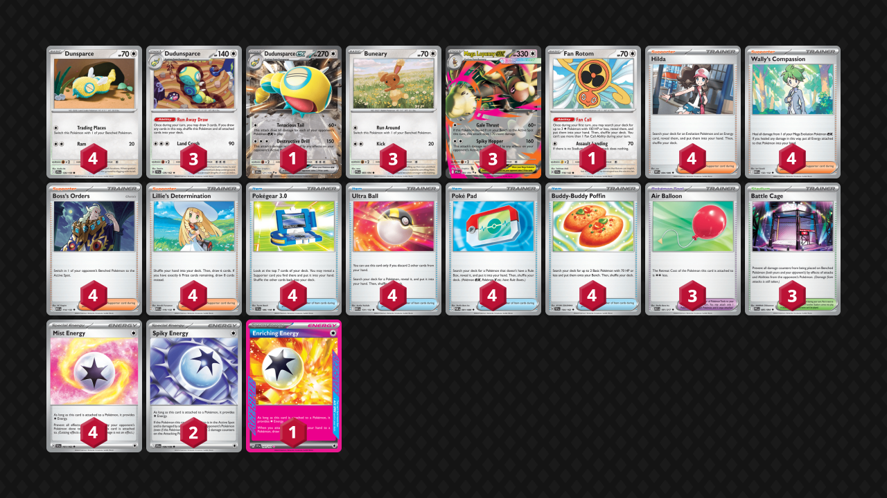

<!-- PUBLIC -->
## Decklist


```decklist
Pokémon: 15
4 Dunsparce JTG 120
3 Dudunsparce TEF 129
1 Dudunsparce ex JTG 121
3 Buneary PFL 83
3 Mega Lopunny ex PFL 84
1 Fan Rotom SCR 118

Trainer: 38
4 Hilda WHT 84
4 Wally's Compassion MEG 132
4 Boss's Orders MEG 114
4 Lillie's Determination MEG 119
4 Pokégear 3.0 SVI 186
4 Ultra Ball MEG 131
4 Poké Pad POR 81
4 Buddy-Buddy Poffin TEF 144
3 Air Balloon ASC 181
3 Battle Cage PFL 85

Energy: 7
4 Mist Energy TEF 161
2 Spiky Energy JTG 159
1 Enriching Energy SSP 191
```

### Inclusions

- I think the 70 HP Dunsparce is superior. The option to get a Turn 1 Fan Rotom attack via the free retreat Dunsparce is tempting, but I don’t think it is that relevant. The 60 HP is a pretty big liability in the current format.
- Dudunsparce ex offers meaningful help in the Raging Bolt matchup. It’s still tough, but not nearly as bad as it is without Dudunsparce ex.
- I maxed out all of the consistency (four Poffin, four Lillie, etc.) just because I found the techs were not that good and so there is a lot of space to play with.
- Third Air Balloon is necessary for the deck’s functionality. Not having Air Balloon at any given time is a huge pain.
- Battle Cage is very good against Dragapult and can counter various annoying Stadiums.
- Spiky Energy might not be necessary, but it helps against Festival Lead and Raging Bolt. Having more Energy in general also helps get the consistent Turn 2 attack, which is a big selling point for this deck. There are also times where the extra Energy is good, as Lopunny occasionally has to hard retreat when it doesn’t have Air Balloon, or when it wants to use its second attack (which comes up often).

### Possible Inclusions

- Chien-Pao could be a decent tech if Watchtower ends up becoming big. I still think Watchtower is bad and inconsistent, but if people play it, Chien-Pao can be a good response.
- Second Fan Rotom could be included over a different consistency card like Poffin or Lillie. Prizing it is sad, but not necessarily game-losing.
- It’s possible to play some amount of Nighttime Mine over Battle Cage. I think Battle Cage is better, but maybe they’re about the same. Nighttime Mine could be good against Wellspring Ogerpon, I suppose.

### Exclusions

- Mega Froslass is just a bad Lopunny that opponents can play around (and requires Water Energy). You’ll still lose to Fighting decks just as hard, so there’s no point.
- Moltres is bad and doesn’t do anything against Raging Bolt. Having to play Fire Energy is bad too.
- Shaymin similarly doesn’t do as much against Bolt as I had hoped.
- Abra is not relevant very often. It allows Lopunny to cycle Wally when the opponent is at one prize (or has Watchtower in play), which is nice utility, but just doesn’t really matter. It would be relevant in games where opponents can KO one Lopunny but not a second one. This most commonly is Festival Lead with only one Black Belt, but against that, Spiky Energy does the same job! In the games where Abra is good, it is game-winning, but I found those to be incredibly rare.
- Psyduck did not have the desired effect against Dragapult / Dusknoir, partly due to this deck playing no recovery cards. Even if you found the space for a Psyduck and a Stretcher, this deck can’t find the Stretcher. Furthermore, Dragapult has options to remove Psyduck and use Dusknoir in the same turn.
- I don’t see the vision for Repel. Dragapult is usually too behind in Energy attachments to merry-go-round Pults thanks to Lopunny’s fast pressure. Maybe it would be good against the Blaziken version?
<!-- /PUBLIC -->
## Gameplay Tips

- Instantly slamming Air Balloon on Lopunny is generally good.
- Enriching Energy should go on Lopunny in matchups where you’re forced to play Wally often (such as Dragapult). In matchups where you don’t use Wally as much (Raging Bolt), it’s better on Dudunsparce. Either way, plenty of exceptions exist. The main thing to keep in mind is that leaving Enriching in deck or on Dudunsparce enables Hilda, while putting it on Lopunny enables Wally.
- Prioritize getting two Buneary at the start if one is in any danger of being KO’d. If not, you may not actually need a second one against matchups that can’t one-shot Lopunny. Of course, it’s usually not a bad thing to have a backup Buneary, but Dunsparce is more of a priority if you aren’t being threatened.
- Make sure to keep one or two Dudunsparce in play whenever you take a KO against decks with Unfair Stamp. Unfair Stamp is a major lose-condition, so you need to play around it to the best of your ability.
- When you aren’t playing around hand disruption, using Run Away Draw aggressively is generally good. This deck wants to draw cards and cycle through the deck so that it can chain Wally or Boss when it needs to. If you don’t know whether or not to use Run Away Draw, lean towards using it by default. This is mostly true within the first few turns.
- All search cards are valuable resources throughout the game. Unlike other decks that like to burn excess Poffins, this deck can extract value from them for most of the game.

## Matchups

### Dragapult - Depends

Against most Dragapult builds, the matchup is favorable. However, against Dusknoir, it’s unfavorable.

Against non-Dusknoir
- Second Buneary isn’t a priority.
- Putting a second Lopunny in play too soon can be a game-losing liability. If they build up enough damage, they can threaten both Lopunny at once, which is a bad scenario.
- Play around Stamp very cautiously. Keep 1-2 Dudunsparce in play on turns when you take a KO.
- Playing Battle Cage preemptively is fine. This forces them to find the response Stadium. If we don’t put Battle Cage in play, they can just farm damage for free, which we don’t want to let them do.
- Wally is the most important resource as we’ll need to spam it every time a Lopunny gets smacked.

Deviations against Dusknoir:
- Getting a second Buneary and evolving it into Lopunny is a LOT more important!
- If you have an opportunity to KO their only Duskull/Dusclops in play, go for it. It’s a huge threat, but sometimes you need to use Wally instead of Boss.
- Being fast and aggressive is even more important.

```youtube
id: kpIBOnfXjLE
title: Lop v Hammers 1
```

```youtube
id: bcg3aRUL5lg
title: Lop v Hammers 2
```

```youtube
id: -dkLl5npZaE
title: Lop v Hammers 3
```

```youtube
id: btqClFVMizE
title: Lop v Hammers 4
```

```youtube
id: gCResoCcZb8
title: Lop v Pultnoir 1
```

```youtube
id: tjyW4TJ4Grg
title: Lop v Pultnoir 2
```

### Raging Bolt - Unfavorable

- Getting fast Boss KO’s on two-prize Pokemon is the win condition. Boss is the most important card in this matchup.
- Having Spiky Energy on your active at any given time is good because it puts Raging Bolt in Lopunny range. Raging Bolt is their most reliable attacker.
- Dudunsparce ex is very strong in this matchup. Use it to get a one-shot when you otherwise couldn’t, or when putting Lopunny in play would lose you the game.
- Watch out for Wellspring Ogerpon. Oftentimes there isn’t anything you can do about it, but it’s a big threat. Leaving anything with more than 100 HP in the active or getting extra Buneary are some ways to play around it.
- Fast Fan Rotom smack can be good against Kang or Bolt if you have nothing better to do.

```youtube
id: eT9eYofGYhY
title: Lop v Bolt 1
```

```youtube
id: i2Iu-VecsPo
title: Lop v Bolt 2
```

### Mewtwo - Depends

If they have Maximum Belt, this matchup is very unfavorable. If they don’t have it, the matchup is very favorable.

- Be as fast/aggressive as possible. If you know they aren’t playing Maximum Belt, setting up and stabilizing is more important.
- Play around Archer the same way you’d play around Stamp.
- Try to smack Mewtwo as soon as you can. If they get a Maximum Belt, we want to have the option to KO it immediately.
- Prepare to chain Wally.

```youtube
id: Wv0v3yl2L5I
title: Lop v Mewtwo 1
```

```youtube
id: O306NKKdc3Y
title: Lop v Mewtwo 2
```

### Festival Lead - Depends

If they have just one Black Belt, this matchup is slightly favorable. If they have two ways to KO Lopunny (such as two Black Belt or Black Belt + Max Belt), the matchup is very unfavorable.

- We have to play as if they will get one big KO on a Lopunny and can’t get through the next one.
- Draw as many cards as possible to set up for an inevitable Wally chain. 
- Save one Spiky Energy for your second Lopunny. They’ll one-shot the first one, and you will often need Spiky for the next one.
- If they go first and get the double-KO on Turn 2, don’t panic. Sacrifice Fan Rotom to the second hit if you have it in play. Set up two Lopunny, and use Run Away Draw to clear all other Pokemon off your bench. If you leave a single-prize Pokemon in play, they’ll Boss it and then one-shot Lopunny for game. If we only have two Lopunny, they’ll one-shot one and may not be able to KO the other. After they get down to one-prize, make sure you have Spiky Energy and start chaining Wally. Spiky Energy allows the 60 hit to KO their Dipplin, making the Wally chain functional with only one Pokemon in play.

```youtube
id: UMCYykyzajc
title: Lop v Festival 1
```

```youtube
id: wcW8QeFjgtE
title: Lop v Festival 2
```

```youtube
id: 7W-YVpWEcL4
title: Lop v Festival 3
```

### Alakazam - Unfavorable

If they have Dedenne and two Hammer, this matchup is very unfavorable. If not, it’s still unfavorable but not as bad.

- This matchup is the most complicated one. The overall plan is to stack every Mist Energy on a single Buneary. If you end up with a Lopunny with four Mist and no benched Pokemon, you win. There are lots of variations based on what is prized and what your opponent does.
- Try to attach Mist Energy every turn.
- If they have Dedenne, you have to be aggressive. Being slow will simply let them Hammer off all of your Mists. If they do not have Dedenne, going slow is better.
- Don’t evolve the Buneary until you need to start attacking OR if they are threatening a Fez KO on it.
- If you prize Mist, start being aggressive after getting two or three Mists on your Lopunny since you’ll need to find that fourth one.
- Having extra Buneary/Fan Rotom in play is generally bad because they hamper your ability to play around Handheld Fan. Try to sacrifice those Pokemon while building up your main Buneary with Mists. If your opponent KO’s your fodder, you can use Run Away Draw to leave only Lopunny in play, which is very good against Handheld Fan.
- Boss is a very good resource for getting around Handheld Fan. Using all four Boss allows you to beat Handheld Fan without necessarily needing to have an empty bench.

```youtube
id: STEe7cRpzw0
title: Lop v Zam 1
```

### Garchomp and Lucario - Auto Loss

- Can’t really win. Target down Gabite/Riolu/Gible with Energy and try to cheese them with speed.

```youtube
id: uLwhdLAY6b8
title: Lop v Lucario 1
```

```youtube
id: ueOJv4yRtcU
title: Lop v Garchomp 1
```

### Crustle - Auto Win

- It’s basically impossible to lose so it doesn’t matter what you do. In theory they can get triple heads on Kangaskhan twice, but there’s nothing you can do about that.

```youtube
id: whq8qKAhgBg
title: Lop v Crustle 1
```

### Zoroark - Favorable

- If they are playing Punk Helmet, it’s very important to play around it. Do not attack into Punk Helmet with a full HP Lopunny.
- Feeding them a Reshiram KO one time is generally fine if you have to. Ideally you’ll smack Zoroark for 160 and force them to get a damage modifier along with Reshiram, making it difficult for them to get a subsequent Mochi + Black Belt play.
- Boss is a premium resource, especially for getting around Punk Helmet or Zoroark in general.
- If they are board-locked out of Munkidori, using Fan Rotom to smack a Zoroark can be very good. However, it’s still risky if they have Scoop Up Cyclone.
- KO any two-prize liabilities on sight such as Pecarunt, Meowth, or Fez. This plays around Reshiram and Scoop Up Cyclone.
- KO’ing anything on the bench (especially dangerous Munkidori) is generally better than smacking into Zoroark. Passing is occasionally better than smacking into Zoroark. This is typically accompanied by sacking a single-prize Pokemon so you can find Boss next turn and not have to Wally. If you’re going to leave Lopunny in the active, may as well just smack them.
- If you can’t heal your damaged Lopunny, use that turn to smack a Zoroark with it.

```youtube
id: eNstnz9wA9E
title: Lop v Zoro 1
```

## Personal Thoughts

This deck is just bad.
