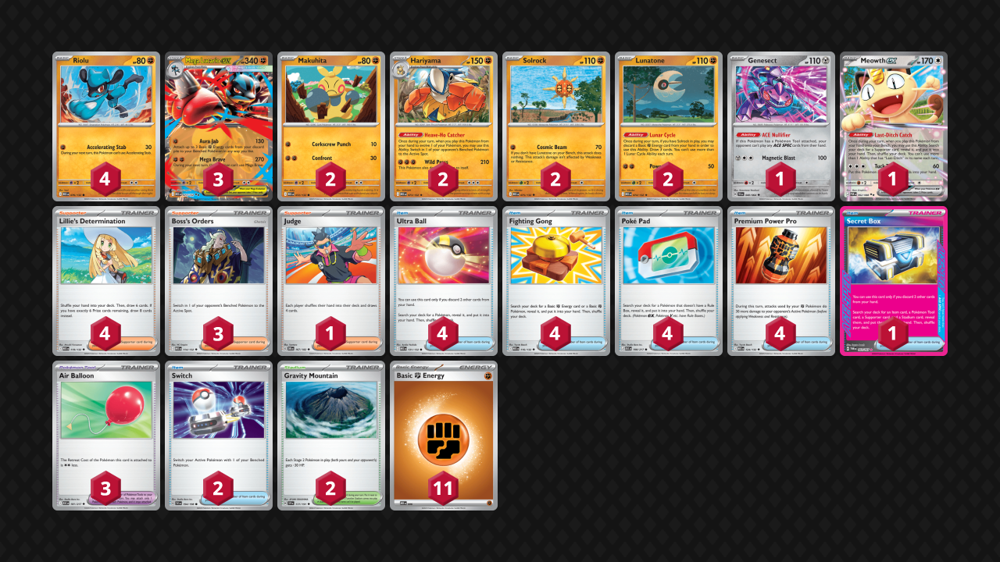

## Decklist


```decklist
Pokémon: 17
4 Riolu MEG 76
3 Mega Lucario ex MEG 77
2 Makuhita MEG 72
2 Hariyama MEG 73
2 Solrock MEG 75
2 Lunatone MEG 74
1 Genesect SFA 40
1 Meowth ex POR 62

Trainer: 32
4 Lillie's Determination MEG 119
3 Boss's Orders MEG 114
1 Judge DRI 167
4 Ultra Ball MEG 131
4 Fighting Gong MEG 116
4 Premium Power Pro MEG 124
4 Poké Pad ASC 198
1 Secret Box TWM 163
3 Air Balloon ASC 181
2 Switch SVI 194
2 Gravity Mountain SSP 177

Energy: 11
11 Fighting Energy MEE 6
```
<!-- PUBLIC -->
### Inclusions

- Genesect is actually very good. One of this deck’s most common lose conditions is bricking off Stamp. Genesect gives us protection from this. It isn’t hard to find or use, and usually you can afford having it on your bench. It actually performed well in testing, even though it didn’t when I tried it in other decks.
- Meowth is insanely broken. Yes, it can be a liability, but I use it for value way too often to not play it.
- I tried with three Riolu and wanted a fourth one because they are important to swarm into play in some matchups, and you want the second one quickly.
- Even with Hariyama, this deck still likes to use Boss’s Orders a lot. In fact, I would even like to play a fourth Boss if space allowed.
- Judge is overall not very good but sometimes it actually is the card you need to stop the opponent from getting a big combo. Meowth makes it somewhat consistent at least.
- The Ace Spec question is an interesting one. For this build, I think the best option is Secret Box followed by Maximum Belt. If you build the deck a bit differently, perhaps something like Hero’s Cape or Scoop Up Cyclone could work as well. Secret Box is better than Maximum Belt when it comes to reaching big KO’s on the likes of Arboliva or Dragapult, since it can grab Premium Power and Gravity Mountain while also doing other things. Of course, Secret Box has infinite versatility and use cases, while also boosting the consistency of the deck. Max Belt allows you to more easily Aura Jab KO the likes of Teal Mask Ogerpon and such, which can be very relevant. It also allows for occasional Riolu KO’s on the likes of Fez/Meowth on Turn 1, as well as a better mirror match, so it isn’t bad to play Max Belt.
- There’s a lot of switching cards in this deck. I want this many Air Balloon to consistently be able to use Genesect. With three Air Balloon and no Switch, I found myself sometimes wanting Switch. This is mostly relevant against decks that do not instantly KO your Lucario after you use Mega Brave. In general, preserving Energy drops on the board is also quite important. Although the switching cards aren’t the most integral part of the deck, it is nice to have them.
- Gravity Mountain is important against Dragapult and Arboliva for both the damage modification as well as the Stadium removal.
- 11 Fighting Energy is good. I tried 10 and wanted more. I could even add 12th one, though I don’t think I would go above that.

### Exclusions

- Tried the third Solrock and found it to be dead weight. This deck does not attack with Solrock as much as I expected. Using Aura Jab is usually preferred. You still attack with Solrock some, but not enough to warrant a third copy of it.
- Also tried the second Judge and just hate the card. I am only playing one reluctantly because there are occasionally situations where you need it. I don’t see the need for a second one. Between Lunar Cycle, Meowth, and Secret Box, it’s not too hard to find the single copy. Using Judge for draw is just terrible so it’s mostly for disruption.
- I tried Wally’s Compassion and just never got value from it. Using it on Lucario means you can’t use Mega Brave or Boss’s Orders that turn, which sucks. Wally’s seems good in theory but is just bad.
- Rocky Energy is bad. I always get punished for having it over Fighting Energy as there are too many interactions with Basic Fighting Energy each game. Sure, Rocky has use cases against Dragapult and Alakazam, but it doesn’t really impact win-rate that much.
<!-- /PUBLIC -->
## Gameplay

- Hariyama is a very good attacker! It often swings prize trades. You’ll almost never power it up manually, but it’s great to power up with Aura Jab in some matchups. In the matchups where Hariyama is good, I usually Aura Jab two to it while putting one on Riolu/Lucario. That way, I can be flexible and use the manual attachment next turn on whichever one I want to use.
- Lunar Cycling your only Fighting Energy for turn may be tempting, but don’t fall for it! I always get punished when I greed the Lunar Cycle! Only greed it when you are desperate, otherwise don’t sacrifice your manual attachment for the turn if you need it for a relevant attack. If you’re already able to use the attack you want (or if you can’t attack anyway), of course Lunar Cycle away. In other words, if you aren’t sure if you should Lunar Cycle or not, just don’t!
- Riolu or Solrock can get some pretty nasty quick KO’s thanks to Premium Power Pro.
- Keep your eyes peeled for situations where you may need to keep an open bench spot for Meowth.
- Keeping Energy in play is extremely important. Sometimes it’s even better to use Aura Jab over getting a big Mega Brave KO. This is mostly applicable if your opponent will be able to KO your Lucario and leave you without a big attacker. Of course, if you can close out the game with Solrock or another Aura Jab, it’s no problem. Try to always have one or two Riolu/Lucario with at least one Energy, as well as Hariyama with 2-3 Energy if you have the option off Aura Jab. Keeping every attacker within one Energy of attacking is generally a good idea, so you don’t really need to Aura Jab or preemptively attach Energy to Solrock.
- Using Boss is generally better than using Hariyama, but sometimes I use Hariyama instead anyway. For instance, if you use Boss and the opponent can KO your Makuhita to leave you without a gust effect, you’ll wish you had used Hariyama instead. Of course, Hariyama is also better if you prefer to play Lillie or Judge for the turn instead of Boss.
- If you aren’t sure where to put extra Air Balloon, a good rule of thumb is on Riolu/Lucario. This deck doesn’t need to pivot very often, so it’s not a big deal if the Balloon gets KO’d. If you’re worried about Hariyama getting stuck (if it has no Energy AND your opponent can punish you with buying time), put it on Hariyama.
- I usually prefer to Lunar Cycle after Lillie given the option. The odds of whiffing a Fighting off Lillie are slim, and it’s optimal to sequence that way.
- Using Aura Jab to KO Pokemon like Meowth/Fez to accelerate Energy while prize trading is a major part of this deck’s win condition/prize mapping. It’s best to do so when you have 2-3 Energy in your discard. If you do it without accelerating Energy, you may get punished and stuck later.
- If you have a very small bench against Clefairy decks, it’s possible that Clefairy won’t be able to one-shot Lucario. This is pretty difficult to play around but can be game-winning if you have the opportunity.
- It is okay to evolve into Hariyama without using the Ability, so long as the following conditions are met: 1) you’re getting Stamped OR they can easily snipe off the Makuhita 2) you are going to need to attack with the Hariyama, and 3) you won’t necessarily need the gust effect from the Ability.
- Going first is usually best. Go second against decks with Budew or some evolution decks, particularly Dragapult.

## Matchups

### Dragapult - Even

If they play Clefairy, the matchup becomes unfavorable because it’s so much easier for them to respond to Lucario.

- Solrock and Riolu are good early attackers, especially if they are threatening Latias. If they aren’t threatening Latias (and sometimes even if they are), Lucario’s Aura Jab is the best early-game attack to set up Energy on backup Riolu or Hariyama.
- Need to have some sort of response to their Psychic attackers (usually Hariyama or Lucario’s second attack). Lucario’s first attack can also kill Clefairy with two damage mods. Having lots of Energy in play is generally very important.
- Getting a fast lead is important because the prize trade becomes unfavorable later. Mid- or late-game Aura Jab KO’s on Meowth/Fez are generally good to accelerate the game or close it out.
- Preemptively using Ultra Ball for Lucario is VERY GOOD. Try to do this before they Item lock you, such as on Turn 1 if you don’t already have Lucario in hand.
- Two-shotting Dragapult is bad. Try to one-shot it or gust around it if necessary.
- Need to swarm Riolu and get them evolved asap because they drop like flies.
- Try to get Genesect before they get Stamp, even though this is somewhat hard in this matchup and entirely up to luck.

```youtube
id: KrC_xNmpJrg
title: Pult v Lucario 1
```

```youtube
id: tFMrLmjER0Y
title: Pult v Lucario 2
```

```youtube
id: peMLpGQQT9o
title: Pult v Lucario 3
```

### Lucario Mirror - Even

This matchup may be slightly unfavored depending on the opponent’s list, as we do not have Maximum Belt or healing. This is the main matchup where the lack of Maximum Belt will be felt.

- Prize map is usually 3-3 or 1-1-1-3 depending on the situation. If they put down Meowth, try to incorporate that into your prize map instead to win in 3 attacks. Meowth is obviously a huge liability so try not to put it in play.
- If you get an early single prize KO, go for a 1-1-1-3 map and try to one-shot their Mega Lucario. If you can’t, gust around it until you can get the one-shot. Save Premium Power Pros so that you can get the triple Premium Power to one-shot their Lucario.
- If they get two Lucario in play early, you can ignore single-prizers and try to win by KO’ing both of them. Two-shot one and one-shot the other. If this map is available to your opponent, you may want to delay your second Lucario from coming into play.
- Judge is best used to stop them from one-shotting your Lucario. For example, if you’re attacking with an undamaged Lucario and they have a large hand, Judge can be good to potentially make them whiff the KO.
- Genesect is very strong alongside an undamaged Lucario, as it makes it very hard for them to KO it.

### Absol (or other Clefairy/Ogerpon) - Favorable

This matchup is favorable against non-Noctowl toolbox-type decks.

- Hariyama is insanely broken for swinging the prize trade, and you’ll most likely need to attack with it to win. Clefairy one-shotting Lucario is not a problem as long as you have the Hariyama response.
- You need to use Aura Jab to set up Hariyama. If you get baited by a Mega Brave KO with no follow up plan for when Lucario inevitably gets one-shot, you’ll lose.
- Genesect is also quite good here for stopping Unfair Stamp.
- You may want to delay the second Lucario to prevent them from going 3-3, and force them to go through the Hariyama.

```youtube
id: bzvRSCnAT7U
title: Lucario v Absol 1
```

```youtube
id: EKXF9j5d8KE
title: Lucario v Absol 2
```

```youtube
id: WiiZllhotKY
title: Lucario v Absol 3
```

### Meganium - Favorable

- Go first even though they sometimes have Budew.
- Genesect is also good here for stopping Stamp.
- Ogerpon needs 5 Energy to one-shot a Lucario with 2 Energy. Therefore, any Ogerpon with fewer than three Energy isn’t much of an immediate threat.
- Using Mega Brave to get KO’s instead of Aura Jab to set up is generally best, unless they have a three-Energy Ogerpon that you can’t immediately KO. If they can’t KO your Lucario, be as aggressive as possible. If they can, make sure to set up backup attackers.
- Aura Jab is best on Meowth/Fez if they put them down. Loading up Hariyama can be great in this matchup since it one-shots Ogerpon.

```youtube
id: 5zPxQivDD-E
title: Lucario v Meganium 1
```

```youtube
id: SSoxROD2hVQ
title: Lucario v Meganium 2
```

### Raging Bolt - Unfavorable

This matchup is unfavorable assuming they have Clefairy.

- Solrock is often useful in the prize trade since it can one-shot 70 HP Hoothoot.
- Don’t let them go 3-3 by feeding them two Lucario. It’s not hard for them to one-shot Lucario.
- Hariyama is very useful in this matchup as well. Try to power it up with Aura Jab and use it to take a two-prize KO.
- Not sure if I should keep mentioning Genesect since it’s good against literally every deck that has Unfair Stamp, which is most decks. You get the idea. If they have Prime Catcher instead, Genesect can still be useful but it’s not as much of a priority as it is against Stamp.

```youtube
id: OXhJiSR_HZI
title: Lucario v Bolt 1
```

```youtube
id: 3gGYgkVt9Qs
title: Lucario v Bolt 2
```

### Mewtwo - Unfavorable

- Getting random KO’s with single-prize Pokemon can be good because if they do not have a full board of Rocket’s Pokemon they cannot two-shot Lucario with Spidops, which is often relevant.
- Save Premium Power Pro to one-shot Mewtwo with Mega Brave. Whenever they have Mewtwo with Energy, try to get the one-shot on it with two Premium Power plus Mega Brave.
- Try to get a fast Aura Jab for Energy acceleration and then start attacking with other Pokemon. Attacking with Lucario is generally bad unless you’re one-shotting something big or really need the Energy acceleration.
- Their Maximum Belt does make relevant breakpoints on Lucario. Therefore, Genesect can still be useful, but it’s situation dependent. If they have Energy lying around, Mewtwo can one-shot Lucario anyway, and if they easily have a full board for Spidops, they are two-shotting with it anyway, so it doesn’t matter in those instances.

```youtube
id: e-WATTU3iTA
title: Lucario v Mewtwo 1
```

```youtube
id: NlCBLjsG3ic
title: Lucario v Mewtwo 2
```

### Zoroark - Favorable

- Target their Energy or easy prize cards. Solrock can be good for this as it one-shots Zorua. Aura Jab for acceleration vs Fez/Meowth/Pech, etc.
- Try to get three Riolu (or two plus a Lucario) so they cannot spawn trap you with Darmanitan. If they don’t have Darmanitan, ignore this.
- Make sure to get Genesect so they can’t cheese you with Stamp. Usually the third Riolu and Genesect take priority over Makuhita.
- Delay the second Lucario so they cannot win in three attacks by hitting both Lucario for 90 followed by 250 on each. If they don’t have Darmanitan, ignore this.
- Aura Jabbing into a Zoroark is not advisable, especially if it’s poisoned or they have a large hand.

```youtube
id: 3sJ9esJlQ40
title: Lucario v Zoroark 1
```

```youtube
id: 5ADHOmhoTMo
title: Lucario v Zoroark 2
```

```youtube
id: nU1gG12catQ
title: Lucario v Zoroark 3
```

## Personal Thoughts

This deck is pretty good and better than I was expecting. However, it has a rather polarized matchup spread and gets collateral'd by all the random Clefairy running around. I don't think it's quite good enough to be top tier, but definitely viable