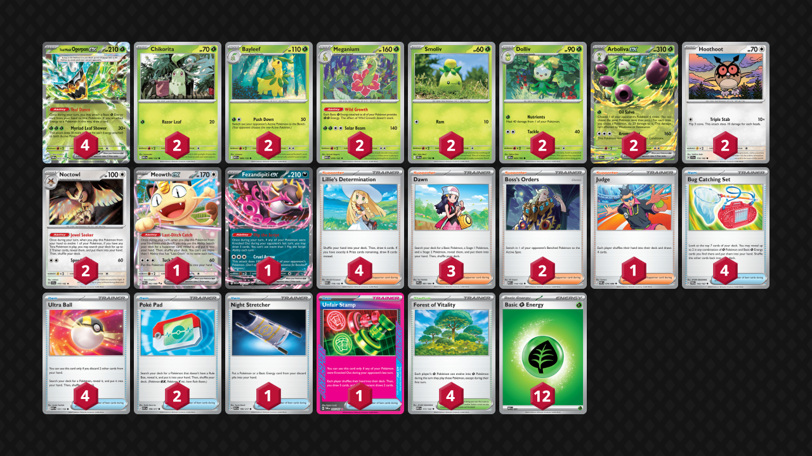

## Decklist


```decklist
Pokémon: 22
4 Teal Mask Ogerpon ex TWM 25
2 Chikorita MEG 8
2 Bayleef MEG 9
2 Meganium MEG 10
2 Smoliv DRI 21
2 Dolliv DRI 22
2 Arboliva ex DRI 23
2 Hoothoot SCR 114
2 Noctowl SCR 115
1 Meowth ex POR 62
1 Fezandipiti ex ASC 142

Trainer: 26
4 Lillie's Determination MEG 119
3 Dawn PFL 87
2 Boss's Orders MEG 114
1 Judge POR 76
4 Bug Catching Set TWM 143
4 Ultra Ball MEG 131
2 Poké Pad ASC 198
1 Night Stretcher ASC 196
1 Unfair Stamp TWM 165
4 Forest of Vitality MEG 117

Energy: 12
12 Grass Energy MEE 1
```
<!-- PUBLIC -->
### Inclusions

- You usually won’t need the third or fourth Ogerpon, but they are important to find early. They get the deck going and you want to start loading Energy on Ogerpon quickly so that they can one-shot anything.
- Noctowl greatly improves the performance of this deck. I don't think one is reliable enough, and I always want to have it, so I like the 2-2 line.
- The one of Judge looks bad but it actually is very strong in some situations. It can break opponent’s combos if they are building a large hand, which ends up being relevant a lot more often than I expected. Stamp is useful for the same reason, and both can be searched with Noctowl.
- Even with Noctowl, Forest and Dawn are kind of hard to find and I always want to have them. I tried with 3 Forest and really think 4 is necessary. Dawn is even better with Noctowl.

### Exclusions

- Energy Switch is not necessary in this build at all. It has some use cases but you just don't need it very often and I'd rather be consistent.
- Unfortunately some cuts had to be made for Noctowl: Boss, Budew, Meowth, and a recovery card. All of those besides Meowth would still be very good in the Noctowl build and could potentially be added back in.
- Briar is bad and hardly ever relevant.
<!-- /PUBLIC -->

## Gameplay Tips

- Oftentimes you’ll need to sacrifice a single-prize Pokemon in the active before you’re ready to engage in a favorable prize trade. Budew is very good for this if you play it because it comes with Item-lock. It can occasionally get punished, but usually it’s fine.
- Fast Arboliva is the priority in most matchups. It is just very good in this format and difficult for opponents to deal with right away.
- Don’t play Forest until you can get immediate value from it, as the opponent can just bump it. Exceptions are 1) if you have multiple Forest in hand or 2) you expect an incoming Unfair Stamp.
- Preload Ogerpon with the amount of Energy corresponding to the matchup. Against Lucario (for example), you want to have Ogerpon with 3 Energy to threaten a KO on it next turn. Against Zoroark, preloading Ogerpon is not very important at all.
- Occasionally you do actually save Stamp. Arboliva is capable of sniping key support Pokemon which can go well with Stamp. Stamp + Boss stall + Arboliva snipe is very potent and can make comebacks.
- Bug Catching Set is an interesting sequencing card. It is like Pokegear in that you may want to draw first with Fez/Teal Dance, but oftentimes I use it before Poke Pad/Ultra Ball so I know what missing Pokemon to search out. If you mostly want Energy, thin the Pokemon out first. If you want multiple Pokemon (such as the early-game or if you have Forest in play), use Bug Catching Set first. If you don’t have Forest in play (or even sometimes if you do), shuffling the Bug Catching Set back in with Lillie/Stamp is actually best! Without Forest, you can’t get as much value from the Bug Catching Set, and it’s a very powerful resource, so shuffling it back in can be very strong.
- Putting a third Ogerpon in play is usually not necessary and will likely actively harm you. You’ll inevitably need bench space for support Pokemon. Second Arboliva is sometimes good, and second Meganium is only useful if they KO the first one. The extra Ogerpon is much better if you play Energy Switch.
- Late game Ultra Balls are sometimes used just to thin cards out.
- Go first against everything.

## Matchups

### Dragapult - Unfavorable

- Prioritize getting a fast Arboliva and try to get max value from Items before getting Item-locked. When using Arboliva’s attack, KO Drakloak and put 20 on the next Drakloak/Dreepy. On the next attack, you can KO that Drakloak/Dreepy and Budew.
- It’s also possible to do a similar thing but with Fezandipiti and Meganium instead of Arboliva. Of course, getting the Arboliva is easier and better, but if your hand lines up for the fast Fez instead, that’s nearly as good. Keep your eyes peeled for that option.
- Try to get two Energy on two different Ogerpon. Since you need four Energy to one-shot Dragapult, having two preemptively is the magic number. You don’t need commit more Energy before you take the KO, but it can be situationally ok to play around Stamp (though it plays into Boss). You do need to one-shot their Dragapult with Ogerpon.
- You typically won’t need a second Arboliva or Meganium, and their pre-evolutions are liabilities.

```youtube
id: q32sS-zVUb8
title: Pult v Meganium 1
```

```youtube
id: EiOSHaWnuqs
title: Pult v Meganium 2
```

```youtube
id: dt4M6CfciwA
title: Pult v Meganium 3
```

```youtube
id: QjIFFi2LNgI
title: Pult v Meganium 4
```

```youtube
id: Ibp6SWJNgX8
title: Blaziken v Meg 1
```

```youtube
id: 1pSNLuWc6y8
title: Blaziken v Meg 2
```

### Lucario - Unfavorable

- Hitting Riolu for 10 with a random guy or pinging it for 20 with Arboliva is relevant for the Ogerpon breakpoint.
- Arboliva is very good. Try to get it early, and sometimes you’ll want a second one. Sometimes it’s best to KO Lunatona or Solrock if their board isn’t developed. Otherwise, KO’ing Makuhita while pinging Riolu/Lucario is also very good.
- Meowth/Fez are big liabilities but it’s hard to go without them. Try to use Arboliva to snipe off Makuhita and Judge to disrupt them when they have a big hand. If they whiff a response to an Arboliva, it’s possible to win as a result.
- Getting tons of Energy on Ogerpon quickly is another win condition. If you can one-shot their Lucario as soon as they attack with it, you’ll be in great shape. Since that sometimes isn’t possible, you may need to save an Energy for Arboliva instead.

```youtube
id: 5zPxQivDD-E
title: Lucario v Meganium 1
```

```youtube
id: SSoxROD2hVQ
title: Lucario v Meganium 2
```

### Meganium mirror - Even

- If you play Budew, it can be both good and bad. It can be good for its normal purpose, but bad because they can punish it with Arboliva. If you have another small single-prize Pokemon on the board, it may be better to not put Budew down so they cannot get two prizes with Arboliva. If that looks like an issue, you can push a different single-prize Pokemon as a sacrifice before you’re ready to go in.
- Even if you aren’t getting two prizes, Arboliva can be useful to KO Chikorita/Bayleef and potentially deny a Meganium. Boss stalling can also stress their Energy so they can’t load up Ogerpon as quickly.
- Ideally, you’ll simply get the first two prizes and win from there. If you’re behind, you’ll have to rely on Arboliva and disruption tactics to try and make them whiff something.
- If you have extra ping damage, think about what you might want to go for. 20 on Meowth puts it in range of Arboliva’s second attack, while 60 puts it in range of another snipe. 40 on Meganium puts it in range of another snipe, and damage on their Arboliva can make it easier for Ogerpon to KO it.
- Your Meganium boosts their Ogerpon’s damage. It’s possible to delay Meganium to make it harder for them to one-shot your Arboliva.

### Alakazam - Very Unfavorable

- Try to get a fast Arboliva. If you can’t, attack with whatever you can as fast as possible.
- Hand disruption is your win condition. Judge/Stamp when you’re attacking with Arboliva to try and make them whiff. KO two Abra with Arboliva if possible.
- Try to get a second Arboliva as well.
- If they don’t have Shaymin in play, you can Boss stall something and try to set up a board wipe with multiple Arboliva attacks. This only realistically works alongside Stamp.
- If they only have one Dudunsparce/Fez in play, KO it on the Stamp turn, and they might brick.

```youtube
id: iD7-LXurpaQ
title: Zam v Meganium 1
```

```youtube
id: mfO2VViBono
title: Zam v Meganium 2
```

### Garchomp - Favorable

- Fast Arboliva is insanely strong. Use it to spawn trap Gabite or Energy. If you can’t get it, try to take two fast prize cards to get ahead on the trade.
- Prioritize getting lots of Ogerpon with Energy, especially if you don’t get the Arboliva. You’ll need to chain Ogerpon with three Energy to mow down their Garchomp. This is one matchup where you may actually need a third Ogerpon. If they don’t have Power Weight, Ogerpon with two Energy can get an efficient KO.
- Second Meganium can be ok if you’re ahead on the trade. At the very least, don’t discard the pieces for the second Meganium so that you can set it back up if the first one gets KO’d.

```youtube
id: hZzfYs-eYcI
title: Chomp v Meg 1
```

```youtube
id: Tyoe8uv-E4c
title: Chomp v Meg 2
```

```youtube
id: A0I3I8FeHYw
title: Chomp v Meg 3
```

### Slop Box / Absol - Even

- If they have Munkidori and a Mega in play, use Arboliva to KO the Munki, which sets up a very nice 1-3-2 prize map.
- If you can nuke their active with Ogerpon and take the lead in the prize race (or use Boss to do so), that is an easy way to win. If you can’t, leave a single-prizer up instead and wait until you can. Budew is generally good if you play it, but you do have to be somewhat careful with it. If you Itchy Pollen three times, they can KO it with Adrenabrain and open aggression with the lead.
- This matchup is a very straightforward prize race where each side tries to position themselves to get the lead at the beginning, as it is very hard to make a comeback if you’re behind. Loading Energy on multiple Ogerpon is generally good as you need to chain them for one-shots. This is one matchup where the third Ogerpon can potentially be good, especially if they don’t put down Munkidori since Arboliva will have less value in that case.
- Staying at four Pokemon on the bench makes it harder for them to win since they cannot KO Ogerpon with Clefairy (unless they also get Area Zero).

```youtube
id: PvhArUmgbJ4
title: Absol v Meganium 1
```

```youtube
id: ImYPuD7Y3_Y
title: Absol v Meganium 2
```

### Raging Bolt - Favorable

- Arboliva is actually decent for sniping Hoothoot and it’s hard for them to KO if they don’t already have a lot of Energy in play. If they already have a few Energy as well as an extra Hoothoot (or a large hand), using Arboliva is not as good as they may nuke it with Raging Bolt ex.
- Similar to other prize trade matchups, try to get an even-prize lead and win normally from there. There is not much depth here, this deck just matches up well since it’s easier for us to chain KO’s than it is for them.
- Staying at four Pokemon on the bench makes it harder for them to win since they cannot KO Ogerpon with Clefairy (unless they also get Area Zero).
- Stamp + KO’ing support Pokemon can be very strong depending on the situation. If they don’t have Latias, Boss stall plus Arboliva snipe can also be effective since it’s annoying for them to find it.

```youtube
id: 9RMiJGE6ais
title: Bolt v Meganium 1
```

```youtube
id: lvVut6hOcNI
title: Bolt v Meganium 2
```

### Mewtwo - Favorable

- Fast Arboliva is very strong because it can KO multiple Pokemon at once. Even if you can’t do that, it’s hard for them to deal with the Arboliva and the snipe damage adds up. If they have Articuno in play, usually you want to put 60 on it while KO’ing a small guy (of course, KO’ing two small guys at once is better if it is available). By putting 60 on Articuno, it traps them from putting more small guys in play. This is relevant because Mimikyu is actually a threat.
- If you have extra snipe damage, putting it on Mewtwo can make it a lot easier for Ogerpon to get the KO. Sometimes you won’t have the extra damage since you want to prioritize KO’ing little guys and putting 60 on Articuno. Trying to snipe Spidops is very inefficient.
- Mimikyu can easily KO Ogerpon with Energy on it, so keep that in mind. Spidops with Maximum Belt can also KO Ogerpon. For these reasons, Arboliva is usually the best attacker. Of course, you still want to use Ogerpon for getting big KO’s, such as one-shots on Mewtwo. They can one-shot Arboliva with Mewtwo Max Belt, but it’s hard for them to line it up, especially in the early-game.

```youtube
id: k2C_bZin2HI
title: Mewtwo v Meganium 1
```

```youtube
id: Txu0iMcxAKA
title: Mewtwo v Meganium 2
```

### Zoroark - Favorable

- Treat this the same as other prize-trade matchups. Don’t initiate with Ogerpon unless you’re getting two prizes. Opening with a single-prizer or Arboliva is best. With a single-prizer, you have to be a little careful if they are threatening Darmanitan, so sometimes you want a chunkier one like Bayleef or Meganium. Leaving up a lower-HP Pokemon is fine if you don’t have something else that Darmanitan can snipe, or if they don’t have Darumaka yet.
- As always, fast Arboliva is very good since it’s hard for them to KO it early. Getting the two-prize lead straight-up is best if you have the option (such as Ogerpon Boss on Zoroark).
- Yveltal is basically a non-issue since everything can attack with two attachments, so don’t worry about it.
- Using an extra Energy attachment on Meganium is very good, as it can one-shot Zoroark for just two Energy. This is relatively easy to do since you don’t really need to prioritize loading up Ogerpon with a bunch of Energy. This can be a solid way to make a comeback if they do get the initial lead, especially combined with Stamp or Judge to make them whiff gusts.

```youtube
id: rft0Tohghl4
title: Zoroark v Meganium 1
```

```youtube
id: VESe6pnhDkk
title: Zoroark v Meganium 2
```

### Crustle - Unfavorable

- Fast Arboliva is very good for sniping off Dwebble (or Munkidori).
- Extra attachments should go onto Meganium since that’s the only thing that can take out a Crustle. Ideally you’ll also use Judge or Stamp when going in with Meganium, although those cards are also good at pretty much any time. Hand disruption is the best way to realistically win this matchup.

```youtube
id: ioVZ82Db7Gw
title: Crustle v Meg 1
```

### Ogerpon - Depends

This matchup mostly depends on what techs each player plays. If they have Moltres, it’s unfavorable. If they have Legacy Energy and you have Briar, it’s favorable. If they don’t have Moltres and you don’t have Briar, it’s about even or slightly favorable.

- As usual, we want to position ourselves to start the game on the winning end of the prize trade. We have the advantage in regards to this because we have Meganium and they don’t. However, Meganium can also buff their damage, so don’t put it in play until you’re ready to engage.
- Don’t completely fill your bench in the early-game to feed Clefairy. This is less relevant later because they can get KO’s with Ogerpon, but they won’t have enough Energy to do so at the start of the game.
- Don’t feed them Wellspring plays. The best active Pokemon to start the game is Ogerpon with just one Energy, unless they play Moltres, in which case you’ll have to keep Ogerpon on the bench to start and sacrifice a random single-prize Pokemon. In general, think about what types of plays they can do and try to play around them.

```youtube
id: NqIuI3DuDVI
title: Ogerpon v Meganium 1
```

```youtube
id: OILBoOI06cM
title: Ogerpon v Meganium 2
```

## Personal Thoughts

The Noctowl build does perform better than without, but overall the deck still does not seem that great to me. Another issue is people randomly teching Shaymin. If that changes I would consider this deck a bit better.
