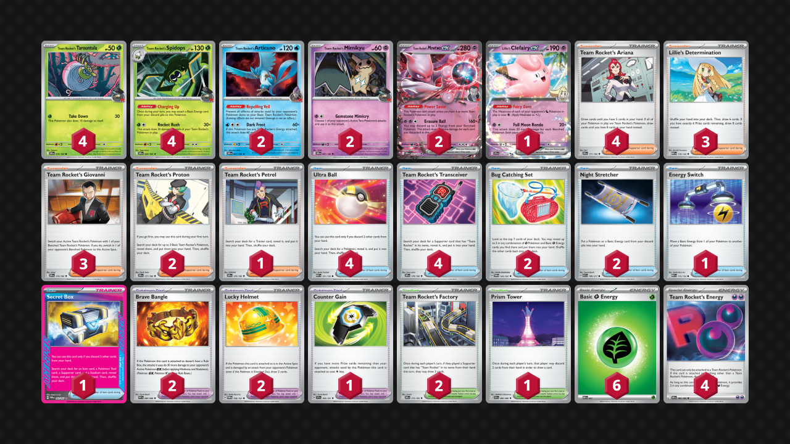

## Decklist


```decklist
Pokémon: 15
4 Team Rocket's Tarountula DRI 19
4 Team Rocket's Spidops DRI 20
2 Team Rocket's Articuno DRI 51
2 Team Rocket's Mimikyu DRI 87
2 Team Rocket's Mewtwo ex DRI 81
1 Lillie's Clefairy ex JTG 56

Trainer: 35
4 Team Rocket's Ariana DRI 171
3 Lillie's Determination MEG 119
3 Team Rocket's Giovanni DRI 174
2 Team Rocket's Proton DRI 177
1 Team Rocket's Petrel DRI 176
4 Ultra Ball MEG 131
4 Team Rocket's Transceiver DRI 178
2 Bug Catching Set TWM 143
2 Night Stretcher ASC 196
1 Energy Switch MEG 115
1 Secret Box TWM 163
2 Brave Bangle WHT 80
2 Lucky Helmet TWM 158
1 Counter Gain SSP 169
2 Team Rocket's Factory DRI 173
1 Prism Tower CRI 80

Energy: 10
6 Grass Energy MEE 1
4 Team Rocket's Energy DRI 182
```
<!-- PUBLIC -->
### Inclusions

- Lillie’s Clefairy messes with the Rocket synergy a little bit, but it’s extremely strong against Dragapult, which makes it a worthwhile tech.
- I play four Ariana because I found it’s the Supporter I want to use most often. It has good synergy with the four Ultra Ball as well as the Factories.
- Even though it isn’t a Rocket Supporter, Lillie’s Determination is still an insanely strong card. This deck needs all the consistency help it can get.
- Petrel is very consistent with the four Tranceivers and it is often relevant. You’ll mostly use Petrel to find Energy Switch, Stretcher, or a damage modifier on a key turn. It also is quite strong with the draw 2 from Factory.
- Ultra Ball is definitely warranted as a four-of. The discard effect is very good with Ariana (for draw) as well as Spidops (for Energy acceleration).
- Two Bug Catching Set along with all Grass Energy seems to be the most consistent way to use these slots, counterintuitive as it is. Bug Catching Set helps with swarming Spidops/Tarountula, which is what we want nearly every game. It also helps with finding Energy, as we can struggle with that and still need to get Energy drops each turn (and discard them too).
- Secret Box is better now that Maximum Belt isn't as important in the metagame. All of the Trainers do something good in this deck, so the Box is particularly powerful. At worst, it's just more consistency, which this deck needs.
- Brave Bangle is very good with Spidops and hits tons of relevant numbers. One-shotting 210 HP two-prizers and more easily two-shotting Megas are both great. I tried with just one damage modifier card and often wanted a second one.
- Lucky Helmet is very nice to help against hand disruption as well as general consistency. It's more important now that Special Red Card is in many decks. Best used when going into Red Card range.
- Counter Gain is absurdly strong when you're behind in prizes.
- Prism Tower is not amazing but it provides draw and discard, which are both welcome in this deck. In a way, this is similar to Factory's draw two on Ariana turns, as Prism Tower allows the Ariana itself to draw more cards.

### Possible Inclusions

- Second Energy Switch would still be good, but playing only one makes more sense with Secret Box and Counter Gain.
- Maximum Belt is still good but not as relevant with the way the metagame is developing. Using Mewtwo Max Belt to KO Dragapult with no Clefairy in play is extremely uncommon, and Lopunny isn't as popular now.
- Archer is weirdly mediocre so I think it's fine to cut it, but having the option would still be nice.
- Other random Rocket Pokemon such as Wobbuffet, Sneasel, and Murkrow/Honchkrow have only fringe use cases. Smacking with Spidops is sufficient for the most part. However, having these Pokemon around can still help Spidops do more damage, so the flexibility of other situational attackers isn’t necessarily bad. I haven’t tried them much though.
- Playing Poffin over a Proton and Bug Catching Set is also a consideration. Tweaking the Bug Catching Set and Grass Energy counts also requires some adjustment with Psychic Energy and Poke Pad, and it’s hard to find the perfect balance. Proton’s existence also makes me question if Poffin is even worth playing, but it definitely can be useful in games where you don’t have Proton and start with Lillie/Ariana instead.

### Exclusions

- Poke Pad was very underwhelming when testing with it.
- Handheld Fan is a decent tech for Festival Lead, but that's not as relevant now.
- Psychic Energy was never really needed, and it doesn’t mesh well with Bug Catching Set.
- Sacred Ash could be ok for chaining Spidops. However Stretcher is mostly better because it's hard to find the Pokemon out of the deck. Most games also end before you really need the Sacred Ash. I much prefer Stretcher.
<!-- /PUBLIC -->
## Gameplay Tips

- All random Rocket Pokemon are important resources! You usually want a full board of them when attacking with Spidops, which is often. As some get KO’d, you’ll need to replace them. This means that discarding any Basic Pokemon can have severe consequences later in the game.
- Because discarding Energy is so good and it’s kind of hard to do, I want to prioritize using Ultra Ball when I have Energy to discard and consider saving it when I don’t. Of course this is situational. If you have no other Energy to attach for the turn, then discarding one is pointless. Same if you have no Spidops.
- Mimikyu is very good to have on the board as a pivot, which is important for helping Mewtwo attack. However, somtimes Mimikyu is a liability (or dead, or prized). In those cases, Spidops can often be used as a pivot thanks to its Ability. Keeping random Energy on Spidops is good for this reason. Why commit a meaningless Charging Up now when you can keep your options open for next turn? To use Spidops as a pivot!
- Go first against everything. Using Proton, getting an Energy attachment, and also getting Spidops in play (potentially for a fast attack) are all great reasons to go first. Not to mention, lots of other decks want to go first too and it’s overall much better in this format.
- Whether you want to keep a single-prize board or not depends on situation and matchup. Can they easily snipe a Mewtwo off the bench? Decks like Zoroark and Raging Bolt can, so you might want to hold off and wait for an Energy Switch play, or just stick with Spidops the whole way. Don’t have an Energy or Giovanni? Mewtwo could get stuck, and it doesn’t take a genius brain on your opponent’s part to see that. In most other cases, putting Mewtwo in play is generally good.

## Matchups

### Dragapult - Even

- Evolving into Spidops is bad! If you have Articuno in play (which you always should), you mostly don’t want to evolve into Spidops unless you’re attacking with it, which does happen here and there.
- Mimikyu is sometimes good, but often bait. I’d usually prefer to attack with Mewtwo and prioritize powering it up. There are many downsides to Mimikyu, but it is still a single-prizer that can one-shot Dragapult.
- Try to get a fast Tarountula with Grass Energy so that you can mow down Budew with it on the first few turns.
- Preemptively putting down Clefairy depends on the situation and how many outs to Stretcher/Ultra Ball you have in deck. If you think you’ll be able to get the Clefairy back or are overly worried about Stamp, putting it down can be fine. If not, holding it is better.
- Getting extra Energy in play for Hammer as well as Lucky Helmet for hand disruption are all good things to keep in mind.

```youtube
id: EuEq39RGns8
title: Pult v Mewtwo 1
```

```youtube
id: fusMKkbOseU
title: Pult v Mewtwo 2
```

```youtube
id: osdV2FPSiDI
title: Pult v Mewtwo 3
```

```youtube
id: rKnuz-k3Qxw
title: Pult v Mewtwo 4
```

```youtube
id: _g3NT0sbFGo
title: Blaziken v Mewtwo 1
```

```youtube
id: bwkleD_as9E
title: Blaziken v Mewtwo 2
```

### Raging Bolt - Slightly Unfavorable

- Powering up Mewtwo on the bench might be safe in the early-game. Later, or if they have a strong board, try to delay Mewtwo until you can charge it in one turn via Energy Switch / Counter Gain. Otherwise, it will get Boss-KO’d. Clefairy can help Mewtwo one-shot Bolt, and that also should not be put into play until absolutely necessary.
- Spidops can be a very good attacker that trades well into most things that they have. You’ll need Bangle to get a relevant one-shot with Spidops.
- Putting Mimikyu in play is very good as it can be used as a pivot to help make Mewtwo in one turn. If you don’t have Mewtwo, you’ll want to attack with Spidops to maintain tempo. Attacking Spidops can also be used as a pivot if they don’t KO it.

### Alakazam - Auto Win

- Try to keep Articuno on the bench at all times. Getting both of them is fine. Attack with Mewtwo. It’s basically impossible to lose unless you brick, and even then you might still win.
- Powering up a second Mewtwo is also good in case they have a tech like the other Alakazam, which can two-shot a Mewtwo. Spidops can also one-shot the bad Zam, but it can be return KO’d, so Mewtwo is better if it’s available.
- When choosing to attach Grass or Rocket Energy to Mewtwo first, attaching Grass first is better. They play Enhanced Hammer (and it also takes less damage to bad Zam).
- If they KO a Mewtwo with bad Zam and you can KO it back with another Mewtwo, try to use Archer to stop them from chaining bad Zam.

### Zoroark - Favorable

- Mewtwo is obviously very bad in this matchup. I wouldn’t put it down unless you absolutely need it for Spidops damage. Spidops easily one-shots everything, so spam it.
- Your main lose condition is bricking off Stamp. There isn’t that much you can do about it. Don’t use draw Supporters if you don’t have to, and thin out any other cards whenever you can get a chance. Try to burn non-draw Trainer cards and establish as much Spidops/Energy/random single-prize Pokemon as possible.
- Darmanitan with Mochi lets them take a double KO. If you have a chance to snipe off Darm with Giovanni, sometimes it is worth it.

```youtube
id: MHPP4lIZYY0
title: Mewtwo v Zoroark 1
```

```youtube
id: AqDycXcIsq0
title: Mewtwo v Zoroark 2
```

### Crustle - Depends

If they play Cornerstone and adequate support for it, the matchup is slightly unfavorable, so I’ll be going over that one. If they don’t have Cornerstone, it’s a free win.

- Attack and get KO’s with fast Spidops. Leave two or three Tarountula unevolved because it’s good against Cornerstone. Save damage modifiers for attacking into Cornerstone. You can use Bangle/Max Belt on Tarountula or Mimikyu.
- Mimikyu is a premium resource. Use it and both Stretcher to deal with Cornerstone. You’ll want to save it until you’re ready to attack with it so that it does not get KO’d preemptively. This also means you’ll need to manage your Energy so that you can pivot into it.
- Giovanni and Archer are very good in this matchup. Use Giovanni to either pressure Cornerstone before it gets enough Energy or to KO Munkidori with Dark, which is also a big threat. Disrupt their hand with Archer when applicable. It’s best when they attack with Cornerstone, you can Archer them to hopefully make them whiff Ice Cream.

```youtube
id: C3ofUo0imDU
title: Crustle v Mewtwo 1
```

```youtube
id: 9R29o4idU1o
title: Crustle v Mewtwo 2
```

### Mewtwo Mirror - Even

- Try to get a fast lead with Spidops or Mewtwo. With Spidops is easier, but Mewtwo is often better if you can get it just as quickly. Getting any value from Mewtwo before they can one-shot it is good.
- You’ll have to use Mewtwo at some point anyway because you’ll run out of Spidops if you only use that. We want to use Mewtwo when it’s less likely for the opponent to one-shot our Mewtwo back. Can also attack with Mewtwo along with Archer for disruption or with Giovanni to KO their Mewtwo. Attacking with Mewtwo when they can obviously one-shot it back is bad.
- Mewtwo needs two Energy on the bench to one-shot each other, which makes the damage mods irrelevant. Therefore, it’s best to attack with Mewtwo when they don’t have extra Energy/Spidops, which is typically earlier rather than later. We also want to be able to one-shot their Mewtwo when the opportunity arise.
- Two shotting their Mewtwo is fine unless you’re far behind.
- Articuno can have uses against Wobbuffet or Murkrow, if they play those.

### Lucario - Favorable

- Mewtwo is the best attacker because it one-shots Lucario and is somewhat hard for them to kill.
- Spidops is a very common attacker because sometimes you can’t power up Mewtwo or it gets KO’d. Spidops can one-shot all of their single-prize Pokemon and also two-shots Lucario if you have a full board, so it’s quite good.
- All random Rocket Pokemon are actually valuable resources because of Spidops requiring the full board in this matchup. This comes up more often than one might expect, so you want to keep all the random little critters around and not mindlessly throw them away with Ultra Ball.
- Even if you play Psychic Energy, Clefairy is generally bad in this matchup because it’s hard to power up and griefs the other Rocket cards like Spidops and Ariana. However, every once in awhile, you might find yourself in a situation where you need Clefairy to one-shot a Lucario and actually have the right cards to do so, and then it’s probably fine. I would normally not plan on using it though. Of course, my current list can’t attack with it at all, so it’s not a consideration.

```youtube
id: e-WATTU3iTA
title: Lucario v Mewtwo 1
```

```youtube
id: NlCBLjsG3ic
title: Lucario v Mewtwo 2
```

### Festival Lead - Very Unfavorable

- Get as many Tarountula and Spidops as possible. KO Dipplin.
- If you play Archer, it is best when they don’t have a backup Dipplin. Bumping their Stadium is best in the early-game or when using Archer.
- Mewtwo can sometimes be used in the early-game as they might not be able to get the KO on it right away. Using it when they’re stabilized is a bad idea, except if you get Archer + Stadium they might not be able to get all the pieces to KO it.

```youtube
id: YT4891TzjBk
title: Festival v Mewtwo 1
```

### Lopunny - Very Unfavorable

Without Maximum Belt, this matchup is terrible. With Maximum Belt, it's very favorable.

- The general plan is to get one clean one-shot on a Lopunny with Maximum Belt and get the rest of your prizes from single-prize KO’s. You’ll need two or even three Giovanni to accomplish this. Of course, if they don’t KO your Mewtwo right away, it’s possible to get more than three prizes with it.
- Getting a fast Spidops KO on a single-prizer is valuable since it’s one fewer Giovanni you’ll need to win. You’ll probably want to rely on Spidops for all of the single-prize KO’s since Mewtwo is a valuable piece to deal with Lopunny.
- Mimikyu and Articuno are pretty much useless, so prioritize getting as many Tarountula/Spidops as possible as well as Mewtwo. Sometimes you’ll need a second Mewtwo if you draw slow and they pressure the first one.

```youtube
id: Wv0v3yl2L5I
title: Lop v Mewtwo 1
```

```youtube
id: O306NKKdc3Y
title: Lop v Mewtwo 2
```

### Garchomp - Favorable

- Swarm the board with as many Spidops and Tarountula as possible.
- Save Bangle for a big one-shot on Garchomp. If you don’t have them, two-shotting a Garchomp is fine but you’ll need Giovanni to finish it off.
- Attack with Spidops pretty much every turn. It’s easy for them to one-shot Mewtwo, so don’t put it in play early and only use it if you need to not run out of attackers.

```youtube
id: 9FyEwjGxUZE
title: Chomp v Mewtwo 1
```

```youtube
id: cGdmwR51CxI
title: Chomp v Mewtwo 2
```

```youtube
id: LvY_9sbjIjQ
title: Chomp v Mewtwo 3
```

### Arboliva - Unfavorable

- Try to get two Spidops evolved quickly before they get Arboliva out. If you get two Spidops, don’t put down any more Tarountula as it just feeds Arboliva (unless you have to for Spidops damage).
- Putting Mimikyu down preemptively is only good if they are threatening a big Ogerpon one-shot on Mewtwo (or if you think they might not get Arboliva). Otherwise, putting it down preemptively is bad because it just feeds Arboliva. If they attack with Ogerpon, Mimikyu can easily one-shot it. You may need Energy on Spidops to use it as a pivot in some situations.
- Bangle is often good on Spidops to one-shot Ogerpon.
- Putting Articuno in play is generally bad since it feeds Arboliva. Sometimes you need to put it down for Spidops or Mewtwo, which is fine, but don’t do it if you don’t have to. Pretty much any Basic is a liability due to Arboliva. The ideal board is both Mewtwo and a bunch of Spidops, but reality is not so kind, so it just depends on the situation.

```youtube
id: k2C_bZin2HI
title: Mewtwo v Meganium 1
```

```youtube
id: Txu0iMcxAKA
title: Mewtwo v Meganium 2
```

### Ogerpon - Slightly Favorable

- Damage modifiers and Energy Switch are our most premium resources. They should be used to get a two-prize turn when you otherwise wouldn’t be able to. They are extremely strong in this matchup.
- Spidops is quite a good attacker because it can get a gust-KO on Meowth or a damage modifier KO on their attacker, so look for those plays.
- Getting Energy in play whenever you can as there’s lots of ways to utilize them. Preemptive Energy on Mimikyu can be good for helping get the one-shot on their Ogerpon if they attack with it.
- Articuno stops their Sob.
- Mewtwo is sometimes fine for lack of a better option. It’s very good if you manage to get a one-shot with it, but that is harder to come by than expected.

```youtube
id: Szl3_rJGc6s
title: Ogerpon v Mewtwo 1
```

```youtube
id: Q0ck8sVaKG4
title: Ogerpon v Mewtwo 2
```

## Personal Thoughts

This deck is not very good, but the metagame is actually kind of decent for it right now.