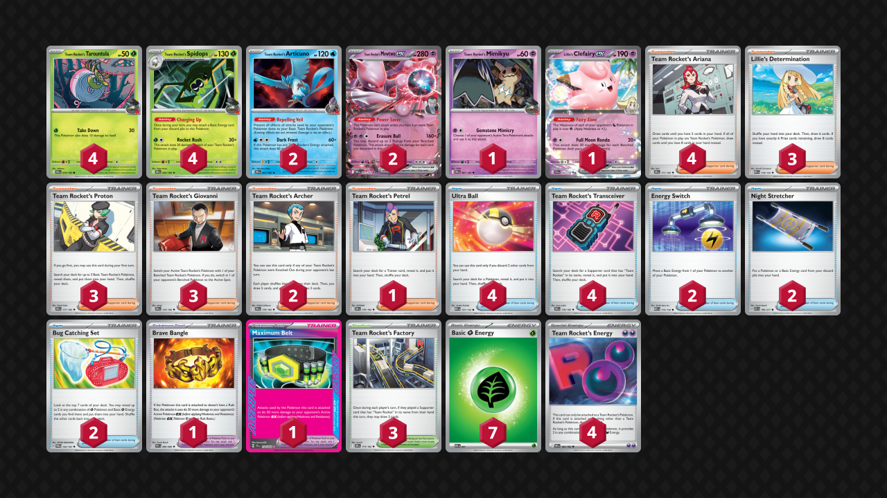

## Decklist


```decklist
Pokémon: 14
4 Team Rocket's Tarountula DRI 19
4 Team Rocket's Spidops DRI 20
2 Team Rocket's Articuno DRI 51
2 Team Rocket's Mewtwo ex DRI 81
1 Team Rocket's Mimikyu DRI 87
1 Lillie's Clefairy ex JTG 56

Trainer: 35
4 Team Rocket's Ariana DRI 171
3 Lillie's Determination MEG 119
3 Team Rocket's Proton DRI 177
3 Team Rocket's Giovanni DRI 174
2 Team Rocket's Archer DRI 170
1 Team Rocket's Petrel DRI 176
4 Ultra Ball MEG 131
4 Team Rocket's Transceiver DRI 178
2 Energy Switch MEG 115
2 Night Stretcher ASC 196
2 Bug Catching Set TWM 143
1 Brave Bangle WHT 80
1 Maximum Belt TEF 154
3 Team Rocket's Factory DRI 173

Energy: 11
7 Grass Energy MEE 1
4 Team Rocket's Energy DRI 182
```
<!-- PUBLIC -->
### Inclusions

- Lillie’s Clefairy messes with the Rocket synergy a little bit, but it’s extremely strong against Dragapult, which makes it a worthwhile tech.
- I play four Ariana because I found it’s the Supporter I want to use most often. It has good synergy with the four Ultra Ball as well as the Factories.
- Even though it isn’t a Rocket Supporter, Lillie’s Determination is still an insanely strong card. This deck needs all the consistency help it can get.
- Petrel is very consistent with the four Tranceivers and it is often relevant. You’ll mostly use Petrel to find Energy Switch, Stretcher, or a damage modifier on a key turn. It also is quite strong with the draw 2 from Factory.
- Ultra Ball is definitely warranted as a four-of. The discard effect is very good with Ariana (for draw) as well as Spidops (for Energy acceleration).
- I tried with just one Energy Switch and found myself needing it constantly. It’s quite difficult to use Mewtwo without Energy Switch, so I added a second one and like it quite a lot.
- Two Bug Catching Set along with all Grass Energy seems to be the most consistent way to use these slots, counterintuitive as it is. Bug Catching Set helps with swarming Spidops/Tarountula, which is what we want nearly every game. It also helps with finding Energy, as we can struggle with that and still need to get Energy drops each turn (and discard them too).
- Brave Bangle is very good with Spidops and hits tons of relevant numbers. One-shotting 210 HP two-prizers and more easily two-shotting Lucario are both great. I tried with just Maximum Belt and found that it was not really enough as far as damage mods.
- Maximum Belt is the Ace Spec because it lets Mewtwo hit for 330 and Spidops to hit for up to 230. These numbers are very relevant for helping Mewtwo keep up in the metagame.

### Exclusions

- Second Mimikyu is unnecessary and it’s sometimes a liability. However, that or the Rocket’s Kangaskhan could be considered to help against Cornerstone, should it become meta-relevant.
- Poke Pad was very underwhelming when testing with it.
- Psychic Energy was never really needed, and it doesn’t mesh well with Bug Catching Set. However, the two Energy Switch are a bit worse with no Psychic Energy.
- Other random Rocket Pokemon such as Wobbuffet, Sneasel, and Murkrow/Honchkrow have only fringe use cases. Smacking with Spidops is sufficient for the most part. However, having these Pokemon around can still help Spidops do more damage, so the flexibility of other situational attackers isn’t necessarily bad. I haven’t tried them much though.
- Playing Poffin over a Proton and Bug Catching Set is also a consideration. Tweaking the Bug Catching Set and Grass Energy counts also requires some adjustment with Psychic Energy and Poke Pad, and it’s hard to find the perfect balance. Proton’s existence also makes me question if Poffin is even worth playing, but it definitely can be useful in games where you don’t have Proton and start with Lillie/Ariana instead.
<!-- /PUBLIC -->
## Gameplay Tips

- All random Rocket Pokemon are important resources! You usually want a full board of them when attacking with Spidops, which is often. As some get KO’d, you’ll need to replace them. This means that discarding any Basic Pokemon can have severe consequences later in the game.
- Because discarding Energy is so good and it’s kind of hard to do, I want to prioritize using Ultra Ball when I have Energy to discard and consider saving it when I don’t. Of course this is situational. If you have no other Energy to attach for the turn, then discarding one is pointless. Same if you have no Spidops.
- Mimikyu is very good to have on the board as a pivot, which is important for helping Mewtwo attack. However, somtimes Mimikyu is a liability (or dead, or prized). In those cases, Spidops can often be used as a pivot thanks to its Ability. Keeping random Energy on Spidops is good for this reason. Why commit a meaningless Charging Up now when you can keep your options open for next turn? To use Spidops as a pivot!
- Go first! Using Proton, getting an Energy attachment, and also getting Spidops in play (potentially for a fast attack) are all great reasons to go first. Not to mention, lots of other decks want to go first too and it’s overall much better in this format.
- Whether you want to keep a single-prize board or not depends on situation and matchup. Can they easily snipe a Mewtwo off the bench? Decks like Zoroark and Raging Bolt can, so you might want to hold off and wait for an Energy Switch play, or just stick with Spidops the whole way. Don’t have an Energy or Giovanni? Mewtwo could get stuck, and it doesn’t take a genius brain on your opponent’s part to see that. In most other cases, putting Mewtwo in play is generally good.

## Matchups

### Dragapult - Even

- Evolving into Spidops is bad! If you have Articuno in play (which you always should), you mostly don’t want to evolve into Spidops unless you’re attacking with it, which does happen here and there.
- Mimikyu is sometimes good, but often bait. I’d usually prefer to attack with Mewtwo and prioritize powering it up. There are many downsides to Mimikyu, but it is still a single-prizer that can one-shot Dragapult.
- Try to get a fast Tarountula with Grass Energy so that you can mow down Budew with it on the first few turns.
- Preemptively putting down Clefairy depends on the situation and how many outs to Stretcher/Ultra Ball you have in deck. If you think you’ll be able to get the Clefairy back or are overly worried about Stamp, putting it down can be fine. If not, holding it is better.
- Getting extra Energy in play and Max Belt on Mewtwo can be very good because Mewtwo can possibly one-shot Dragapult without Clefairy’s help. Otherwise, Max Belt can be used on Spidops to one-shot the likes of Fez/Latias (as can Bangle).

```youtube
id: EuEq39RGns8
title: Pult v Mewtwo 1
```

```youtube
id: fusMKkbOseU
title: Pult v Mewtwo 2
```

```youtube
id: osdV2FPSiDI
title: Pult v Mewtwo 3
```

```youtube
id: rKnuz-k3Qxw
title: Pult v Mewtwo 4
```

### Lucario - Favorable

- Mewtwo is the best attacker because it one-shots Lucario and is somewhat hard for them to kill.
- Spidops is a very common attacker because sometimes you can’t power up Mewtwo or it gets KO’d. Spidops can one-shot all of their single-prize Pokemon and also two-shots Lucario if you have a full board, so it’s quite good.
- All random Rocket Pokemon are actually valuable resources because of Spidops requiring the full board in this matchup. This comes up more often than one might expect, so you want to keep all the random little critters around and not mindlessly throw them away with Ultra Ball.
- Even if you play Psychic Energy, Clefairy is generally bad in this matchup because it’s hard to power up and griefs the other Rocket cards like Spidops and Ariana. However, every once in awhile, you might find yourself in a situation where you need Clefairy to one-shot a Lucario and actually have the right cards to do so, and then it’s probably fine. I would normally not plan on using it though. Of course, my current list can’t attack with it at all, so it’s not a consideration.

```youtube
id: e-WATTU3iTA
title: Lucario v Mewtwo 1
```

```youtube
id: NlCBLjsG3ic
title: Lucario v Mewtwo 2
```

### Alakazam - Very Favorable

- Try to keep Articuno on the bench at all times. Getting both of them is fine. Attack with Mewtwo. It’s basically impossible to lose unless you brick, and even then you might still win.
- Powering up a second Mewtwo is also good in case they have a tech like the other Alakazam, which can two-shot a Mewtwo. Spidops can also one-shot the bad Zam, but it can be return KO’d, so Mewtwo is better if it’s available. If they play Dudunsparce ex, don’t put the second Mewtwo down, as they can then one-shot Articuno.
- When choosing to attach Grass or Rocket Energy to Mewtwo first, attaching Grass first is better. They play Enhanced Hammer (and it also takes less damage to bad Zam).
- If they KO a Mewtwo with bad Zam and you can KO it back with another Mewtwo, try to use Archer to stop them from chaining bad Zam.

### Meganium - Unfavorable

- Try to get two Spidops evolved quickly before they get Arboliva out. If you get two Spidops, don’t put down any more Tarountula as it just feeds Arboliva (unless you have to for Spidops damage).
- Putting Mimikyu down preemptively is only good if they are threatening a big Ogerpon one-shot on Mewtwo (or if you think they might not get Arboliva). Otherwise, putting it down preemptively is bad because it just feeds Arboliva. If they attack with Ogerpon, Mimikyu can easily one-shot it. You may need Energy on Spidops to use it as a pivot in some situations.
- Max Belt/Bangle is often good on Spidops to one-shot Ogerpon. On some occasions, Max Belt can instead be used on Mewtwo to one-shot Arboliva
- Putting Articuno in play is generally bad since it feeds Arboliva. Sometimes you need to put it down for Spidops or Mewtwo, which is fine, but don’t do it if you don’t have to. Pretty much any Basic is a liability due to Arboliva. The ideal board is both Mewtwo and a bunch of Spidops, but reality is not so kind, so it just depends on the situation.

```youtube
id: k2C_bZin2HI
title: Mewtwo v Meganium 1
```

```youtube
id: Txu0iMcxAKA
title: Mewtwo v Meganium 2
```

### Raging Bolt - Unfavorable

- Powering up Mewtwo on the bench might be safe in the early-game. Later, or if they have a strong board, try to delay Mewtwo until you can charge it in one turn via Energy Switch. Otherwise, it will get Boss-KO’d. Clefairy can help Mewtwo one-shot Bolt, and that also should not be put into play until absolutely necessary.
- Spidops can be a very good attacker that trades well into most things that they have. You’ll need Bangle or Max Belt to get a relevant one-shot with Spidops.
- Putting Mimikyu in play is very good as it can be used as a pivot to help make Mewtwo in one turn. If you don’t have Mewtwo, you’ll want to attack with Spidops to maintain tempo. Attacking Spidops can also be used as a pivot if they don’t KO it.

I did not get any close or interesting games to put here. Only massacres.

### Mewtwo Mirror - Even

- Try to get a fast lead with Spidops or Mewtwo. With Spidops is easier, but Mewtwo is often better if you can get it just as quickly. Getting any value from Mewtwo before they can one-shot it is good.
- You’ll have to use Mewtwo at some point anyway because you’ll run out of Spidops if you only use that. We want to use Mewtwo when it’s less likely for the opponent to one-shot our Mewtwo back. Can also attack with Mewtwo along with Archer for disruption or with Giovanni to KO their Mewtwo. Attacking with Mewtwo when they can obviously one-shot it back is bad.
- Mewtwo needs two Energy on the bench to one-shot each other, which makes the damage mods irrelevant. Therefore, it’s best to attack with Mewtwo when they don’t have extra Energy/Spidops, which is typically earlier rather than later. We also want to be able to one-shot their Mewtwo when the opportunity arise.
- Two shotting their Mewtwo is fine unless you’re far behind.
- Articuno can have uses against Wobbuffet or Murkrow, if they play those.

### Slop Box / Absol - Even

This matchup could be slightly favored one way or the other, but I couldn’t really tell, so I think it’s close enough to even.

- Smacking into their Kang is not ideal, as we don’t want to give them Adrenabrain damage. Waiting a turn to gust or one-shot with Mewtwo Max Belt is preferred. There are some situations where hitting the Kang is still correct, such as if we need to apply pressure, have nothing else going on, or if they have a weak board/start. That said, the main way to lose this matchup is by giving them Adrenabrain damage, so it is risky.
- Use Spidops for gust KO’s. Also can use it to KO Absol or Clefairy (with Bangle/Max Belt) should they choose to attack with either of those. Otherwise, use Mewtwo.
- Mewtwo is generally good because it’s very hard for them to KO. If they use Absol to do so, we trade into it favorably with Spidops.
- Don’t put a fifth Pokemon on your bench so that Clefairy with Area Zero cannot one-shot Mewtwo. This can also apply to a fourth Pokemon if they have Adrenabrain damage, but that is much harder to avoid. Easier to not give them Adrenabrain damage.

I forgot to record the games I tested of this matchup, sorry about that.

### Zoroark - Favorable

- Mewtwo is obviously very bad in this matchup. I wouldn’t put it down unless you absolutely need it for Spidops damage. Spidops easily one-shots everything, so spam it.
- Your main lose condition is bricking off Stamp. There isn’t that much you can do about it. Don’t use draw Supporters if you don’t have to, and thin out any other cards whenever you can get a chance. Try to burn non-draw Trainer cards and establish as much Spidops/Energy/random single-prize Pokemon as possible.
- Darmanitan with Mochi lets them take a double KO. If you have a chance to snipe off Darm with Giovanni, sometimes it is worth it.

```youtube
id: MHPP4lIZYY0
title: Mewtwo v Zoroark 1
```

```youtube
id: AqDycXcIsq0
title: Mewtwo v Zoroark 2
```

## Personal Thoughts

Don’t be deceived by the acceptable-looking matchup spread. This deck is truly bad.