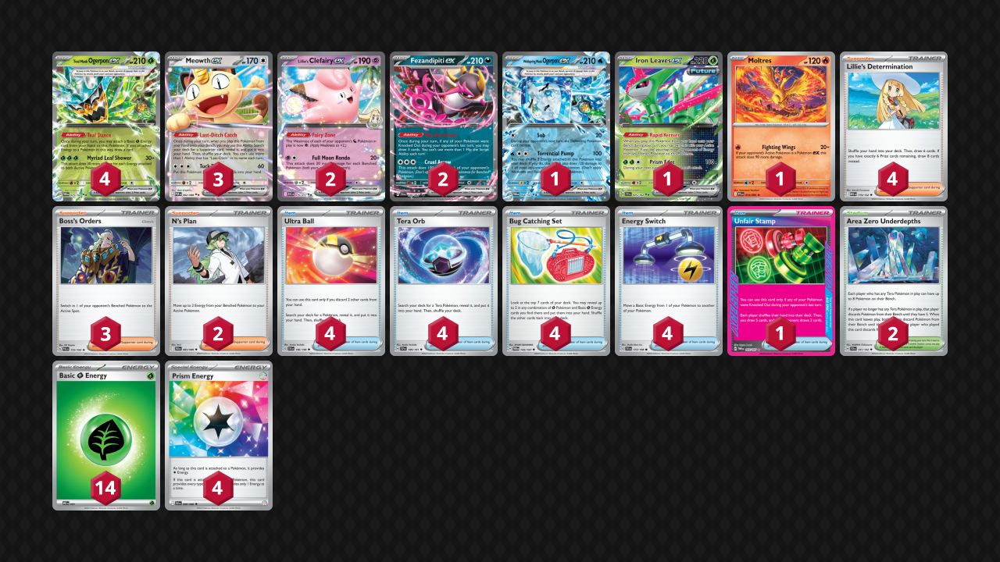

## Decklist


```decklist
Pokémon: 14
4 Teal Mask Ogerpon ex TWM 25
3 Meowth ex POR 62
2 Lillie's Clefairy ex ASC 76
2 Fezandipiti ex SFA 38
1 Wellspring Mask Ogerpon ex TWM 64
1 Iron Leaves ex TEF 25
1 Moltres PFL 14

Trainer: 28
4 Lillie's Determination MEG 119
3 Boss's Orders PAL 172
2 N's Plan BLK 83
4 Ultra Ball SVI 196
4 Tera Orb SSP 189
4 Bug Catching Set TWM 143
4 Energy Switch SVI 173
1 Unfair Stamp TWM 165
2 Area Zero Underdepths SCR 131

Energy: 18
14 Grass Energy MEE 1
4 Prism Energy BLK 86
```
<!-- PUBLIC -->
### Inclusions

- Fezandipti is very important for draw power. I always want it in play and not prized. It is more important now that there’s no Kangaskhan. It can sometimes attack as well.
- Wellspring is very strong and easy to use in this deck. It is particularly good against Fighting decks. Sob can also buy a turn to build up Energy in some situations.
- Iron Leaves is a very convenient attacker because of how easy it is to utilize and get a Turn 1 attack. Although nothing really gets stuck from retreat lock, having an out to that is nice as well. Even aside from retreat lock, it sometimes gets used as a general purpose switching card since this deck doesn’t play Latias. Iron Leaves’ flexibility and utility is great, but it probably is cuttable if you needed space.
- Moltres is incredibly useful for getting the advantage against all similar two-prize decks. It is much better and more consistent than other methods of swinging the prize trade such as Legacy Energy or Briar.
- I like the third Meowth and third Boss because of how often I rely on Meowth. It also works well with this deck. Boss is just broken and I think two is too few a lot of times. Boss is especially strong with Wellspring or Moltres.
- N’s Plan is a versatile Supporter that works perfectly in this deck. It is often used to make a big Ogerpon to close out the game.
- Area Zero is nice to have, but not necessarily needed for this deck to execute its strategy. It would probably be good to add another one if you were so inclined.
- Maxing out Tera Orb and Bug Catching Set makes sense because this deck’s entire engine revolves around Teal Dance, which is sufficient for winning games.
- Unfair Stamp is my Ace Spec of choice because the card is way too good and is the most reliable means of swinging back the prize trade. I tried Legacy Energy and it was completely useless. Stamp isn’t necessary for the deck to function but the other Ace Specs don’t seem very appealing. Boss + Unfair Stamp is also extremely strong in this format.

### Exclusions

- I did not find Latias or Kangaskhan to be very good in this version of this deck. Spamming Teal Dance gets you where you need to go, and without reliable Cyrano usage, the Kang + Latias combo is not as good. I also think those cards are just too slow for an aggro deck like this. I tested and happily cut them for a more streamlined approach. Cyrano itself is ok but Lillie is just better. Without Latias and Kang, Cyrano is not really necessary.
- Ursaluna would be nice but of course does not make much sense with no Latias. I haven’t had trouble making big Ogerpon to close out games since this deck plays a million Grass Energy.
- Tried Briar and never used it. Alakazam and similar decks with Shaymin are basically auto-losses anyway.
- Same with Legacy Energy. Did not get any value from it. Moltres and Unfair Stamp are much better and more reliable ways to swing the prize trade if needed.
- Chien-Pao could possibly help against Dragapult with techs, but probably not that much. I found that matchup to be tough if they have both Moltres and Shaymin, but if they don’t, it’s fine anyway.
<!-- /PUBLIC -->
## Gameplay Tips

- Getting a bunch of Grass Energy in play for “no reason” is generally good. This deck has lots of ways to utilize the Energy in play, and Grass Energy is basically an infinite resource since you won’t go through all of them in one game. Furthermore, leaving too much Energy in the deck could actually backfire if the ratio of Energy to real cards left is too skewed. For these reasons, I tend to spam Teal Dance without thinking too much about saving the Energy.
- When sequencing to find something like an Energy Switch combo or Stamp, burn stuff like search cards before Lillie, but save the draw effects for after Lillie. Bug Catching Set is an interesting sequencing card. I usually save Bug Catching Set until after Lillie because it is often card-positive on play (or at least neutral). It is quite powerful for thinning and drawing along with multiple Teal Dances. Use it before drawing with Abilities to have a better chance of getting what you need. If you only need Grass Energy, draw first instead. If you aren’t sure you’re going to use Lillie, generally start with Bug Catching Set. For sequencing purposes, Stamp is equal to Lillie and takes priority between the two, unless you want to save it for later.
- Tera Orb is almost always slammed on sight. There’s no limit to how many Teal Mask Ogerpon you want in play, though you usually don’t need all four.
- Second Fez is good to put into play if the opponent is capable of Stamping and KO’ing your Fez at the same time.
- Iron Leaves isn’t necessarily a special resource, so I tend to slam it whenever I can get value, such as for a switch or a Turn 1 attack.
- You do have to be a little careful with bench space if you don’t have Area Zero in play. I won’t put down stuff like Clefairy or Wellspring for no reason, and I’ll try to leave a spot open for Meowth.

## Matchups

### Dragapult - Depends

If they have both Shaymin and Moltres, this matchup is unfavorable. With neither, it’s favorable. With one or the other, it’s close to even or slightly favorable.

- Oftentimes you’ll need both Clefairy to trade off against Dragapult. Putting one down preemptively is risky because it can get KO’d before you can get value from it, and there’s no way to recover it. Holding onto Clefairy is usually fine because it’s not hard to find the combo, but many exceptions exist. For example, if you get two quick prizes, you might not even need both Clefairy, so it could be better to put it down and prepare it in that case.
- Ending the game with a massive Ogerpon is very common, even capable of one-shotting Dragapult. It’s not that hard to get 8 Energy on an Ogerpon to close out the game.
- Wellspring is very broken if they do not have Shaymin. This is the best way of responding to Moltres as well. Unfortunately, it’s hard to use in the early-game because of Budew, but if it happens to line up, great. 
- You can use Sob to trap Budew or other liabilities if you need time to set up a big play. Don’t waste Sob on Budew if they cannot attack next turn (such as if they have no Drakloak in play). Using Sob on Budew unnecessarily takes away your option to trap it later. Sob can also trap Blaziken after it attacks. Don’t plan on trapping anything for an extended period of time, just use it to buy a turn for positioning, setting up, breaking Item lock, etc.

```youtube
id: WjBDGAt49G8
title: Ogerpon v Pult 1
```

```youtube
id: EwB6s6nUu8A
title: Ogerpon v Pult 2
```

```youtube
id: K9E4AWBJng4
title: Ogerpon v Pult 3
```

### Lucario - Favorable

- Wellspring is very good in this matchup. If they have Solrock or Lunatone active, Sob into Torrential Pump is an easy two prizes. Of course, if they have Riolu or Makuhita active, or if you can use Boss for two prizes right away, that’s better. You can also Boss to use Sob on Lunatone/Solrock if you don’t have a more powerful play available yet.
- Wellspring can also be a good response to an attacking Hariyama since it does 70 damage to itself. Teal Mask Ogerpon is more of a placeholder attacker if you can’t do anything else. Ideally, you’ll be using Clefairy or Wellspring for big plays.
- Area Zero is a very important resource in this matchup. They can keep Lucario out of Clefairy KO range, so you’ll need Area Zero to get the one-shot. Don’t put it down preemptively or it might get bumped. Play it when you need to reach for the KO on Lucario.

```youtube
id: FEY-EhVbP6o
title: Ogerpon v Lucario 1
```

```youtube
id: Q_P_hE7aCWE
title: Ogerpon v Lucario 2
```

### Alakazam - Very Unfavorable

- Your only chance is to cheese them with Wellspring before they get Shaymin in play.
- Stamp + KO their draw support on board, or Stamp when they have no draw support on board.

### Garchomp - Favorable

- Wellspring is very good in this matchup. Use it to apply fast pressure. If you can’t, try to at least get a fast KO with something else. If they evolve into Roserade, you can Sob it to set up a two-prize play if needed.
- Try to spawn trap their Energy in the early-game so they cannot build up Energy in play. If they use Power Weight protect their Gible/Gabite with Energy, using Boss to KO it with Teal Mask is fine. Of course, if there’s a two-prize play available with Wellspring, that can be better.
- Teal Mask with enough Energy can one-shot even a Weighted Garchomp. If you don’t have enough Energy, try to find something more efficient to do besides just smacking into it.
- Iron Leaves is an efficient way to one-shot a non-Weighted Garchomp.

```youtube
id: mk-e0LvwOls
title: Ogerpon v Garchomp 1
```

```youtube
id: 1pVKyVlZlzQ
title: Ogerpon v Garchomp 2
```

### Meganium - Favorable

- As expected, Moltres is extremely good in this matchup. It can be used to initiate or to swing the prize trade back.
- If the opportunity presents itself for Wellspring to get two-prizes, it can be a great chance to remove Hoothoot from their board. Noctowl is threatening because it can find Briar or consecutive Bosses to get around Moltres.
- Try not to leave Energy on your active two-prize Pokemon until you’re ready to initiate. Although we do have Moltres, we still want to engage in a winning 2-2-2 prize race. If you have Energy on your active, it’s easier for them to get the first KO. The exception of course is if you’re using Sob to stop them from initiating. This is somewhat rare and only works on fully evolved Pokemon or liabilities like Fezandipiti, but it is very good in those cases.

```youtube
id: NqIuI3DuDVI
title: Ogerpon v Meganium 1
```

```youtube
id: OILBoOI06cM
title: Ogerpon v Meganium 2
```

### Raging Bolt - Favorable

- Once again, this matchup is quite good thanks to Moltres. You’ll usually need to combo it with Boss to snipe off an Ogerpon. Bonus points if you can get Stamp at the same time.
- Clefairy is very good to one-shot Raging Bolt, or in general if they fill up their bench too much.
- Making a big Ogerpon to reach for a KO is also somewhat common as a means to grab two prizes or close out the game.
- This is another standard two-prize trade-off matchup, but we have Moltres to swing things in our favor if needed.

```youtube
id: rs8soPQClrQ
title: Ogerpon v Raging Bolt 1
```

```youtube
id: WH8m4IA1vOc
title: Ogerpon v Raging Bolt 2
```

### Mewtwo - Slightly Unfavorable

- Attacking with Clefairy or Iron Leaves is generally best because they cannot respond to them with Mimikyu. Iron Leaves is quite nice because it is also out of range of Spidops with Brave Bangle.
- If you can get a double-KO with Wellspring, that’s obviously very good.
- If they have Mewtwo in the active in the early-game, you probably won’t have enough Energy to one-shot it. If that’s the case, smack it with anything to get it in range of Moltres, and finish it off with Moltres. They likely won’t have enough Energy to immediately KO your two-prize attacker, so hopefully they just have to smack it when you go for the fast initial hit. It would be most efficient to use Teal Mask for the initial smack, but you might not have enough Energy to get Mewtwo in range of Moltres, so you may have to use Clefairy or Leaves instead, which is fine.
- In the mid- or late-game, try to one-shot any Mewtwo you see and don’t even bother going for a two-shot.

```youtube
id: Szl3_rJGc6s
title: Ogerpon v Mewtwo 1
```

```youtube
id: Q0ck8sVaKG4
title: Ogerpon v Mewtwo 2
```

### Zoroark - Favorable

- Pressure them in the early-game with Wellspring or Fezandipti. If you can’t, at least get a KO with any means possible. You can also use Sob in the early-game to set up a strong play, but they can get out of it with Pecharunt, so it’s not very reliable and I would rather get a KO. 
- Once you’ve got the first two prizes, you can win the trade normally. If you don’t, it is possible to lose the trade. Target Zoroark with Energy given the choice, and maybe Unfair Stamp can make them whiff a turn.

### Crustle - Auto-Loss

- There is literally nothing you can do once they get a Crustle in play, so do everything you can to stop that from happening (it’s basically impossible).

### Ogerpon Mirror / other Slop Box - Favorable

This matchup is favorable thanks to Moltres, unless they also have Moltres, in which case it's even.

- Save Boss for combo with Moltres or for getting around Legacy Energy if they play it.
- Limit your bench in the early-game so that they cannot get a free KO with Clefairy.
- Play like usual in two-prize trade-off matchups.

## Personal Thoughts

This deck is actually pretty good and might be the best of the slop decks. If you’re going to play non-Noctowl Raging Bolt, this is just better than that, so play this instead. It does unfortunately lose to some of the single-prize decks very hard, but pretty good against everything else.
