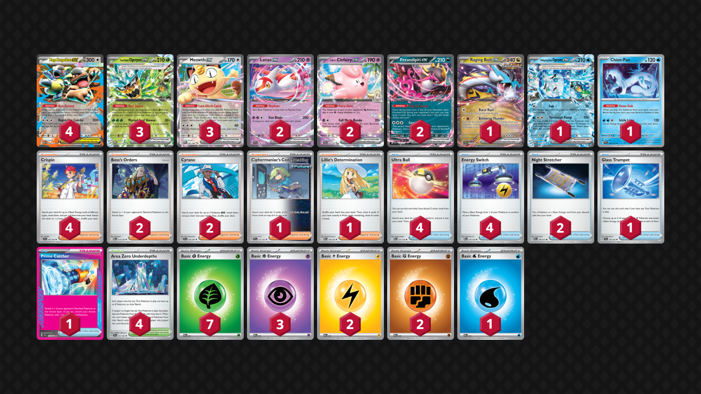
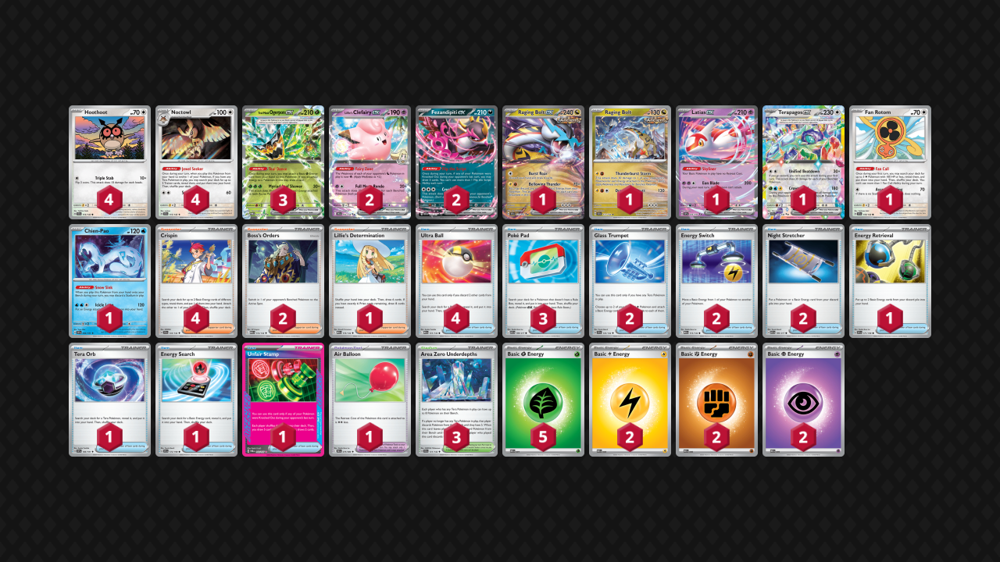

<!-- PUBLIC -->
## Decklist 1


```decklist
Pokémon: 19
4 Mega Kangaskhan ex MEG 104
3 Teal Mask Ogerpon ex TWM 25
3 Meowth ex POR 62
2 Latias ex SSP 76
2 Lillie's Clefairy ex JTG 56
2 Fezandipiti ex ASC 142
1 Raging Bolt ex TEF 123
1 Wellspring Mask Ogerpon ex TWM 64
1 Chien-Pao SSP 56

Trainer: 26
4 Crispin SCR 133
2 Boss's Orders MEG 114
2 Cyrano SSP 170
1 Ciphermaniac's Codebreaking TEF 145
1 Lillie's Determination MEG 119
4 Ultra Ball MEG 131
4 Energy Switch MEG 115
2 Night Stretcher ASC 196
1 Glass Trumpet SCR 135
1 Prime Catcher TEF 157
4 Area Zero Underdepths SCR 131

Energy: 15
7 Grass Energy MEE 1
3 Psychic Energy MEE 5
2 Lightning Energy MEE 4
2 Fighting Energy MEE 6
1 Water Energy MEE 3
```

I still think this deck is not very good, and inferior to Noctowl or Prism/Lillie builds. However, since this is the build that most people play, I thought it would be good to include for relevance.

### Inclusions

- Each Mega Kangaskhan is roughly an additional ten percent chance to start with it. This is particularly important because the deck highly relies on Run Errand to draw cards and function, so playing four makes sense.
- Double Latias has become standard because it's crucial for the deck to function and find early.
- Fezandipiti is far too good to play only one. It's always good on the board, strong early attacker in some matchups, and great to have if the other is prized or KO'd.
- Wellspring Ogerpon provides good utility. It can be a fast attacker or buy time with Sob in the late-game to piece together a win.
- Chien-Pao is fantastic against Dragapult for clearing off damage or countering Watchtower. Four Stadiums are similarly included to easily deal with Watchtower since the deck highly relies on Kang and Meowth. Area Zero is also important for buffing Clefairy's damage or synergy with Chien-Pao.
- Ciphermaniac is very handy for making combos, but not overly relied on.
- Lillie's is a good consistency card and another solid option off Meowth.
- Prime Catcher is a powerful card for both the gust and switching options. It allows Crispin plus gust in the same turn, and is also the only way out of retreat lock. I think this deck greatly benefits from a third gust effect, so if you play a different Ace Spec like Stamp, I would recommend a third Boss's Orders as well.

### Possible Inclusions

- Unfair Stamp is still very good. I just don't think it synergizes very well with the deck. The same can be said for Special Red Card. Alone, those cards aren't enough to salvage bad matchups, but they're still generally good cards.
- Lillie's Pearl would probably be ok.

### Exclusions

- The second Raging Bolt isn't very important.
- Passimian is not very good. It can help slightly against Crustle, but that matchup is still bad anyway. If you did play Passimian, it would probably be best to add Stamp back in.
<!-- /PUBLIC -->
## Gameplay Tips

- Attaching and storing random Energy types in play is generally very good. It opens up powerful Energy Switch plays out of nowhere for later.
- Sob is a very useful stopgap for when you don't have the play you need right away. It can be used at any point in the game to stall the opponent and functionally put the game on hold until you get what you need. However, this can use up to two precious gust effects, so you need to manage your resources appropriately.
- Need to get Kang in the active as soon as possible. Hard retreating into it is usually worth it even if you don't have Latias. Anytime you aren't attacking, usually Kang should be in the active. If it gets damaged, it can sit on the bench for the rest of the game, or get cleared off by Chien-Pao. Attacking with Kang in random spots is also generally fine.
- This deck does not have much comeback potential so you want to be aggressive and get a prize lead. Sometimes you can hold a bunch of Pokemon until you're ready to go in, which can limit the opponent's available targets or their Clefairy damage.

## Decklist 2


```decklist
Pokémon: 21
4 Hoothoot SCR 114
4 Noctowl SCR 115
3 Teal Mask Ogerpon ex TWM 25
2 Lillie's Clefairy ex JTG 56
2 Fezandipiti ex ASC 142
1 Raging Bolt ex TEF 123
1 Raging Bolt SCR 111
1 Latias ex SSP 76
1 Terapagos ex SCR 128
1 Fan Rotom SCR 118
1 Chien-Pao SSP 56

Trainer: 28
4 Crispin SCR 133
2 Boss's Orders MEG 114
1 Lillie's Determination MEG 119
4 Ultra Ball MEG 131
3 Poké Pad ASC 198
2 Glass Trumpet SCR 135
2 Energy Switch MEG 115
2 Night Stretcher ASC 196
1 Energy Retrieval SVI 171
1 Tera Orb SSP 189
1 Energy Search SVI 172
1 Unfair Stamp TWM 165
1 Air Balloon BLK 79
3 Area Zero Underdepths SCR 131

Energy: 11
5 Grass Energy MEE 1
2 Lightning Energy MEE 4
2 Fighting Energy MEE 6
2 Psychic Energy MEE 5
```
<!-- PUBLIC -->
### Inclusions

- I think the fourth Noctowl line is very beneficial since this deck has a lot more trouble with drawing without Sada, so it relies on Noctowl even more. When playing with the 3-3 line I always wanted more.
- Clefairy is simply too strong in this format. Efficient Crispin attacker, one-shots most things, good with Area Zero, etc. Clefairy probably attacks more than Raging Bolt, making this feel like a Tera Box/slopbox deck.
- The second Fez is also here because of how much trouble this deck has with drawing and piecing things together. We often want Raging Bolt, Latias, and Fez, and it is very annoying trying to find them without Nest Ball. Prizing Fez is also a total disaster if you play one.
- Baby Raging Bolt is surprisingly good in this format. Early pressure, swinging prize trades as a useful one-prize Pokemon, and very good with Energy Switch.
- Terapagos is mainly here because we always need a Tera Pokemon to make the deck function. A fourth Ogerpon could be considered, but I like the flexibility of Terapagos. I end up attacking with it occasionally. It’s very convenient because it can attack with Glass Trumpet, which allows you to Boss for the turn instead of Crispin (which is particularly strong on the Stamp turn).
- Chien-Pao helps deal with Watchtowers and good for clearing off damage against Dragapult.
- I think the second Boss is necessary. Although this deck does rely on Crispin, it still needs to Boss a decent amount.
- Lillie’s Determination is very convenient because there are many spots where you simply play down your hand and then use Lillie to set yourself up for the rest of the game. Of course, it’s also a neutrally good consistency card.
- Glass Trumpet enables all sorts of strong plays along with Energy Switch, and is also needed to consistently use Raging Bolt’s attack. It’s possible to get away with playing just one Trumpet, though I would never play fewer than two Energy Switch. Energy Switch is too important every game and I usually use both of them.
- Tera Orb is mostly for early-game consistency. You could play a fourth Ogerpon, but having too many Pokemon makes this deck very clunky. You’ll always have a chance to play Tera Orb before getting Item-locked anyway. 
- Air Balloon helps make up for not having Latias on the board since it’s hard to find and usually not a priority when setting up. It’s very handy. This deck likes to pivot around a lot.
- Unfair Stamp is the Ace Spec of choice because this deck hugely benefits from the draw power of the Stamp in addition to the disruption. Prime Catcher would also be very good though.

### Possible Inclusions

- A fourth PokePad could be considered. It’s obviously very good.
- Switching option could be considered to deal with retreat lock.
- A small package with Cyrano and Mega Kangaskhan could be ok, but it's also a bit slow and awkward.

### Exclusions

- Trimming any extra Pokemon such as the fourth Ogerpon, Iron Leaves, and second Fan Rotom makes the deck less clunky and works pretty well. However, this does make the opening turns a little less consistent. As for Iron Leaves, it’s just not very good.
- I considered Wellspring Ogerpon and Water Energy but I think that’s doing too much, and at that point just play Tera Box. Wellspring is not as good in this format as it was pre-rotation, I think.
- Jamming Tower / other Stadiums seem useless. Bumping Area Zero is not very important and usually strictly harmful except against Dragapult, but I'd rather have Chien-Pao for that. I’m not even sure if the third Area Zero is necessary.
<!-- /PUBLIC -->
## Gameplay Tips

- Raging Bolt ex isn’t necessarily the go-to attacker. It is mostly reserved to get one or two big KO’s throughout the game, depending on the matchup, since it is not very efficient. Of course, if you start with it or don't have a better option, it is still a fine early-game attacker. It can also be a good consistency card by utilizing Burst Roar, which is very reasonable in a lot of spots.
- Using Stamp just for draw or just for disruption is fine. Using it for no reason is not. It should be doing something specific and useful. When used for disruption, using it alongside Boss to KO Fez/other support can cripple opponents. Usually, Stamp’s only opportunity cost is not playing it on a different turn, which isn’t a big deal. In this deck, the opportunity cost is using a Noctowl and forgoing a different Trainer card.
- Using Teal Dance isn’t really a priority. It’s mostly best when going for an Energy Switch or Bellowing Thunder play.
- Most of the time you use Trumpet you won’t have Terapagos, and that’s totally fine. Terapagos is only an occasional attacker. You aren’t wasting Trumpet by using it on random Noctowl and such, as its main purpose is enabling Energy Switch/Bellowing Thunder. As such, slamming Trumpet whenever is generally fine even if you aren’t getting instant value.
- Try to always have at least one Hoothoot in play. Sometimes you’ll end up with random extra search cards or a Trainer off Noctowl. If you do, try to get a Hoothoot down if you don’t already have one!
- Energy Switch is a precious resource. Every time you use it, it should be for a very strong play. It’s especially useful along with Boss, as you won’t be able to use Crispin on Boss turns. Playing two Energy Switch also means that it’s easy to get value from Energy randomly thrown onto the board whenever you get the chance.
- Go first against almost everything. Go second against unfavorable evolution decks like Alakazam and Garchomp to try and cheese them with fast KO's.

## Matchups

### Dragapult - Depends

Against most builds, the matchup is favorable or slightly favorable. Against Blaziken or heavy Watchtower builds, the matchup is unfavorable or slightly unfavorable.

- Try to get an early lead attacking with whatever you can. Baby Raging Bolt, Wellspring, or Fez are the best early-game attackers, but they can be hard to get under Item lock. I’ve even attacked with Noctowl or Kang if needed. If you can only get two Energy on baby Bolt, it can still KO Budew and then Drakloak on the following turn.
- Best to respond to Dragapult with an immediate Clefairy. If you don’t have Clefairy, you’ll have to respond with Raging Bolt ex, which is a lot harder.
- The best way to play around Stamp is to have Hoothoot and Fez on board, but again it can be hard to find Fez so sometimes you don’t really have the choice. Staggering the Hoothoot can sometimes be good so they can’t ping them all at once, but usually you just want them all in play.
- Chien-Pao should be saved so that it can bump Watchtower or clear off damage at a crucial time. Area Zero is best saved for Watchtower, but playing one before that to set up a better board isn't necessarily bad.
- Sob stopgap can be a good response to their disruption. They can fling the damage back with Adrenabrain, so you can't do it forever or set up damage, but it can still be useful to buy time.

```youtube
id: tauR3pT-QbY
title: Pult v Bolt 1
```
Close game but pretty standard. The next three are some interesting games that go in ways you might not expect.

```youtube
id: dcyAmSbMJFY
title: Pult v Bolt 2
```

```youtube
id: 5mFaaXLnZEk
title: Pult v Bolt 3
```

```youtube
id: cYkI-nNI1OU
title: Pult v Bolt 4
```

```youtube
id: xtyhdTqg5eI
title: Pultnoir v Bolt 1
```

```youtube
id: NolNmY62jDY
title: Pultnoir v Bolt 2
```

```youtube
id: b_n36dgxdPo
title: Blaziken v Bolt 1
```

```youtube
id: v568uuMMVyM
title: Blaziken v Bolt 2
```

### Raging Bolt Mirror - Even

- This is a straight up prize race matchup. Try to open the aggression when you can get a two-prize KO and leave a single-prize Pokemon or Kang in the active until you’re ready to do so. Getting random Energy in play even if you aren't ready to attack can help Raging Bolt get the KO on their Kang.
- If you can't KO their Kang first, sometimes you can go around it and go 2-2-2 instead, if that ends up being easier. Clefairy is quite good at that.
- If you have the lead, play around Stamp as much as you can and set up efficient attackers like Clefairy and Terapagos. Keeping Fez, Hoothoot, and attackers in play is the best way to maintain a lead.
- If you’re stuck in a losing prize trade, you’ll have to rely on Stamp scam. Taking out their Fez and Stamping them can make them brick, but then you still have the attacker to deal with that can probably one-shot you. Therefore, you may need to KO their attacker and Stamp, giving them Fez, and hope they whiff.
- Sob can randomly be good, especially in the early-game.

### Alakazam - Very Unfavorable

- Baby Raging Bolt is very good, prioritize attacking with it early. If you can’t, Fan Rotom is also a good fast attacker. Otherwise, just attack with whatever you can for fast pressure. Baby Raging Bolt can also be useful throughout the game.
- If they have Fez, KO it. If they only have one Dudunsparce/Fez, go for Stamp + Boss KO it and hope they brick. If they have neither, use Stamp immediately and hope they brick.

```youtube
id: jghIvgnkBmg
title: Zam v Bolt 1
```

```youtube
id: nqv7CF4-1NI
title: Zam v Bolt 2
```

### Slowking - Slightly Favorable

This matchup is slightly favorable for the normal build and unfavorable for the Noctowl build.

- Both of Wellspring’s attacks can be very strong. It is a big part of the matchup.
- If you play Passimian, it can be very useful for prize trading.
- Do NOT leave Kang in the active if they are likely to get a Metagross KO next turn. This is the main way to lose, even though sometimes you need Kang to play the game.
- If you play Stamp, it is very good in this matchup, especially if they don’t have Fez in play or you can KO it.
- Of course, Prime Catcher is also great if they put Kang in play because you can go for a 3-2-1 prize map. This is also possible with two Boss but it’s slightly harder.
- Keep Chien-Pao around so they can’t set up a big double Kyurem play.
- For the Noctowl list, a fast baby Bolt can be quite good. Try to play around Kyurem to some extent by not putting too many single-prize Pokemon in play.

```youtube
id: zB_wM3zBebQ
title: King v Bolt 1
```

```youtube
id: hnu2VK19vmk
title: King v Bolt 2
```

### Slop Box - Even

- KO their Kang whenever possible.
- Delaying putting down Teal Mask can be good because it stops them from getting an easy Moltres KO.
- Slim board in the early-game is very good to stop them from initiating with Clefairy. If you started with something bad like Meowth or Raging Bolt, this isn’t as relevant since they can get the KO anyway.
- Sob can be very good for buying time, particularly in the early-game.
- If they Sob you, try to instantly start attacking with whatever is stuck.
- Kang can sometimes be a good attacker since it’s hard for them to KO. Even if they have Koraidon, it’s not any worse than if a two-prize Pokemon gets KO’d (unless you have a single-prize attacker).

```youtube
id: NfV1_7qY9JA
title: Slop v Bolt 1
```
These games are actually surprisingly interesting.

```youtube
id: RoK0ACF6r9E
title: Slop v Bolt 2
```

### Zoroark - Slightly Favorable

- Similar to the above two, but applying fast pressure is better than positioning because they don’t have to put a two-prize Pokemon in play in order to play the game. Don’t leave a two-prize Pokemon in the active unless you’re winning the prize trade. Fan Rotom can efficiently apply pressure. Whether you’re KO’ing Zorua or not, attacking with Fan Rotom early is generally good.
- Sometimes they have no Energy on the bench, and you have a choice to KO their Fez or KO their active Zoroark with Energy. I think KO’ing their Zoroark with Energy is generally best (even though it may be harder) if they have no Energy on the bench. Sometimes they just whiff PP Up, especially if you Stamp them.
- Try to get a Grass Energy on Ogerpon (or even better, two of them) quickly so that you’ll have that option to one-shot Zoroark.
- Try not to leave too much Energy in the discard. Using cards like Retrieval, Stretcher, and Trumpet can help play around Darmanitan and not give them that option.

```youtube
id: OHs-Mc5D3AU
title: Bolt v Zoroark 1
```

```youtube
id: iLIy5jBXhcw
title: Bolt v Zoroark 2
```

```youtube
id: 440pWXk5OLc
title: Bolt v Zoroark 3
```

### Crustle - Very Unfavorable

- Fan Rotom can be used for fast pressure, but most of the time you’ll be trying to power up baby Bolt as fast as possible. It’s possible to win with baby Bolt. Use Boss to stall and snipe to pressure their Energy. Stamp is also very good to make them brick. If they KO baby Bolt, get it back and power it up with Energy Switch / Crispin.
- If you're playing the non-Noctowl build with Passimian, save Passimian in hand and make a fast Kang to KO their Kang. Set up a Passimian play in your hand for when they are forced to go in with Crustle. If they don't have Cape, one-shot it with Passimian. If they do have Cape, deal as much damage as possible. You'll need both Stretchers for Passimian as well as Glass Trumpet for the Fighting Energy. Ideally you'll also Stamp them after they KO your first Passimian.

```youtube
id: BK_19n-ZiI0
title: Crustle v Bolt 1
```

```youtube
id: ovX7LmYRiqY
title: Crustle v Bolt 2
```

### Mewtwo - Favorable

- Use Raging Bolt ex to one-shot Mewtwo whenever possible. Otherwise, attack with whatever the situation calls for. Baby Bolt is good but sometimes annoying to use since you’ll need some Fighting/Lightning for the ex. Fan Rotom is an extremely useful and efficient attacker when they have Tarountula/Mimikyu in the active, which is often. Otherwise, Clefairy or Terapagos are good neutrally. Terapagos is generally better because it does not get KO’d by a Bangle Spidops (but still dies to Max Belt). Mimikyu copying Tera attacks is completely irrelevant, unless you attack with Ogerpon for some reason, which is not recommended.
- Putting random Energy in play is good whenever you get the chance. It’s hard for them to power up Mewtwo in one turn, so they’ll often put it on the bench and attach an Energy to it. That’s your cue to go for a Boss-KO on it with Bolt.
- If they don’t have Mewtwo in play, KO’ing their Mimikyu (sometimes via Baby Bolt snipe) can be very good as it is hard for them to maneuver around. Without a pivot, it’s even more difficult for them to put together a Mewtwo play. That said, most Mewtwo-less boards are attacking with Spidops, so you may just want to KO that depending on the situation.

### Excadrill - Slightly Unfavorable

- Go first.
- Wellspring Ogerpon is very strong. Try to get a fast Torrential Pump for two prizes before they get set up. If they push Genesect, KO it normally or Sob it if you can’t get the KO yet.
- Raging Bolt and Glass Trumpet are very premium cards for one-shotting an Excadrill.
- 3-2-1 map is on the table, though it typically requires both Boss and a big Raging Bolt one-shot. You’ll probably want both Boss in most games.
- Clefairy might seem bad, but it’s actually a very strong and efficient attacker. Mostly good for getting the Boss one-shot on their Genesect / Fez.
- YOLO Kangaskhan is sometimes the best option.
- If you don’t have Clefairy in play, Sob’ing a Genesect can reliably buy one turn.

```youtube
id: dkbC_f9YsAc
title: Drill v Bolt 1
```

```youtube
id: hb0QJ851_EY
title: Drill v Bolt 1
```

### Lucario - Depends

This matchup is favorable for the Noctowl build, but unfavorable for the normal build.

- Baby Raging Bolt is extremely helpful. It is a good option to open the aggression and get off to a fast start. It can also be used at other points to fix the prize trade if necessary.
- Even if you don’t have Baby Bolt, you want to be fast and pressure them with whatever you can. The next best option is Raging Bolt ex or Clefairy. Clefairy is more efficient but risks getting KO’d by a two-modifier Aura Jab, which can be bad, so I would prefer Raging Bolt. You probably won’t need big Bolt later, and it’s unlikely to be KO’d by Aura Jab.
- Respond to Lucario with Clefairy.
- Putting Fez down is usually good. Although it is a liability, it is important to keep tempo and recover off a potential Judge. Of course, don’t put it down if it will lose you the prize trade, as it does give them an easy Aura Jab target if they’re low on Energy in play.
- Wellspring Ogerpon is very useful in this matchup as you can Sob a Lunatone or Solrock and then Pump for two prizes.

```youtube
id: OXhJiSR_HZI
title: Lucario v Bolt 1
```

```youtube
id: 3gGYgkVt9Qs
title: Lucario v Bolt 2
```

### Festival Lead - Unfavorable

- Try to be very fast and aggressive with a single-prize attacker. Baby Raging Bolt is ideal, but Fan Rotom is much easier to use.
- Stamp + Boss Thwackey is very effective if they don't have Shaymin in play. You can get Thwackey stuck and then snipe around it.

### Lopunny - Favorable

- In the early-game, it’s possible to play around all of their threats. By limiting the two-prize Pokemon in play, they can’t apply fast pressure with Moltres or Dudunsparce ex.
- If you’re playing Kang, it is a fantastic early-game meat shield. For Noctowl, single-prize Pokemon or Raging Bolt ex provide a similar effect.
- Build up Energy in play so that you can one-shot multiple Lopunny with Raging Bolt. Raging Bolt is generally the best attacker since it cannot be KO’d by Lopunny. If they have Spiky Energy, consider playing around it.
- If you play Wellspring Ogerpon, it can be very strong in the early-game.

```youtube
id: eT9eYofGYhY
title: Lop v Bolt 1
```

```youtube
id: i2Iu-VecsPo
title: Lop v Bolt 2
```

### Garchomp - Favorable

- Get a fast Fan Rotom KO if you can. If not, attacking with Raging Bolt ex can be fine for a fast attacking option. Baby Bolt can also be fine if you happen to get an Energy on it going first.
- Load as much Energy in play as possible, and have both Raging Bolt and Ogerpon as threats that can one-shot a Garchomp. Try to preload at least one Grass Energy onto one or two Ogerpon. Loading extra random Energy types on it can also be good since you’ll often need four or even five Energy for a KO anyway..
- Glass Trumpet and Energy Switch are very important resources in this matchup, as they can be used to reach for a big KO on a Garchomp.
- Fez is sometimes necessary, but it is also a big liability because it can be KO’d by Gabite or Garchomp’s first attack. Don’t put it down if you don’t have to!

```youtube
id: 6pt514ByFc8
title: Chomp v Bolt 1
```

```youtube
id: hk89SR43qCE
title: Chomp v Bolt 2
```

### Arboliva - Unfavorable

- Building lots of Energy in play is very good so that Raging Bolt can one-shot Arboliva.
- This is a normal prize trade matchup. Clefairy, Terapgaos, or even Ogerpon can be used to efficiently KO their Ogerpon. Try to leave single-prize Pokemon in the active until you can enter a winning prize race.
- Raging Bolt can discard Energy off itself, which can be handy. If their Ogerpon only has one Energy on your turn, they cannot one-shot a Raging Bolt with no Energy since they can only get two and then hit for 210 max. In this scenario, Raging Bolt is a very good attacker.

```youtube
id: 9RMiJGE6ais
title: Bolt v Meganium 1
```

```youtube
id: lvVut6hOcNI
title: Bolt v Meganium 2
```

### Ogerpon - Depends

This matchup is largely good, but if they play Moltres it becomes unfavorable.

- This is your generic two-prize trade matchup. If they don’t have Moltres, we have the advantage because we can get a fast Raging Bolt KO with Crispin. Fast Raging Bolt is a great way to take the lead.
- If you’re not getting a lead, don’t leave Raging Bolt ex in the active as it will die to Clefairy. The same applies about filling up your bench if you have a different two-prize Pokemon in the active.
- Save gusts to get around Legacy Energy or Moltres if they play them.
- Watch out for Sob, especially in the early-game. Leave up something like Hoothoot (with no other ones on the bench for Wellspring) or Clefairy if you don’t have enough Pokemon in play for them to KO it with their own Clefairy. Latias or Fez are hard for them to KO, but vulnerable to Sob.

```youtube
id: rs8soPQClrQ
title: Ogerpon v Raging Bolt 1
```

```youtube
id: WH8m4IA1vOc
title: Ogerpon v Raging Bolt 2
```

## Personal Thoughts

This deck is very mediocre right now and I think there are plenty of better options out there.
