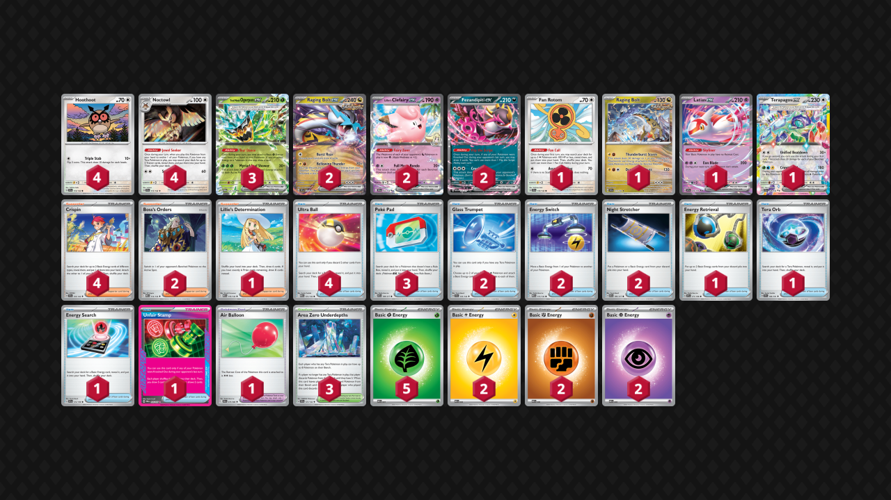

## Decklist


```decklist
Pokémon: 21
4 Hoothoot SCR 114
4 Noctowl SCR 115
3 Teal Mask Ogerpon ex TWM 25
2 Raging Bolt ex TEF 123
2 Lillie's Clefairy ex JTG 56
2 Fezandipiti ex ASC 142
1 Fan Rotom SCR 118
1 Raging Bolt SCR 111
1 Latias ex SSP 76
1 Terapagos ex SCR 128

Trainer: 28
4 Crispin SCR 133
2 Boss's Orders MEG 114
1 Lillie's Determination MEG 119
4 Ultra Ball MEG 131
3 Poké Pad ASC 198
2 Glass Trumpet SCR 135
2 Energy Switch MEG 115
2 Night Stretcher ASC 196
1 Energy Retrieval SVI 171
1 Tera Orb SSP 189
1 Energy Search SVI 172
1 Unfair Stamp TWM 165
1 Air Balloon BLK 79
3 Area Zero Underdepths SCR 131

Energy: 11
5 Grass Energy MEE 1
2 Lightning Energy MEE 4
2 Fighting Energy MEE 6
2 Psychic Energy MEE 5
```
<!-- PUBLIC -->
### Inclusions

- I think the fourth Noctowl line is very beneficial since this deck has a lot more trouble with drawing without Sada, so it relies on Noctowl even more. When playing with the 3-3 line I always wanted more.
- Clefairy is simply too strong in this format. Efficient Crispin attacker, one-shots most things, good with Area Zero, etc. Clefairy probably attacks more than Raging Bolt, making this feel like a Tera Box/slopbox deck.
- The second Fez is also here because of how much trouble this deck has with drawing and piecing things together. We often want Raging Bolt, Latias, and Fez, and it is very annoying trying to find them without Nest Ball. Prizing Fez is also a total disaster if you play one.
- Baby Raging Bolt is surprisingly good in this format. Early pressure, swinging prize trades as a useful one-prize Pokemon, and very good with Energy Switch.
- Terapagos is mainly here because we always need a Tera Pokemon to make the deck function. A fourth Ogerpon could be considered, but I like the flexibility of Terapagos. I end up attacking with it occasionally. It’s very convenient because it can attack with Glass Trumpet, which allows you to Boss for the turn instead of Crispin (which is particularly strong on the Stamp turn).
- I think the second Boss is necessary. Although this deck does rely on Crispin, it still needs to Boss a decent amount.
- Lillie’s Determination is very convenient because there are many spots where you simply play down your hand and then use Lillie to set yourself up for the rest of the game. Of course, it’s also a neutrally good consistency card.
- A fourth PokePad could be considered. It’s obviously very good.
- Glass Trumpet enables all sorts of strong plays along with Energy Switch, and is also needed to consistently use Raging Bolt’s attack. It’s possible to get away with playing just one Trumpet, though I would never play fewer than two Energy Switch. Energy Switch is too important every game and I usually use both of them.
- Tera Orb is mostly for early-game consistency. You could play a fourth Ogerpon, but having too many Pokemon makes this deck very clunky. You’ll always have a chance to play Tera Orb before getting Item-locked anyway. 
- Air Balloon helps make up for not having Latias on the board since it’s hard to find and usually not a priority when setting up. It’s very handy. This deck likes to pivot around a lot.
- Unfair Stamp is the Ace Spec of choice because this deck hugely benefits from the draw power of the Stamp in addition to the disruption. Prime Catcher would also be very good though.

### Exclusions

- Trimming any extra Pokemon such as the fourth Ogerpon, Iron Leaves, and second Fan Rotom makes the deck less clunky and works pretty well. However, this does make the opening turns a little less consistent. As for Iron Leaves, it’s just not very good.
- I considered Wellspring Ogerpon and Water Energy but I think that’s doing too much, and at that point just play Tera Box. Wellspring is not as good in this format as it was pre-rotation, I think.
- Kangaskhan could help with drawing cards, which would be nice, but it’s still hard to find and very annoying to use because you’d also need the Latias. Getting both of those early is basically impossible. I could see potentially playing a version with Cyrano over the Lillie and adding a Kang. I’ll probably try this at some point.
- Jamming Tower / other Stadiums seem useless. Bumping Area Zero is not very important and usually strictly harmful. I’m not even sure if the third Area Zero is necessary.
<!-- /PUBLIC -->
## Gameplay Tips

- Raging Bolt ex isn’t necessarily the go-to attacker. It is mostly reserved to get one or two big KO’s throughout the game, depending on the matchup, since it is not very efficient. It can also be a good consistency card by utilizing Burst Roar, which is very reasonable in a lot of spots.
- Using Stamp just for draw or just for disruption is fine. Using it for no reason is not. It should be doing something specific and useful. When used for disruption, using it alongside Boss to KO Fez/other support can cripple opponents. Usually, Stamp’s only opportunity cost is not playing it on a different turn, which isn’t a big deal. In this deck, the opportunity cost is using a Noctowl and forgoing a different Trainer card.
- Using Teal Dance isn’t really a priority. It’s mostly best when going for an Energy Switch or Bellowing Thunder play.
- Most of the time you use Trumpet you won’t have Terapagos, and that’s totally fine. Terapagos is only an occasional attacker. You aren’t wasting Trumpet by using it on random Noctowl and such, as its main purpose is enabling Energy Switch/Bellowing Thunder. As such, slamming Trumpet whenever is generally fine even if you aren’t getting instant value.
- Try to always have at least one Hoothoot in play. Sometimes you’ll end up with random extra search cards or a Trainer off Noctowl. If you do, try to get a Hoothoot down if you don’t already have one!
- Energy Switch is a precious resource. Every time you use it, it should be for a very strong play. It’s especially useful along with Boss, as you won’t be able to use Crispin on Boss turns. Playing two Energy Switch also means that it’s easy to get value from Energy randomly thrown onto the board whenever you get the chance.
- Go first against almost everything. Go second against unfavorable evolution decks like Alakazam and Garchomp to try and cheese them with fast KO's.

## Matchups

### Dragapult - Favorable

With Clefairy, this matchup is favorable. If you don’t play Clefairy, it’s unfavorable.

- Try to get an early lead attacking with whatever you can. Baby Raging Bolt or Fez are the best early-game attackers, but they can be hard to get under Item lock. I’ve even attacked with Noctowl to KO Budew. If you can only get two Energy on baby Bolt, it can still KO Budew and then Drakloak on the following turn.
- Best to respond to Dragapult with an immediate Clefairy. If you don’t have Clefairy, you’ll have to respond with Raging Bolt ex, which is a lot harder.
- The best way to play around Stamp is to have Hoothoot and Fez on board, but again it can be hard to find Fez so sometimes you don’t really have the choice. Staggering the Hoothoot can sometimes be good so they can’t ping them all at once, but usually you just want them all in play.

```youtube
id: iBgJKAXktFk
title: Pult v Bolt 1
```

```youtube
id: szk1791lO-s
title: Pult v Bolt 2
```

```youtube
id: b_n36dgxdPo
title: Blaziken v Bolt 1
```

```youtube
id: v568uuMMVyM
title: Blaziken v Bolt 2
```

### Lucario - Favorable

- Baby Raging Bolt is extremely helpful. It is a good option to open the aggression and get off to a fast start. It can also be used at other points to fix the prize trade if necessary.
- Even if you don’t have Baby Bolt, you want to be fast and pressure them with whatever you can. The next best option is Raging Bolt ex or Clefairy. Clefairy is more efficient but risks getting KO’d by a two-modifier Aura Jab, which can be bad, so I would prefer Raging Bolt. You probably won’t need big Bolt later, and it’s unlikely to be KO’d by Aura Jab.
- Respond to Lucario with Clefairy.
- Putting Fez down is usually good. Although it is a liability, it is important to keep tempo and recover off a potential Judge. Of course, don’t put it down if it will lose you the prize trade, as it does give them an easy Aura Jab target if they’re low on Energy in play.

```youtube
id: OXhJiSR_HZI
title: Lucario v Bolt 1
```

```youtube
id: 3gGYgkVt9Qs
title: Lucario v Bolt 2
```

### Alakazam - Very Unfavorable

- Baby Raging Bolt is very good, prioritize attacking with it early. If you can’t, Fan Rotom is also a good fast attacker. Otherwise, just attack with whatever you can for fast pressure. Baby Raging Bolt can also be useful throughout the game.
- If they have Fez, KO it. If they only have one Dudunsparce/Fez, go for Stamp + Boss KO it and hope they brick. If they have neither, use Stamp immediately and hope they brick.

```youtube
id: jghIvgnkBmg
title: Zam v Bolt 1
```

```youtube
id: nqv7CF4-1NI
title: Zam v Bolt 2
```

### Garchomp - Favorable

- Get a fast Fan Rotom KO if you can. If not, attacking with Raging Bolt ex can be fine for a fast attacking option. Baby Bolt can also be fine if you happen to get an Energy on it going first.
- Load as much Energy in play as possible, and have both Raging Bolt and Ogerpon as threats that can one-shot a Garchomp. Try to preload at least one Grass Energy onto one or two Ogerpon. Loading extra random Energy types on it can also be good since you’ll often need four or even five Energy for a KO anyway..
- Glass Trumpet and Energy Switch are very important resources in this matchup, as they can be used to reach for a big KO on a Garchomp.
- Fez is sometimes necessary, but it is also a big liability because it can be KO’d by Gabite or Garchomp’s first attack. Don’t put it down if you don’t have to!
- If you play Jamming Tower, it is extremely strong in this matchup, especially with Iron Leaves.

```youtube
id: 6pt514ByFc8
title: Chomp v Bolt 1
```

```youtube
id: hk89SR43qCE
title: Chomp v Bolt 2
```

### Meganium - Unfavorable

- Building lots of Energy in play is very good so that Raging Bolt can one-shot Arboliva.
- This is a normal prize trade matchup. Clefairy, Terapgaos, or even Ogerpon can be used to efficiently KO their Ogerpon. Try to leave single-prize Pokemon in the active until you can enter a winning prize race.
- Raging Bolt can discard Energy off itself, which can be handy. If their Ogerpon only has one Energy on your turn, they cannot one-shot a Raging Bolt with no Energy since they can only get two and then hit for 210 max. In this scenario, Raging Bolt is a very good attacker.

```youtube
id: 9RMiJGE6ais
title: Bolt v Meganium 1
```

```youtube
id: lvVut6hOcNI
title: Bolt v Meganium 2
```

### Mewtwo - Favorable

- Use Raging Bolt ex to one-shot Mewtwo whenever possible. Otherwise, attack with whatever the situation calls for. Baby Bolt is good but sometimes annoying to use since you’ll need some Fighting/Lightning for the ex. Fan Rotom is an extremely useful and efficient attacker when they have Tarountula/Mimikyu in the active, which is often. Otherwise, Clefairy or Terapagos are good neutrally. Terapagos is generally better because it does not get KO’d by a Bangle Spidops (but still does to Max Belt). Mimikyu copying Tera attacks is completely irrelevant, unless you attack with Ogerpon for some reason, which is not recommended.
- Putting random Energy in play is good whenever you get the chance. It’s hard for them to power up Mewtwo in one turn, so they’ll often put it on the bench and attach an Energy to it. That’s your cue to go for a Boss-KO on it with Bolt.
- If they don’t have Mewtwo in play, KO’ing their Mimikyu (sometimes via Baby Bolt snipe) can be very good as it is hard for them to maneuver around. Without a pivot, it’s even more difficult for them to put together a Mewtwo play. That said, most Mewtwo-less boards are attacking with Spidops, so you may just want to KO that depending on the situation.

I did not get any close or interesting games to put here. Only massacres.

### Slop Box / Absol - Slightly Unfavorable

- This is a straight up prize race matchup. Try to open the aggression when you can get a two-prize KO and leave a single-prize Pokemon in the active until you’re ready to do so. If they have a single-prize Pokemon in the active, it’s fine to KO it with a two-prizer if they also have a Mega in play, as you can go 1-2-3.
- If they put a Mega in play, you may need Raging Bolt to one-shot it. Sometimes you can go 2-2-2 and ignore it though, depending on how things shake out.
- If you have the lead, play around Stamp as much as you can and set up efficient attackers like Clefairy and Terapagos. Keeping Fez, Hoothoot, and attackers in play is the best way to maintain a lead.
- If you’re stuck in a losing prize trade, you’ll have to rely on Stamp scam. Taking out their Fez and Stamping them can make them brick, but then you still have the attacker to deal with that can probably one-shot you (usually Clefairy or Ursaluna). Therefore, you may need to KO their attacker and Stamp, giving them Fez, and hope they whiff.
- In the early-game, keep a somewhat small bench and don’t put down Pokemon that can easily be KO’d by Clefairy, such as Raging Bolt ex or your own Clefairy. It’s hard for them to get a two-prize KO in the early-game if they cannot do so with Clefairy.

```youtube
id: Ljy0_-rv0pM
title: Bolt v Absol 1
```

```youtube
id: TPHTpIWAvpE
title: Bolt v Absol 2
```

### Raging Bolt Mirror - Even

- This is similar to the Absol/Tera Box/slopbox matchup. Don’t leave 70 HP Pokemon in the active to feed Fan Rotom.
- Taking a single-prize KO to apply fast pressure isn’t always bad. If you do, you can KO Hoothoot with Fan Rotom later to potentially swing a prize trade back into your favor. If you end up having to do this, try to use Stamp on the same turn to stop a Boss response.
- Playing with the lead and without it are basically the same as above.

### Zoroark - Even

- Similar to the above two, but applying fast pressure is better than positioning because they don’t have to put a two-prize Pokemon in play in order to play the game. Don’t leave a two-prize Pokemon in the active unless you’re winning the prize trade. Fan Rotom can efficiently apply pressure. Whether you’re KO’ing Zorua or not, attacking with Fan Rotom early is generally good.
- Sometimes they have no Energy on the bench, and you have a choice to KO their Zekrom/Fez or KO their active Zoroark with Energy. I think KO’ing their Zoroark with Energy is generally best (even though it may be harder) if they have no Energy on the bench. Sometimes they just whiff PP Up, especially if you Stamp them.
- Try to get a Grass Energy on Ogerpon (or even better, two of them) quickly so that you’ll have that option to one-shot Zoroark.
- Try not to leave too much Energy in the discard. Using cards like Retrieval, Stretcher, and Trumpet can help play around Darmanitan and not give them that option.

```youtube
id: OHs-Mc5D3AU
title: Bolt v Zoroark 1
```

```youtube
id: iLIy5jBXhcw
title: Bolt v Zoroark 2
```

### Crustle - Very Unfavorable

- Fan Rotom can be used for fast pressure, but most of the time you’ll be trying to power up baby Bolt as fast as possible. It’s possible to win with baby Bolt. Use Boss to stall and snipe to pressure their Energy. Stamp is also very good to make them brick. If they KO baby Bolt, get it back and power it up with Energy Switch / Crispin.

```youtube
id: BK_19n-ZiI0
title: Crustle v Bolt 1
```

```youtube
id: ovX7LmYRiqY
title: Crustle v Bolt 2
```

## Personal Thoughts

This deck is fine but it does have a lot of games that make you question life. Being one of the few decks good into Dragapult and Lucario is pretty nice, and it’s fundamentally a decent deck so it can hold its own against most other stuff.
