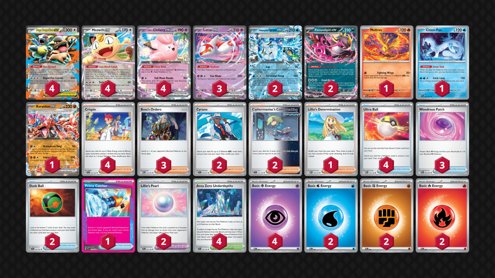

## Decklist


```decklist
Pokémon: 22
4 Mega Kangaskhan ex MEG 104
4 Meowth ex POR 62
4 Lillie's Clefairy ex ASC 76
3 Latias ex SSP 76
2 Wellspring Mask Ogerpon ex TWM 64
2 Fezandipiti ex ASC 142
1 Moltres PFL 14
1 Chien-Pao SSP 56
1 Koraidon ex ASC 121

Trainer: 28
4 Crispin SCR 133
3 Boss's Orders MEG 114
2 Cyrano SSP 170
2 Ciphermaniac's Codebreaking TEF 145
1 Lillie's Determination MEG 119
4 Ultra Ball MEG 131
3 Wondrous Patch PFL 94
2 Dusk Ball SSP 175
1 Prime Catcher TEF 157
2 Lillie's Pearl JTG 151
4 Area Zero Underdepths SCR 131

Energy: 10
4 Psychic Energy MEE 5
2 Water Energy MEE 3
2 Fighting Energy MEE 6
2 Fire Energy MEE 2
```
<!-- PUBLIC -->
### Inclusions

- This deck plays high counts of all the Pokemon primarily for consistency and to have enough Pokemon to bump liabilities with Chien-Pao whenever necessary. We also want to start with Kangaskhan as much as possible. This deck also uses many copies of Clefairy and Meowth every game, so it’s not as overkill as you might think.
- Wellspring Ogerpon is a useful tech. Sob can buy time to build up Energy in play or find a specific combo. Torrential Pump can be very strong in early games against Dragapult or other evolving decks, though sometimes you still just use Clefairy instead. Crucially it also opens up Area Zero which powers up Clefairy and enables Chien-Pao.
- Moltres helps prize trade against decks with Teal Mask Ogerpon. It can also be useful to smack big Pokemon like opposing Mega Kangaskhan or to open fast aggression against other two-prize decks.
- Koraidon is surprisingly helpful because of how many decks play Kangaskhan. It enables 3-2-1 prize maps as a way to one-shot other Kangs, and also provides a Tera in play for Area Zero. Its second attack gets used on occasion too.
- Chien-Pao is extremely relevant. Aside from the Dragapult matchup, removing Mega Kangaskhan from play is very strong against any deck that can one-shot it. This helps us utilize Lillie’s Pearl for a better prize trade.
- I found Cyrano to be much better than Dusk Ball, so I added a Cyrano and cut a couple of Dusk Balls from the original list. Dusk Ball can still help with consistency, especially in the early-game, though I often still want to use Cyrano in most games.
- Lillie’s Determination is a solid option in a deck with four Meowth. Sometimes your hand is small or bad and you just want a new one.
- Prime Catcher has great synergy with the deck. It enables Ciphermaniac + Run Errand even if you don’t already have Kang in the active. It escapes retreat lock. And of course, gust + Crispin is incredibly strong.

### Possible Inclusions

- A tech for Crustle could be considered, such as Chi-Yu or Passimian. However, if they have Fan or Crushing Hammer, it might not be reliable. If you do play a tech, it might be worth also adding a Night Stretcher for it.
- Second Moltres or Chien-Pao would be nice.
- More Cyrano, Lillie’s, or Dusk Balls would increase consistency, which is never bad. I did not find the Dusk Balls to be that great when playing with four, which is why I trimmed them down.
- A tech Energy Switch or two could still be good. There are some times where you use Crispin in the early-game but want to repurpose the Energy later. It also works well with Wondrous Patch.
- This deck has some space to work with, so I’m sure some other ideas that I haven’t thought of could be good.

### Exclusions

- I did not find the Telepathic Energy to be very useful.
- Hand disruption cards are good and could be nice on occasion, but usually they won’t swing any matchups and don’t work well with the deck overall.
<!-- /PUBLIC -->
## Gameplay Tips

- Go first.
- Against any deck that can one-shot Mega Kang, you may need to use Chien-Pao to remove it from play before they can KO it. This is mostly relevant if the opponent is on track for a 3-2-1 prize map, which occurs if they have to KO a Pearl’d Clefairy or Moltres. Chien-Pao is also a strong resource against Dragapult, so you mostly want to keep it around.
- If you don’t know where to manually attach Energy for the turn, lean towards non-Psychic types. Energy attachments can be made up via Wondrous Patch, so sometimes you want to be flexible and keep various attacking options open. Manually attaching to Clefairy is still generally good though.
- Wondrous Patch + Crispin can make an attacking Latias out of nowhere. I was surprised at how often this was relevant.
- Draw before Dusk Ball is typically correct sequencing. Dusk Ball doesn’t thin the deck in the traditional sense, so you’d rather see your cards to inform the correct selection off Dusk Ball.
- If you’re not sure what to get off Ciphermaniac, such as if your immediate needs are already fulfilled, remember that Area Zero, Lillie’s Pearl, and Wondrous Patch are important to have access to and difficult to find. If you don’t already have them, you may want them in the future and not have a way to find them.
- Attacking with Kangaskhan with this deck is rare and inefficient. It’s mostly just a desperation option. However, sometimes you may need to acknowledge when you can’t win through normal means and start powering up Kang to rely on luck.

## Matchups

### Dragapult - Slightly Unfavorable

Some builds of Dragapult might be closer to even.

- Save Area Zero for bumping their Stadium, making a Chien-Pao play, or reaching for the KO when they have a slim board. Chien-Pao can bump Watchtower if necessary, but ideally you’ll have an Area Zero for that instead.
- Latias can one-shot Dragapult even if they have too slim of a board for Clefairy. This is mostly relevant in the end-game. If you manage to get extra Energy on Latias at some point throughout the game, it can be a good closer.
- Attaching Energy to Wellspring or Fez on Turn 1 can be good to present the threat. Even if it gets Hammered, you can still Crispin Clefairy. While attacking with Wellspring/Fez can be very strong in the early-game, attacking with Clefairy instead is still fine. It just depends on the situation and what lines up easier. If you’re going second, try to get the Turn 1 KO with Clefairy.
- Prepare for hand disruption and play around it to the best of your ability.
- If they have Meowth or Fez in play, they are massive liabilities for them. Don’t go out of your way to KO them. Instead, keep them around as easy Sob or KO targets for later. Of course, if they are threatening to attack with them after you use Sob, you have to take the KO.
- Against the Dusknoir version, if you have too many Meowth and Clefairy in play, they can possibly win with just two Phantom Dives + one Dusknoir. Watch out for that and try to play around it. Snipes from Phantom Dive or Dusknoir also bypasses Lillie’s Pearl.
- If they don’t have Stamp left, Ciphermaniac (or Dusk Ball, to some extent) can play around Special Red Card to close out the game.

```youtube
id: zvBAEEaoVNA
title: Slop v Pult 1
```

```youtube
id: sa8Ah2uxEz4
title: Slop v Pult 2
```

```youtube
id: PADRK5BOGhQ
title: Slop v Pultnoir 1
```

### Raging Bolt - Even

- Koraidon and Moltres are generally good in this matchup. Moltres can open aggression if they foolishly put down Teal Mask, while Koraidon can threaten them if they try to hide behind a Kang. Koraidon is also good to respond to a Kang as they might try to attack with it.
- You may need to remove your own Kang in this matchup to stop a 3-2-1 line from your opponent. Don’t worry about it if you’re already winning the trade regardless. Going 3-2-1 yourself is only possible if they use Passimian, which could happen. If not, you can sometimes just ignore their Kang.
- Don’t board lock yourself out of a Tera Pokemon.
- Slim board in the early-game can stop them from initiating with Clefairy. Sob can also stall them from initiating.
- Prime Catcher is a premium resource to get around their Sob. They don’t play tons of gusts, so threatening an attack with whatever gets Sob locked is another way out of it. Boss is also a premium resource to get easy KO’s.
- You want to be the one initiating the aggression as soon as you can get a KO, and then win the prize trade straightforward from there.

```youtube
id: NfV1_7qY9JA
title: Slop v Bolt 1
```
These games are actually surprisingly interesting.

```youtube
id: RoK0ACF6r9E
title: Slop v Bolt 2
```

### Alakazam - Very Unfavorable

- Your win condition is speed blitzing prize cards before they can stabilize. Wellspring Ogerpon is very strong in the early-game. Prioritize targeting their Kadabra. If they don’t have any, target Abra. Fast Clefairy is also good. Just try to amass a fast prize lead.
- Save Stadiums / Chien-Pao to counter Nighttime Mine if you plan on attacking with Wellspring Ogerpon.

```youtube
id: UMXM2VXsxeo
title: Slop v Zam 1
```

```youtube
id: OABzOSwJJ3c
title: Slop v Zam 2
```

### Hydrapple - Unfavorable

- Moltres and Lillie’s Pearl are very strong in this matchup. 
- You’ll need to remove Kang from play at some point to deny them the 3-2-1. Even better if you can get by without putting Kang in play in the first place, but that is sometimes difficult.
- Wellspring’s attacks are nearly useless in this matchup, but it’s still a good card to enable Area Zero.
- Watch out for Briar. Sometimes there’s nothing you can do about it though. KO’ing their initial Celebi or other fodder one-prize isn’t bad because it does avoid Briar.
- Also watch out for Stamp and Red Card. Play around them whenever possible.

```youtube
id: ReNNpTcJ4MA
title: Slop v Hydrap 1
```

### Zoroark - Unfavorable

- Save Prime Catcher in case they try to use Yveltal or Drapion.
- If they have a full bench, try to get the one-shot with Clefairy on their Zoroark. Your opportunity to one-shot Zoroark will disappear after that. The same is true if they have four Pokemon on the bench and a poisoned Zoroark. They should never let that happen, but if they do, you can punish it with a Clefairy one-shot.
- If they have Fez, Meowth, or Pecharunt on their bench, KO it before it disappears to Transformation Tome.
- Eventually, you’ll probably just have to two-shot a Zoroark, which is fine. You may need to rely on Mega Kangaskhan attacking luck in this matchup. Mega Kang can also be a meatshield at various points in the game because it’s very hard for them to one-shot it (especially because they do not want Pecharunt in play).

```youtube
id: Y9wQFCdEMII
title: Slop v Zoro 1
```

### Slowking - Favorable

- Wellspring is very good in this matchup so try to power it up with any spare Energy. Smacking into Kang sets it up for a Clefairy finish, or you can snipe it off after hitting it with Clefairy first. Of course, clearing off Slowpoke + Slowking is also great, and Sob can buy a turn or two if you have nothing better to do.
- Lillie’s Pearl on an attacking Clefairy is generally very good. Lillie’s Pearl is a premium card in general because it also denies some Trifrost lines even if you’re not attacking with Clefairy.
- You need to hold Area Zero + Meowth to counter Trifrost. If they use Trifrost and threaten lethal, Meowth → Ciphermanaic → Prime Catcher and Chien-Pao → retreat, Run Errand, clear off the damage and Prime snipe whatever you want. This is the ideal response to Trifrost so make sure you keep it available. Set up your board so that they cannot win with two more Trifrosts.
- If they have the Kang in play but you aren’t able to punch it, try to get Koraidon with Energy so you can take three prizes on their Kang and close out the game.

```youtube
id: m42C_e2OwqU
title: King v Slop 1
```

### Slop Box Mirror - Even

- Many of the same principles as the Raging Bolt matchup, barring Moltres. You can still use Moltres to swing fast, but it’s obviously not as strong when it can’t one-shot anything.
- If they are threatening a Koraidon with an Energy, remove Kang from play. You can do the same thing to threaten their Kang. Using Chien-Pao makes it harder for them to remove Pokemon from play.
- Don’t board lock yourself out of a Tera Pokemon.
- Slim board in the early-game can stop them from initiating with Clefairy. Sob can also stall them from initiating.
- Save Prime Catcher for Sob. It’s probably fine to use it to get a solid prize lead if you have to.
- Lillie’s Pearl is very good.

### Crustle - Auto Loss

Without a tech you just can’t win. With a tech, you still have to play carefully.

### Mewtwo - Unfavorable

- Moltres is good to smack into Mewtwo. Lillie’s Pearl also very good in this matchup since it’s hard for them to gust a lot.
- Wellspring’s attacks are also mostly bad here. Torrential Pump is hard to line up but it could occasionally be useful since getting the damage on Mewtwo is relevant. I never found a good chance to use it since it’s so committal.
- Clefairy is the go-to attacker in most situations.
- Attacking with Kang can sometimes be good in this matchup since it’s hard for them to one-shot it. Attacking with it earlier is best to reduce the likelihood of them having the Max Belt combo to one-shot it. If they swing into Kang for a bunch of damage, you HAVE to remove it with Chien-Pao.
- Chien-Pao can also be very good because it removes Meowth from play, which leaves them with nothing they can easily KO with Spidops.

```youtube
id: 5vN-SSszLeg
title: Slop v Mewtwo 1
```

### Excadrill - Even

- Go first.
- Going fast and aggressive is the way to win. If you can get an Energy on Wellspring Turn 1, that can be very good. Torrential Pump is generally always good in this matchup if you’re able to power it up. Any spare Crispin or manual attachments should go onto Wellspring, while using Wondrous Patch to power up Clefairy.
- Moltres is insane in this matchup. If you smack Excadrill for 220, you can even get a Torrential Pump with Boss or Prime Catcher to take four prizes.
- Clefairy is still a useful and efficient attacker. Even better if you have the Pearl to go with it.
- Try to remove Kang from play with Chien-Pao whenever you get the chance. It is a massive liability.

```youtube
id: yXZhZKazbs8
title: Drill v Slop 1
```

### Lucario - Unfavorable

- Kangaskhan should be avoided if at all possible.
- Lillie’s Pearl!
- Sob on Lunatone or Solrock is very good because it sets up for a perfect Torrential Pump for two prizes. This is the best way to actually win a prize trade. There’s nothing you can do if they have Switch right away, but sometimes they will not have it.
- If they have only one Riolu and no Lucario, obviously target that. Otherwise, target Makuhita because Hariyama is a massive threat in this matchup.

```youtube
id: KRenxp2JaK0
title: Slop v Lucario 1
```

## Personal Thoughts

This deck is atrociously bad and doesn’t really beat anything. I just thought I should cover it since it somehow won NAIC.
