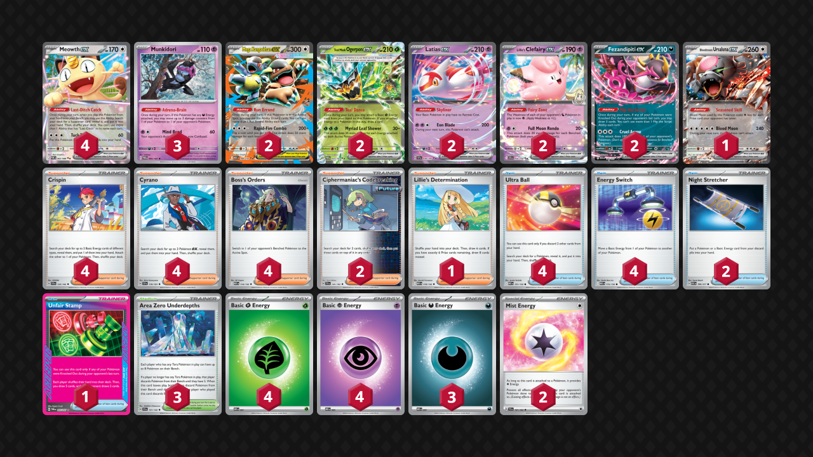

## Decklist


```decklist
Pokémon: 18
4 Meowth ex POR 62
3 Munkidori TWM 95
2 Mega Kangaskhan ex MEG 104
2 Teal Mask Ogerpon ex TWM 25
2 Latias ex SSP 76
2 Lillie's Clefairy ex JTG 56
2 Fezandipiti ex ASC 142
1 Bloodmoon Ursaluna ex TWM 141

Trainer: 29
4 Crispin SCR 133
4 Cyrano SSP 170
4 Boss's Orders MEG 114
2 Ciphermaniac's Codebreaking TEF 145
1 Lillie's Determination MEG 119
4 Ultra Ball MEG 131
4 Energy Switch MEG 115
2 Night Stretcher ASC 196
1 Unfair Stamp TWM 165
3 Area Zero Underdepths SCR 131

Energy: 13
4 Grass Energy MEE 1
4 Psychic Energy MEE 5
3 Darkness Energy MEE 7
2 Mist Energy TEF 161
```
<!-- PUBLIC -->
### Inclusions

- This started as the winning Japanese Absol deck but obviously has undergone many changes. I play four Meowth because I literally always want it in hand and like to spam it. Tried two and three, but I want all four.
- Munkidori is handy in a variety of matchups because many decks can’t easily one-shot Mega Kang. With multiple Energy Switch, it’s easy to get value from several Adrenabrains, which opens a lot of lines and strong plays. Wanting to use two Munkidori in a turn is somewhat common, though it’s not as good in fast-paced prize trade matchups.
- Ogerpon allows us to make plays without necessarily needing Crispin. It works well with the Energy Switches. It can also be used to attack against Grass-weak Pokemon.
- Latias and Kangaskhan are required for the deck to function. Although you only need one in most games, we play two because of how important they are. We can’t afford to prize either of them if we play just one copy, and Kang is often a good attacker as well.
- Similarly, we play two Fezandipti because it’s extremely important and prizing it can be disastrous. It’s also a great attacker against Dragapult or other evolution decks if they don’t have Shaymin.
- Clefairy is the most consistent attacker and we’ll use it to handle most situations. I think two or even three Clefairy are necessary because we use both of them in many games.
- Crispin is used multiple times every game and we usually want to use it on turn 1 or turn 2 to start attacking.
- Similarly, Cyrano is needed to get the game going. We’ll often use another one later for a big Clefairy attack. Unlike Crispin, we never need more than two, but it’s still good overall for consistency.
- Ciphermaniac’s Codebreaking is extremely good with the various draw Pokemon in the deck. It is mostly used for Energy Switch/Stretcher combos, finding Stamp, or finding the right Energy to attack.
- The one-of Lillie works well with the heavy Meowth engine. Sometimes Lillie is the best Supporter for the turn, especially when we have a small or useless hand.
- Mist Energy is pretty good against Dragapult, but they are definitely cuttable. If you did cut them, I would probably add a Chien-Pao for a similar use case against Dragapult plus whatever else you wanted to add. Mist Energy is not that useful against Alakazam if they play Hammer, and I expect most Alakazam to play Hammer right now. If they don’t, Mist Energy becomes much better for an instant-win in that matchup.

### Exclusions

- Absol is useless, so I cut them.
- I don’t think Cornerstone is needed because the Mewtwo matchup isn’t that bad.
- Psyduck is good if Dusknoir is a big threat. I currently think Dusknoir is a fraud, but if that changes, we could add Psyduck back in. This deck has plenty of space.
- Brock’s Scouting should go back in if we add Psyduck. Without Psyduck, Brock isn’t worth playing.
- Pokegear is a nice consistency card but we don’t mind spamming Meowth so I prefer that.
- Wellspring Ogerpon plus Water Energy could be a consideration, but it’s not that important for most matchups right now. I still wouldn’t play Prism Energy either way.
- If you wanted a way to bump Area Zero, I think Chien-Pao is better than a random Stadium. However, I don’t think any of that is necessary. The heal can be good against Dragapult, which is already favorable anyway. Discarding liabilities isn’t a real thing because if you have that many Pokemon in play, there will be liabilities remaining anyway.
- Lillie’s Pearl doesn’t make that much sense in this build that relies on Kang. However, I plan on trying Pearl builds as well.
<!-- /PUBLIC -->
## Gameplay Tips

- Before using Run Errand, always ask yourself “is there a chance I need Ciphermaniac this turn?” If you don’t already have the cards you need for the turn, there’s a good chance the answer is yes. Blindly using Run Errand can and will cost you games. With four Meowth and four Ultra Ball, accessing Cipher is easy, so be sure you won’t need it before using Run Errand!
- If Crispin is the desired Supporter for the turn, start your sequence with that. In general, sequence like this: Unfair Stamp -> Flip the Script -> Teal Dance -> Ciphermaniac -> Run Errand, excluding any of the steps that aren’t applicable. Of course, there are plenty of exceptions.
- As with other decks, sometimes it’s better to delay Stamp depending on the board state. This requires some experience and intuition to get a feel for. What is Stamp doing for you? Can it stop the opponent from doing something specific? Can you combo it with a Boss or other disruptive option? Stamp is mostly used as a disruption option in this deck, so try to deliver it at a the right moment. Although it’s usually best with Boss, sometimes that is not an option because it’s hard to find Stamp without Cipher.
- In most games, you want to ship Kang to the active and start drawing cards. It’s often fine to attach to it to start attacking, though this can depend on the matchup. Of course, if you’re against something like Lucario that can easily one-shot the Kang, try to keep it out of the active or even out of play.
- Ursaluna can often be used earlier than normal thanks to Crispin/Energy Switch.
- Munkidori is often a good attacker and is sometimes the only option for fast pressure. Also keep your eyes open for possible double or triple Adrenabrain plays out of nowhere, as they can be very potent.
- Ogerpon should probably be attacking less often than you think and Kang more than you think.
- Sometimes keeping Munkidori off the board entirely is the best way to stop the opponent from having an easy prize map. This is mostly relevant if they’re KO’ing Kangaskhan. It comes up most often against Arboliva. The inverse can also be said about keeping Kangaskhan off the board, but that is somewhat rare (mostly done against Lucario).
- Go first against everything besides Dragapult.

## Matchups

A lot of these games I still have Absol in the deck, but you’ll notice that it doesn’t do anything.

### Dragapult - Favorable

- Get a Psychic Energy in play asap as you may need to Energy Switch onto Clefairy. Try to leave at least one Psychic in the deck for Crispin.
- Attacking with a fast Fez is ideal and can destroy them. Attacking with a fast Munki or Kang is also somewhat common. Between attacking with Munki now or Fez next turn, it just depends. If their board is not developed at all, going for Fez next turn can be stronger as it does not proc Stamp or Fez and can spawn trap Drakloak.
- Adrenabrain damage to their Fez/Latias is often relevant for Kang to finish it off. Alternatively, Ursaluna can close out games against those Pokemon.
- Mist Energy is usually best on Fez or Kang. If they have Dusknoir and you have Psyduck, Mist can be good on Psyduck.
- Use Clefairy to respond to Dragapult. Having Munkidori on board is also good.

```youtube
id: mlxrooxjTrg
title: Pult v Slop 1
```

```youtube
id: xpa-XDUyuyk
title: Pult v Slop 2
```

```youtube
id: 3CKGTQowFjM
title: Pult v Slop 3
```

### Lucario - Unfavorable

- Use Clefairy to respond to Lucario and one-shot it.
- Open aggression asap with an attacker that Aura Jab can’t easily KO, such as Ogerpon or even Latias. We need to pressure them and try to make it so that they cannot easily power up Hariyama. This is easier said than done though. If you’re desperate, you can have Clefairy open aggression and just hope they don’t have two damage mods for the Aura Jab KO.
- If you’re able to play the early-game without putting Fighting-weak Pokemon into play (especially Kang), try to avoid doing so and still apply pressure. This is pretty hard since you usually need to rely on Kang or Meowth to play the game, but if you manage to find a way to start attacking without them, it’s the best chance of winning.
- Munkidori’s Mind Bend can respond to Hariyama as well as potentially open aggression by KO’ing Riolu/Makuhita. If you have to choose between early-game speed or waiting a turn for a more ideal attacker, I tend to prefer going for speed.

```youtube
id: bzvRSCnAT7U
title: Lucario v Slop 1
```

```youtube
id: EKXF9j5d8KE
title: Lucario v Slop 2
```

```youtube
id: WiiZllhotKY
title: Lucario v Slop 3
```

### Alakazam - Very Unfavorable

- Your win condition is attacking fast and then bricking them off Stamp.
- Mist Energy is best early or on the turn you Stamp, as those are the times they are least likely to have a response. Cipher can help you get value from both Mist Energy as well as Stamp on key turns.
- Attack with whatever is fastest or most convenient. In the most ideal situation, Kang is best because it has the most HP and might survive if you’re lucky. Otherwise, use Clefairy or Fez.
- On your Stamp turn, you need to KO Fez/Dudunsparce to maximize the chance of them bricking.
- If they don’t play Hammer, rely on Mist Kang and don’t put many Pokemon in play. If they play bad Zam, use Adrenabrain to stop it from 2-shotting Kang and try to get a second Mist Energy attacker.

### Garchomp - Unfavorable

- Try to cheese them with a fast Fezandipiti or Clefairy.
- Extra Energy should go onto Ogerpon. Try to preload it as much as possible to get a one-shot on Garchomp.
- Mind Bend is useful on some occasions, especially if you were able to pressure their early Energy attachments.

```youtube
id: MNNf2n41tB0
title: Chomp v Slop 1
```

```youtube
id: aGzRod7FXUs
title: Chomp v Slop 2
```

```youtube
id: YhIOn0kE4ko
title: Chomp v Slop 3
```

### Meganium - Even

This matchup is about even if they have Budew and a little better if they don’t.

- Don’t put down Munkidori until you can either get value from it or they can’t abuse it for their prize map. If you put it in play, they will snipe it with Arboliva for a convenient 1-3-2 prize map, as you almost always need to put Kang in play for draw. Munkidori is mostly good if they use Itchy Pollen too much and give you damage to throw back at them. When in doubt, just don’t put Munkidori down at all.
- Don’t put any Energy on your initial Kang that you’re using to draw until you’re ready to attack with it. If you put even one Energy on it, they can one-shot with Ogerpon with four Energy (which can easily be made over two turns).
- There aren’t really any convenient attackers to open aggression with. You can use Clefairy, Ogerpon, Kangaskhan, or Cornerstone (if you play it), but they’re a bit slow if you’re Item locked. This is a normal prize-trade matchup, so you want to enter the prize race on the winning end of it (don’t throw away an attacker just to KO a single prize Pokemon). Once they’ve taken a few prizes, Ursaluna is very good. It can sometimes be used as early as 3 or even 4 prizes remaining thanks to Energy Switch/Crispin.

```youtube
id: PvhArUmgbJ4
title: Slop v Meganium 1
```

```youtube
id: ImYPuD7Y3_Y
title: Slop v Meganium 2
```

### Raging Bolt - Slightly Favorable

- Getting Kang in the active early is ideal because it’s hard for them to KO it in the early-game. Try to get a Clefairy with an Energy fast as well. Clefairy with Boss is the easiest way to get the first two prize cards. You may need a lot of other Pokemon and even Area Zero depending on how careful the opponent is.
- This is straightforward prize race. Don’t put a two-prize Pokemon in the active unless you’re able to take the lead.
- If they smack Kang with Fan Rotom or baby Bolt in the early-game, return KO with Munkidori is fine, mostly because you don’t want to leave anything else in the active.
- We are most likely not attacking with Kang in this matchup. Mostly rely on Clefairy and Ursaluna.

```youtube
id: Ljy0_-rv0pM
title: Bolt v Slop 1
```

```youtube
id: TPHTpIWAvpE
title: Bolt v Slop 2
```

### Absol / Slop Box Mirror - Even

- Prize trade matchup. Try to be the one that takes the lead on even prizes. Kang in the active early because it’s hard to KO. Try to manually attach to Clefairy to get the fast Boss KO. If you can’t, just go for a fast Kang punch instead. Don’t attack with Kang if it has damage.
- Holding Pokemon and not putting them in play can stop them from getting the first KO with Clefairy.
- If you’re behind, you’ll have to rely on Kang and Stamp. Depending on the situation, you may need to Boss their Fez and just flip heads on your Stamp turn. 
- If you have a slim board, you can use Ursaluna to attack without much fear of it getting return-KO’d, which is another chance to make a comeback. In general, slim board is better if you’re behind, while wide board is better if you’re ahead.
- There could occasionally be a chance for random Mind Bends if they are attacking with Kang. If they get the first Kang smack into your Kang and you can’t get a Boss KO, Mind Bend might be your best option. Another potential option is double Adrenabrain plus flip a heads.

### Mewtwo - Even

- Push Kang asap. If they smack into it, pivot into attacking Clefairy and use the damaged Kang as a damage bank for Adrenabrain throughout the game. If they do not smack the Kang, start attacking with it.
- Kang and Clefairy are the default attackers. Try not to attack with anything that is damaged! Damage in play for Adrenabrain is an incredibly powerful resource, though it’s completely up to the opponent if they give you any.
- Ursaluna is occasionally useful on 3-4 prizes. Otherwise, use it as a closer.
- If they have a full bench, try to use Clefairy to one-shot Mewtwo. This is easier said than done, but extremely strong if you get it.
- If they have Spidops/Tarountula with a Bangle/Belt, it is a big threat so remove it asap. If they have a threatening Mewtwo as well, sometimes that takes priority, but it is highly situation-dependent.

Unfortunately I forgot to record for this matchup and the next one. My bad.

### Zoroark - Even

- Although this is a prize trade matchup, they have a single-prize board to start, which means they can always theoretically win if they draw perfect.
- Kang is very good because it is hard for them to KO it, so start attacking with that. Of course, it cannot reliably one-shot Zoroark, so you’ll likely end up using Boss for another one-prize KO with it later as well as KO on Pecharunt/Meowth if they put them in play.
- If they smack Kang and they have Darm, heal it out of Darm range if you can. If not, don’t put Munkidori down so they cannot get a four-prize turn with Darm’s attack.
- Get Grass Energy on Ogerpon asap so that you can one-shot Zoroark. If you can get two Ogerpon, each with a Grass Energy, that’s even better.
- If they have a full bench, which is most of the time, Clefairy with full bench can one-shot Zoroark.

## Personal Thoughts

This deck does not look remarkable and neither does its matchup spread. However, the deck is fundamentally strong and somehow wins lots of games. I think it’s better than most of the other decks, but it can sometimes struggle against random stuff. There is also lots of space for adaptability and teching should the need arise.
