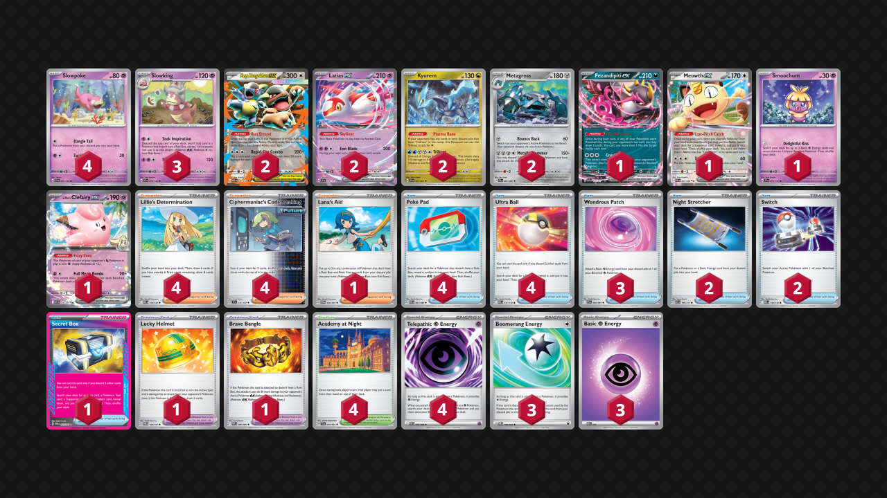

## Decklist


```decklist
Pokémon: 19
4 Slowpoke SCR 57
3 Slowking SCR 58
2 Mega Kangaskhan ex MEG 104
2 Latias ex SSP 76
2 Kyurem SFA 47
2 Metagross CRI 61
1 Fezandipiti ex ASC 142
1 Meowth ex POR 62
1 Smoochum SSP 75
1 Lillie's Clefairy ex ASC 76

Trainer: 31
4 Lillie's Determination MEG 119
4 Ciphermaniac's Codebreaking TEF 145
1 Lana's Aid TWM 155
4 Poké Pad POR 81
4 Ultra Ball MEG 131
3 Wondrous Patch PFL 94
2 Night Stretcher ASC 196
2 Switch MEG 130
1 Secret Box TWM 163
1 Lucky Helmet TWM 158
1 Brave Bangle WHT 80
4 Academy at Night SFA 54

Energy: 10
4 Telepathic Psychic Energy POR 88
3 Boomerang Energy TWM 166
3 Psychic Energy MEE 5
```
<!-- PUBLIC -->
### Inclusions

- Smoochum is too valuable, especially against Dragapult. It's also very consistent 
and easy to use.
- Switch is needed in a variety of situations, such as after using Kyurem, getting 
retreat locked, or just to draw with Kang. I definitely think two is good and I would
even consider adding a third one.
- Boomerang Energy isn't that important, but it is very strong when you happen to have
it with a Kyurem attack.
- Ciphermanaic is too good in this deck to play less than four.
- Lana's Aid is generally good and useful but I'm honestly not sure if it's necessary.

### Possible Inclusions

- The Ian Robb version with Crispin, Munkidori, Drapion, and Zoroark is interesting. I
haven't tried it yet. Drapion in particular could help a lot with two-prize decks, but
you do have to play Munkidori to go along with it, which is very high-maintenance.
- Along those lines, Prime Catcher could also be good, though you don't necessarily need
all the fancy techs in order to play it. Secret Box is definitely good, but I don't 
think it's 100% necessary.
- More Kangaskhan would always be nice.
- I am considering swapping a Boomering for another Psychic.

### Exclusions

- Powerglass isn't good enough for how hard it is to pull off at a relevant time.
- Surfer is worse than Switch. Although you can use it while Item locked, you won't have
it at the right time.
- Dawn seems good in theory but was not that useful in testing. Finding Slowking or 
Metagross is not that hard normally as the deck often has extra Poke Pads anyway.
<!-- /PUBLIC -->
## Gameplay Tips

- Go first against Dragapult and everything that can’t attack on Turn 1.
- One of the more difficult things with this deck is deciding what to get off Ciphermaniac.
Oftentimes you'll get the attacker you need to copy and some good card for next turn's 
topdeck. When deciding what the next card should be, it's important to guess what the 
opponent is most likely to do next turn. If they're likely to KO Slowking, you'll need to
power up a new one. If you Trifrosted and need to continue progressing the game, consider
getting Switch or Energy. If they're going to start using Itchy Pollen, perhaps Lucky Helmet
is best. If you don't have another Supporter, another Ciphermaniac or Lillie could be the
play. Secret Box can be a neutrally good pick if you have enough cards in hand. Another
important consideration is your prize cards. If you're taking three prizes and have multiple
Energy prized, might not want to put another Energy on top.
- If you aren't using Slowking's attack for the turn and you're at three or fewer prizes,
use Academy at Night to play around Special Red Card (if they haven't used one yet).
- Delaying extra Slowking evolutions is often good because they are very prone to 
getting stuck in the active. Many exceptions exist, such as if you don't care about it
getting stuck or are more concerned about hand disruption.
- Wondrous Patch is usually the most valuable resource so try not to discard them. 
They are always important later.
- If your opponent puts you on an inconvenient prize map, exploiting your lack of gusts, 
you may have to chain Kyurem to stay winning on the prize trade. This means that Kyurem
is occasionally needed in matchups where it usually isn't, but it's entirely situational.

## Matchups

### Dragapult - Depends

The Dragapult matchup can vary based on both players' lists. Thanks to Smoochum, most 
Dragapult matchups are slightly favorable. Against heavy Watchtower/disruption with 
Moltres, it's unfavorable or slightly unfavorable.

- Fast Kyurem is obviously the go-to move. Do everything in your power to set it up.
- Trifrost should prioritize KO'ing Drakloak, anything with Energy, and Budew, roughly 
in that order. That means that KO'ing Budew is generally better than KO'ing Dreepy, but 
exceptions exist.
- Overloading a Slowpoke with hand attach + Smoochum is generally good to play around 
Crushing Hammer. But if you have another Energy in hand, it might be better to split 
the Energy instead.
- Preemptive Items should get used to play around Budew. Budew is the main obstacle in 
this matchup.
- Sometimes Clefairy is better than Metagross to KO Dragapult. Usually you want to KO 
Dragapult on sight one way or another. However, if they are threatening to evolve their 
board and make a difficult prize map, sometimes Trifrost first is better.
- Do not leave damage on their board with Trifrost. The main exception is if they have 
only three Pokemon on their board and you want to KO two of them, the extra 110 onto 
their Fez/Meowth is forced, which is fine.
- Oftentimes Budew slows the game down after the initial Trifrost. This is fine. You 
do need to have some way to stop them from simply using Itchy Pollen a million times, 
so load up the active Slowking to threaten an attack, or get Lucky Helmet on it.
- This is the main matchup where not evolving backup Slowpoke is important because 
there's so many ways they can punish it. Once they start using Phantom Dive is when 
you want to evolve all the Pokes (or if they are threatening some Adrenabrain + Phantom 
Dive play).

```youtube
id: lRVe5drKOyU
title: Pult v King 1
```

```youtube
id: wFXYpr6UAaA
title: Pult v King 2
```

```youtube
id: Ff6AUafaIxE
title: Pult v King 3
```

```youtube
id: FEuncXxevBc
title: King v Pultnoir 1
```

```youtube
id: DuCHkNj08Rw
title: King v Pultnoir 2
```

### Raging Bolt - Slightly Unfavorable

- Sometimes Kang is needed to play the game, but putting it in play is very risky because it can give the opponent a good prize map. If you’re at 5 or 3 prizes and the opponent has plenty of Energy on the board, Kang is a lot worse to put in play. If you think they can’t punish it then it can be fine.
- Try to get Fez and/or Lucky Helmet in play when you’re taking a KO so you can get out of Stamp. Sometimes you need Kang for this reason as well.
- Kyurem is generally not used much in this matchup but sometimes you need it in some fringe scenarios. Most of the time you just want to spam Metagross as quickly as possible.
- Clefairy can be an efficient way to take a KO if they overbench or attack with Raging Bolt.
- Sob is a threat so hang onto your Switches.

```youtube
id: zB_wM3zBebQ
title: King v Bolt 1
```

```youtube
id: hnu2VK19vmk
title: King v Bolt 2
```

### Alakazam - Depends

If they have Shaymin or the Eri + Dedenne + Elgyem package, the matchup is very unfavorable. If they don’t, the matchup is about even and it can get very interesting.

- Spamming Kyurem is usually best even if they have a slim board. Of course, it’s irrelevant if they have Shaymin.
- Save Wondrous Patches and Switches. They are premium resources and you need them if they try to trap a Slowking with Elgyem.
- Sometimes the game slows down after using Trifrost when they try to trap Slowking. If that happens, simply wait for the combo. However, if they have Eri and Dedenne, waiting does not necessarily work, so you’ll have to somehow avoid ending up in that situation (take a few KO’s with Metagross and hoard cards for back to back Kyurem is one way).
- The best targets for Trifrost are usually control Pokemon (Dede and Elgyem) or Pokemon that can draw when they evolve (especially before their hand is built up). However, sometimes you need to smack something for 110 (such as Fez or Alakazam) for a more efficient prize map. 
- Prize mapping efficient Trifrosts is very important, and sometimes you need to include a Clefairy or Metagross attack for one prize card.

```youtube
id: yV715Nm-4z8
title: King v Zam 1
```

```youtube
id: FyKyROvWcvY
title: King v Zam 2
```

```youtube
id: OkwXG4DViHE
title: King v Zam 3
```

### Hydrapple - Unfavorable

- Trifrost is usually good, but if the opponent is careful they might have a board composition where it isn’t. If that’s the case, just use Metagross. If they have more than one single-prize Pokemon in play and / or Meowth, Trifrost is usually good. It can also be good if they have Fez and no Hydrapple, but if you smack Fez for 110, there is still a risk of Hydrapple healing it for 30. 
- Smacking Hydrapple for 110 is not too bad if you have no better option, as you no longer need Bangle to KO it. Otherwise, Bangle is a necessary resource for KO’ing Hydrapple.
- Same as with the Bolt matchup, sometimes Kang is needed to play the game, but putting it in play is very risky because it can give the opponent a good prize map. I would be very careful and not put it in play unless absolutely necessary.
- If the opponent makes a full bench and attacks with Ogerpon, Clefairy can get the KO (same with a Trifrost-damaged Hydrapple).
- Watch out for Briar and play around it if possible. This can sometimes be done with good Trifrost timing, but sometimes it’s impossible or unrealistic.
- Try to get Fez and/or Lucky Helmet in play when you’re taking a KO so you can get out of Stamp. Sometimes you need Kang for this reason as well.

```youtube
id: mVqDByjCGiU
title: King v Hydrap 1
```

```youtube
id: IAtSXBDV-Hc
title: King v Hydrap 2
```

### Slowking Mirror - Even

- Don’t leave Kang active if an incoming Metagross attack is likely. This goes for any two-prize Pokemon as well.
- Get at least two Slowpoke evolved as soon as possible. Swarming all four Slowpoke can be viable in the early- or mid-game.
- Spam Trifrost unless they have Kang in the active that you can KO with Metagross. Trifrost on their Slowking is still good because you can wipe out all their Pokes/Kings with two Trifrosts. Of course, the same can also be done to you and there’s nothing you can do about it. Sniping two-prize Pokemon with Trifrost can also be very good for the prize map. If they have Munkidori, sniping Meowth/Clefairy is still good, but sniping Latias/Fez is not as good (but can still be viable if you’re KO’ing Munkidori and don’t think they can replace it).

### Zoroark - Even

- Fast Clefairy can sometimes be viable. Of course, Trifrost is preferred if possible.
- Switch is an important resource for escaping Yveltal / Drapion.
- Need space for triple Slowpoke, as Darmanitan can easily wipe them out.
- General rule of thumb: if they have a single-prize Pokemon active, attack with Kyurem or Clefairy. If they have a two-prizer, KO with Metagross.

```youtube
id: rcxdgYn7PUY
title: King v Zoro 1
```

```youtube
id: vewPb1rXCkw
title: King v Zoro 2
```

```youtube
id: XJnQMqbMkXU
title: King v Zoro 3
```

### Slop Box - Unfavorable

- Sometimes you may be tempted to go for Trifrost because they have a Pearl Clefairy active that doesn’t look very appetizing. Trifrost seems appealing because you can win in two attacks. However, if they have the Chien-Pao play available, it is a game-deciding punish. If it seems reasonable that they can have that play, just settle for a humble Metagross attack and chain Metagross (Clefairy can sometimes get in there too). That is the more reliable line and it also constantly forces them to find attackers (which makes it harder for them to gust). All they need for the Chien-Pao play is Meowth and Area Zero → Meowth for Ciphermaniac for Chien-Pao and Prime Catcher → Run Errand. 
- If you don’t think they can do that, or if you’re hopelessly behind in a prize trade, then you can go for Kyurem.
- Some Raging Bolt principles apply, such as Kang being a massive liability and holding Switches for the Sob threat.

```youtube
id: m42C_e2OwqU
title: King v Slop 1
```

### Crustle - Favorable

- Need to be careful with resources and try to play around Xerosic’s and Eri to some extent. You’ll probably need every last recovery card to get enough attacks through.
- If you’re running low on attackers to copy, consider using Slowking’s second attack. It can get through Crustle, although slowly.
- Trifrost is actually very good if they have Crustle/Dwebble in the active (unless they’re attacking with it, in which case just KO with Metagross). Sniping their Kang for 110 is very relevant. If they have Kang active, Metagross is usually best.
- Make sure not to play into Bianca’s Devotion (on their Caped Kang) as that would be a catastrophe. Bangle can be useful for playing around it. If they heal to a number where 300 puts their Kang into Bianca range, Bangle can get the KO. Getting the extra damage from Bangle upfront can also be good sometimes.

```youtube
id: 7K4rTEmfVbU
title: King v Crust 1
```

### Mewtwo - Favorable

- For the early- and mid-game, prioritize hitting Tarountula, Spidops, and Articuno with Trifrost. In the late-game, just close it out in whatever way is most efficient.
- If they have Mewtwo active and you can’t get max value from a Triforst, then it’s ok to one-shot the Mewtwo with Metagross. Pinging Mewtwo for 110 with Trifrost is pretty much useless.

### Hide n Sneak - Slightly Unfavorable

- Even if their board isn’t particularly vulnerable to Trifrost, it’s still worth going for. KO’ing Dunsparce is the highest priority, otherwise put the damage onto Dhelmise and set them up to get wiped. This deck is capable of chaining Trifrost and that’s what you want to do. If they only have two Pokemon in play, it’s probably not worth using Trifrost in that instance.
- Do not leave Kang in the active if there is any chance of it getting attacked! This will give them a free three prizes in two attacks, which must be avoided!
- Be careful not to run out of gas. This requires some thoughtful use of resources, and sometimes you’ll need Clefairy as an efficient attacker to close out the game. However, if your opponent does not play the matchup correctly, you won’t have to think as hard.

```youtube
id: J96IFKJc8gg
title: Sneak v King 1
```

```youtube
id: it6-5D9h9vA
title: Sneak v King 2
```

### Excadrill - Favorable

This matchup is favorable if they do not play Shaymin, and probably unfavorable if they do.

- Don’t leave Kang in the active, especially once their board is established, as we do not want to feed Excadrill an easy three-prize KO.
- Trifrost is obviously insane. Wipe out three Metang, smack the Excadrill for 300, and then Trifrost to finish it off wins in three attacks. If there are not three targets to KO, smack their Excadrill for 300 and win with two follow up Trifrosts. Trifrosting first in that scenario can be worse since they can retreat Excadrill and it is permanently safe.

## Personal Thoughts

This deck is not that good due to its inconsistency and somewhat mediocre matchup spread. It is also quite difficult to play optimally. However, it is not complete trash, which is better than I expected.
