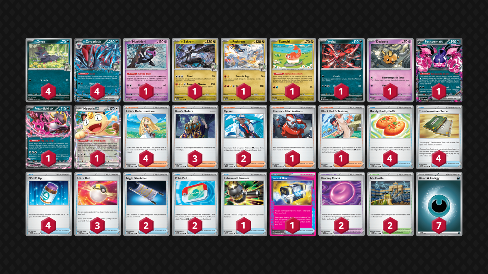

## Decklist


```decklist
Pokémon: 17
4 N's Zorua ASC 136
4 N's Zoroark ex ASC 137
1 Munkidori TWM 95
1 N's Zekrom ASC 155
1 N's Reshiram JTG 116
1 Tatsugiri TWM 131
1 Yveltal MEG 88
1 Dedenne SSP 87
1 Pecharunt ex SFA 39
1 Fezandipiti ex ASC 142
1 Meowth ex POR 62

Trainer: 36
4 Lillie's Determination MEG 119
3 Boss's Orders MEG 114
2 Cyrano SSP 170
1 Xerosic's Machinations SFA 64
1 Black Belt's Training JTG 143
4 Buddy-Buddy Poffin ASC 184
4 Transformation Tome CRI 83
4 N's PP Up ASC 195
3 Ultra Ball MEG 131
2 Night Stretcher ASC 196
2 Poké Pad POR 81
1 Enhanced Hammer TWM 148
1 Secret Box TWM 163
2 Binding Mochi PRE 95
2 N's Castle JTG 152

Energy: 7
7 Darkness Energy MEE 7
```
<!-- PUBLIC -->
### Inclusions

- Reshiram is often relevant against Dragapult since it’s another option to one-shot Dragapult, which you can’t afford to whiff on. It is sometimes just as good as Zekrom naturally, but other times you’re sad if Zekrom is prized.
- Tatsugiri is very nice for consistency and it’s not as much of a liability due to Transformation Tome.
- Meowth has overperformed and is very good for helping with this deck’s early-game consistency. I often use Stretcher for it to end the game by getting Boss as well. Three Ultra Ball are included mostly due to synergy with Meowth.
- Yveltal is a very nice stopgap for when you don’t have the full combo you need yet. Although dedicated Yveltal gameplans don’t work too well in the current meta, it often buys you a turn or two that you need for some extra Trades. Clutching a Mega Kang is also very strong as it can easily be KO’d on the follow up, but it’s otherwise difficult to KO without any prior damage.
- Dedenne and Enhanced Hammer are here to ensure a win against Crustle. Of course they are cuttable if you don’t care about the Crustle matchup, which is perfectly fine. I think Crustle might be a decent play for Worlds which is why I’ve included them.
- Xerosic’s Machinations with Dedenne can sometimes beat Alakazam and is also very good in the mirror. Otherwise it’s not very good so it is definitely cuttable.
- Black Belt’s Training is incredibly good against Dragapult allowing for easier one-shots. I found it to be very relevant. It can also help against other high HP Pokemon such as Hydrapple or Mega Kang.
- Four N’s PP Up ensures that we can chain Zoroark in prize trades. I would consider playing a Janine’s Secret Art over one of them, but it’s really important to always have PP Up on the turns you need it, and you usually need many of them each game.
- Secret Box is a neutrally good Ace Spec. It helps with consistency and hitting combos.

### Possible Inclusions

- Darmanitan is very good still. If you don’t care about the Dedenne package, I would definitely recommend Darmanitan in those slots.
- Budew is very viable and often good against Dragapult and Slowking. I’m definitely considering adding it in. However it can be a liability due to its low HP.
- A second Munkidori would be nice as well. With one Munki I often wanted a second one, but when I tried a second one, I never used it!
- Energy Switch would also be pretty cool, especially with multiple Munkidori.
- Purrloin would be ok over Tatsugiri, but Tatsugiri is a lot easier to use.
- Janine’s Secret Art is pretty good and could allow for easier Pecharunt attacks.

### Exclusions

- Drapion is not very good and impossible to set up. It also never gets used against Dragapult. If you’re worried about Hydrapple, it might be good against that.
- Similarly, Dusknoir is also not that good and never used against Dragapult.
- Same with Mega Absol. Although it would be nice to have some insane Transformation Tome possibilities, I just don’t see the point of any of these cards.
- Ruffian does not beat Crustle so there’s no point in playing it.
- Special Red Card could be ok. I don’t have much of an opinion on it. I don’t think it does anything particularly important, and there’s a lot of other cards I’d rather use the space on.

<!-- /PUBLIC -->
## Gameplay Tips

- Even with Transformation Tome in the deck, you still want to be careful with your board. Bench space is still a premium resource and you’ll only get one or two Tome uses per game.
- Go first.
- When going first, starting with Zorua and attaching to it is generally good, except against Lucario or any deck that can consistently KO it on turn 1.
- When the first Zoroark/Zorua goes down, try to replace it with Fez instead of another Zorua, as long as you have two Zoroark already on the board. There are some exceptions such as if the Zoroark might get board wiped and you can’t finish with Pecharunt.
- In two-prize matchups, try to be aggressive and start out ahead on the prize trade. If you can’t get the first two prizes, don’t put two-prize liabilities in play until you can. Sometimes it’s ok to evolve into Zoroark on the bench since it’s hard for most other decks to KO it. Active Zoroark or benched Pecharunt are easier to KO, but that doesn’t matter if you’re winning the prize trade. In other words, keep a single-prize board (or have a difficult to KO benched Zoroark) until you’re ready to go in.
- When using Trade, consider if you want to open up a particular Tome play. Sometimes you need to Trade away a specific Pokemon in order to have access to Tome.
- Attaching Energy to Pecharunt in the late-game is something you should keep in mind. It comes up more than I expected. Since Pecharunt is often in play, Tome’ing into it is unrealistic.
- Pecharunt is a really big liability but you pretty much need it in play all the time anyway, so just try to win the prize race.
- Against Budew, use Items preemptively.
- Zorua’s Scratch with Binding Mochi can KO various Pokemon on Turn 1 if going second, including Munkidori!

## Matchups

### Dragapult - Slightly Favorable

Against most versions of Dragapult the matchup is very close. It might be closer to even, but I don’t think it’s any worse than that.

- Playing the early-game passively is fine if you can build up Energy in play. KO’ing their Budew is generally not great. If you want to KO something, KO something else and leave their Budew as a liability on their board.
- Sometimes you can be aggressive in the early-game. This is mostly good if you’re stabilized and they aren’t, which is fairly rare.
- If you play your own Budew, you can KO their Budew first with no consequences. Early Itchy Pollen is quite good against them, especially along with Adrenabrain. If you play Darmanitan, you also want to be aggressive with that if possible. Budew and Darmanitan are good against Dragapult if you play them.
- Get Munkidori with Dark in play as soon as you can.
- Do not leave two-prize liabilities in play, especially in the early-game. We do not want to let them start the game by getting Boss KO for two prizes. Sometimes you need Meowth to play the game, which is unavoidable, and maybe you can Tome it sometimes.
- Getting a one-shot on Dragapult is ideal. If they swing into you, Reshiram gets it done. If not, Mochi Black Belt Zekrom can also accomplish it. You can also use Adrenabrain as a damage modifier for this. If you can’t one-shot their Zoroark, Boss-KO’ing a Fez/Meowth is also fine, as is Bossing a single-prize KO if you’re going to even prizes.
- Giving them random damage is very risky, such as with a poisoned Zoroark or by smacking into their Dragapult. They can take advantage of every damage counter. I usually prefer bossing around Dragapult if I can’t KO it, but I will still rather smack the Dragapult than pass, so it’s unavoidable sometimes. 
- If you do smack into their Dragapult, you will want to have the extra Mochi damage so that you can finish it off with Adrenabrain.
- Sometimes they will board wipe Zoroark. Even if they don’t, attaching to Pecharunt still can be very good if they’re going down to one prize, which does come up every so often.
- Black Belt is very good in this matchup.
- If Zoroark has 60 damage from Phantom Dive, try to heal it or don’t poison it. We don’t want to let them KO via poison.
- Ideally you will take a two-prize KO with every attack. If you find yourself on odd prizes (common against Dusknoir), it’s still fine if they have Budew in play since you can easily KO it with Adrenabrain.

```youtube
id: eAgzMk0ev4Q
title:  Zoro v Pult 1
```

```youtube
id: aCS_bCuLyEw
title: Zoro v Pultnoir 1
```

```youtube
id: MDcEZJCONKQ
title: Zoro v Pultnoir 2
```

### Raging Bolt - Slightly Unfavorable

- This is a straightforward prize trade matchup. Don’t put Zoroark in play if their board is threatening and they might get the first two-prize KO. Of course, putting Zoroark in play is fine if you’re taking the lead or if you just need to Trade to play the game. If you do have to put it in play preemptively, don’t leave it active unless you’re winning the prize trade!
- We’re mostly using Zekrom three times to win (can also close out with Pecharunt). Boss is generally very good for entering the prize race and keeping the lead. N’s PP Up is an extremely important resource!
- Yveltal is not to be relied upon since they can easily attack with anything. However, it can be a good stopgap or good for Clutching their Kang one time.

```youtube
id: 440pWXk5OLc
title: Bolt v Zoroark 1
```

### Alakazam - Slightly Unfavorable

- Winning normally is out of the question. We have to rely on the Dedenne package. Disrupt them with Xerosic, Hammer, and Boss. Dedenne should always recover Xerosic or sometimes Hammer. You will need to use Xerosic multiple times to win.
- Taking a KO can be good following a Xerosic, particularly if they have one or zero Dudunsparce in play. If you think they can’t get a return KO on Zoroark, you can strategically take a KO as a way of removing something from their board (such as Energy). In other words, Zoroark can be good because it isn’t easy for them to KO. After all, attacking with Dedenne is basically feeding them a prize card.
- Recovery and switching options are premium resources to reuse Dedenne.

```youtube
id: y-Q-39hGx1M
title: Zoro v Zam 1
```

```youtube
id: C2V6sKkPxY4
title: Zoro v Zam 2
```

### Hydrapple - Unfavorable

- Similar to Raging Bolt. We want to win a 2-2-2 trade. We can leave a single-prize board until going in. Of course, sometimes we have to put two-prize Pokemon in play just to play the game. This can be ok since a lot of times they won’t have Boss. Unfortunately they do have Briar as a comeback mechanism which there isn’t really anything we can do about.
- Boss can be very useful for taking two-prize KO’s, especially because they can attack with Meganium to KO Zoroark. Black Belt makes it possible to one-shot Hydrapple.

### Zoroark Mirror - Even

- Watch out for Darmanitan if they put Darumaka down early.
- Just take two prizes whenever you can and try to get ahead on the prize race. If they have no Darumaka in play, your single-prize board is safe (barring a Tome play) and you can wait for them to get the first two-prize Pokemon in play.
- If you’re on odd prizes and only behind one prize, Zorua or Zekrom can get a KO on their Zorua.
- If they have Dusknoir, you may need to be a bit more aggressive since being too passive will get punished.

### Slowking - Slightly Unfavorable

- The best way to play around Trifrost is to get a couple of Zoroark in play before they pull it off. You don’t have much control over that, but the point is to not bend over backwards trying to mitigate the damage. If they get a fast Trifrost you just lose anyway. Just try to go fast and don’t feed unnecessary Trifrost targets later in the game.
- Clutch can be good to stall a Kang and put it in range of KO. It can also be good as a comeback gameplan if they are down their Switch. Even if they get a Switch, you can KO the Kang later and go 3-2-1.
- Darmanitan is insanely strong in this matchup if you play it. Budew can also be good.
- Munkidori doesn’t get used in a lot of games, but occasionally it can be important. Mostly used when going with Yveltal gameplans or if they end up Trifrosting a two-prize Pokemon.

```youtube
id: rcxdgYn7PUY
title: King v Zoro 1
```

```youtube
id: vewPb1rXCkw
title: King v Zoro 2
```

```youtube
id: XJnQMqbMkXU
title: King v Zoro 3
```

```youtube
id: 0Fk7J6XC3RU
title: Zoro v Slowking 4
```

### Slop Box - Favorable

- Limit your board so that they cannot one-shot Zoroark with Clefairy. Don’t leave Zoroark poisoned if you have four Pokemon on your bench since they can still get the KO with Clefairy.
- Transformation Tome is extremely strong for getting a perfect board and removing two-prize liabilities.
- It’s ok to put a two-prize liability in play, but don’t put down too many of them. Try to remove them with Tome as soon as possible.
- Start attacking with Zoroark normally and just take easy one-shots with Zekrom’s attack. You probably won’t be able to KO their Kang and don’t need to worry about it. But if they threaten to attack with Kang, you may want to have Mochi + Black Belt to respond to it. Those cards aren’t usually important though.
- Try to play around Wellspring and don’t let them get a double KO with it. In the early-game this means not leaving a small Pokemon in the active. Later, it means not putting down unnecessary Zorua or having two small Pokemon in play.

```youtube
id: Y9wQFCdEMII
title: Slop v Zoro 1
```

### Crustle - Favorable

- Use the Dedenne and Enhanced Hammer to run them out of Energy. If nothing important is prized, it’s an easy win.
- Xerosic ensures that they deck out first, and Lillie can mitigate the damage from their Xerosic as long as you use it before you get too many cards in hand.
- If you prized Dede or Hammer, try to KO the Kang quickly and take your chances with getting it off the prizes. Ideally, you can do this fast enough before they get an invincible Crustle with too much Energy and you can still deny them an attack with Dedenne loop.
- If they have Kang and two Dwebble / Crustle, you can still win even if they establish Crustle with lots of Energy. KO the Kang to unprize what you need, and then Boss stall the one without Energy while spamming Dedenne. If you KO the Dwebble and then the Kang, they will be able to have just Crustle with a bunch of Energy (with no Boss stall target), so then they can run through Dedenne.

### Mewtwo - Very Unfavorable

- Just go fast and hope they draw bad. Zorua can sometimes get a fast KO and is generally good for prize trading into Tarountula.
- If you play Darmanitan, it is very good as you can have Zoroark copy the second attack with Mochi to KO Spidops and Tarountula.

### Lucario - Unfavorable

- Darmanitan is very good if you play it. If they have two Lucario, hit them both for 90 and finish them off with Zekrom. If they have one Lucario, smack it for 90 and snipe KO a Riolu. This can potentially stop the second Lucario from coming in, and you can finish it off with Zekrom.
- Putting liabilities such as Fez/Pecharunt/Meowth in play is usually bad, especially in the early-game. If they can’t get two prizes with Aura Jab, we actually have a chance to win.
- Ideally leave up Zekrom on turn 1 so that Solrock cannot KO it. Leaving Zoroark in the active is good in general since they need to use Mega Brave with a modifier to KO it, which means they aren’t accelerating Energy with Aura Jab.

```youtube
id: kCNGnaA4PnM
title:  Zoro v Lucario 1
```

```youtube
id: 3mNTRWOgMqI
title: Zoro v Lucario 2
```

```youtube
id: rSOCCo-ePY8
title: Zoro v Lucario 3
```

### Arboliva - Unfavorable

- This matchup revolves around being on the winning end of the 2-2-2 prize race. Don’t leave a two-prize Pokemon in the active until you’re taking the lead in the prize trade. Zekrom’s attack is very good for farming two-prize KO’s.
- Darmanitan is usually not a priority in the early-game. However sometimes they will use Budew and you can get a double KO with its attack, which is obviously very good.
- Darmanitan can sometimes be used to make comebacks since it can take a KO as a single-prize Pokemon. If they have enough Energy in their discard, Darmanitan can be a good attacking option. It is best with Stamp so that they might whiff Boss, and you may also need Black Belt to get the KO.
- Black Belt + Mochi can get the one-shot on Arboliva. It doesn’t line up often, but it’s very good if you can get it.

```youtube
id: rft0Tohghl4
title: Zoroark v Meganium 1
```

```youtube
id: VESe6pnhDkk
title: Zoroark v Meganium 2
```

### Garchomp - Unfavorable

- Try to get a fast Darmanitan. Not only is Darmanitan great early, but it’s also very strong throughout the game. Most wins in this matchup are due to Darmanitan.
- If they don’t get multiple Roserade quickly, you can try to target them down. If you manage to keep Roserade out of play, they cannot one-shot Zoroark. Mochi Flamebody Cannon is good for taking out two things at once, but unfortunately, if Zoroark is poisoned they can KO it with zero Roserade in play.
- Pech/Fez/Meowth are massive liabilities so only use them if necessary.
- Try to get the one-shot on Garchomp with no Weight. Two-shotting Garchomp with Weight is usually the worst option but sometimes you have no choice and have to do it anyway.

```youtube
id: nYKMJsbXtIQ
title: Chomp v Zoro 1
```

```youtube
id: s3PdNIgy3AY
title: Chomp v Zoro 2
```

## Personal Thoughts

Unfortunately Zoroark is still terrible. The deck often fails to function on the level of other decks, leading to lots of unwinnable games. It has lots of tricks that it can play but they’re all inconsistent or just bad. Zoroark doesn’t beat anything, though it does achieve the bare minimum of not hard losing to Dragapult.
