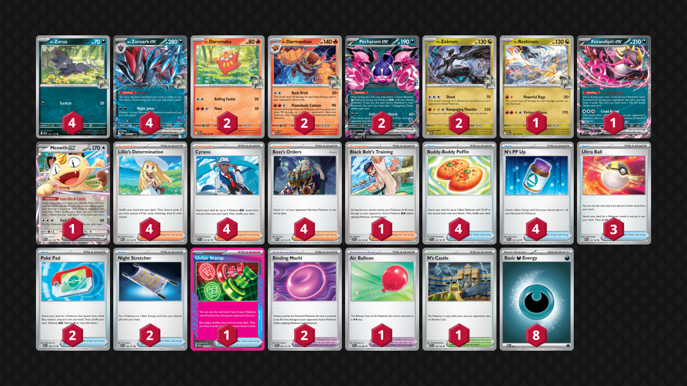

zoroark.md
---
title: Zoroark
pokemon: [571]
tier: 3
format: Standard
---
## Decklist


```decklist
Pokémon: 19
4 N's Zorua JTG 97
4 N's Zoroark ex JTG 98
2 N's Darumaka JTG 26
2 N's Darmanitan JTG 27
2 Pecharunt ex SFA 39
2 N's Zekrom ASC 155
1 N's Reshiram JTG 116
1 Fezandipiti ex SFA 38
1 Meowth ex POR 62

Trainer: 33
4 Lillie's Determination MEG 119
4 Cyrano SSP 170
4 Boss's Orders MEG 114
1 Black Belt's Training JTG 143
4 Buddy-Buddy Poffin TEF 144
4 N's PP Up JTG 153
3 Ultra Ball MEG 131
2 Poké Pad ASC 198
2 Night Stretcher ASC 196
1 Unfair Stamp TWM 165
2 Binding Mochi PRE 95
1 Air Balloon BLK 79
1 N's Castle JTG 152

Energy: 8
8 Darkness Energy MEE 7
```
<!-- PUBLIC -->
### Inclusions

- I tried the other builds, such as one with more techs like Yveltal, Budew, and Munkidori, as well as the Control build. I think this verison is best, focused on speed and consistency. This version aims to win prize trades or run the opponent off the board.
- I have a somewhat thick Darmanitan line because it’s important for winning most matchups. Being able to use Flamebody Cannon on Turn 2, especially when going first, is extremely strong.
- Reshiram is not that good but helps against Dragapult. If they don’t have Shaymin, the matchup is already fine, but since a lot of them do have Shaymin, Reshiram helps a bit there. Munkidori could also go in this slot, as they’re both tech Pokemon that are good against Dragapult but not very useful elsewhere. I just think Reshiram is more reliable than Munkidori.
- I like two Pecharunt since you usually want one on the board for mobility, and it makes Mochi plays very consistent. Not only is Mochi good with Zekrom, but also with Darmanitan on various Pokemon. It would probably be ok to cut a Pecharunt, but then I’d want another mobility card like N’s Castle since this deck needs to pivot around all the time. Pecharunt is the best mobility card, but it is also a liability.
- Meowth has overperformed and is very good for helping with this deck’s early-game consistency. I often use Stretcher for it to end the game by getting Boss as well. Three Ultra Ball are included mostly due to synergy with Meowth.
- Four Boss is necessary as this deck needs to spam Boss to keep up in this format. There are plenty of two-prize Pokemon on opponent’s benches that Zoroark can easily snipe off with Zekrom’s attack.
- Four N’s PP Up ensures that we can chain Zoroark in prize trades. I would consider playing a Janine’s Secret Art over one of them, but it’s really important to always have PP Up on the turns you need it, and you usually need many of them each game.
- Stamp is mostly included to try and gain an edge in bad matchups by making them brick or whiff something for a turn. It can also steal losing games every once in awhile. Secret Box has lost a lot of its usefulness. Scoop Up Cyclone is better suited for lists with more different Pokemon, especially Munkidori. Prime Catcher could be good though.

### Exclusions

- This deck does not have any bench space to spare. When I tried cards like Yveltal and Budew, starting with them was very problematic. Yveltal can be strong in this format, but I did not have the bench space to accommodate it with Munkdori and Pecharunt. Most decks that Yveltal would seem good against (like Dragapult) can also attack with their liabilities a lot easier now, so I was not having much success with it.
- Munkidori is not very good outside of the Dragapult matchup and there isn’t bench space. You could include it over Reshiram.
- Janine’s Secret Art is not bad, you could play it if you want. It’s just situational and hard to find, but usually good when you have it.
- There are a lot of cards that make sense in the Control build such as Dedenne, Elgyem, Xerosic’s etc., but are not suited for this version of the deck.
- Team Rocket’s Watchtower could be a good tech for Alakazam, but I would want to play two in addition to another hand disruption card like Judge in order to have a decent chance of it actually working. With just one and the Stamp, it will not line up that often and they will only have to escape the lock once. Watchtower can randomly cheese other decks by locking Meowth, Noctowl, or Kang, but is very situational and random when you draw it. I think the deck has more success by being fast and aggressive. Sometimes the simplest answer is the best one. Just take two prizes every turn.
<!-- /PUBLIC -->
## Gameplay Tips

- We need to be very careful with our board and resources! Second Darumaka is basically never put into play because we’ll get board-locked. The ideal board is three Zoroark, Darmanitan, Zekrom, Pecharunt. We can neglect the Darmanitan against Shaymin.
- Go first against everything.
- When going first, starting with Zorua and attaching to it is generally good, except against Lucario or any deck that can consistently KO it on turn 1.
- When the first Zoroark/Zorua goes down, try to replace it with Fez instead of another Zorua, as long as you have two Zoroark already on the board. There are some exceptions such as if the Zoroark might get board wiped and you can’t finish with Pecharunt.
- Try to be aggressive and start out ahead on the prize trade. If you can’t get the first two prizes, don’t put two-prize liabilities in play. Sometimes it’s ok to evolve into Zoroark on the bench since it’s hard for most other decks to KO it. Active Zoroark or benched Pecharunt are easier to KO, but that doesn’t matter if you’re winning the prize trade. In other words, keep a single-prize board (or have a difficult to KO benched Zoroark) until you’re ready to go in.
- If you’re stuck in a losing prize trade, the only ways to swing it back are by using a single-prize attacker (Darmanitan’s Back Draft or Zorua Mochi Scratch), OR by cheesing them with Unfair Stamp.
- Attaching Energy to Pecharunt in the late-game is something you should keep in mind. It comes up more than I expected.
- Pecharunt is a really big liability but you pretty much need it in play all the time anyway, so just try to win the prize race.
- Against Budew, use Ultra Ball preemptively.
- Air Balloon is usually best on Zoroark or Fez due to synergy with Pecharunt.
- Zorua’s Scratch with Binding Mochi can KO various Pokemon on Turn 1 if going second, including Munkidori!

## Matchups

Some of these games I was playing other lists, but they were similar enough to not change any of the fundamental game plans.

### Dragapult - Depends

This build is favored against Dragapult if they do not have Shaymin and unfavored if they do have it.

- Try to get the Darmanitan attack off as fast as possible. This entails aggressively searching for Darumaka or Darmanitan on Turn 1. Even if you can’t KO two Dreepy/Drakloak, KO’ing Budew with it is perfectly fine. If you KO Budew and they don’t get another one, you can reload with N’s PP Up.
- Sometimes they will board wipe Zoroark. Preemptively attach to Pecharunt to close out the game. This is very situation-dependent but comes up a decent amount.
- Getting a one-shot on Dragapult is ideal. If they swing into you, Reshiram gets it done. If not, Mochi Black Belt Zekrom can also accomplish it. However, this doesn’t line up a decent amount of the time, and that’s fine.
- Giving them random damage is very risky, such as with a poisoned Zoroark or by smacking into their Dragapult. They can take advantage of every damage counter. I usually prefer bossing around Dragapult, but I will still rather smack the Dragapult than pass, so it’s unavoidable sometimes. 
- If you do smack into their Dragapult, you will want to have the extra Mochi damage so that you can finish it off with Flamebody Cannon plus snipe something on the bench even after they heal with Adrenabrain. Of course, this is irrelevant if they have Shaymin.

```youtube
id: tKXEObYVwes
title:  Zoro v Pult 1
```

```youtube
id: JKy_FJ4hJ60
title: Zoro v Pult 2
```

```youtube
id: TEOrq9hJz-A
title: Zoro v Pult 3
```

### Lucario - Unfavorable

- Darmanitan is very good. If they have two Lucario, hit them both for 90 and finish them off with Zekrom. If they have one Lucario, smack it for 90 and snipe KO a Riolu. This can potentially stop the second Lucario from coming in, and you can finish it off with Zekrom.
- Putting liabilities such as Fez/Pecharunt/Meowth in play is usually bad, especially in the early-game. If they can’t get two prizes with Aura Jab, we actually have a chance to win.
- Ideally leave up Zekrom on turn 1 so that Solrock cannot KO it. Leaving Zoroark in the active is good in general since they need to use Mega Brave with a modifier to KO it, which means they aren’t accelerating Energy with Aura Jab.

```youtube
id: kCNGnaA4PnM
title:  Zoro v Lucario 1
```

```youtube
id: 3mNTRWOgMqI
title: Zoro v Lucario 2
```

```youtube
id: rSOCCo-ePY8
title: Zoro v Lucario 3
```

### Alakazam - Very Unfavorable

Some of the techs that I don’t play can be useful in this matchup, but in the end, it’s still very unfavorable anyway.

- Try to get a fast Darmanitan.
- Use Stamp when they’re likely to brick, such as if they have no Fez/Dudunsparce. Try to remove those Pokemon and then use Stamp when you do. If you play Watchtower, try to incorporate that as well.
- If they have Shaymin and if you play Yveltal, try to get a board of Zoroark, Yveltal, Munkidori, Darmanitan, Pecharunt. Use Yveltal to trap the Shaymin and move damage to whatever you want to snipe. After three Clutches, KO Shaymin with Adrenabrain and have Zoroark use Darmanitan’s attack to KO whatever two Pokemon you want. After they respond, use Stamp.

```youtube
id: AAIh8BWElzA
title: Zam v Zoroark 1
```

### Meganium - Unfavorable

- This matchup revolves around being on the winning end of the 2-2-2 prize race. Don’t leave a two-prize Pokemon in the active until you’re taking the lead in the prize trade. Zekrom’s attack is very good for farming two-prize KO’s.
- Darmanitan is usually not a priority in the early-game. However sometimes they will use Budew and you can get a double KO with its attack, which is obviously very good.
- Darmanitan can sometimes be used to make comebacks since it can take a KO as a single-prize Pokemon. If they have enough Energy in their discard, Darmanitan can be a good attacking option. It is best with Stamp so that they might whiff Boss, and you may also need Black Belt to get the KO.
- Black Belt + Mochi can get the one-shot on Arboliva. It doesn’t line up often, but it’s very good if you can get it.

```youtube
id: rft0Tohghl4
title: Zoroark v Meganium 1
```

```youtube
id: VESe6pnhDkk
title: Zoroark v Meganium 2
```

### Garchomp - Unfavorable

- Try to get a fast Darmanitan. Not only is Darmanitan great early, but it’s also very strong throughout the game. Most wins in this matchup are due to Darmanitan.
- If they don’t get multiple Roserade quickly, you can try to target them down. If you manage to keep Roserade out of play, they cannot one-shot Zoroark. Mochi Flamebody Cannon is good for taking out two things at once, but unfortunately, if Zoroark is poisoned they can KO it with zero Roserade in play.
- Pech/Fez/Meowth are massive liabilities so only use them if necessary.
- Try to get the one-shot on Garchomp with no Weight. Two-shotting Garchomp with Weight is usually the worst option but sometimes you have no choice and have to do it anyway.

```youtube
id: nYKMJsbXtIQ
title: Chomp v Zoro 1
```

```youtube
id: s3PdNIgy3AY
title: Chomp v Zoro 2
```

### Raging Bolt - Even

- This is a straightforward prize trade matchup. Don’t feed Zorua to Fan Rotom. Don’t put Zoroark in play if their board is threatening and they might get the first two-prize KO. Of course, putting Zoroark in play is fine if you’re taking the lead or if you just need to Trade to play the game. If you do have to put it in play preemptively, don’t leave it active unless you’re winning the prize trade!
- We’re mostly using Zekrom three times to win (can also close out with Pecharunt). Boss is generally very good for entering the prize race and keeping the lead. N’s PP Up is an extremely important resource!
- Darmanitan can sometimes be good! In the early-game, copying its attack can get two KO’s to put you ahead in the prize trade. Later, Back Draft can KO things such as Ogerpon. This is a potential way to swing the prize trade back into your favor.

```youtube
id: OHs-Mc5D3AU
title: Bolt v Zoroark 1
```

```youtube
id: iLIy5jBXhcw
title: Bolt v Zoroark 2
```

### Slop Box / Absol - Even

- This is a straight up prize trade matchup. Try to keep a single-prize board until you’re ready to go in. Having Zoroark on the bench with no Energy can be fine depending on how much Energy they have on their Ogerpon.
- If they have a single-prize Pokemon on the board like Munkidori, smacking their Kang can lead to a four-prize turn with Darmanitan. If you can’t confidently pull that off, just try to Boss around Kang for two prizes instead. If you’re not going for that play, you don’t need to bother getting Darmanitan in play and can use the board space for something more useful instead.
- If you’re behind in the trade, try to keep stuff like Meowth/Fez/Pecharunt off the board, as they may struggle to KO Zoroark. If you have only four Pokemon on your bench, they cannot one-shot Zoroark with Clefairy plus full board, so that’s another possible way to come back. If you’re winning the trade, it doesn’t really matter what your board looks like.

### Mewtwo - Unfavorable

- There are two ways to win. The most consistent is to use Darmanitan’s second attack with Mochi, allowing you to KO Spidops and Tarountula in one turn. Spamming Darmanitan’s attack can be very strong. If they put Mewtwo down, you can easily one-shot it with Zekrom’s attack.
- The other way to win is by bricking them off Stamp, so try to do that at the earliest opportunity.

### Zoroark Mirror - Even

- Make sure that your board is never vulnerable to Darmanitan! Conversely, punish them with Darmanitan if you can.
- Just take two prizes whenever you can and try to get ahead on the prize race. If they have no Darumaka in play, your single-prize board is safe and you can wait for them to get the first two-prize Pokemon in play.
- If you’re on odd prizes and only behind one prize, Zorua or Zekrom can get a KO on their Zorua.

### Crustle - Very Unfavorable

- Pressure them with a fast Zoroark. KO any Dwebble on sight. Against Crustle, copy Zekrom’s Shred. Force them to respond and then Stamp them. Making them brick off Stamp is your only chance.

## Personal Thoughts

This deck is terrible in the current metagame. Zoroark is a pretty strong deck but it is unfavored against basically everything, and it has the worst matchup spread I have seen in my entire life. Frankly, it does not pass the bar for being good enough to write a guide on but I figured I should not be lazy and at least put it up. Sure, there are different builds and techs that could cover specific threats, but the fundamental issue of a bad matchup spread across the board cannot be fixed.
